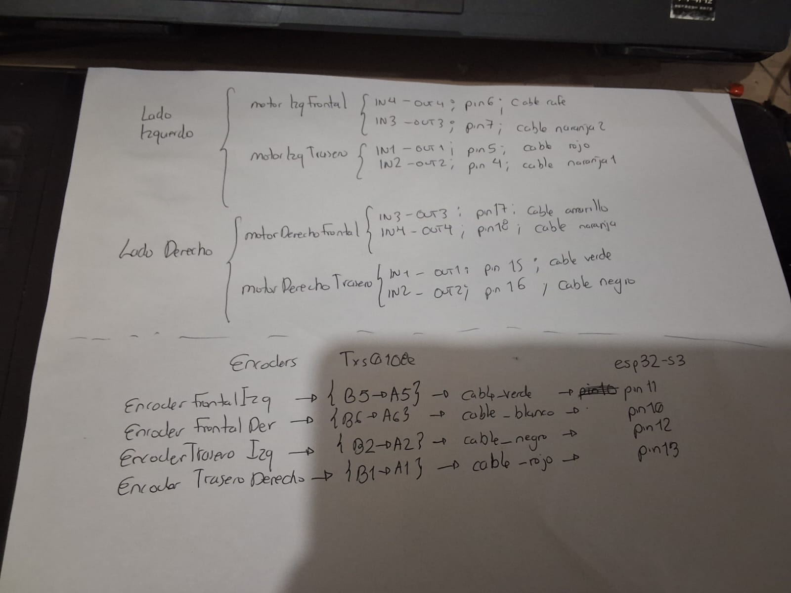

# Reglas del repositorio para agentes

## Fuentes canónicas

- `desktop_app/` contiene el backend/HMI canónico. En Windows es el único
  propietario del WebSocket hacia el ESP32; `android_app/` empaqueta esa misma
  fuente y asume la propiedad única cuando se opera desde la tablet. No ejecutar
  ambos controladores contra el robot al mismo tiempo.
- `src/` e `include/` contienen el firmware modular actual. Los ensayos físicos
  aprobados están deshabilitados en `archive/firmware_tests/` y se compilan
  únicamente mediante su script de staging.
- `archive/legacy/` es material histórico de solo referencia. No se copia hacia
  la implementación activa sin una revisión explícita.
- El mockup web antiguo se conserva íntegro en `archive/legacy/IUInWeb/`. No se
  elimina ni se vacía.
- La fotografía [`evidencia/hardware/cableado_dogmatico_milestone_2026-09-08.jpeg`](evidencia/hardware/cableado_dogmatico_milestone_2026-09-08.jpeg)
  y su transcripción fijan el cableado físico del Milestone. `include/Config.h`
  debe representarlo exactamente; ninguno de esos GPIO se cambia para corregir
  dirección, PID, calibración o ejes.

## Arquitectura y seguridad

- Mantener `Task_Web` en Core 0. Core 1 usa exclusivamente el `loop()` nativo
  como súper-ciclo síncrono de 100 Hz: PCNT/MPU, pose, seguridad, cinemática y
  PWM consumen la misma muestra, sin tareas ni colas intermedias.
- Los encoders se leen con PCNT; no usar `attachInterrupt` para reemplazarlo.
- El ESP32 conserva los lazos de tiempo real, límites, E-STOP y watchdog. Python
  conserva misión, interfaz, historial y validación de entrada.
- No incluir credenciales en el repositorio. Usar `include/Secrets.example.h`
  como plantilla local de `include/Secrets.h`.

### Protección eléctrica del DRV8833

#### Dogma de cableado físico del Milestone (inmutable)

La hoja anterior fue proporcionada por el operador y se conserva como evidencia
física. Fija entrada, salida, GPIO y color; los nombres lógicos FWD/REV sólo
documentan la dirección individual verificada y no autorizan a reinterpretar
el cableado.

| Motor | Entrada/salida DRV8833 | GPIO | Color | Representación nominal en `Config.h` |
|---|---|---:|---|---|
| FL | izquierdo IN4/OUT4 | 6 | café | `PIN_FL_FWD` |
| FL | izquierdo IN3/OUT3 | 7 | naranja 2 | `PIN_FL_REV` |
| BL | izquierdo IN1/OUT1 | 5 | rojo | `PIN_BL_REV` |
| BL | izquierdo IN2/OUT2 | 4 | naranja 1 | `PIN_BL_FWD` |
| FR | derecho IN3/OUT3 | 17 | amarillo | `PIN_FR_FWD` |
| FR | derecho IN4/OUT4 | 18 | naranja | `PIN_FR_REV` |
| BR | derecho IN1/OUT1 | 15 | verde | `PIN_BR_FWD` |
| BR | derecho IN2/OUT2 | 16 | negro | `PIN_BR_REV` |

| Encoder | Canal TXS0108E | Color | GPIO ESP32-S3 |
|---|---|---|---:|
| FL | B5→A5 | verde | 11 |
| FR | B6→A6 | blanco | 10 |
| BL | B2→A2 | negro | 12 |
| BR | B1→A1 | rojo | 13 |

- No intercambiar GPIO ni ruedas para compensar un signo de movimiento.
- Corregir la convención sólo en la frontera lógica de motores, después de una
  prueba individual con ruedas elevadas.
- Si código, documentación y hoja difieren, detener la integración y resolver
  la contradicción explícitamente; no elegir una fuente por conveniencia.

#### Límites por firmware (todas las rutas de control)
- PWM máximo de avance: 242/255 (~95%); giros autónomos, calibración y pivote continuo conservan 247/255 (~97%) para vencer fricción en superficies difíciles.
- Tiempo muerto universal de 250 ms en `Motores.cpp:aplicarVelocidades()` al
  invertir sentido de giro. Aplica a joystick, giro autónomo y calibración.
- La versión 3.5 no usa inversión global: la dirección lógica es individual por
  rueda. `PWM lógico +` activa FL=GPIO6, BL=GPIO4, FR=GPIO17 y BR=GPIO15;
  `PWM lógico -` activa sus pares REV (GPIO7/5/18/16). No cambiar estos GPIO.
- Los giros arrancan con rampa suave de 2/255 cada 20 ms desde cero. El watchdog
  de 2.5 s por lado se arma sólo después de alcanzar el torque calibrado; el
  avance conserva su corte de 450 ms.
- La calibración, odometría y confirmación de giro usan el promedio de las
  fuentes confiables de cada lado. Un encoder sano por lado permite continuar
  en modo degradado; perder todas las fuentes de cualquier lado detiene el
  movimiento. El control recto usa los deltas filtrados, no el error acumulado.
- La calibración v3.5 no descubre ni invierte polaridades: conserva reposo de
  5 s y valida primero +yaw (L+/R−). Los ticks previos al baseline se ignoran
  y la rampa continúa hasta que el MPU o el movimiento relativo confirmen el
  pivote; no se congela por un tick bilateral aislado. Al alcanzar el PWM
  máximo se audita durante 350 ms y, si falta confirmación o hay desbalance,
  permite pausas de 750 ms y hasta once barridos antes de fallar. Signo
  contrario, pérdida total de un lado o deriva >10 cm producen
  `cal_yaw_sign_mismatch`, `cal_pivot_unbalanced` o `cal_origin_drift`.
- El signo del giro sigue continuamente el error real. Al entrar en ±2° se
  apagan motores; un sobrepaso baja PWM a cero, respeta el interlock universal
  y corrige en sentido contrario sin pausa residual ni vuelta inventada.
- La calibración valida +25°, reposa 2.5 s y regresa al yaw 0° con una maniobra
  contraria independiente. Las rutas aceptan solamente tramos ortogonales con
  tolerancia geométrica de 1 mm y terminan tras su alineación cardinal final.
- Todos los giros autónomos usan un único pivot dinámico. `AUTO`, `PIVOT` y los nombres de arco heredados se resuelven al mismo controlador; la aproximación fina (<5°) utiliza micro-pulsos intermitentes de exactitud (`TURN_PULSE_ON_MS` / `TURN_PULSE_OFF_MS`) para evaluar la inercia e integración del IMU y evitar sobrepasos. El movimiento se valida con `fabsf(gyro_z)` y deltas de encoder. Mientras no se confirme movimiento en macro-giros, el torque escala en rampa adaptativa sin exceder 247/255 (~97%). Un atasco físico de lado, pérdida de IMU, E-STOP o protección eléctrica produce parada segura.
- Los encoders PCNT se montan a 45° respecto al chasis; son sensores de magnitud.
  El MPU6050 es la autoridad angular: +yaw es horario hacia +X/derecha y -yaw
  antihorario hacia la izquierda. La calibración sólo pivota sobre su centro.
- Stacks: Web 8192 y súper-ciclo de control 8192 bytes. El firmware publica el
  mínimo libre medido y el motivo de reinicio; menos de 1024 bytes es fallo de
  aceptación aunque no haya ocurrido un reset.

#### Protección física requerida (no implementable por software)
- El DRV8833 original incorpora pull-down interno en sus entradas de control.
  Pull-downs externos son opcionales como defensa adicional para módulos clon.
- Mantener VMOT físicamente apagado durante boot y carga; habilitar motores
  únicamente después de confirmar ESP32 estable y PWM izquierdo/derecho en cero.
- Capacitor electrolítico ≥100 µF en VMOT–GND de cada módulo DRV8833.
- Capacitor cerámico 0.1 µF entre terminales de cada motor.
- Fusible o polyfuse de 1.5 A por driver o por motor.
- Los módulos DRV8833 típicos no exponen nSLEEP ni nFAULT.

#### Boot ROM (no controlable por software)
`setup_MotorPinsLow()` fuerza GPIO a LOW como primera operación de hardware
en `setup()`, pero no cubre el intervalo del boot ROM. El pull-down interno del
DRV8833 ayuda durante ese lapso; el corte físico de VMOT sigue siendo la defensa
operativa obligatoria durante carga y reinicio.

#### Prueba de corriente (obligatoria antes de operar en suelo)
1. Ruedas elevadas.
2. Fuente limitada a 0.5 A o batería con fusible de 1 A.
3. Medir corriente en serie con VMOT durante calibración, avance y giro.
4. Medir corriente de arranque y de rotor bloqueado por motor.
5. Solo después de verificar corrientes <1 A sostenidos, operar en suelo.
6. No se afirmará seguridad eléctrica sin esta prueba física.

## Convenciones

- Documentación, scripts y mensajes para el usuario se escriben en español.
- Firmware: nombres descriptivos en español cuando ya exista esa convención.
- Python: conservar nombres idiomáticos en inglés para módulos y APIs internas.
- Directorios nuevos en minúsculas y `snake_case`; usar nombres estándar del
  ecosistema cuando correspondan (`src`, `include`, `tests`, `README.md`).
- Antes de mover archivos, actualizar todas sus referencias y ejecutar las
  validaciones indicadas en `CONTRIBUTING.md`.

## Herramientas

- Antes de una búsqueda amplia, consultar `codebase-memory-mcp` en este orden:
  `list_projects`, `index_status` y después `search_graph`, `query_graph` o
  `get_architecture`, según la pregunta. Usar `get_code_snippet` para recuperar
  solamente el contexto necesario.
- Si el proyecto no está indexado o `detect_changes` informa cambios, ejecutar
  `scripts\desarrollo\actualizar_memoria_codigo.bat` desde la raíz antes de
  continuar. El índice es una caché local: nunca se confirma en Git.
- Si `codebase-memory-mcp` no está instalado o falla, usar `rg` y documentar el
  hallazgo sin bloquearse. La memoria complementa `AGENTS.md`; no reemplaza las
  fuentes canónicas ni las reglas de seguridad de este archivo.
- Para inspeccionar la base de datos SQLite extraída por ADB (`tmp_db/robot.sqlite3`), usar la herramienta CLI canónica en la raíz:
  - `python consultar_db.py` (resumen general de tablas y sesiones)
  - `python consultar_db.py --commands 15` (últimos 15 comandos con su estado y payload)
  - `python consultar_db.py --events 20` (últimos 20 eventos del sistema)
  - `python consultar_db.py --telemetry 10` (muestras de pose, yaw y PWM)
  - `python consultar_db.py --search "calib"` (búsqueda rápida por patrón)
- No editar salidas generadas, entornos virtuales, `node_modules`, `.pio/`,
  `desktop_app/build/` ni `desktop_app/dist/`.
