# Atlas UML y arquitectura completa del Robot S3

Este documento representa la implementación operativa actual del proyecto **carroTest3-Milestone_Funcional_1.0** (Hito 85/100). Los inventarios de todas las funciones y sus grafos por carpeta se generan en [`docs/uml/`](docs_markdowns/uml/README.md). Los hallazgos y discrepancias se mantienen en [`docs/auditoria_estado_actual.md`](docs_markdowns/auditoria_estado_actual.md).

---

## Mapas de Arquitectura Interactivos (Archify)

El sistema cuenta con 6 especificaciones y mapas interactivos deterministas compilados mediante **Archify** ([tt-a1i/archify](https://github.com/tt-a1i/archify)), con calidad *showcase* verificada (0 errores, 0 advertencias), conmutador de tema claro/oscuro, trazabilidad de rutas y exportación SVG/PNG:

| Mapa Interactivo | Tipo | Descripción | Artefacto Autosuficiente |
|---|---|---|---|
| **1. Arquitectura General y Contexto** | `architecture` | Topología de hosts (Windows / Android Tablet), SoftAP, loopback `X-App-Token`, SQLite WAL y chasis 4WD. | [`sistema_contexto.html`](docs/archify/sistema_contexto.html) |
| **2. Súper-ciclo RTOS a 100 Hz** | `architecture` | Desacoplamiento Core 0 (`Task_Web`) y Core 1 (`loop()` nativo sincrónico), colas acotadas y sample unificado. | [`firmware_superciclo.html`](docs/archify/firmware_superciclo.html) |
| **3. Dogma Canónico de Calibración** | `sequence` | Flujo inviolable de 5 fases: reposo 5.0 s para sesgo MPU, búsqueda `CAL_A`, validación +25°, `CAL_B` y retorno a 0°. | [`calibracion_dogma.html`](docs/archify/calibracion_dogma.html) |
| **4. Navegación Ortogonal y Ockham** | `workflow` | Partición en tramos $\le 200\text{ cm}$, avance frontal exclusivo (sin reversa) y retorno Ockham en orden cronológico inverso. | [`mision_navegacion.html`](docs/archify/mision_navegacion.html) |
| **5. Ciclo de Vida y Estados (FSM)** | `lifecycle` | Máquina de estados del robot: `DESARMADO`, `CALIBRANDO`, `LISTO`, `EJECUTANDO`, `FALLO` y `ESTOP`. | [`fsm_ciclo_vida.html`](docs/archify/fsm_ciclo_vida.html) |
| **6. Protección Eléctrica DRV8833** | `architecture` | Clamps de PWM (242 crucero, 247 giro, ráfagas 80 ms), interlock 250 ms, zona muerta 180 y desacople físico. | [`seguridad_electrica.html`](docs/archify/seguridad_electrica.html) |

---

## 1. Contexto del sistema

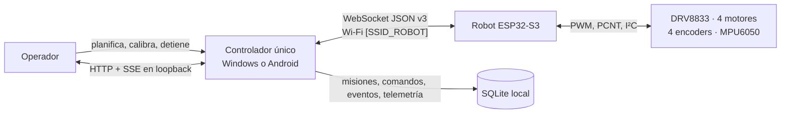
```mermaid
flowchart LR
    Operator["Operador"]
    Host["Controlador único<br/>Windows o Android"]
    Robot["Robot ESP32-S3"]
    Storage[("SQLite local")]
    Hardware["DRV8833 · 4 motores<br/>4 encoders · MPU6050"]

    Operator -->|"planifica, calibra, detiene"| Host
    Host <-->|"HTTP + SSE en loopback"| Operator
    Host <-->|"WebSocket JSON v3<br/>Wi-Fi [SSID_ROBOT]"| Robot
    Host -->|"misiones, comandos, eventos, telemetría"| Storage
    Robot <-->|"PWM, PCNT, I²C"| Hardware
```

Regla de propiedad: Windows y Android son alternativas. Nunca deben mantener dos gateways conectados simultáneamente al mismo robot.

## 2. Despliegue físico, simetría 4WD y mapeo de hardware

### Dogma de Simetría y Espejado Mecánico del Chasis 4WD

En la estructura física del chasis 4WD acrílico de doble plataforma, los reductores TT están montados en pares opuestos: los motores delanteros (FL/FR) tienen sus cuerpos orientados hacia atrás y los traseros (BL/BR) hacia adelante (enfrentados entre sí en el eje longitudinal). Asimismo, los pares izquierdo y derecho están reflejados respecto al eje sagital.

Al estar invertidos mecánicamente $180^\circ$, la polaridad eléctrica de las borneras DRV8833 y el software compensan esta simetría mediante `PWM_FORWARD_POLARITY = -1` para que la señal lógica de avance (`FWD` = 1) genere traslación positiva pura y uniforme hacia el vector $+Y$ en las cuatro ruedas.

```
                  FRENTE (+Y, Yaw = 0°)
          ┌───────────────────────────────────┐
          │   [Motor FL]          [Motor FR]  │
          │   (Cuerpo hacia       (Cuerpo hacia│
          │      atrás)              atrás)   │
          │                                   │
IZQUIERDA │        (ESP32-S3 / Baterías)      │ DERECHA (+X, Yaw = 90°)
(-X)      │         Pose (0,0) IMU            │
          │                                   │
          │   [Motor BL]          [Motor BR]  │
          │   (Cuerpo hacia       (Cuerpo hacia│
          │     adelante)           adelante) │
          └───────────────────────────────────┘
                  ATRÁS (-Y, Yaw = 180°)
```

### Mapeo Físico de Pines (Verificado en Taller)
- **Motores**: FL (`FWD`=GPIO7, `REV`=GPIO6), BL (`FWD`=GPIO4, `REV`=GPIO5), FR (`FWD`=GPIO18, `REV`=GPIO17), BR (`FWD`=GPIO16, `REV`=GPIO15).
- **Encoders (Level Shifter TXS0108E)**: FL (GPIO11), FR (GPIO10), BL (GPIO12), BR (GPIO13). Odometría configurada a 40 PPR con filtro anti-rebote PCNT 1023.
- **IMU MPU6050**: SDA=GPIO8, SCL=GPIO9 (Bus I2C a 400 kHz).

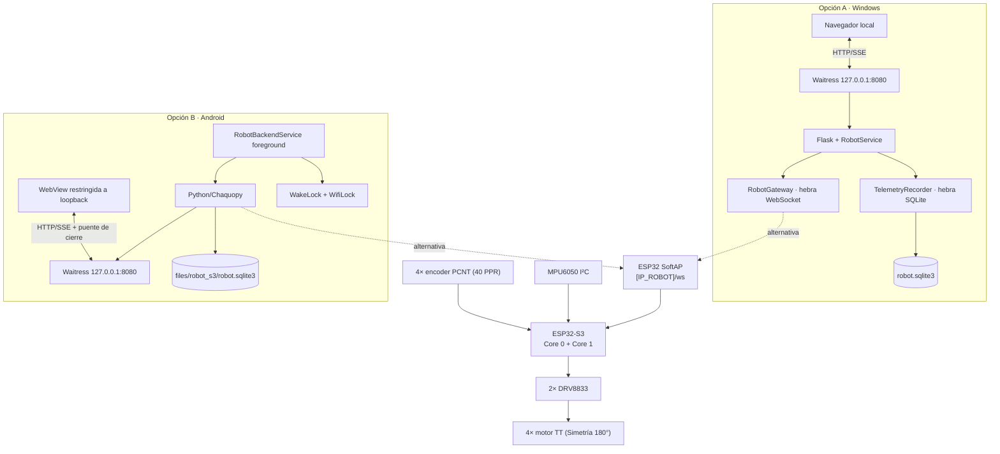
```mermaid
flowchart TB
    subgraph WIN["Opción A · Windows"]
        Browser["Navegador local"]
        WaitressW["Waitress 127.0.0.1:8080"]
        FlaskW["Flask + RobotService"]
        GatewayW["RobotGateway · hebra WebSocket"]
        RecorderW["TelemetryRecorder · hebra SQLite"]
        DBW[("robot.sqlite3")]
        Browser <-->|"HTTP/SSE"| WaitressW
        WaitressW --> FlaskW
        FlaskW --> GatewayW
        FlaskW --> RecorderW --> DBW
    end

    subgraph AND["Opción B · Android"]
        WebView["WebView restringida a loopback"]
        Service["RobotBackendService foreground"]
        Chaquopy["Python/Chaquopy"]
        WaitressA["Waitress 127.0.0.1:8080"]
        DBA[("files/robot_s3/robot.sqlite3")]
        Locks["WakeLock + WifiLock"]
        WebView <-->|"HTTP/SSE + puente de cierre"| WaitressA
        Service --> Chaquopy --> WaitressA
        Service --> Locks
        Chaquopy --> DBA
    end

    AP["ESP32 SoftAP<br/>[IP_ROBOT]/ws"]
    ESP["ESP32-S3<br/>Core 0 + Core 1"]
    Driver["2× DRV8833"]
    Motors["4× motor TT (Simetría 180°)"]
    Enc["4× encoder PCNT (40 PPR)"]
    IMU["MPU6050 I²C"]

    GatewayW -. "alternativa" .-> AP
    Chaquopy -. "alternativa" .-> AP
    AP --> ESP
    ESP --> Driver --> Motors
    Enc --> ESP
    IMU --> ESP
```

## 3. Componentes reales del backend

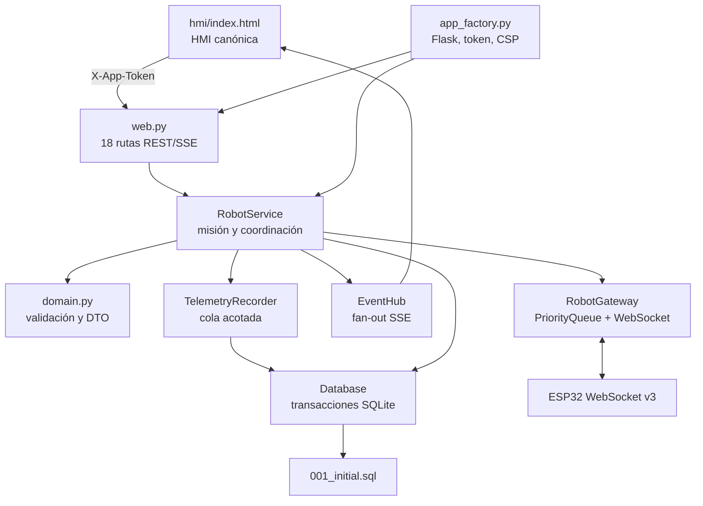
```mermaid
flowchart TB
    HMI["hmi/index.html<br/>HMI canónica"]
    Web["web.py<br/>18 rutas REST/SSE"]
    Factory["app_factory.py<br/>Flask, token, CSP"]
    Service["RobotService<br/>misión y coordinación"]
    Domain["domain.py<br/>validación y DTO"]
    Gateway["RobotGateway<br/>PriorityQueue + WebSocket"]
    Hub["EventHub<br/>fan-out SSE"]
    Recorder["TelemetryRecorder<br/>cola acotada"]
    Database["Database<br/>transacciones SQLite"]
    Migration["001_initial.sql"]
    Firmware["ESP32 WebSocket v3"]

    HMI -->|"X-App-Token"| Web
    Web --> Service
    Factory --> Web
    Factory --> Service
    Service --> Domain
    Service --> Gateway
    Service --> Hub --> HMI
    Service --> Recorder --> Database
    Service --> Database
    Database --> Migration
    Gateway <--> Firmware
```

## 4. Componentes del firmware y afinidad de núcleo

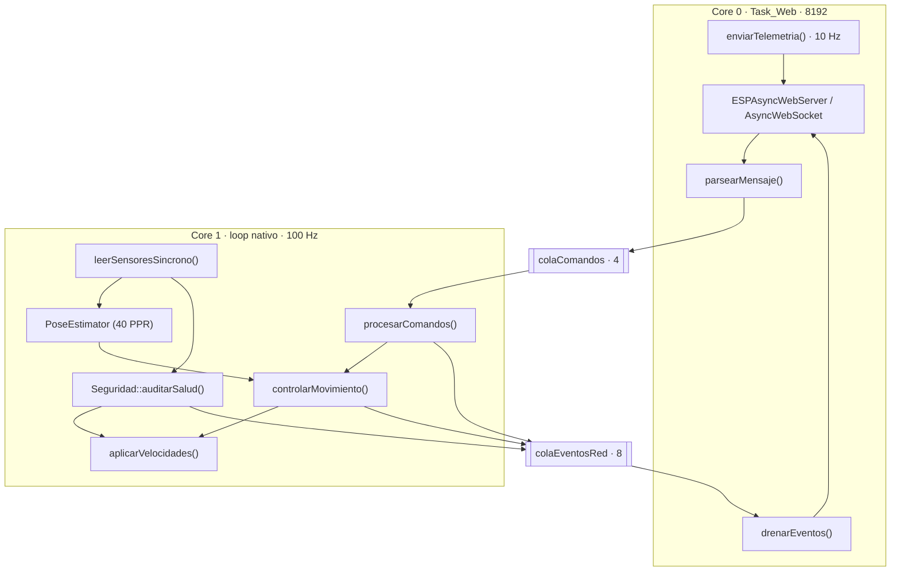
```mermaid
flowchart TB
    subgraph CORE0["Core 0 · Task_Web · 8192"]
        WS["ESPAsyncWebServer / AsyncWebSocket"]
        Parse["parsearMensaje()"]
        Drain["drenarEventos()"]
        Telemetry["enviarTelemetria() · 10 Hz"]
        WS --> Parse
        Drain --> WS
        Telemetry --> WS
    end

    CmdQ[["colaComandos · 4"]]
    EvtQ[["colaEventosRed · 8"]]

    subgraph CORE1["Core 1 · loop nativo · 100 Hz"]
        Commands["procesarComandos()"]
        Sensors["leerSensoresSincrono()"]
        Pose["PoseEstimator (40 PPR)"]
        Safety["Seguridad::auditarSalud()"]
        Motion["controlarMovimiento()"]
        Motor["aplicarVelocidades()"]
        Commands --> Motion
        Sensors --> Pose
        Sensors --> Safety
        Pose --> Motion
        Safety --> Motor
        Motion --> Motor
    end

    Parse --> CmdQ --> Commands
    Commands --> EvtQ
    Motion --> EvtQ
    Safety --> EvtQ
    EvtQ --> Drain
```

## 5. Secuencia de arranque y conexión lógica

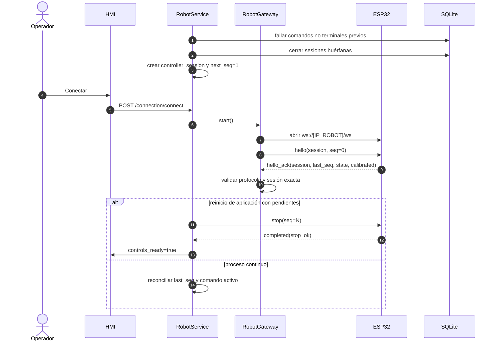
```mermaid
sequenceDiagram
    autonumber
    actor O as Operador
    participant H as HMI
    participant S as RobotService
    participant G as RobotGateway
    participant E as ESP32
    participant D as SQLite

    S->>D: fallar comandos no terminales previos
    S->>D: cerrar sesiones huérfanas
    S->>S: crear controller_session y next_seq=1
    O->>H: Conectar
    H->>S: POST /connection/connect
    S->>G: start()
    G->>E: abrir ws://[IP_ROBOT]/ws
    G->>E: hello(session, seq=0)
    E-->>G: hello_ack(session, last_seq, state, calibrated)
    G->>G: validar protocolo y sesión exacta
    alt reinicio de aplicación con pendientes
        S->>E: stop(seq=N)
        E-->>S: completed(stop_ok)
        S->>H: controls_ready=true
    else proceso continuo
        S->>S: reconciliar last_seq y comando activo
    end
```

## 6. Dogma Canónico de Calibración (5 Fases)

La calibración utiliza el MPU6050 como autoridad angular única y se rige por un dogma inmutable:
1. **Estabilización MPU (5.0 s)**: Cuenta regresiva y reposo para calibrar sesgo en reposo.
2. **Torque Positivo (`CAL_A`)**: Rampa de 140 a 247/255 hasta confirmar `ticksOk` bilateralmente y $|\text{gyro}_z| \ge 0.12\text{ rad/s}$ sostenido 100 ms. Si el giro resulta invertido, invierte polaridad con 750 ms de pausa.
3. **Validación +25° (`CAL_VALIDAR_25`)**: Pivote puro hasta $+25^\circ$ ($\pm 2.5^\circ$) con 600 ms de asentamiento.
4. **Torque Negativo (`CAL_B`)**: Pausa de 2.5 s y validación bilateral en polaridad opuesta.
5. **Retorno Estricto (`CAL_RETORNO`)**: Pausa de 2.5 s y pivote estricto hacia el rumbo original $0^\circ$, reseteando odometría ($X=0, Y=0$) y yaw al estabilizarse.

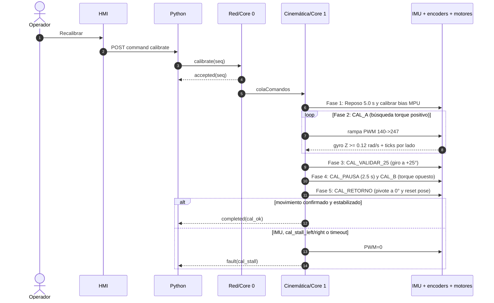
```mermaid
sequenceDiagram
    autonumber
    actor O as Operador
    participant H as HMI
    participant P as Python
    participant R as Red/Core 0
    participant C as Cinemática/Core 1
    participant HW as IMU + encoders + motores

    O->>H: Recalibrar
    H->>P: POST command calibrate
    P->>R: calibrate(seq)
    R-->>P: accepted(seq)
    R->>C: colaComandos
    C->>HW: Fase 1: Reposo 5.0 s y calibrar bias MPU
    loop Fase 2: CAL_A (búsqueda torque positivo)
        C->>HW: rampa PWM 140->247
        HW-->>C: gyro Z >= 0.12 rad/s + ticks por lado
    end
    C->>HW: Fase 3: CAL_VALIDAR_25 (giro a +25°)
    C->>HW: Fase 4: CAL_PAUSA (2.5 s) y CAL_B (torque opuesto)
    C->>HW: Fase 5: CAL_RETORNO (pivote a 0° y reset pose)
    alt movimiento confirmado y estabilizado
        C-->>P: completed(cal_ok)
    else IMU, cal_stall_left/right o timeout
        C->>HW: PWM=0
        C-->>P: fault(cal_stall)
    end
```

## 7. Misión ortogonal saliente

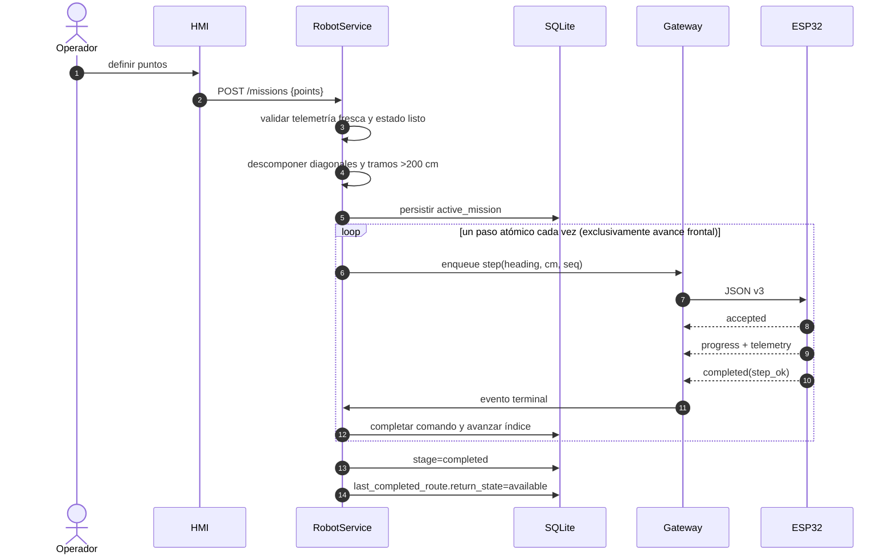
```mermaid
sequenceDiagram
    autonumber
    actor O as Operador
    participant H as HMI
    participant S as RobotService
    participant DB as SQLite
    participant G as Gateway
    participant E as ESP32

    O->>H: definir puntos
    H->>S: POST /missions {points}
    S->>S: validar telemetría fresca y estado listo
    S->>S: descomponer diagonales y tramos >200 cm
    S->>DB: persistir active_mission
    loop un paso atómico cada vez (exclusivamente avance frontal)
        S->>G: enqueue step(heading, cm, seq)
        G->>E: JSON v3
        E-->>G: accepted
        E-->>G: progress + telemetry
        E-->>G: completed(step_ok)
        G->>S: evento terminal
        S->>DB: completar comando y avanzar índice
    end
    S->>DB: stage=completed
    S->>DB: last_completed_route.return_state=available
```

## 8. Paso atómico en el ESP32

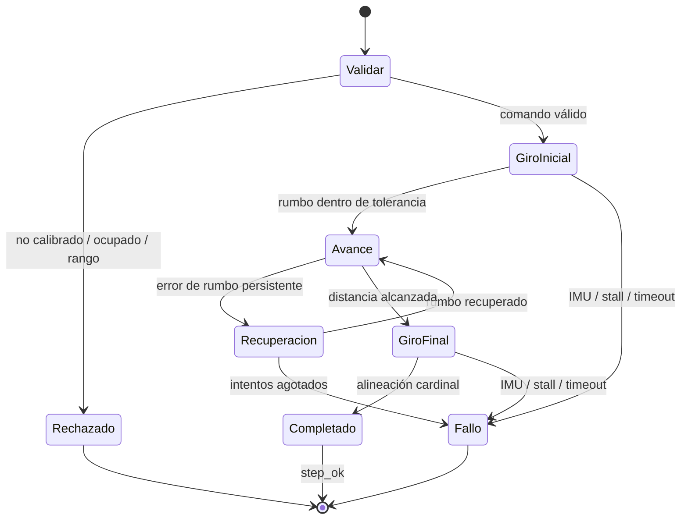
```mermaid
stateDiagram-v2
    [*] --> Validar
    Validar --> Rechazado: no calibrado / ocupado / rango
    Validar --> GiroInicial: comando válido
    GiroInicial --> Avance: rumbo dentro de tolerancia
    GiroInicial --> Fallo: IMU / stall / timeout
    Avance --> Recuperacion: error de rumbo persistente
    Recuperacion --> Avance: rumbo recuperado
    Avance --> GiroFinal: distancia alcanzada
    GiroFinal --> Completado: alineación cardinal
    GiroFinal --> Fallo: IMU / stall / timeout
    Recuperacion --> Fallo: intentos agotados
    Completado --> [*]: step_ok
    Rechazado --> [*]
    Fallo --> [*]
```

## 9. Retorno Ockham (Sin Reversa Física)

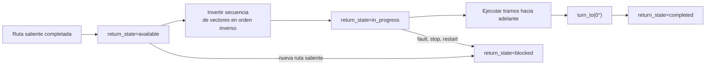
```mermaid
flowchart LR
    Completed["Ruta saliente completada"]
    Available["return_state=available"]
    Reverse["Invertir secuencia<br/>de vectores en orden inverso"]
    Consume["return_state=in_progress"]
    Steps["Ejecutar tramos hacia adelante"]
    Align["turn_to(0°)"]
    Done["return_state=completed"]
    Blocked["return_state=blocked"]

    Completed --> Available --> Reverse --> Consume --> Steps --> Align --> Done
    Consume -->|"fault, stop, restart"| Blocked
    Available -->|"nueva ruta saliente"| Blocked
```

## 10. Reconexión dentro del mismo proceso

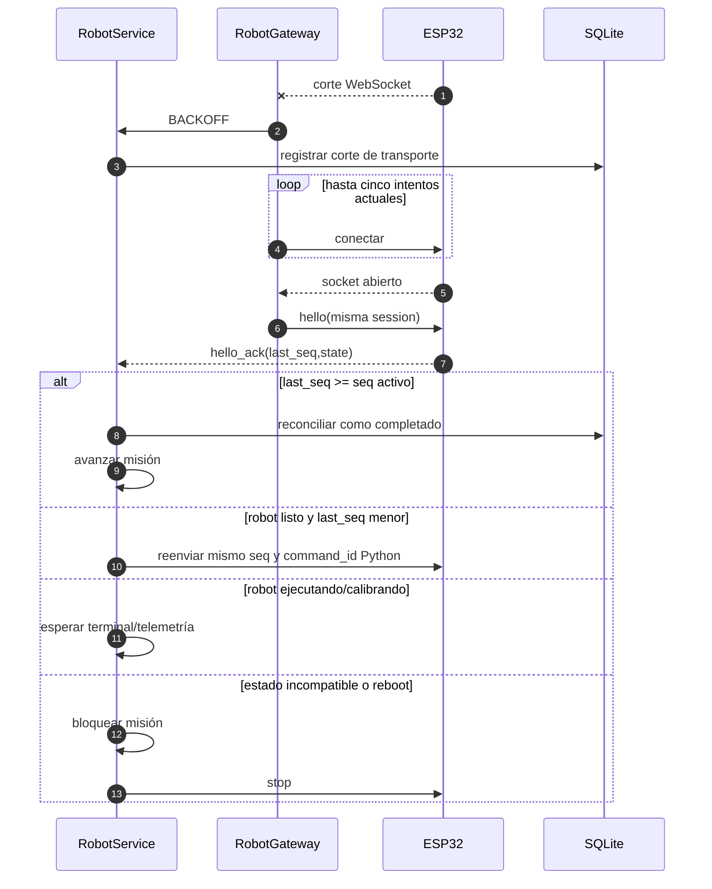
```mermaid
sequenceDiagram
    autonumber
    participant S as RobotService
    participant G as RobotGateway
    participant E as ESP32
    participant DB as SQLite

    E--xG: corte WebSocket
    G->>S: BACKOFF
    S->>DB: registrar corte de transporte
    loop hasta cinco intentos actuales
        G->>E: conectar
    end
    E-->>G: socket abierto
    G->>E: hello(misma session)
    E-->>S: hello_ack(last_seq,state)
    alt last_seq >= seq activo
        S->>DB: reconciliar como completado
        S->>S: avanzar misión
    else robot listo y last_seq menor
        S->>E: reenviar mismo seq y command_id Python
    else robot ejecutando/calibrando
        S->>S: esperar terminal/telemetría
    else estado incompatible o reboot
        S->>S: bloquear misión
        S->>E: stop
    end
```

## 11. Reinicio de la aplicación Python

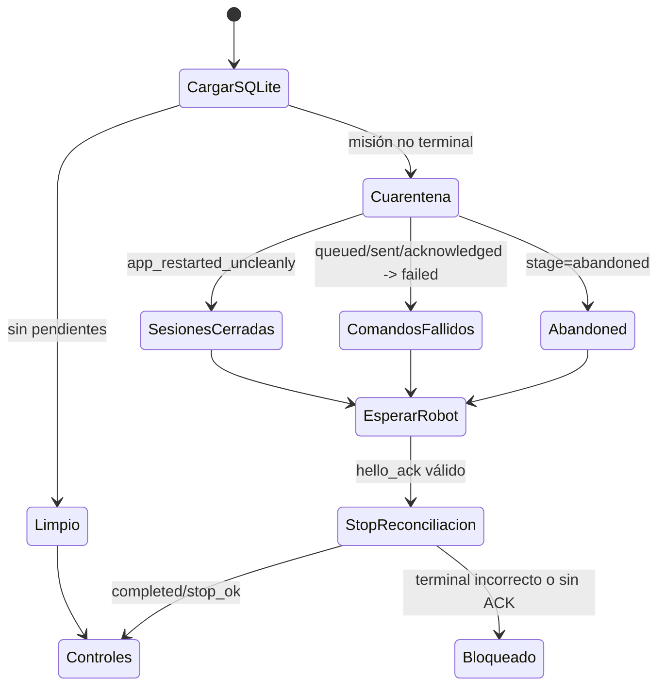
```mermaid
stateDiagram-v2
    [*] --> CargarSQLite
    CargarSQLite --> Cuarentena: misión no terminal
    CargarSQLite --> Limpio: sin pendientes
    Cuarentena --> Abandoned: stage=abandoned
    Cuarentena --> ComandosFallidos: queued/sent/acknowledged -> failed
    Cuarentena --> SesionesCerradas: app_restarted_uncleanly
    Abandoned --> EsperarRobot
    ComandosFallidos --> EsperarRobot
    SesionesCerradas --> EsperarRobot
    EsperarRobot --> StopReconciliacion: hello_ack válido
    StopReconciliacion --> Controles: completed/stop_ok
    StopReconciliacion --> Bloqueado: terminal incorrecto o sin ACK
    Limpio --> Controles
```

## 12. Cierre seguro

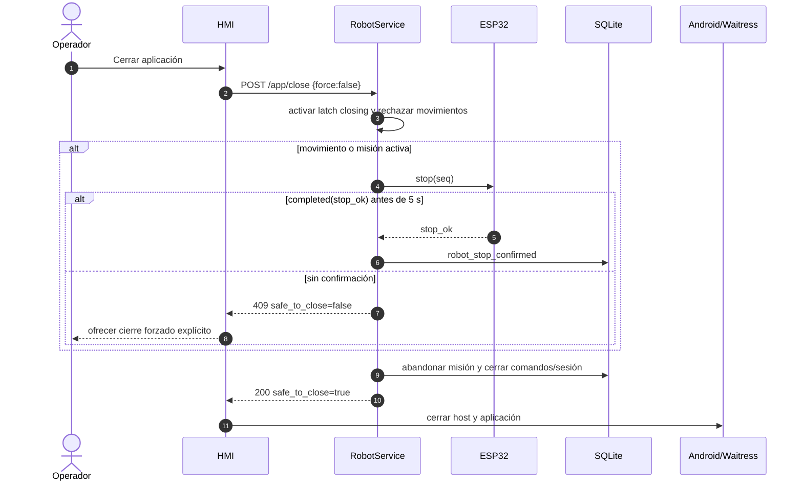
```mermaid
sequenceDiagram
    autonumber
    actor O as Operador
    participant H as HMI
    participant S as RobotService
    participant E as ESP32
    participant DB as SQLite
    participant OS as Android/Waitress

    O->>H: Cerrar aplicación
    H->>S: POST /app/close {force:false}
    S->>S: activar latch closing y rechazar movimientos
    alt movimiento o misión activa
        S->>E: stop(seq)
        alt completed(stop_ok) antes de 5 s
            E-->>S: stop_ok
            S->>DB: robot_stop_confirmed
        else sin confirmación
            S-->>H: 409 safe_to_close=false
            H-->>O: ofrecer cierre forzado explícito
        end
    end
    S->>DB: abandonar misión y cerrar comandos/sesión
    S-->>H: 200 safe_to_close=true
    H->>OS: cerrar host y aplicación
```

## 13. Máquinas de estado coordinadas

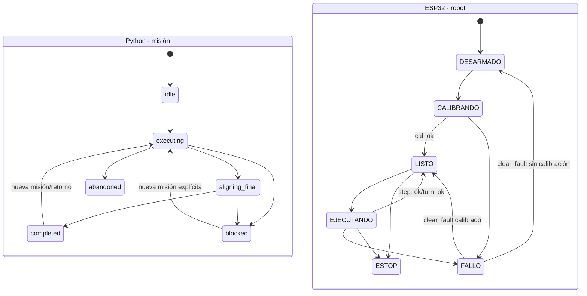
```mermaid
stateDiagram-v2
    state "Python · misión" as PY {
        [*] --> idle
        idle --> executing
        executing --> aligning_final
        aligning_final --> completed
        executing --> blocked
        aligning_final --> blocked
        executing --> abandoned
        blocked --> executing: nueva misión explícita
        completed --> executing: nueva misión/retorno
    }

    state "ESP32 · robot" as FW {
        [*] --> DESARMADO
        DESARMADO --> CALIBRANDO
        CALIBRANDO --> LISTO: cal_ok
        CALIBRANDO --> FALLO
        LISTO --> EJECUTANDO
        EJECUTANDO --> LISTO: step_ok/turn_ok
        EJECUTANDO --> FALLO
        LISTO --> ESTOP
        EJECUTANDO --> ESTOP
        FALLO --> DESARMADO: clear_fault sin calibración
        FALLO --> LISTO: clear_fault calibrado
    }
```

## 14. Modelo de datos SQLite

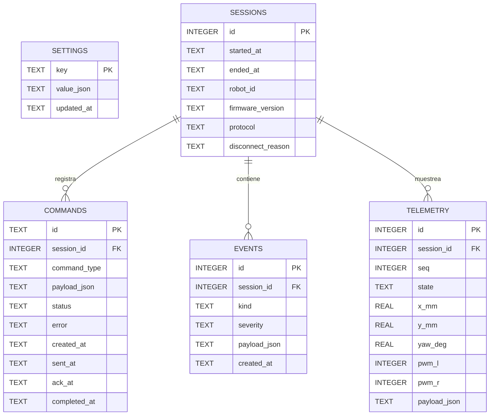
```mermaid
erDiagram
    SETTINGS {
        TEXT key PK
        TEXT value_json
        TEXT updated_at
    }
    SESSIONS {
        INTEGER id PK
        TEXT started_at
        TEXT ended_at
        TEXT robot_id
        TEXT firmware_version
        TEXT protocol
        TEXT disconnect_reason
    }
    COMMANDS {
        TEXT id PK
        INTEGER session_id FK
        TEXT command_type
        TEXT payload_json
        TEXT status
        TEXT error
        TEXT created_at
        TEXT sent_at
        TEXT ack_at
        TEXT completed_at
    }
    EVENTS {
        INTEGER id PK
        INTEGER session_id FK
        TEXT kind
        TEXT severity
        TEXT payload_json
        TEXT created_at
    }
    TELEMETRY {
        INTEGER id PK
        INTEGER session_id FK
        INTEGER seq
        TEXT state
        REAL x_mm
        REAL y_mm
        REAL yaw_deg
        INTEGER pwm_l
        INTEGER pwm_r
        TEXT payload_json
    }
    SESSIONS ||--o{ COMMANDS : registra
    SESSIONS ||--o{ EVENTS : contiene
    SESSIONS ||--o{ TELEMETRY : muestrea
```

## 15. Cadena de seguridad e interlocks de hardware

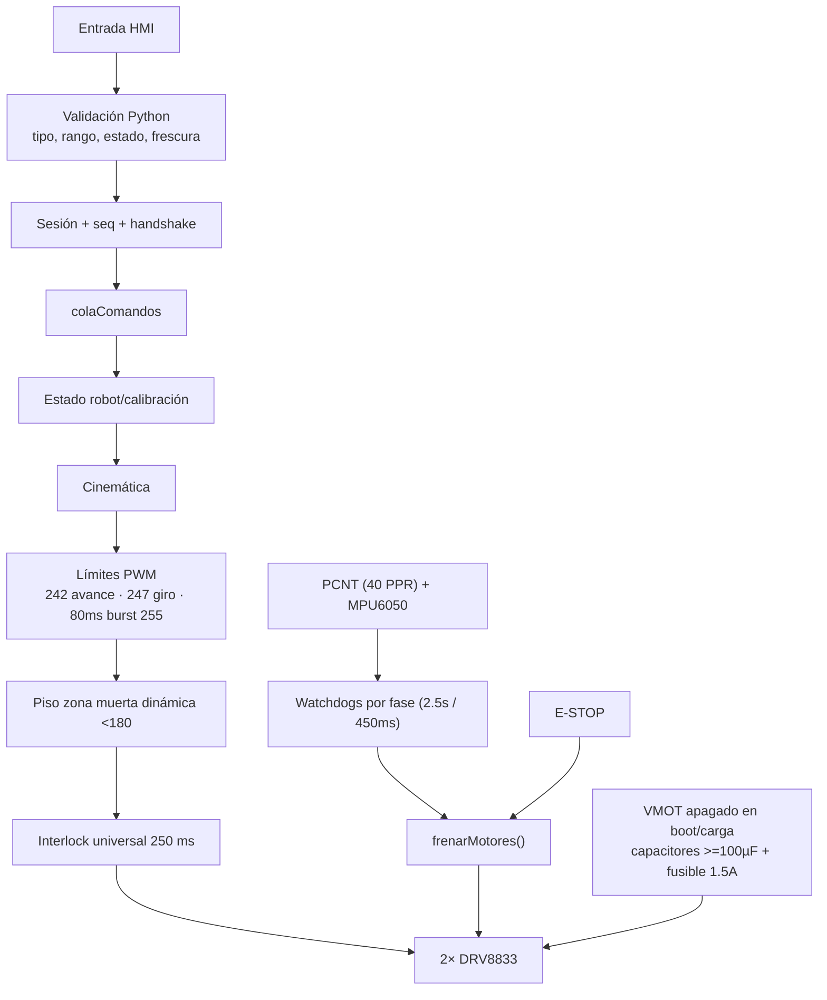
```mermaid
flowchart TB
    Input["Entrada HMI"] --> Validate["Validación Python<br/>tipo, rango, estado, frescura"]
    Validate --> Protocol["Sesión + seq + handshake"]
    Protocol --> Queue["colaComandos"]
    Queue --> State["Estado robot/calibración"]
    State --> Motion["Cinemática"]
    Motion --> Clamp["Límites PWM<br/>242 avance · 247 giro · 80ms burst 255"]
    Clamp --> Deadband["Piso zona muerta dinámica <180"]
    Deadband --> Interlock["Interlock universal 250 ms"]
    Interlock --> DRV["2× DRV8833"]
    Sensors["PCNT (40 PPR) + MPU6050"] --> Watchdog["Watchdogs por fase (2.5s / 450ms)"]
    Watchdog --> Stop["frenarMotores()"]
    Estop["E-STOP"] --> Stop
    Stop --> DRV
    Physical["VMOT apagado en boot/carga<br/>capacitores >=100µF + fusible 1.5A"] --> DRV
```

## 16. Ciclo de vida Android

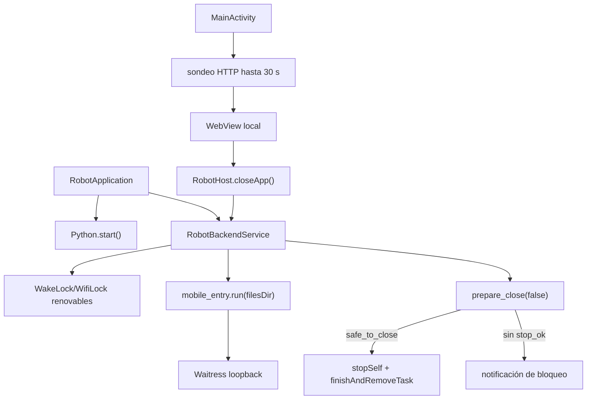
```mermaid
flowchart TB
    Launch["RobotApplication"] --> Python["Python.start()"]
    Launch --> Service["RobotBackendService"]
    Service --> Locks["WakeLock/WifiLock renovables"]
    Service --> Mobile["mobile_entry.run(filesDir)"]
    Mobile --> Waitress["Waitress loopback"]
    Activity["MainActivity"] --> Probe["sondeo HTTP hasta 30 s"]
    Probe --> WebView["WebView local"]
    WebView --> Bridge["RobotHost.closeApp()"]
    Bridge --> Service
    Service --> Prepare["prepare_close(false)"]
    Prepare -->|"safe_to_close"| Finish["stopSelf + finishAndRemoveTask"]
    Prepare -->|"sin stop_ok"| Warning["notificación de bloqueo"]
```

## 17. Flujo de eventos y telemetría

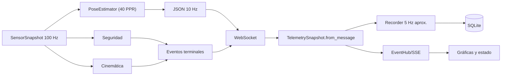
```mermaid
flowchart LR
    Snapshot["SensorSnapshot 100 Hz"] --> Pose["PoseEstimator (40 PPR)"]
    Snapshot --> Safety["Seguridad"]
    Snapshot --> Control["Cinemática"]
    Pose --> Telemetry["JSON 10 Hz"]
    Safety --> Events["Eventos terminales"]
    Control --> Events
    Telemetry --> WS["WebSocket"]
    Events --> WS
    WS --> Normalize["TelemetrySnapshot.from_message"]
    Normalize --> Recorder["Recorder 5 Hz aprox."]
    Normalize --> SSE["EventHub/SSE"]
    Recorder --> DB[("SQLite")]
    SSE --> HMI["Gráficas y estado"]
```

## 18. Construcción y validación

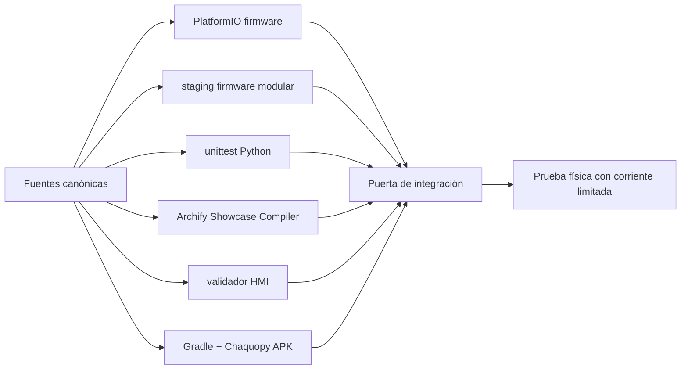
```mermaid
flowchart LR
    Source["Fuentes canónicas"] --> PIO["PlatformIO firmware"]
    Source --> Modular["staging firmware modular"]
    Source --> PyTest["unittest Python"]
    Source --> Archify["Archify Showcase Compiler"]
    Source --> HmiCheck["validador HMI"]
    Source --> Gradle["Gradle + Chaquopy APK"]
    PIO --> Gate["Puerta de integración"]
    Modular --> Gate
    PyTest --> Gate
    Archify --> Gate
    HmiCheck --> Gate
    Gradle --> Gate
    Gate --> Physical["Prueba física con corriente limitada"]
```

## 19. Trazabilidad de evidencia

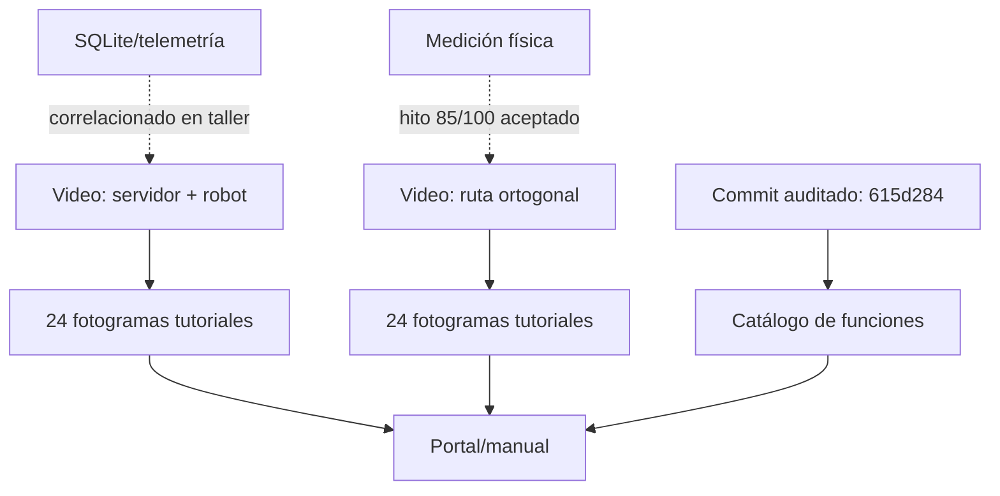
```mermaid
flowchart TB
    Video1["Video: servidor + robot"] --> Frames1["24 fotogramas tutoriales"]
    Video2["Video: ruta ortogonal"] --> Frames2["24 fotogramas tutoriales"]
    Frames1 --> Manual["Portal/manual"]
    Frames2 --> Manual
    SQLite["SQLite/telemetría"] -. "correlacionado en taller" .-> Video1
    Measure["Medición física"] -. "hito 85/100 aceptado" .-> Video2
    CurrentCode["Commit auditado: 615d284"] --> Catalog["Catálogo de funciones"]
    Catalog --> Manual
```

## 20. Índices detallados

- [Auditoría y riesgos](docs_markdowns/auditoria_estado_actual.md)
- [Catálogo UML por carpeta](docs_markdowns/uml/README.md)
- [Vistas especializadas PCNT/MPU/JSON/PWM](docs_markdowns/uml/vistas_especializadas.md)
- [Especificación de objetos](docs_markdowns/especificacion_objetos_sistema.md)
- [Protocolo JSON v3](docs_markdowns/protocolo_json_steps_v3_hmi_esp32.md)
- [Evidencia audiovisual](evidencia/README.md)
- [Validación física](docs_markdowns/validacion_sistema_final.md)
