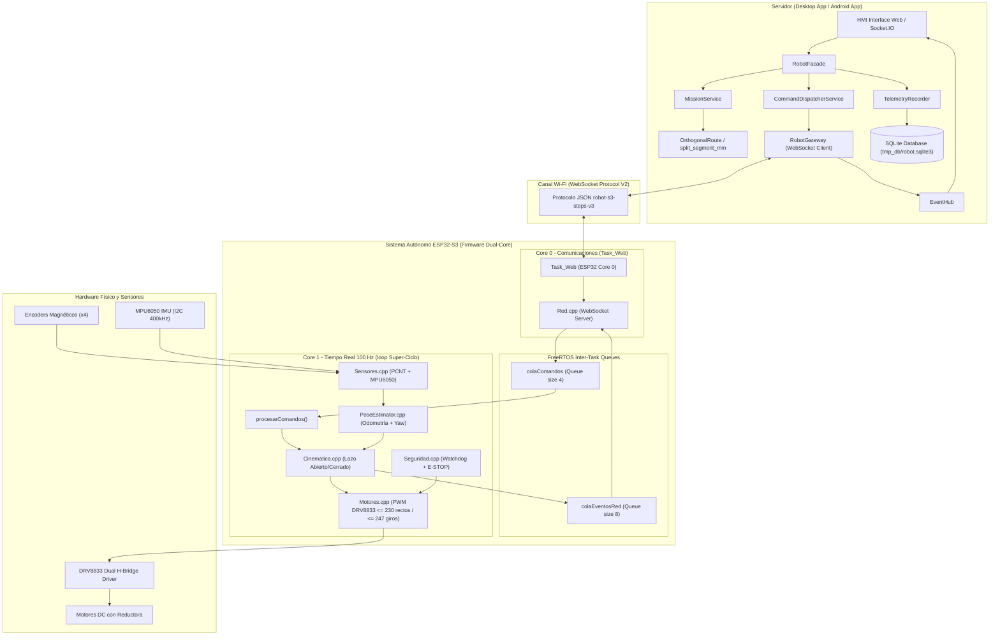
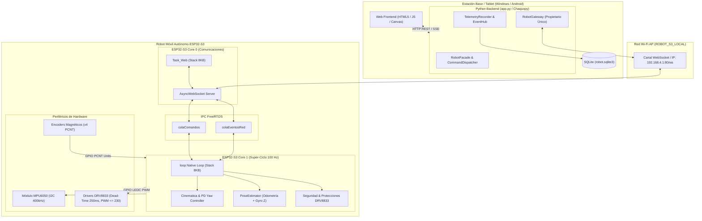
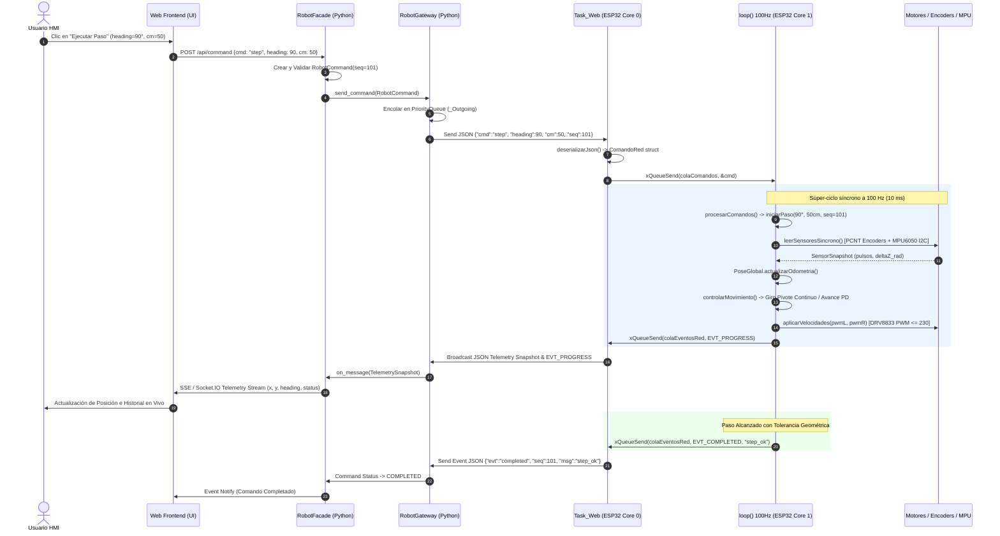
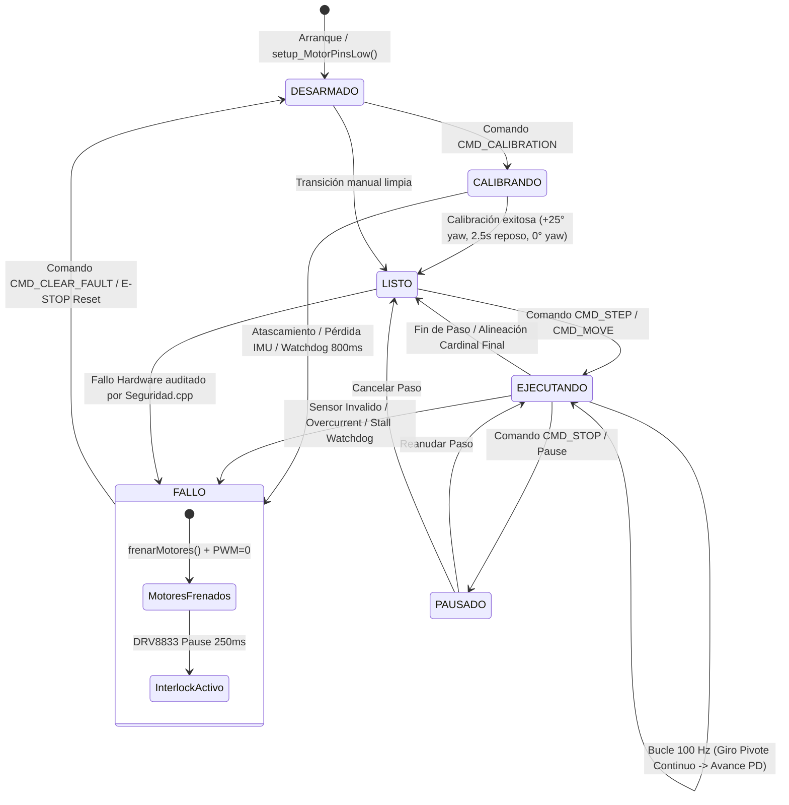

# Esquema de Funcionamiento y Diagramas UML del Sistema General

Este documento describe la arquitectura global, flujo de control y esquemas de interacción entre el **Servidor HMI/Backend (Python Desktop / Android)** y el **Sistema Autónomo (Firmware ESP32-S3)**.

---

## 1. Diagrama UML de Componentes del Sistema General

El sistema se compone de dos grandes subsistemas:

1. **Servidor HMI / Backend** (en `desktop_app/` para Windows y `android_app/` para Tablet Samsung): maneja interfaz visual, persistencia en SQLite, descomposición ortogonal de rutas y WebSocket cliente.
2. **Sistema Autónomo ESP32-S3** (en `src/` e `include/`): ejecuta el control en tiempo real a 100 Hz, odometría, filtrado MPU6050, protecciones eléctricas DRV8833 y servidor WebSocket.

---

## 2. Diagrama UML de Despliegue (Hardware & Software)

Describe la asignación física de componentes software sobre el hardware del robot y la estación base / tablet:

---

## 3. Diagrama UML de Secuencia (Flujo de Ejecución de Paso Ortogonal y Telemetría)

Ilustra el intercambio asíncrono desde que el usuario solicita un comando de movimiento en el Servidor HMI hasta su procesamiento síncrono a 100 Hz en el ESP32-S3 y la retroalimentación de telemetría:

---

## 4. Diagrama UML de Máquina de Estados (Firmware ESP32-S3)

Muestra los estados operativos y las transiciones del robot en firmware:

---

## 5. Referencias de Especificación por Componente

Las especificaciones detalladas de clases, funciones y estructuras de datos se encuentran organizadas en las siguientes carpetas del proyecto:

- **Servidor y Backend (Python / HMI)**: [`desktop_app/README.md`](desktop_app/README.md) y [`docs/especificacion_objetos_sistema.md`](docs/especificacion_objetos_sistema.md#1-especificación-de-objetos-del-servidor-python-desktop_app--android_app).
- **Sistema Autónomo (ESP32-S3 Firmware)**: [`src/README.md`](src/README.md), [`include/README.md`](include/README.md) y [`docs/especificacion_objetos_sistema.md`](docs/especificacion_objetos_sistema.md#2-especificación-de-objetos-del-sistema-autónomo-firmware-esp32-s3).
- **Aplicación Android (Tablet Samsung Wrapper)**: [`android_app/README.md`](android_app/README.md).
