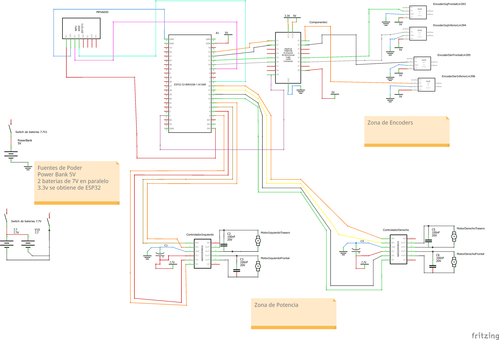
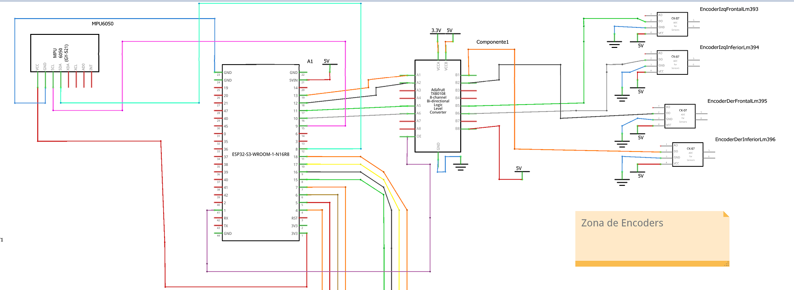
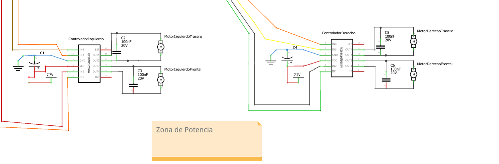
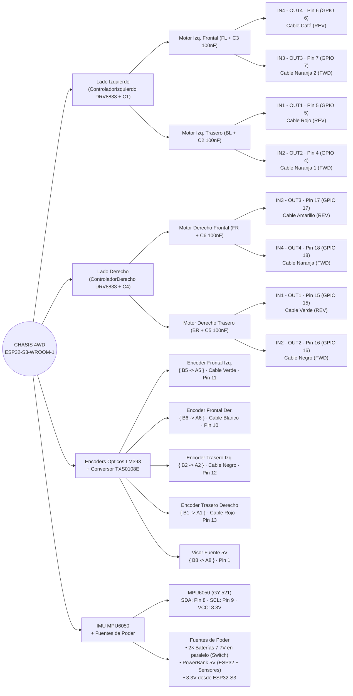

# Esquema Completo y Canónico de Conexiones del ESP32-S3-DevKitC-1 (Robot 4WD)

Este documento detalla el cableado físico exacto del **ESP32-S3-DevKitC-1 (44 pines / WROOM-1-N16R8)** según [`include/Config.h`](../../include/Config.h) y las especificaciones de hardware de [`AGENTS.md`](../../AGENTS.md), e integra las capturas y el **Corolario del Esquemático Diseñado en Fritzing**.

---

## 1. Vista rápida de pines usados en el ESP32-S3-DevKitC-1

En la placa de 44 pines (2×22), los **15 GPIOs** activos y los pines de alimentación se conectan de la siguiente manera:

| Pin ESP32-S3 | Constante en Firmware | Función | Destino físico |
| :--- | :--- | :--- | :--- |
| **GPIO 1** | `PIN_SENSOR_5V` | Monitor de fuente 5V | `TXS0108E` pin **A8** (`B8` va a +5V) |
| **GPIO 4** | `PIN_BL_FWD` | Motor Trasero Izq. (Avance) | `DRV8833 Izq.` pin **IN2** |
| **GPIO 5** | `PIN_BL_REV` | Motor Trasero Izq. (Reversa) | `DRV8833 Izq.` pin **IN1** |
| **GPIO 6** | `PIN_FL_REV` | Motor Delantero Izq. (Reversa) | `DRV8833 Izq.` pin **IN4** |
| **GPIO 7** | `PIN_FL_FWD` | Motor Delantero Izq. (Avance) | `DRV8833 Izq.` pin **IN3** |
| **GPIO 8** | `PIN_I2C_SDA` | Datos I²C (400 kHz) | `GY-521 (MPU6050)` pin **SDA** |
| **GPIO 9** | `PIN_I2C_SCL` | Reloj I²C (400 kHz) | `GY-521 (MPU6050)` pin **SCL** |
| **GPIO 10** | `PIN_ENC_FR` | Encoder Delantero Der. *(Blanco)* | `TXS0108E` pin **A6** |
| **GPIO 11** | `PIN_ENC_FL` | Encoder Delantero Izq. *(Verde)* | `TXS0108E` pin **A5** |
| **GPIO 12** | `PIN_ENC_BL` | Encoder Trasero Izq. *(Negro)* | `TXS0108E` pin **A2** |
| **GPIO 13** | `PIN_ENC_BR` | Encoder Trasero Der. *(Rojo)* | `TXS0108E` pin **A1** |
| **GPIO 15** | `PIN_BR_REV` | Motor Trasero Der. (Reversa) | `DRV8833 Der.` pin **IN1** |
| **GPIO 16** | `PIN_BR_FWD` | Motor Trasero Der. (Avance) | `DRV8833 Der.` pin **IN2** |
| **GPIO 17** | `PIN_FR_REV` | Motor Delantero Der. (Reversa) | `DRV8833 Der.` pin **IN3** |
| **GPIO 18** | `PIN_FR_FWD` | Motor Delantero Der. (Avance) | `DRV8833 Der.` pin **IN4** |
| **3V3** | — | Riel lógico 3.3 V | `MPU6050 VCC` + `TXS0108E VCCA` y `OE` |
| **5V / 5VIN** | — | Alimentación 5 V | Salida +5V del PowerBank / Convertidor DC-DC |
| **GND** | — | Tierra común general | Todos los `GND` del sistema |

---

## 2. Conexión detallada por módulo para Fritzing

### A. Etapa de Potencia: 2× Drivers DRV8833 y 4× Motores TT

> **Nota de simetría mecánica:** En el chasis 4WD los motores delanteros (FL/FR) tienen sus cuerpos orientados hacia atrás y los traseros (BL/BR) hacia adelante. En todos los motores, la salida **FWD** va al cable **Naranja (+)** y la salida **REV** al cable **Negro (-)**.

* **Driver DRV8833 #1 (`ControladorIzquierdo`: FL y BL)**
  * `IN1` ← **GPIO 5** (`PIN_BL_REV`) → `OUT1` al cable **Negro (-)** del **Motor BL** (`MotorIzquierdoTrasero`)
  * `IN2` ← **GPIO 4** (`PIN_BL_FWD`) → `OUT2` al cable **Naranja (+)** del **Motor BL** (`MotorIzquierdoTrasero`)
  * `IN3` ← **GPIO 7** (`PIN_FL_FWD`) → `OUT3` al cable **Naranja (+)** del **Motor FL** (`MotorIzquierdoFrontal`)
  * `IN4` ← **GPIO 6** (`PIN_FL_REV`) → `OUT4` al cable **Negro (-)** del **Motor FL** (`MotorIzquierdoFrontal`)
  * `VCC / VMOT` ← Riel **7.7V** (2 baterías en paralelo a través de **Switch de baterías 7.7V** + capacitor electrolítico **`C1`**)
  * `GND` ← Tierra común (`GND`)

* **Driver DRV8833 #2 (`ControladorDerecho`: FR y BR)**
  * `IN1` ← **GPIO 15** (`PIN_BR_REV`) → `OUT1` al cable **Negro (-)** del **Motor BR** (`MotorDerechoTrasero`)
  * `IN2` ← **GPIO 16** (`PIN_BR_FWD`) → `OUT2` al cable **Naranja (+)** del **Motor BR** (`MotorDerechoTrasero`)
  * `IN3` ← **GPIO 17** (`PIN_FR_REV`) → `OUT3` al cable **Negro (-)** del **Motor FR** (`MotorDerechoFrontal`)
  * `IN4` ← **GPIO 18** (`PIN_FR_FWD`) → `OUT4` al cable **Naranja (+)** del **Motor FR** (`MotorDerechoFrontal`)
  * `VCC / VMOT` ← Riel **7.7V** (2 baterías en paralelo a través de **Switch de baterías 7.7V** + capacitor electrolítico **`C4`**)
  * `GND` ← Tierra común (`GND`)

* **Componentes pasivos de filtrado y protección en el diseño:**
  * **2× Capacitores electrolíticos (`C1` y `C4`, ≥ 100 µF)**: desacoplo de potencia entre `VCC (7.7V)` y `GND` en la entrada de cada módulo DRV8833.
  * **4× Capacitores cerámicos `100nF 20V` (`C2`, `C3`, `C5`, `C6` — 0.1 µF)**: conectados en paralelo entre los terminales de cada uno de los 4 motores reductores TT para supresión de ruido de conmutación de escobillas (Back-EMF / EMI).

---

### B. Odometría: 4× Sensores Ópticos LM393 + Conversor de Nivel Lógico (5V ↔ 3.3V)

Los sensores ópticos LM393 (`CK-07`) operan a **5V** y entregan pulsos digitales de 5V por su pin **`DO`**. El conversor bidireccional de 8 canales reduce esos pulsos a **3.3V** para proteger las entradas PCNT del ESP32-S3:

* **Alimentación y control del Conversor de Nivel (`Componente1`):**
  * `VCCA` (Lado bajo 3.3V) ← **3.3V** (obtenido del pin `3V3` del ESP32-S3)
  * `OE` (Output Enable) ← **3.3V** *(habilita la traducción de los 8 canales)*
  * `VCCB` (Lado alto 5V) ← **+5V** (PowerBank 5V)
  * `GND` ← **GND** común

* **Ruteo canal por canal en el Conversor de Nivel:**

| Canal | Lado B (5V — Sensores LM393) | Lado A (3.3V — ESP32-S3) | Etiqueta en Fritzing | Color de línea |
| :---: | :--- | :--- | :--- | :--- |
| **Canal 1** | **B1** ← Pin `DO` de **Encoder BR** (Trasero Der.) | **A1** → **GPIO 13** (Pin 19) | `EncoderDerInferiorLm396` | Naranja / Rojo |
| **Canal 2** | **B2** ← Pin `DO` de **Encoder BL** (Trasero Izq.) | **A2** → **GPIO 12** (Pin 18) | `EncoderIzqInferiorLm394` | Negro |
| **Canal 5** | **B5** ← Pin `DO` de **Encoder FL** (Delantero Izq.) | **A5** → **GPIO 11** (Pin 17) | `EncoderIzqFrontalLm393` | Verde |
| **Canal 6** | **B6** ← Pin `DO` de **Encoder FR** (Delantero Der.) | **A6** → **GPIO 10** (Pin 16) | `EncoderDerFrontalLm395` | Gris / Blanco |
| **Canal 8** | **B8** ← Riel **+5V** de sensores | **A8** → **GPIO 1** (Pin 41) | Monitor de fuente 5V | Rojo / Violeta |

*(En cada uno de los 4 módulos **LM393**: `VCC` va a **5V**, `GND` a **GND**, `DO` al canal `Bx` correspondiente y `AO` queda sin conectar).*

---

### C. Sensor Inercial (IMU): Módulo GY-521 (MPU6050)

* `VCC` ← **3V3** del ESP32-S3 (Pin 1, línea roja)
* `GND` ← **GND** del ESP32-S3 (Pin 23, línea azul)
* `SDA` ← **GPIO 8** del ESP32-S3 (Pin 12, línea cian)
* `SCL` ← **GPIO 9** del ESP32-S3 (Pin 15, línea magenta)
* *(Pines `XDA`, `XCL`, `AD0` e `INT` quedan abiertos).*

---

## 3. Planos Esquemáticos Diseñados en Fritzing

### 3.1. Plano Esquemático General Completo
Vista integral del sistema (`IntentDiagramRobotS3_esquemático.png`) con las fuentes de poder, la etapa digital/odometría y la etapa de potencia:



* **Archivos fuente y vectoriales en esta carpeta:**
  * [Archivo nativo Fritzing (.fzz)](./IntentDiagramRobotS3.fzz)
  * [Esquemático en alta resolución (PNG)](./IntentDiagramRobotS3_esquematico.png)
  * [Esquemático vectorial escalable (SVG)](./IntentDiagramRobotS3_esquematico.svg)
  * [Documento de plano para impresión (PDF)](./IntentDiagramRobotS3_esquematico.pdf)
  * [Lista de redes eléctrica (Netlist XML)](./IntentDiagramRobotS3_netlist.xml)

---

### 3.2. Detalle de la Zona Digital, IMU y Zona de Encoders
Acercamiento a la interconexión entre el **ESP32-S3-WROOM-1-N16R8 (`A1`)**, el **MPU6050 (`GY-521`)**, el conversor de nivel lógico de 8 canales (`Componente1`) y los cuatro sensores ópticos **`LM393` (`CK-07`)**:



---

### 3.3. Detalle de la Zona de Potencia y Filtrado
Acercamiento a los dos controladores **`MJKDZ DRV8833`** (`ControladorIzquierdo` y `ControladorDerecho`), sus capacitores electrolíticos de riel (`C1`, `C4` sobre `7.7V`) y los cuatro motores TT con sus respectivos capacitores cerámicos anti-ruido de `100nF 20V` (`C2`, `C3`, `C5`, `C6`):



---

## 4. Corolario del Diseño Esquemático en Fritzing

Del diseño esquemático consolidado en **Fritzing** para el robot 4WD basado en **ESP32-S3-WROOM-1-N16R8**, se establecen las siguientes conclusiones de ingeniería y verificación física:

1. **Aislamiento de Rieles de Alimentación (Doble Fuente + Regulación Local):**
   * **Potencia Motriz (`7.7V`)**: Alimentada por **2 baterías de 7.7 V en paralelo** gobernadas por un interruptor físico de corte (`Switch de baterías 7.7V`). Este seccionamiento físico garantiza que durante el intervalo del *Boot ROM* del ESP32-S3 o durante la carga/programación, los puentes H de los módulos `DRV8833` permanezcan desenergizados, evitando movimientos espurios.
   * **Riel Digital y Sensórica (`5V`)**: Suministrado de forma independiente por un **PowerBank de 5 V**, el cual alimenta el pin `5VIN` del ESP32-S3, el lado alto (`VCCB`) del conversor de nivel lógico y los cuatro comparadores ópticos `LM393`. De este modo, los picos de corriente de arranque o bloqueo de los 4 motores TT no provocan caídas de tensión (*brownouts*) en el microcontrolador ni en los encoders.
   * **Riel Lógico de Precisión (`3.3V`)**: Extraído directamente del regulador interno del ESP32-S3 (`3V3`) para alimentar exclusivamente el `MPU6050 (GY-521)` y la referencia baja (`VCCA`) del conversor de nivel lógico, asegurando niveles CMOS limpios para el bus $\text{I}^2\text{C}$ a $400\text{ kHz}$ y los periféricos `PCNT`.

2. **Supresión de Ruido Electromagnético (EMI) y Estabilidad Transitoria:**
   * La inclusión de los capacitores cerámicos **`C2`, `C3`, `C5` y `C6` (`100 nF / 20 V`)** directamente en bornes de cada motor reductor TT cortocircuita a alta frecuencia el ruido de conmutación de las escobillas antes de que se propague por los cables hacia el chasis.
   * Los capacitores electrolíticos de desacoplo **`C1` y `C4`** en los pines `VCC` (`7.7V`) y `GND` de cada `DRV8833` absorben las demandas instantáneas de corriente durante las ráfagas de arranque (*kickstart* de hasta $80\text{ ms}$) y el frenado activo dinámico (*Back-EMF*).

3. **Adaptación de Nivel y Diagnóstico de Salud en Odometría (PCNT):**
   * El conversor de 8 canales adapta de forma segura los pulsos de $5\text{ V}$ de los cuatro sensores `LM393` (`B1`, `B2`, `B5`, `B6`) a niveles de $3.3\text{ V}$ (`A1` $\rightarrow$ `GPIO 13`, `A2` $\rightarrow$ `GPIO 12`, `A5` $\rightarrow$ `GPIO 11`, `A6` $\rightarrow$ `GPIO 10`).
   * El canal 8 (`B8` conectado al riel de `+5V`) actúa como testigo de presencia de tensión de sensores para que el firmware distinga entre una falla mecánica de tracción y una fuente de $5\text{ V}$ apagada.
   * **Nota de revisión rápida de ensamblaje en el esquemático**: En la captura de `ZonaDigital.png`, la línea violeta que sale de `GPIO 1` (pin 41) llega al pin `OE` del conversor mientras `A8` aparece libre; en el montaje físico definitivo, asegúrate de que **`OE` quede fijo a `3.3V`** y que la línea de **`GPIO 1` se conecte a `A8`** (correspondiente a `B8 = 5V`), tal como lo espera `PIN_SENSOR_5V = 1` en el firmware.

4. **Correspondencia Biunívoca Hardware–Firmware:**
   * La disposición simétrica en el plano (`ControladorIzquierdo` gobernado por `GPIO 4, 5, 6, 7` y `ControladorDerecho` por `GPIO 15, 16, 17, 18`, más `SDA/SCL` en `GPIO 8/9`) refleja con exactitud la arquitectura del súper-ciclo síncrono de $100\text{ Hz}$ en el Core 1 del ESP32-S3.

---

## 5. Mapa Conceptual y Cuadro Sinóptico de Cableado Físico (Estilo Taller)

Esta sección traduce tus apuntes manuscritos de banco de trabajo a **cuadros sinópticos con llaves**, **tablas de código de colores** y un **mapa conceptual gráfico** para consulta visual inmediata.

### 5.1. Cuadro Sinóptico con Llaves (Notación de Apuntes)

#### A. Etapa de Motores y Controladores DRV8833

$$
\text{Lado Izquierdo (DRV8833 Izq.)} \left\{
\begin{array}{l}
\text{Motor Izq. Frontal (FL)} \left\{
\begin{array}{l}
\mathtt{IN4 - OUT4} \quad ; \quad \mathbf{Pin\ 6\ (GPIO\ 6)} \quad ; \quad \text{cable café} \quad (\text{REV}) \\
\mathtt{IN3 - OUT3} \quad ; \quad \mathbf{Pin\ 7\ (GPIO\ 7)} \quad ; \quad \text{cable naranja 2} \quad (\text{FWD})
\end{array}
\right. \\
\\
\text{Motor Izq. Trasero (BL)} \left\{
\begin{array}{l}
\mathtt{IN1 - OUT1} \quad ; \quad \mathbf{Pin\ 5\ (GPIO\ 5)} \quad ; \quad \text{cable rojo} \quad (\text{REV}) \\
\mathtt{IN2 - OUT2} \quad ; \quad \mathbf{Pin\ 4\ (GPIO\ 4)} \quad ; \quad \text{cable naranja 1} \quad (\text{FWD})
\end{array}
\right.
\end{array}
\right.
$$

$$
\text{Lado Derecho (DRV8833 Der.)} \left\{
\begin{array}{l}
\text{Motor Derecho Frontal (FR)} \left\{
\begin{array}{l}
\mathtt{IN3 - OUT3} \quad ; \quad \mathbf{Pin\ 17\ (GPIO\ 17)} \quad ; \quad \text{cable amarillo} \quad (\text{REV}) \\
\mathtt{IN4 - OUT4} \quad ; \quad \mathbf{Pin\ 18\ (GPIO\ 18)} \quad ; \quad \text{cable naranja} \quad (\text{FWD})
\end{array}
\right. \\
\\
\text{Motor Derecho Trasero (BR)} \left\{
\begin{array}{l}
\mathtt{IN1 - OUT1} \quad ; \quad \mathbf{Pin\ 15\ (GPIO\ 15)} \quad ; \quad \text{cable verde} \quad (\text{REV}) \\
\mathtt{IN2 - OUT2} \quad ; \quad \mathbf{Pin\ 16\ (GPIO\ 16)} \quad ; \quad \text{cable negro} \quad (\text{FWD})
\end{array}
\right.
\end{array}
\right.
$$

---

#### B. Encoders Ópticos (`LM393`) $\rightarrow$ `TXS0108E` $\rightarrow$ `ESP32-S3`

$$
\text{Encoders (PCNT)} \left\{
\begin{array}{llll}
\text{Encoder Frontal Izq. (FL)} & \longrightarrow \{ \mathtt{B5 \rightarrow A5} \} & \longrightarrow \text{cable verde} & \longrightarrow \mathbf{Pin\ 11\ (GPIO\ 11)} \\
\text{Encoder Frontal Der. (FR)} & \longrightarrow \{ \mathtt{B6 \rightarrow A6} \} & \longrightarrow \text{cable blanco} & \longrightarrow \mathbf{Pin\ 10\ (GPIO\ 10)} \\
\text{Encoder Trasero Izq. (BL)} & \longrightarrow \{ \mathtt{B2 \rightarrow A2} \} & \longrightarrow \text{cable negro} & \longrightarrow \mathbf{Pin\ 12\ (GPIO\ 12)} \\
\text{Encoder Trasero Der. (BR)} & \longrightarrow \{ \mathtt{B1 \rightarrow A1} \} & \longrightarrow \text{cable rojo} & \longrightarrow \mathbf{Pin\ 13\ (GPIO\ 13)} \\
\text{Visor de Fuente 5V} & \longrightarrow \{ \mathtt{B8 \rightarrow A8} \} & \longrightarrow \text{cable violeta} & \longrightarrow \mathbf{Pin\ 1\ (GPIO\ 1)}
\end{array}
\right.
$$

---

#### C. IMU (`MPU6050 GY-521`) y Fuentes de Poder

$$
\text{IMU y Energía} \left\{
\begin{array}{l}
\text{MPU6050 (GY-521)} \left\{
\begin{array}{l}
\mathtt{SDA} \longrightarrow \mathbf{Pin\ 8\ (GPIO\ 8)} \quad ; \quad \text{cable cian} \\
\mathtt{SCL} \longrightarrow \mathbf{Pin\ 9\ (GPIO\ 9)} \quad ; \quad \text{cable magenta} \\
\mathtt{VCC} \longrightarrow \mathbf{3V3\ (ESP32)} \quad ; \quad \mathtt{GND} \longrightarrow \mathbf{GND}
\end{array}
\right. \\
\\
\text{Fuentes de Poder} \left\{
\begin{array}{l}
\mathbf{7.7\text{ V}} \longrightarrow \text{2 baterías 7.7 V en paralelo + Switch físico} \longrightarrow \mathtt{VCC\ DRV8833\ (C1, C4)} \\
\mathbf{5.0\text{ V}} \longrightarrow \text{PowerBank 5 V} \longrightarrow \mathtt{5VIN\ ESP32} + \mathtt{VCCB\ TXS0108E} + \mathtt{4\times LM393} \\
\mathbf{3.3\text{ V}} \longrightarrow \text{Salida 3V3 del ESP32-S3} \longrightarrow \mathtt{VCC\ MPU6050} + \mathtt{VCCA/OE\ TXS0108E}
\end{array}
\right.
\end{array}
\right.
$$

---

### 5.2. Vista en Árbol de Texto (Referencia Directa en Consola/Editor)

```text
┌── LADO IZQUIERDO (ControladorIzquierdo DRV8833 + C1)
│   ├── Motor Izq Frontal (FL + C3 100nF)
│   │   ├── IN4 - OUT4  ;  pin 6  (GPIO 6)   ;  cable café       [REV]
│   │   └── IN3 - OUT3  ;  pin 7  (GPIO 7)   ;  cable naranja 2  [FWD]
│   └── Motor Izq Trasero (BL + C2 100nF)
│       ├── IN1 - OUT1  ;  pin 5  (GPIO 5)   ;  cable rojo       [REV]
│       └── IN2 - OUT2  ;  pin 4  (GPIO 4)   ;  cable naranja 1  [FWD]
│
├── LADO DERECHO (ControladorDerecho DRV8833 + C4)
│   ├── Motor Derecho Frontal (FR + C6 100nF)
│   │   ├── IN3 - OUT3  ;  pin 17 (GPIO 17)  ;  cable amarillo   [REV]
│   │   └── IN4 - OUT4  ;  pin 18 (GPIO 18)  ;  cable naranja    [FWD]
│   └── Motor Derecho Trasero (BR + C5 100nF)
│       ├── IN1 - OUT1  ;  pin 15 (GPIO 15)  ;  cable verde      [REV]
│       └── IN2 - OUT2  ;  pin 16 (GPIO 16)  ;  cable negro      [FWD]
│
├── ENCODERS (4× LM393 5V) ──► TXS0108E ──► ESP32-S3 (3.3V)
│   ├── Encoder Frontal Izq (FL)  ──► { B5 -> A5 } ──► cable verde   ──► pin 11 (GPIO 11)
│   ├── Encoder Frontal Der (FR)  ──► { B6 -> A6 } ──► cable blanco  ──► pin 10 (GPIO 10)
│   ├── Encoder Trasero Izq (BL)  ──► { B2 -> A2 } ──► cable negro   ──► pin 12 (GPIO 12)
│   ├── Encoder Trasero Der (BR)  ──► { B1 -> A1 } ──► cable rojo    ──► pin 13 (GPIO 13)
│   └── Monitor Fuente 5V         ──► { B8 -> A8 } ──► cable violeta ──► pin 1  (GPIO 1)
│
└── IMU MPU6050 (GY-521)
    ├── SDA ──► cable cian    ──► pin 8 (GPIO 8)
    ├── SCL ──► cable magenta ──► pin 9 (GPIO 9)
    └── VCC ──► 3V3 (ESP32)   ;   GND ──► GND común
```

---

### 5.3. Tablas de Trazabilidad Física (Pines, Canales y Colores de Cable)

#### Tabla 1: Cableado de Control de Motores (ESP32-S3 $\rightarrow$ DRV8833 $\rightarrow$ Motores TT)

| Lado del Chasis | Motor | Canal DRV8833 | Pin ESP32-S3 | Función Lógica | Color de Cable Control (Jumper) | Bornera Motor TT (+ / -) | Capacitor Anti-Ruido |
| :--- | :--- | :---: | :---: | :---: | :--- | :--- | :---: |
| **Lado Izquierdo** | **Motor Izq. Frontal (`FL`)** | `IN4 - OUT4` | **Pin 6** (`GPIO 6`) | Reversa (`REV`) | **Café** | Negro (`-`) | `C3` (`100nF 20V`) |
| **Lado Izquierdo** | **Motor Izq. Frontal (`FL`)** | `IN3 - OUT3` | **Pin 7** (`GPIO 7`) | Avance (`FWD`) | **Naranja 2** | Naranja (`+`) | `C3` (`100nF 20V`) |
| **Lado Izquierdo** | **Motor Izq. Trasero (`BL`)** | `IN1 - OUT1` | **Pin 5** (`GPIO 5`) | Reversa (`REV`) | **Rojo** | Negro (`-`) | `C2` (`100nF 20V`) |
| **Lado Izquierdo** | **Motor Izq. Trasero (`BL`)** | `IN2 - OUT2` | **Pin 4** (`GPIO 4`) | Avance (`FWD`) | **Naranja 1** | Naranja (`+`) | `C2` (`100nF 20V`) |
| **Lado Derecho** | **Motor Der. Frontal (`FR`)** | `IN3 - OUT3` | **Pin 17** (`GPIO 17`) | Reversa (`REV`) | **Amarillo** | Negro (`-`) | `C6` (`100nF 20V`) |
| **Lado Derecho** | **Motor Der. Frontal (`FR`)** | `IN4 - OUT4` | **Pin 18** (`GPIO 18`) | Avance (`FWD`) | **Naranja** | Naranja (`+`) | `C6` (`100nF 20V`) |
| **Lado Derecho** | **Motor Der. Trasero (`BR`)** | `IN1 - OUT1` | **Pin 15** (`GPIO 15`) | Reversa (`REV`) | **Verde** | Negro (`-`) | `C5` (`100nF 20V`) |
| **Lado Derecho** | **Motor Der. Trasero (`BR`)** | `IN2 - OUT2` | **Pin 16** (`GPIO 16`) | Avance (`FWD`) | **Negro** | Naranja (`+`) | `C5` (`100nF 20V`) |

#### Tabla 2: Cableado de Encoders Ópticos (`LM393` $\rightarrow$ `TXS0108E` $\rightarrow$ `ESP32-S3`)

| Sensor Óptico (`LM393`) | Nombre en Esquema Fritzing | Cruce `TXS0108E` (5V $\rightarrow$ 3.3V) | Color de Cable Físico | Pin ESP32-S3 (PCNT) | Constante Firmware |
| :--- | :--- | :---: | :--- | :---: | :--- |
| **Encoder Frontal Izq.** (`FL`) | `EncoderIzqFrontalLm393` | `{ B5 -> A5 }` | **Cable Verde** | **Pin 11** (`GPIO 11`) | `PIN_ENC_FL` |
| **Encoder Frontal Der.** (`FR`) | `EncoderDerFrontalLm395` | `{ B6 -> A6 }` | **Cable Blanco** | **Pin 10** (`GPIO 10`) | `PIN_ENC_FR` |
| **Encoder Trasero Izq.** (`BL`) | `EncoderIzqInferiorLm394` | `{ B2 -> A2 }` | **Cable Negro** | **Pin 12** (`GPIO 12`) | `PIN_ENC_BL` |
| **Encoder Trasero Der.** (`BR`) | `EncoderDerInferiorLm396` | `{ B1 -> A1 }` | **Cable Rojo** | **Pin 13** (`GPIO 13`) | `PIN_ENC_BR` |
| **Monitor Fuente 5V** | Riel `+5V` en `Componente1` | `{ B8 -> A8 }` | **Cable Violeta / Rojo** | **Pin 1** (`GPIO 1`) | `PIN_SENSOR_5V` |

---

### 5.4. Mapa Conceptual Gráfico (Mermaid)


