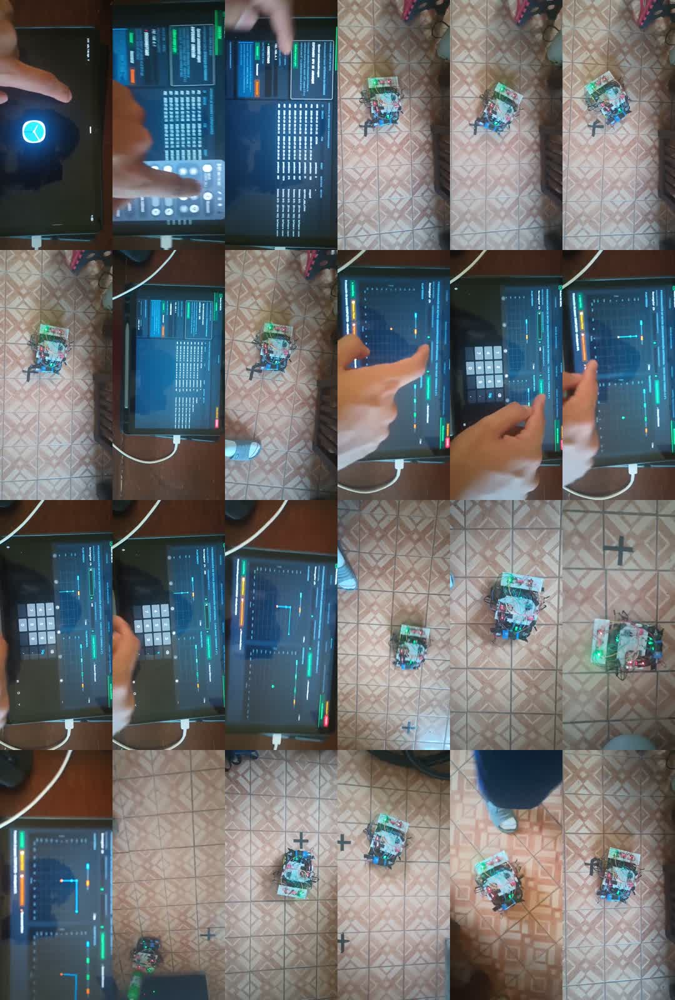
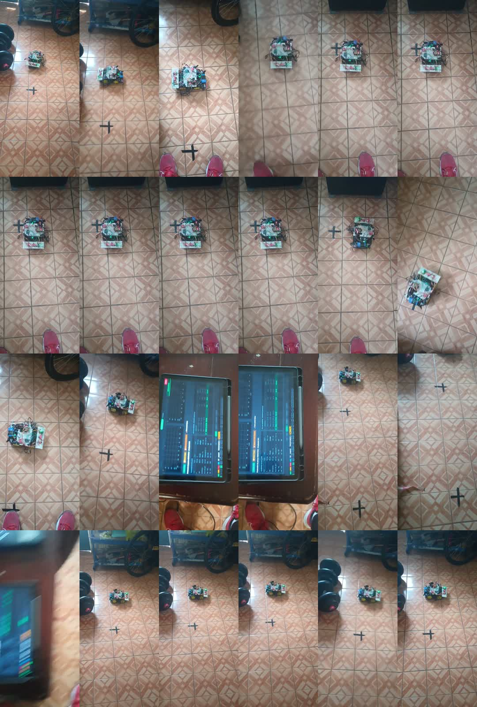

# Manual de uso y recuperación — Robot S3

Este manual describe el sistema operativo actual `robot-s3-steps-v3`. La HMI y
el backend canónicos viven en `desktop_app/`; Android empaqueta esas mismas
fuentes. Python planifica y conserva la misión. El ESP32 ejecuta una sola
maniobra atómica y conserva toda la autoridad de tiempo real y seguridad.

> **Estado de aceptación:** la arquitectura puede probarse con ruedas elevadas,
> pero no debe declararse segura para suelo hasta completar la medición de
> corriente, verificar los cuatro encoders y resolver los hallazgos altos de la
> [auditoría vigente](auditoria_estado_actual.md).

## 1. Reglas que nunca deben romperse

1. Utilizar un solo controlador: Windows **o** Android, nunca ambos conectados
   simultáneamente al WebSocket del robot.
2. Mantener VMOT apagado durante boot, reset y carga de firmware.
3. Hacer la primera prueba con ruedas elevadas, fuente limitada a 0.5 A o
   batería protegida con fusible de 1 A.
4. Confirmar PWM izquierdo y derecho en cero antes de habilitar potencia.
5. No repetir manualmente un paso cuya ejecución quedó incierta después de un
   reinicio o pérdida prolongada de telemetría.
6. Cerrar mediante **Cerrar aplicación**, no terminando el proceso desde el
   selector de tareas.

## 2. Elementos del sistema

| Elemento | Responsabilidad |
|---|---|
| HMI local | Preparación, rutas, visualización, alarmas y cierre seguro. |
| Backend Python | Validación, subdivisión, misión, secuencias, SQLite y gateway. |
| ESP32-S3 | PCNT, MPU, pose, seguridad, cinemática, PWM y E-STOP. |
| SQLite | Sesiones históricas, comandos, eventos, telemetría y ajustes persistentes. |
| DRV8833 | Etapa física de potencia; requiere protecciones eléctricas externas. |

La vista completa de componentes, despliegue y secuencias está en el
[Atlas UML](../DIAGRAMA_SISTEMA_GENERAL.md). El inventario generado de funciones
está en [`docs/uml/`](uml/README.md).

## 3. Preparación física

Antes de encender:

- Ruedas elevadas y área de giro libre.
- Un capacitor electrolítico de al menos 100 µF entre VMOT y GND por driver.
- Un capacitor cerámico de 0.1 µF entre terminales de cada motor.
- Fusible o polyfuse de 1.5 A por driver o motor para operación; usar 1 A en la
  primera prueba indicada.
- Tierra común entre fuente, drivers y ESP32.
- Conectores de los cuatro encoders firmes.
- Entradas de motor sin señales flotantes.

El firmware fuerza los GPIO de motor a LOW como primera operación controlable,
pero no controla el intervalo del boot ROM. Por eso VMOT debe permanecer
físicamente deshabilitado durante carga o reset.

### Ensamble y verificación de señales

La tabla describe el corte auditado; confirmar siempre `include/Config.h` antes
de cablear una revisión distinta.

| Elemento | Pines activos | Comprobación sin VMOT |
|---|---|---|
| Motores FL | GPIO 6/7 | Ambas entradas permanecen LOW durante boot controlable. |
| Motores BL | GPIO 4/5 | Ambas entradas permanecen LOW durante boot controlable. |
| Motores FR | GPIO 17/18 | Ambas entradas permanecen LOW durante boot controlable. |
| Motores BR | GPIO 15/16 | Ambas entradas permanecen LOW durante boot controlable. |
| Encoders FL/FR/BL/BR | GPIO 10/11/12/13 | Cada contador cambia al girar manualmente sólo su rueda. |
| MPU6050 I²C | SDA 8, SCL 9 | El escaneo detecta el sensor; no confundir con RX/TX. |

No alimentar motores desde el regulador del ESP32. Unir tierras, respetar la
tensión admitida por cada módulo y comprobar polaridad antes de energizar.

### Instalar PlatformIO, compilar y cargar firmware

PlatformIO Core ya instalado en este equipo vive en
`C:\Users\IK\.platformio\penv\Scripts\platformio.exe`. En otro equipo puede
instalarse con PlatformIO IDE o el instalador oficial de Core CLI.

1. Copiar `include/Secrets.example.h` a `include/Secrets.h` y completar las
   credenciales localmente. Nunca confirmar `Secrets.h`.
2. Con VMOT físicamente apagado, conectar el ESP32-S3 por USB.
3. Compilar:

   ```powershell
   $pio = 'C:\Users\IK\.platformio\penv\Scripts\platformio.exe'
   & $pio run
   ```

4. Identificar el puerto con el Administrador de dispositivos o
   `& $pio device list` y cargar:

   ```powershell
   & $pio run --target upload --upload-port '<PUERTO_COM>'
   & $pio device monitor --port '<PUERTO_COM>' --baud 115200
   ```

5. Confirmar versión `robot-s3-v3`, protocolo `robot-s3-steps-v3`, razón de
   reset y PWM 0/0 antes de desconectar USB o habilitar VMOT.

## 4. Inicio desde Windows

1. Encender solamente la lógica del ESP32.
2. Esperar la red Wi-Fi `<SSID_ROBOT>` definida en la configuración privada.
3. Conectar Windows a esa red.
4. Desde la raíz del repositorio, ejecutar:

   ```powershell
   .\INICIAR_ROBOT.bat
   ```

5. Abrir la dirección local mostrada por el servidor.
6. Confirmar que el destino sea `<IP_ROBOT>` y pulsar **Conectar** si fuese
   necesario.
7. No iniciar también la aplicación Android mientras Windows sea propietario.

Un indicador **CONECTADO** sólo confirma el transporte. Para permitir rutas,
la HMI debe mostrar además protocolo `robot-s3-steps-v3`, telemetría reciente,
`cal=true` y estado `listo`.

El `X-App-Token` protege mutaciones HTTP del servidor local; la HMI lo obtiene
del arranque y no debe copiarse a capturas o documentación pública. La sesión
corta del protocolo identifica un proceso controlador y `seq` ordena comandos
dentro de ella. El ID entero de SQLite es sólo historial: ninguno de estos tres
valores reemplaza a los otros.

## 5. Instalación y actualización Android

La tablet debe tener depuración USB habilitada y autorizar la huella RSA del
equipo. Primero se descubre el serial real:

```powershell
$adb = 'C:\Users\IK\AppData\Local\Android\Sdk\platform-tools\adb.exe'
& $adb devices -l
```

Si la salida muestra `unauthorized`, desbloquear la tablet y aceptar el cuadro
de autorización. Si la lista está vacía, revisar cable, modo USB y depuración;
no reutilizar un serial anterior hasta que aparezca de nuevo.

Con el serial mostrado por `devices -l`:

```powershell
$serial = '<SERIAL_ACTUAL>'
$apk = 'C:\Users\IK\Documents\Codex\carroTest3-For-Esp32-s3-wroom\android_app\app\build\outputs\apk\debug\app-debug.apk'
& $adb -s $serial install -r $apk
```

Después:

1. Conectar la tablet a `<SSID_ROBOT>` y aceptar mantener la red aunque no
   tenga Internet.
2. Cerrar el controlador Windows.
3. Abrir Robot S3 en la tablet.
4. Verificar que el servicio persistente esté activo.
5. Confirmar WebSocket v3 y telemetría antes de habilitar VMOT.



## 6. Interpretar los estados de la HMI

| Indicación | Significado | Puede ejecutar ruta |
|---|---|---:|
| `DESCONECTADO` | No hay socket hacia `<IP_ROBOT>`. | No |
| `CONECTANDO` | Intento de conexión en curso. | No |
| `REINTENTANDO` | Backoff después de fallo de transporte. | No |
| `CONECTADO` + `desarmado` | Socket abierto, pero robot no calibrado. | No |
| `calibrando` | Calibración física en ejecución. | No |
| `listo`, `cal=true` | Transporte, sensores y calibración disponibles. | Sí |
| `ejecutando` | Paso atómico activo. | No se inicia otra misión |
| `fallo` | Protección activada; PWM debe estar en cero. | No |
| `estop` | E-STOP enclavado. | No |

La versión actual puede mostrar un mensaje genérico de “robot conectado y MPU
lista” para varias causas. Consultar protocolo, antigüedad de telemetría,
`cal`, estado y último terminal antes de asumir que falló el Wi-Fi.

## 7. Calibración supervisada

1. Mantener las ruedas elevadas y el radio de giro libre.
2. Habilitar VMOT con fuente limitada.
3. Confirmar que los cuatro contadores PCNT reaccionen al girar sus ruedas.
4. Pulsar **Recalibrar** una sola vez.
5. Observar la búsqueda de torque, validación de giro, reposo y retorno.
6. Aceptar sólo el terminal `completed/cal_ok` y estado final `listo`.

Durante la calibración se deben observar simultáneamente gyro y ticks por lado.
Un cambio de yaw con los cuatro encoders en cero no es una calibración válida.

### Fallos de calibración

| Detalle | Interpretación | Acción |
|---|---|---|
| `cal_stall_left` | El lado izquierdo no confirmó movimiento. | Cortar VMOT y revisar ambos encoders/conectores izquierdos. |
| `cal_stall_right` | El lado derecho no confirmó movimiento. | Cortar VMOT y revisar ambos encoders/conectores derechos. |
| `cal_unavailable` | Estado actual no permite calibrar. | Esperar parada, limpiar fallo si procede y revisar telemetría. |
| Pérdida de conexión | No se conoce el estado final. | No repetir inmediatamente; reconectar y revisar `cal/state/last_seq`. |

## 8. Crear y ejecutar una ruta

La convención cardinal es:

- `0°`: `Y+`
- `90°`: `X+`
- `180°`: `Y−`
- `270°`: `X−`

Procedimiento:

1. Abrir la pestaña **Rutas** sólo después de `listo/cal=true`.
2. Introducir los puntos absolutos y revisar la previsualización.
3. Confirmar que no exista otra misión activa o bloqueada sin resolver.
4. Pulsar **Ejecutar ruta**.
5. Verificar que Python envíe un único `step` por vez.
6. Para cada tramo esperar `accepted`, `progress` y
   `completed/detail=step_ok`.
7. No considerar terminada la misión hasta `stage=completed`.

Python subdivide cada vector en tramos de máximo 200 cm. La tolerancia
geométrica de 1 mm se usa para normalizar pequeñas desviaciones y los puntos
diagonales se descomponen en dos tramos ortogonales.



### Tutorial visual de la ruta grabada

| Momento | Referencia | Qué comprobar |
|---:|---|---|
| 00:01 | [Punto inicial](../evidencia/fotogramas/ruta_ortogonal/fotograma_01.jpg) | Posición, orientación y marcas físicas. |
| 00:16 | [Primer tramo](../evidencia/fotogramas/ruta_ortogonal/fotograma_05.jpg) | Avance continuo y ausencia de obstáculos. |
| 00:31 | [Continuidad](../evidencia/fotogramas/ruta_ortogonal/fotograma_09.jpg) | Correspondencia visual con el eje previsto. |
| 00:46 | [Transición](../evidencia/fotogramas/ruta_ortogonal/fotograma_13.jpg) | Giro y cambio de tramo. |
| 01:00 | [Estado HMI](../evidencia/fotogramas/ruta_ortogonal/fotograma_17.jpg) | Índice, estado y telemetría. |
| 01:22 | [Resultado](../evidencia/fotogramas/ruta_ortogonal/fotograma_23.jpg) | Posición observable final. |

El video comprimido y normalizado está en
[`evidencia/videos/`](../evidencia/videos/ruta_ortogonal_y100_y50_x190_xmenos190.mp4).
La grabación no sustituye medición física ni telemetría SQLite.

## 9. Retorno Ockham

El retorno sólo está disponible después de completar una ruta saliente. Python
guarda el origen y los puntos subdivididos realmente aceptados.

1. Confirmar `last_completed_route.return_state=available`.
2. Confirmar telemetría reciente, estado `listo` y ausencia de comando activo.
3. Pulsar **Regresar por Ockham** una sola vez.
4. Python marca el retorno `in_progress` antes del primer movimiento.
5. Los vectores se invierten en orden inverso y se envían uno a uno.
6. Después del último tramo, el ESP32 recibe `turn_to {heading:0}`.
7. Aceptar únicamente `step_ok` para tramos, `turn_ok` para alineación y
   `return_state=completed` al final.

No volver a iniciar un retorno consumido. Si se bloquea, conservar la evidencia
y decidir una nueva misión desde una pose físicamente verificada.

## 10. Desconexiones y reinicios

### Corte exclusivo de transporte

Si el ESP32 no reinició, la misma sesión y `last_seq` permiten reconciliar:

- `last_seq >= seq esperado`: Python avanza sin repetir el paso.
- Robot todavía `ejecutando`: Python espera el terminal.
- Robot `listo`, `last_seq < seq`: puede reenviar la misma identidad del paso.

La implementación actual sólo hace cinco intentos automáticos; después exige
pulsar **Conectar**. Esta es una limitación abierta, no una instrucción deseada.

### Reinicio del ESP32

Se reconoce por `cal=false`, `last_seq=0`, estado `desarmado`, pose reiniciada o
un futuro `boot_id` diferente. La sesión Python puede conservar el mismo texto,
pero el ESP32 perdió su memoria interna.

- Si había un paso en curso, no repetirlo: la distancia parcial es desconocida.
- Bloquear la misión, frenar y revisar posición real.
- Recalibrar con ruedas elevadas.
- Restablecer o verificar pose antes de crear otra ruta.

### Reinicio de Python o de la aplicación

El arranque pone en cuarentena cualquier misión no terminal, falla comandos
pendientes, cierra sesiones SQLite huérfanas y envía una parada de
reconciliación. La misión abandonada no se reenvía.

## 11. Detener, E-STOP y limpiar fallos

- **Detener** solicita parada controlada y debe terminar con `stop_ok`.
- **E-STOP** tiene prioridad y enclava el robot; usarlo ante movimiento
  inesperado, obstáculo, cable suelto, ruido eléctrico o pérdida de control.
- **Limpiar fallo** sólo retira el estado lógico cuando las condiciones físicas
  ya fueron corregidas. No repara encoders, drivers ni alimentación.

Después de cualquier fallo, verificar PWM `0/0` antes de acercarse al robot.

## 12. Cierre seguro

1. Pulsar **Cerrar aplicación**.
2. El backend bloquea comandos nuevos.
3. Si detecta movimiento o misión activa, envía `stop` y espera hasta cinco
   segundos el terminal exacto `completed/stop_ok`.
4. Con confirmación, abandona la misión si corresponde, cierra comandos y
   sesión, confirma SQLite y devuelve `safe_to_close=true`.
5. Android detiene el servicio y ejecuta `finishAndRemoveTask()`; Windows cierra
   Waitress después de responder al navegador.

Si no llega el ACK, el cierre normal devuelve 409 y debe permanecer abierto. El
cierre forzado sólo registra que la parada física no pudo confirmarse; no
significa que el robot se haya detenido.

## 13. Consultar SQLite y recopilar evidencia

Para extraer la copia de depuración desde Android, comprobar primero el serial
real y usar la ruta externa configurada por la aplicación:

```powershell
$adb = 'C:\Users\IK\AppData\Local\Android\Sdk\platform-tools\adb.exe'
& $adb devices -l
& $adb -s '<SERIAL_ACTUAL>' pull '/sdcard/Android/data/mx.ik.robots3/files/debug/robot.sqlite3' 'tmp_db/robot.sqlite3'
```

Desde la raíz:

```powershell
$python = 'C:\Users\IK\Documents\Codex\carroTest3-For-Esp32-s3-wroom\desktop_app\.test-venv\Scripts\python.exe'
& $python consultar_db.py
& $python consultar_db.py --commands 20
& $python consultar_db.py --events 50
& $python consultar_db.py --telemetry 20
& $python consultar_db.py --search 'cal_stall'
```

Para una prueba reproducible se deben guardar:

- APK/firmware y commit exactos.
- SHA-256 de videos y base SQLite.
- Hora local y UTC.
- Sesión de protocolo, sesión SQLite y secuencia de comando.
- Estado, pose, yaw, PWM y cuatro encoders.
- Eventos `accepted`, terminal y causa de desconexión.
- Medición física y corriente observada.

Antes de limpiar historial, exportar desde la HMI o las rutas
`/api/v1/sessions/<id>.json` y `/api/v1/sessions/<id>/telemetry.csv`. La acción
de limpieza usa `POST /api/v1/sessions/cleanup`; `days=0` borra todas las
sesiones y no tiene deshacer. Véase
[`datos_y_privacidad.md`](datos_y_privacidad.md).

## 14. Diagnóstico rápido

| Síntoma | Revisar primero | Interpretación habitual |
|---|---|---|
| “Debe estar conectado…” con indicador verde | Protocolo, edad de telemetría, `cal` y estado | Socket abierto, pero robot no listo. |
| Ruta no crea ningún `step` | `active_mission`, errores HTTP y preparación | Rechazo previo a encolar. |
| `cal_stall_left/right` | Ticks de ambos encoders del lado | Movimiento no confirmado. |
| Reconecta con `last_seq=0` | `cal`, pose y motivo de reset | Reinicio del firmware o estado perdido. |
| Se detienen los reintentos | Contador 5/5 del gateway | Limitación actual; pulsar Conectar. |
| Varias sesiones SQLite en una misión | Eventos BACKOFF | Fragmentación histórica, no cambio del token. |
| Paso permanece activo sin terminal | Cola de eventos y `last_seq` | ACK terminal perdido o reconciliación pendiente. |

## 15. Prueba física de aceptación

Con ruedas elevadas y protección de corriente:

1. Medir corriente de arranque y rotor bloqueado de cada motor.
2. Verificar corriente sostenida menor de 1 A.
3. Validar encoders FL, FR, BL y BR por separado.
4. Calibrar y ejecutar giros a 0°, 90°, 180° y 270°.
5. Incluir sobrepaso y corrección de polaridad.
6. Ejecutar `Y+100, Y+50, X+190, X−190`.
7. Ejecutar retorno Ockham y confirmar yaw final dentro de la tolerancia
   configurada real.
8. Cortar únicamente Wi-Fi durante un tramo y verificar reconciliación sin
   duplicado.
9. Reiniciar el ESP32 durante otro ensayo y verificar que el paso incierto no se
   repita.
10. Cerrar durante un tramo y confirmar `stop_ok`, PWM cero, sesión terminada y
    eventos SQLite.

Sólo después de registrar estas mediciones se puede repetir la ruta en suelo.

### Lista posterior a cada prueba

- [ ] Pulsar Detener o cierre seguro y confirmar `stop_ok` si hubo movimiento.
- [ ] Verificar PWM 0/0 antes de acercarse o cortar alimentación.
- [ ] Registrar terminal, fallo, `last_seq`, yaw, pose y cuatro encoders.
- [ ] Anotar corriente máxima/sostenida y cualquier olor, temperatura o ruido.
- [ ] Exportar sesión y video antes de limpiar historial.
- [ ] Marcar la prueba como válida, inválida o inconclusa; una desconexión no se
      convierte en éxito por ausencia de un fallo visible.

## 16. Documentación relacionada

- [Auditoría del estado actual](auditoria_estado_actual.md)
- [Atlas UML integral](../DIAGRAMA_SISTEMA_GENERAL.md)
- [Catálogo UML por carpeta](uml/README.md)
- [Protocolo JSON v3](protocolo_json_steps_v3_hmi_esp32.md)
- [Validación física](validacion_sistema_final.md)
- [Evidencia audiovisual](../evidencia/README.md)
- [Datos y privacidad](datos_y_privacidad.md)
- [Glosario y referencias](glosario_y_referencias.md)
- [Portal interactivo](../documentacionCompleta/README.md)
