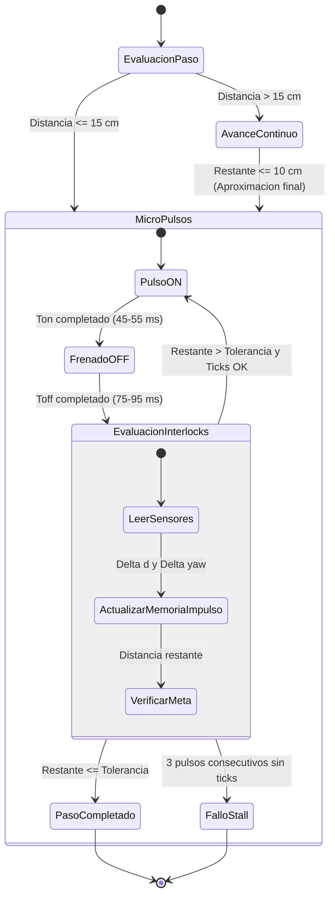

# Plan Técnico de Corrección de Errores: Avance Recto Robusto y Modo de Micro-Pulsos de Alto Par

## 1. Estado Operativo Actual (Post-Calibración Exitosa)

Tras restaurar la detección de flanco dual en el periférico PCNT (`pcnt_config.neg_mode = PCNT_COUNT_INC`), calibrar el filtro de hardware a 100 ciclos APB (1.25 µs) y fijar `ENCODER_PPR = 40`, **la calibración física del robot ha sido validada con éxito**:
- **Sesión #30 (18:27 UTC)**: `cal_ok` obtenido con éxito.
- **Sesión #33 (20:55 UTC)**: `cal_ok` obtenido con éxito.

Sin embargo, al iniciar las secuencias de avance ortogonal en línea recta surgieron fallos sistemáticos que impidieron completar las rutas planificadas.

---

## 2. Diagnóstico Forense de Telemetría ADB (Sesiones #30 y #33)

### 2.1 Sesión #33: Fallo `recenter_diverging` en Avance Recto de 50 cm
- **Objetivo**: `{"heading": 0.0, "cm": 50.0, "drive_mode": "auto", "target_x_mm": 0, "target_y_mm": 500}`.
- **Secuencia Temporal en Telemetría**:
  1. El robot arranca hacia adelante con PWM equilibrado (L: 770, R: 710), avanzando desde $Y = 5.1\text{ cm}$ hasta $Y = 26.0\text{ cm}$.
  2. A medida que avanza, una leve asimetría de tracción produce una deriva lateral de $-2.3\text{ cm}$ ($X = -23\text{ mm}$, rumbo $352.5^\circ$, un desvío de apenas $-7.5^\circ$).
  3. **Disparo Inapropiado de Recentrado**: La función `debeRecentrar()` en `src/Cinematica.cpp` detectó que la desviación superó `RECENTER_LATERAL_DEADBAND_CM` (2.0 cm) y persistió por más de 500 ms.
  4. En lugar de mantener el avance recto compensando la dirección con el PID de rumbo, **el controlador interrumpió el avance** y pasó a `recenter_turn`.
  5. En `recenter_turn`, el firmware inició una rampa desde PWM 16. La fricción estática del chasis 4WD sobre suelo impidió cualquier rotación hasta que el PWM alcanzó 848 / 1023 (~83% duty). Al romper la fricción, la inercia rotacional provocó un sobregiro brusco desde $352^\circ$ hasta $15.4^\circ$.
  6. Al arrancar `recenter_drive`, el rumbo apuntaba lejos de la meta, por lo que el algoritmo de supervisión detectó divergencia y disparó `fallo("recenter_diverging")`.

**Conclusión**: *Avanzar recto debe ser avanzar recto*. No se debe abortar una trayectoria recta por una desviación lateral milimétrica (2 cm), ya que las maniobras de pivote intermedias en chasis 4WD tienen alta fricción y tienden a sobrepasar.

### 2.2 Sesión #30: Calado por Bajo PWM y Bucle de `anti_friccion`
- **Comando**: Avance de 20 cm y retorno de 70 cm.
- **Secuencia Temporal en Telemetría**:
  1. Al aproximarse al objetivo o en tramos cortos, el perfil de desaceleración redujo la consigna de potencia hacia `VELOCIDAD_PRECISION_RECTO = 601` (equivalente a 150/255 o ~58% duty).
  2. Con el chasis acrílico, baterías y cuatro motores TT, **601 PWM es insuficiente para vencer la fricción estática**.
  3. Los encoders registraron 0 ticks durante > 750 ms.
  4. El sistema activó repetidamente la rutina `anti_friccion` (ráfagas de 300 ms a 970 PWM), generando un movimiento a tirones erráticos hasta agotar el tiempo límite y fallar con `endpoint_not_reached`.

---

## 3. Evidencia Audiovisual y Correlación Física

En los ensayos documentados en `evidencia/videos/` (`servidor_y_robot_ruta_ortogonal.mp4` y `ruta_ortogonal_y100_y50_x190_xmenos190.mp4`):
- Los motores TT de plástico presentan una zona muerta considerable (*stiction*).
- Los intentos de arrancar o desplazarse con niveles de par bajos resultan en calado (zumbido audible sin rotación de rueda).
- Las rampas lentas de PWM acumulan retraso y cuando finalmente vencen la resistencia estática, la inercia acumulada genera sobrepasos angulares y lineales.

---

## 4. Arquitectura del Modo de Micro-Pulsos de Alto Par (Pulsed High-Torque Mode)

Para distancias cortas ($\le 15\text{ cm}$) y para la aproximación final de cualquier tramo, se implementa una estrategia de **micro-pulsos deterministas de alto par gobernados por tiempo con interlocks de odometría y seguridad**:

### 4.1 Principio Operativo
1. **Ráfaga de Choque ($T_{\text{on}} \approx 45-55\text{ ms}$)**:
   - Se energizan los cuatro motores a un PWM alto ($PWM_{\text{kick}} \approx 820-880$ / 1023, ~80-86% duty).
   - Este nivel garantiza vencer la fricción estática al instante sin depender de rampas lentas.
   - La duración breve ($T_{\text{on}}$) impide que el vehículo adquiera una velocidad lineal descontrolada.
2. **Ventana de Muestreo y Frenado ($T_{\text{off}} \approx 75-95\text{ ms}$)**:
   - Se desenergizan las entradas (o se aplica frenado dinámico por firmware).
   - Se permite que la inercia se disipe completamente antes de evaluar.
3. **Interlocks de Control y Seguridad**:
   - **Interlock de Medición**: Se computan los deltas de PCNT ($\Delta d$) y de la IMU ($\Delta\text{yaw}$).
   - **Memoria Adaptativa de Impulso**: El sistema calcula y actualiza la ganancia métrica promedio ($\text{cm por pulso}$, nominalmente $0.8 \text{ a } 1.5\text{ cm}$).
   - **Interlock de Rumbo**: Si la orientación acumulada se desvía más de $1.5^\circ$, el siguiente pulso modula diferencialmente las salidas ($\pm 35$ PWM) para conservar la rectitud sin parar el avance.
   - **Interlock de Fin de Carrera**: Si la distancia restante es menor al avance estimado de un pulso o cae dentro del radio de tolerancia ($\le 2.5\text{ cm}$), se frena y se concluye con éxito (`step_ok`).
   - **Interlock de Calado Físico (Anti-Stall)**: Si transcurren 3 pulsos consecutivos con $\Delta d = 0$, se interrumpe la maniobra de forma segura para proteger el DRV8833.

---

## 5. Blindaje del Avance Recto Continuo

1. **Desactivación de Recentrado Intrusivo**:
   - Para movimientos rectos menores a 70 cm, se deshabilita la interrupción por `recenter_turn`. El chasis debe completar el avance.
   - Se incrementa `RECENTER_TRIGGER_CM` a 12.0 cm y `RECENTER_GROWTH_TRIGGER_CM` a 8.0 cm para que sólo intervenga ante desviaciones extremas en recorridos largos.
2. **Piso de Potencia en Desaceleración**:
   - Se eleva `VELOCIDAD_PRECISION_RECTO` a 720 PWM (en 10 bits) para que el modo continuo nunca descienda a la zona muerta de calado.
   - Al alcanzar los últimos 10 cm, el control transiciona suavemente al modo de micro-pulsos para garantizar detención milimétrica.
