# UML funcional: `android/kotlin`

Funciones detectadas: **28**. Tipos detectados: **0**.

## Grafo de llamadas

```mermaid
flowchart LR
  subgraph f0["MainActivity.kt"]
    n87621b6d8c["closeApp()"]
    n8f76673f16["onCreate()"]
    n9820efe960["onWindowFocusChanged()"]
    n8739081e8c["onDestroy()"]
    n3c49a94bd5["onBackPressed()"]
    n59ccc33f26["registerBackNavigation()"]
    nf0c1cce562["handleBackNavigation()"]
    nf3941eb1d6["requestNotificationPermission()"]
    nc30a1b0742["startRobotBackend()"]
    n311443dd41["buildLoadingView()"]
    n003d4fee9d["waitForBackend()"]
    na687e91cde["showHmi()"]
    nd92386c252["shouldOverrideUrlLoading()"]
    ncd0826f85e["onJsConfirm()"]
    n192c9dfeb7["downloadExport()"]
    n8b65f2e09d["showStartupError()"]
    n987109e4ee["applySystemInsets()"]
  end
  subgraph f1["RobotApplication.kt"]
    n520cb03fa4["onCreate()"]
  end
  subgraph f2["RobotBackendService.kt"]
    ndf977c95d0["run()"]
    n838f29f55a["onCreate()"]
    n25639137b6["onStartCommand()"]
    n283189676d["requestSafeStopFromNotification()"]
    n09d4bf5cc2["onDestroy()"]
    n3ff05d3319["onBind()"]
    n9d50172ff3["acquireLocks()"]
    nbce9b29a6e["createNotificationChannel()"]
    n8d67797e67["buildNotification()"]
    n5d94f6061d["updateNotification()"]
  end
  classDef alto fill:#5b1f2a,stroke:#ff7a7a,color:#fff
  classDef medio fill:#4a3717,stroke:#ffca67,color:#fff
  classDef bajo fill:#123b3a,stroke:#39e6aa,color:#fff
  class n87621b6d8c bajo
  class n8f76673f16 bajo
  class n9820efe960 bajo
  class n8739081e8c bajo
  class n3c49a94bd5 bajo
  class n59ccc33f26 bajo
  class nf0c1cce562 bajo
  class nf3941eb1d6 bajo
  class nc30a1b0742 bajo
  class n311443dd41 bajo
  class n003d4fee9d bajo
  class na687e91cde bajo
  class nd92386c252 bajo
  class ncd0826f85e bajo
  class n192c9dfeb7 bajo
  class n8b65f2e09d bajo
  class n987109e4ee bajo
  class n520cb03fa4 bajo
  class ndf977c95d0 bajo
  class n838f29f55a bajo
  class n25639137b6 bajo
  class n283189676d bajo
  class n09d4bf5cc2 bajo
  class n3ff05d3319 bajo
  class n9d50172ff3 bajo
  class nbce9b29a6e bajo
  class n8d67797e67 bajo
  class n5d94f6061d bajo
```

Fuentes: [Mermaid](mermaid/android_kotlin.mmd) · [PlantUML](plantuml/android_kotlin.puml). Las flechas continuas son llamadas síncronas; las discontinuas representan asincronía, eventos o colas. El color del nodo indica riesgo estático.

## Inventario

| Función | Archivo | CC | Propietario | Riesgo/estado | Entra desde | Sale hacia | Estado compartido |
|---|---|---:|---|---|---|---|---|
| `mx.ik.robots3.MainActivity.RobotHostBridge.closeApp` | [`android_app/app/src/main/java/mx/ik/robots3/MainActivity.kt`](../../android_app/app/src/main/java/mx/ik/robots3/MainActivity.kt#L50) | 1 | Android / ciclo de vida | Bajo; interno; síncrona | `closeApplication` | — | — |
| `mx.ik.robots3.MainActivity.onCreate` | [`android_app/app/src/main/java/mx/ik/robots3/MainActivity.kt`](../../android_app/app/src/main/java/mx/ik/robots3/MainActivity.kt#L58) | 2 | Android / ciclo de vida | Bajo; entrada/framework; síncrona | — | — | — |
| `mx.ik.robots3.MainActivity.onWindowFocusChanged` | [`android_app/app/src/main/java/mx/ik/robots3/MainActivity.kt`](../../android_app/app/src/main/java/mx/ik/robots3/MainActivity.kt#L68) | 1 | Android / ciclo de vida | Bajo; sin llamada interna detectada; síncrona | — | — | — |
| `mx.ik.robots3.MainActivity.onDestroy` | [`android_app/app/src/main/java/mx/ik/robots3/MainActivity.kt`](../../android_app/app/src/main/java/mx/ik/robots3/MainActivity.kt#L83) | 1 | Android / ciclo de vida | Bajo; entrada/framework; síncrona | — | — | — |
| `mx.ik.robots3.MainActivity.onBackPressed` | [`android_app/app/src/main/java/mx/ik/robots3/MainActivity.kt`](../../android_app/app/src/main/java/mx/ik/robots3/MainActivity.kt#L96) | 1 | Android / ciclo de vida | Bajo; sin llamada interna detectada; síncrona | — | — | — |
| `mx.ik.robots3.MainActivity.registerBackNavigation` | [`android_app/app/src/main/java/mx/ik/robots3/MainActivity.kt`](../../android_app/app/src/main/java/mx/ik/robots3/MainActivity.kt#L100) | 1 | Android / ciclo de vida | Bajo; sin llamada interna detectada; síncrona | — | — | — |
| `mx.ik.robots3.MainActivity.handleBackNavigation` | [`android_app/app/src/main/java/mx/ik/robots3/MainActivity.kt`](../../android_app/app/src/main/java/mx/ik/robots3/MainActivity.kt#L110) | 1 | Android / ciclo de vida | Bajo; sin llamada interna detectada; síncrona | — | — | — |
| `mx.ik.robots3.MainActivity.requestNotificationPermission` | [`android_app/app/src/main/java/mx/ik/robots3/MainActivity.kt`](../../android_app/app/src/main/java/mx/ik/robots3/MainActivity.kt#L115) | 1 | Android / ciclo de vida | Bajo; sin llamada interna detectada; síncrona | — | — | — |
| `mx.ik.robots3.MainActivity.startRobotBackend` | [`android_app/app/src/main/java/mx/ik/robots3/MainActivity.kt`](../../android_app/app/src/main/java/mx/ik/robots3/MainActivity.kt#L123) | 1 | Android / ciclo de vida | Bajo; sin llamada interna detectada; síncrona | — | — | — |
| `mx.ik.robots3.MainActivity.buildLoadingView` | [`android_app/app/src/main/java/mx/ik/robots3/MainActivity.kt`](../../android_app/app/src/main/java/mx/ik/robots3/MainActivity.kt#L129) | 1 | Android / ciclo de vida | Bajo; sin llamada interna detectada; síncrona | — | — | — |
| `mx.ik.robots3.MainActivity.waitForBackend` | [`android_app/app/src/main/java/mx/ik/robots3/MainActivity.kt`](../../android_app/app/src/main/java/mx/ik/robots3/MainActivity.kt#L156) | 1 | Android / ciclo de vida | Bajo; sin llamada interna detectada; síncrona | — | — | — |
| `mx.ik.robots3.MainActivity.showHmi` | [`android_app/app/src/main/java/mx/ik/robots3/MainActivity.kt`](../../android_app/app/src/main/java/mx/ik/robots3/MainActivity.kt#L181) | 1 | Android / ciclo de vida | Bajo; sin llamada interna detectada; síncrona | — | — | — |
| `mx.ik.robots3.MainActivity.showHmi.<lambda>.shouldOverrideUrlLoading` | [`android_app/app/src/main/java/mx/ik/robots3/MainActivity.kt`](../../android_app/app/src/main/java/mx/ik/robots3/MainActivity.kt#L197) | 1 | Android / ciclo de vida | Bajo; sin llamada interna detectada; síncrona | — | — | — |
| `mx.ik.robots3.MainActivity.showHmi.<lambda>.onJsConfirm` | [`android_app/app/src/main/java/mx/ik/robots3/MainActivity.kt`](../../android_app/app/src/main/java/mx/ik/robots3/MainActivity.kt#L202) | 5 | Android / ciclo de vida | Bajo; sin llamada interna detectada; síncrona | — | — | — |
| `mx.ik.robots3.MainActivity.downloadExport` | [`android_app/app/src/main/java/mx/ik/robots3/MainActivity.kt`](../../android_app/app/src/main/java/mx/ik/robots3/MainActivity.kt#L223) | 3 | Android / ciclo de vida | Bajo; sin llamada interna detectada; síncrona | — | — | — |
| `mx.ik.robots3.MainActivity.showStartupError` | [`android_app/app/src/main/java/mx/ik/robots3/MainActivity.kt`](../../android_app/app/src/main/java/mx/ik/robots3/MainActivity.kt#L244) | 1 | Android / ciclo de vida | Bajo; sin llamada interna detectada; síncrona | — | — | — |
| `mx.ik.robots3.MainActivity.applySystemInsets` | [`android_app/app/src/main/java/mx/ik/robots3/MainActivity.kt`](../../android_app/app/src/main/java/mx/ik/robots3/MainActivity.kt#L258) | 1 | Android / ciclo de vida | Bajo; sin llamada interna detectada; síncrona | — | — | — |
| `mx.ik.robots3.RobotApplication.onCreate` | [`android_app/app/src/main/java/mx/ik/robots3/RobotApplication.kt`](../../android_app/app/src/main/java/mx/ik/robots3/RobotApplication.kt#L8) | 1 | Android / ciclo de vida | Bajo; entrada/framework; síncrona | — | — | — |
| `mx.ik.robots3.RobotBackendService.run` | [`android_app/app/src/main/java/mx/ik/robots3/RobotBackendService.kt`](../../android_app/app/src/main/java/mx/ik/robots3/RobotBackendService.kt#L27) | 1 | Android / ciclo de vida | Bajo; interno; síncrona | `main`, `render`, `run_ctags` | — | — |
| `mx.ik.robots3.RobotBackendService.onCreate` | [`android_app/app/src/main/java/mx/ik/robots3/RobotBackendService.kt`](../../android_app/app/src/main/java/mx/ik/robots3/RobotBackendService.kt#L35) | 1 | Android / ciclo de vida | Bajo; entrada/framework; síncrona | — | — | — |
| `mx.ik.robots3.RobotBackendService.onStartCommand` | [`android_app/app/src/main/java/mx/ik/robots3/RobotBackendService.kt`](../../android_app/app/src/main/java/mx/ik/robots3/RobotBackendService.kt#L54) | 2 | Android / ciclo de vida | Bajo; sin llamada interna detectada; síncrona | — | — | — |
| `mx.ik.robots3.RobotBackendService.requestSafeStopFromNotification` | [`android_app/app/src/main/java/mx/ik/robots3/RobotBackendService.kt`](../../android_app/app/src/main/java/mx/ik/robots3/RobotBackendService.kt#L62) | 1 | Android / ciclo de vida | Bajo; sin llamada interna detectada; síncrona | — | — | — |
| `mx.ik.robots3.RobotBackendService.onDestroy` | [`android_app/app/src/main/java/mx/ik/robots3/RobotBackendService.kt`](../../android_app/app/src/main/java/mx/ik/robots3/RobotBackendService.kt#L75) | 1 | Android / ciclo de vida | Bajo; entrada/framework; síncrona | — | — | — |
| `mx.ik.robots3.RobotBackendService.onBind` | [`android_app/app/src/main/java/mx/ik/robots3/RobotBackendService.kt`](../../android_app/app/src/main/java/mx/ik/robots3/RobotBackendService.kt#L90) | 3 | Android / ciclo de vida | Bajo; sin llamada interna detectada; síncrona | — | — | — |
| `mx.ik.robots3.RobotBackendService.acquireLocks` | [`android_app/app/src/main/java/mx/ik/robots3/RobotBackendService.kt`](../../android_app/app/src/main/java/mx/ik/robots3/RobotBackendService.kt#L92) | 1 | Android / ciclo de vida | Bajo; sin llamada interna detectada; síncrona | — | — | — |
| `mx.ik.robots3.RobotBackendService.createNotificationChannel` | [`android_app/app/src/main/java/mx/ik/robots3/RobotBackendService.kt`](../../android_app/app/src/main/java/mx/ik/robots3/RobotBackendService.kt#L108) | 1 | Android / ciclo de vida | Bajo; sin llamada interna detectada; síncrona | — | — | — |
| `mx.ik.robots3.RobotBackendService.buildNotification` | [`android_app/app/src/main/java/mx/ik/robots3/RobotBackendService.kt`](../../android_app/app/src/main/java/mx/ik/robots3/RobotBackendService.kt#L119) | 1 | Android / ciclo de vida | Bajo; sin llamada interna detectada; síncrona | — | — | — |
| `mx.ik.robots3.RobotBackendService.updateNotification` | [`android_app/app/src/main/java/mx/ik/robots3/RobotBackendService.kt`](../../android_app/app/src/main/java/mx/ik/robots3/RobotBackendService.kt#L154) | 1 | Android / ciclo de vida | Bajo; sin llamada interna detectada; síncrona | — | — | — |
