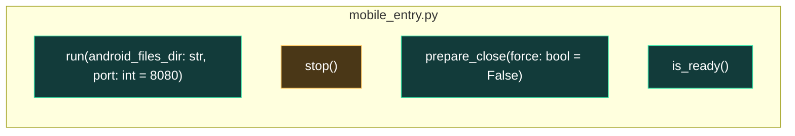

# UML funcional: `android/python`

Funciones detectadas: **4**. Tipos detectados: **0**.

## Grafo de llamadas

Fuentes: [Mermaid](mermaid/android_python.mmd) · [PlantUML](plantuml/android_python.puml). Las flechas continuas son llamadas síncronas; las discontinuas representan asincronía, eventos o colas. El color del nodo indica riesgo estático.

## Inventario

| Función | Archivo | CC | Propietario | Riesgo/estado | Entra desde | Sale hacia | Estado compartido |
|---|---|---:|---|---|---|---|---|
| `run` | [`android_app/app/src/main/python/mobile_entry.py`](../../android_app/app/src/main/python/mobile_entry.py#L22) | 1 | Python / misión e historial | Bajo; interno; síncrona | `main`, `render`, `run_ctags` | `close`, `create_app` | — |
| `stop` | [`android_app/app/src/main/python/mobile_entry.py`](../../android_app/app/src/main/python/mobile_entry.py#L54) | 5 | Python / misión e historial | Medio; interno; síncrona | `close`, `disconnect` | `close` | parada/cierre |
| `prepare_close` | [`android_app/app/src/main/python/mobile_entry.py`](../../android_app/app/src/main/python/mobile_entry.py#L72) | 2 | Python / misión e historial | Bajo; interno; síncrona | `close_application` | — | — |
| `is_ready` | [`android_app/app/src/main/python/mobile_entry.py`](../../android_app/app/src/main/python/mobile_entry.py#L82) | 1 | Python / misión e historial | Bajo; sin llamada interna detectada; síncrona | — | — | — |
