# UML funcional: `firmware/src`

Funciones detectadas: **106**. Tipos detectados: **0**.

## Grafo de llamadas

```mermaid
flowchart LR
  subgraph f0["Cinematica.cpp"]
    n1940a3e27a["errorAng360(float obj,float act)"]
    n3dc7b7e95d["aproximar(float v)"]
    n01277c72c7["sensar()"]
    n186404df9a["copiarBase(int64_t dest[4],const SensorSnapshot & s)"]
    n42e14d27c5["deltas(const int64_t base[4],const SensorSnapshot & s,int64_t out[4])"]
    nfde25926ff["fin(TipoEvento t,const char * d)"]
    nc3eec0fb58["fallo(const char * d)"]
    n77879ff1c7["iniciarFaseCal(Fase f)"]
    nd9b8eddc73["calCuenta()"]
    n94a6712d0e["calTorque(bool primera)"]
    ned2e4d48f2["controlarCalibracion()"]
    n4b536264dc["iniciarBaseGiro(float objetivoDeg,Fase retorno)"]
    n7aa7f5ee49["reintentarGiro(const char * motivo)"]
    nec013fe7a8["controlarGiro()"]
    nd5a5e3678f["completarGiro()"]
    ned4ed8ba55["mediana4(const int64_t v[4])"]
    n74b8dd73d7["hayPorLado()"]
    n09eef1c5c3["promedioLado(const int64_t v[4],bool izq)"]
    n2eb9176c0d["estimarTicksAvance(const int64_t v[4])"]
    n477c017be5["resetConfEncoders()"]
    nb7824323ae["iniciarAvance(bool conservar)"]
    n3e614b3323["detectarOutliers(const int64_t v[4])"]
    n7815c0c425["iniciarPausaReeval(const int64_t v[4])"]
    nd74d78fa17["completarPausaReeval()"]
    n29017fef3c["controlarAvance()"]
    n451b4d7596["completarPaso()"]
    nf969f266f4["iniciarPasoInterno()"]
    nc5b23157f1["normalizar360(float a)"]
    n30c8f0a81c["enFaseAvance()"]
    n3a83295c66["enFaseGiro()"]
    n5ae6f62555["enFaseCalibracion()"]
    na8998b7173["iniciarCalibracion(int seq)"]
    nf2633d6b21["iniciarPaso(float heading,float distanciaCm,int seq,float targetX,float targetY)"]
    ne0362aa598["iniciarGiroAbsoluto(float heading,int seq)"]
    n8b86cd69c0["cancelarMovimiento(const char * detalle)"]
    nbc445e9d60["controlarMovimiento()"]
  end
  subgraph f1["DiagnosticoRTOS.cpp"]
    ned6049114b["textoReset(esp_reset_reason_t motivo)"]
    n999b6f2133["actualizarMinimo(volatile uint32_t & destino,UBaseType_t valor)"]
    n13d5d5c8e7["resultadosValidos(BaseType_t web,bool controlEnCore1)"]
    ne4a753795c["stackBajoValores(uint32_t web,uint32_t control)"]
    n73252a2cfd["inicializarDiagnosticoRTOS()"]
    n93202db9d6["registrarStackLibre(TareaDiagnosticada tarea,UBaseType_t bytesLibres)"]
    n7fe919940e["registrarResultadoArquitectura(BaseType_t web,bool controlEnCore1)"]
    ndf604692a1["registrarCicloControl(uint32_t periodoUs,uint32_t jitterUs,uint32_t duracionUs,uint32_t antiguedadMuestraUs,uint32_t deadlinesPerdidos)"]
    n1b9377afe9["stackRTOSBajo()"]
    ndf57242908["validarLogicaDiagnosticoRTOS()"]
  end
  subgraph f2["Eventos.cpp"]
    na2bfb4ac57["encolarEvento(TipoEvento tipo,int seq,const char * detalle,float progreso)"]
  end
  subgraph f3["Mision.cpp"]
    n4c72a557d1["guardarCheckpoint()"]
    n7f71553283["crearIdPaso(size_t indice)"]
    n7124881696["calcularDestino(float targetX,float targetY,const char * stepId)"]
    n78ff63d885["inicializarPersistenciaMision()"]
    n7111d39d27["misionAutonomaCoincide(const char * missionId,uint32_t revision,const PuntoMision * nuevos,size_t cantidad)"]
    ne2128c8db3["cargarMisionAutonoma(const char * missionId,uint32_t revision,const PuntoMision * nuevos,size_t cantidad)"]
    n3611be396e["iniciarMisionAutonoma(const char * commandId,const char * missionId,uint32_t revision)"]
    n66990ff677["procesarMisionAutonoma()"]
    n70b3074db4["detenerMisionAutonoma(bool conservarRuta)"]
    ne0b5dff15e["liberarMisionAutonoma()"]
    nb0228d405f["misionAutonomaCargada()"]
    n361e38c76d["misionAutonomaActiva()"]
    n9ca963ff76["idMisionAutonoma()"]
    nf5e174de25["revisionMisionAutonoma()"]
    n9e66c04032["pasoMisionActual()"]
    n8d730cf516["pasosMisionCompletados()"]
    n402773b772["totalPasosMision()"]
    n701f62257b["estadoMisionAutonoma()"]
    nebce00eecf["idPasoMisionActual()"]
    n9acab61491["misionAutonomaInterrumpida()"]
  end
  subgraph f4["Motores.cpp"]
    neac6f35910["aplicarVelocidades(int velIzq,int velDer)"]
    na27e92de22["frenarMotores()"]
    n5766281555["validarInterlockMotores()"]
    n2569a29899["estadoInterlockL()"]
    n975b360956["estadoInterlockR()"]
    nf65c4ca9a2["signoEnergizadoL()"]
    n337c0aa1f1["signoEnergizadoR()"]
    nf1254dfd85["signoPendienteL()"]
    n7bc60c1e73["signoPendienteR()"]
    n799d913a06["setup_MotorPinsLow()"]
    n9cd8f173f7["setup_Motores()"]
  end
  subgraph f5["PoseEstimator.cpp"]
    n6d0812ef64["PoseEstimator()"]
    naf7943a248["inicializar(float rueda_diametro_cm,int encoder_ppr)"]
    n09b485aec5["reset()"]
    n40419d6fc8["actualizarOdometria(int64_t pulsosFL,int64_t pulsosFR,int64_t pulsosBL,int64_t pulsosBR,bool avanzando)"]
    nbc5b045960["iniciarMedicionTraslacionGiro()"]
    nc8a9f799ef["actualizarOrientacion(float imu_delta_z)"]
    nf524a72017["distanciaAlObjetivo(float obj_x,float obj_y)"]
    n84102f3e2b["anguloAlObjetivoRad(float obj_x,float obj_y)"]
  end
  subgraph f6["Red.cpp"]
    n336c50ec04["setup_Red()"]
    n2e5041024c["procesarWebSockets()"]
    n3c207cccf1["pushTelemetria()"]
  end
  subgraph f7["Seguridad.cpp"]
    n56c916953e["Seguridad()"]
    n4b74cb0712["auditarSalud(const SensorSnapshot & snap,int pwm_L,int pwm_R)"]
    n55a95df373["forzarEStop()"]
    n4b618bbd88["resetFallo()"]
  end
  subgraph f8["Sensores.cpp"]
    ne07f96b0e0["setup_Sensores()"]
    nbcba3216f0["resetFiltrosEncoder()"]
    n30e90c2e57["resetOrientacionIMU()"]
    nce50232280["obtenerYawIMUDeg()"]
    na50b46ec42["recentrarYawIMUEnReposo()"]
    nbc954010bb["cantidadRecentradosYawIMU()"]
    naf53943060["leerSensoresSincrono()"]
    n8a65804026["snapshotSensoresControl()"]
    n9008852f41["obtenerUltimoSnapshotSensores(SensorSnapshot & destino)"]
  end
  subgraph f9["main.cpp"]
    n48e7b1ca3d["procesarComandos()"]
    n19c52865a0["Task_Web(void *)"]
    na556d6a5dc["setup()"]
    n84f960c41a["loop()"]
  end
  n01277c72c7 --> n9008852f41
  n09b485aec5 --> nbc5b045960
  n19c52865a0 --> n2e5041024c
  n19c52865a0 --> n3c207cccf1
  n19c52865a0 --> n93202db9d6
  n1b9377afe9 --> ne4a753795c
  n29017fef3c --> n01277c72c7
  n29017fef3c --> n1940a3e27a
  n29017fef3c --> n2eb9176c0d
  n29017fef3c --> n3dc7b7e95d
  n29017fef3c --> n3e614b3323
  n29017fef3c --> n42e14d27c5
  n29017fef3c --> n4b536264dc
  n29017fef3c --> n7815c0c425
  n29017fef3c --> na27e92de22
  n29017fef3c --> nc3eec0fb58
  n29017fef3c --> nc5b23157f1
  n29017fef3c --> nd74d78fa17
  n29017fef3c --> neac6f35910
  n29017fef3c --> nf524a72017
  n2eb9176c0d --> n09eef1c5c3
  n2eb9176c0d --> n74b8dd73d7
  n2eb9176c0d --> ned4ed8ba55
  n3611be396e --> nb0228d405f
  n3e614b3323 --> n1940a3e27a
  n3e614b3323 --> ned4ed8ba55
  n451b4d7596 --> nfde25926ff
  n477c017be5 --> nbcba3216f0
  n48e7b1ca3d -.-> n09b485aec5
  n48e7b1ca3d -.-> n30e90c2e57
  n48e7b1ca3d -.-> n4b618bbd88
  n48e7b1ca3d -.-> n55a95df373
  n48e7b1ca3d -.-> n8b86cd69c0
  n48e7b1ca3d -.-> na2bfb4ac57
  n48e7b1ca3d -.-> na8998b7173
  n48e7b1ca3d -.-> ne0362aa598
  n48e7b1ca3d -.-> nf2633d6b21
  n4b536264dc --> n01277c72c7
  n4b536264dc --> n186404df9a
  n4b618bbd88 --> na27e92de22
  n4b74cb0712 -.-> n30c8f0a81c
  n4b74cb0712 -.-> n3a83295c66
  n4b74cb0712 -.-> n5ae6f62555
  n4b74cb0712 -.-> na27e92de22
  n4b74cb0712 -.-> na2bfb4ac57
  n55a95df373 --> na27e92de22
  n66990ff677 -.-> n4c72a557d1
  n66990ff677 -.-> n7124881696
  n66990ff677 -.-> n7f71553283
  n66990ff677 -.-> na2bfb4ac57
  n66990ff677 -.-> nc5b23157f1
  n66990ff677 -.-> nf2633d6b21
  n6d0812ef64 --> n09b485aec5
  n70b3074db4 --> n4c72a557d1
  n70b3074db4 --> ne0b5dff15e
  n7124881696 --> n84102f3e2b
  n7124881696 --> nc5b23157f1
  n7124881696 --> nf2633d6b21
  n7124881696 --> nf524a72017
  n73252a2cfd --> ned6049114b
  n7815c0c425 --> na27e92de22
  n7aa7f5ee49 --> na27e92de22
  n7aa7f5ee49 --> nc3eec0fb58
  n7fe919940e --> n13d5d5c8e7
  n84f960c41a --> n8a65804026
  n84f960c41a --> n93202db9d6
  n84f960c41a --> ndf604692a1
  n8b86cd69c0 -.-> na27e92de22
  n8b86cd69c0 -.-> na2bfb4ac57
  n93202db9d6 --> n999b6f2133
  n94a6712d0e --> n01277c72c7
  n94a6712d0e --> n186404df9a
  n94a6712d0e --> n42e14d27c5
  n94a6712d0e --> n4b536264dc
  n94a6712d0e --> n77879ff1c7
  n94a6712d0e --> na27e92de22
  n94a6712d0e --> nc3eec0fb58
  n94a6712d0e --> nc5b23157f1
  n94a6712d0e --> neac6f35910
  n9cd8f173f7 --> na27e92de22
  na556d6a5dc -.-> n336c50ec04
  na556d6a5dc -.-> n73252a2cfd
  na556d6a5dc -.-> n799d913a06
  na556d6a5dc -.-> n7fe919940e
  na556d6a5dc -.-> n9cd8f173f7
  na556d6a5dc -.-> na27e92de22
  na556d6a5dc -.-> naf7943a248
  na556d6a5dc -.-> ne07f96b0e0
  na8998b7173 -.-> n01277c72c7
  na8998b7173 -.-> na2bfb4ac57
  nb7824323ae --> n01277c72c7
  nb7824323ae --> n186404df9a
  nb7824323ae --> n477c017be5
  nb7824323ae --> nf524a72017
  nbc445e9d60 --> n1940a3e27a
  nbc445e9d60 --> n29017fef3c
  nbc445e9d60 --> n451b4d7596
  nbc445e9d60 --> n4b536264dc
  nbc445e9d60 --> nc5b23157f1
  nbc445e9d60 --> nec013fe7a8
  nbc445e9d60 --> ned2e4d48f2
  nc3eec0fb58 --> nfde25926ff
  nd5a5e3678f --> n09b485aec5
  nd5a5e3678f --> n30e90c2e57
  nd5a5e3678f --> n451b4d7596
  nd5a5e3678f --> n77879ff1c7
  nd5a5e3678f --> na27e92de22
  nd5a5e3678f --> nb7824323ae
  nd5a5e3678f --> nfde25926ff
  nd74d78fa17 --> n01277c72c7
  nd74d78fa17 --> n186404df9a
  nd74d78fa17 --> n74b8dd73d7
  nd74d78fa17 --> nb7824323ae
  nd74d78fa17 --> nc3eec0fb58
  nd74d78fa17 --> ned4ed8ba55
  nd9b8eddc73 --> n01277c72c7
  nd9b8eddc73 --> n186404df9a
  nd9b8eddc73 --> n77879ff1c7
  nd9b8eddc73 --> nc3eec0fb58
  nd9b8eddc73 --> nc5b23157f1
  ndf57242908 --> n13d5d5c8e7
  ndf57242908 --> ne4a753795c
  ndf57242908 --> ned6049114b
  ne0362aa598 -.-> n4b536264dc
  ne0362aa598 -.-> na2bfb4ac57
  ne0362aa598 -.-> nc5b23157f1
  ne2128c8db3 --> n4c72a557d1
  nec013fe7a8 --> n01277c72c7
  nec013fe7a8 --> n186404df9a
  nec013fe7a8 --> n1940a3e27a
  nec013fe7a8 --> n3dc7b7e95d
  nec013fe7a8 --> n42e14d27c5
  nec013fe7a8 --> n7aa7f5ee49
  nec013fe7a8 --> na27e92de22
  nec013fe7a8 --> nc3eec0fb58
  nec013fe7a8 --> nd5a5e3678f
  nec013fe7a8 --> neac6f35910
  ned2e4d48f2 --> n01277c72c7
  ned2e4d48f2 --> n186404df9a
  ned2e4d48f2 --> n4b536264dc
  ned2e4d48f2 --> n77879ff1c7
  ned2e4d48f2 --> n94a6712d0e
  ned2e4d48f2 --> na27e92de22
  ned2e4d48f2 --> nc3eec0fb58
  ned2e4d48f2 --> nc5b23157f1
  ned2e4d48f2 --> nd9b8eddc73
  ned2e4d48f2 --> nec013fe7a8
  nf2633d6b21 -.-> na2bfb4ac57
  nf2633d6b21 -.-> nc5b23157f1
  nf2633d6b21 -.-> nf969f266f4
  nf969f266f4 --> n1940a3e27a
  nf969f266f4 --> n4b536264dc
  nf969f266f4 --> nb7824323ae
  nfde25926ff -.-> na27e92de22
  nfde25926ff -.-> na2bfb4ac57
  classDef alto fill:#5b1f2a,stroke:#ff7a7a,color:#fff
  classDef medio fill:#4a3717,stroke:#ffca67,color:#fff
  classDef bajo fill:#123b3a,stroke:#39e6aa,color:#fff
  class n1940a3e27a bajo
  class n3dc7b7e95d bajo
  class n01277c72c7 bajo
  class n186404df9a bajo
  class n42e14d27c5 bajo
  class nfde25926ff bajo
  class nc3eec0fb58 bajo
  class n77879ff1c7 bajo
  class nd9b8eddc73 bajo
  class n94a6712d0e alto
  class ned2e4d48f2 bajo
  class n4b536264dc bajo
  class n7aa7f5ee49 bajo
  class nec013fe7a8 alto
  class nd5a5e3678f bajo
  class ned4ed8ba55 bajo
  class n74b8dd73d7 bajo
  class n09eef1c5c3 bajo
  class n2eb9176c0d bajo
  class n477c017be5 bajo
  class nb7824323ae bajo
  class n3e614b3323 bajo
  class n7815c0c425 bajo
  class nd74d78fa17 bajo
  class n29017fef3c alto
  class n451b4d7596 bajo
  class nf969f266f4 bajo
  class nc5b23157f1 bajo
  class n30c8f0a81c bajo
  class n3a83295c66 bajo
  class n5ae6f62555 bajo
  class na8998b7173 bajo
  class nf2633d6b21 bajo
  class ne0362aa598 bajo
  class n8b86cd69c0 bajo
  class nbc445e9d60 bajo
  class ned6049114b bajo
  class n999b6f2133 bajo
  class n13d5d5c8e7 bajo
  class ne4a753795c bajo
  class n73252a2cfd bajo
  class n93202db9d6 bajo
  class n7fe919940e bajo
  class ndf604692a1 bajo
  class n1b9377afe9 bajo
  class ndf57242908 bajo
  class na2bfb4ac57 bajo
  class n4c72a557d1 medio
  class n7f71553283 bajo
  class n7124881696 bajo
  class n78ff63d885 medio
  class n7111d39d27 bajo
  class ne2128c8db3 bajo
  class n3611be396e bajo
  class n66990ff677 bajo
  class n70b3074db4 bajo
  class ne0b5dff15e medio
  class nb0228d405f bajo
  class n361e38c76d bajo
  class n9ca963ff76 bajo
  class nf5e174de25 bajo
  class n9e66c04032 bajo
  class n8d730cf516 bajo
  class n402773b772 bajo
  class n701f62257b bajo
  class nebce00eecf bajo
  class n9acab61491 bajo
  class neac6f35910 alto
  class na27e92de22 alto
  class n5766281555 bajo
  class n2569a29899 bajo
  class n975b360956 bajo
  class nf65c4ca9a2 bajo
  class n337c0aa1f1 bajo
  class nf1254dfd85 bajo
  class n7bc60c1e73 bajo
  class n799d913a06 bajo
  class n9cd8f173f7 alto
  class n6d0812ef64 bajo
  class naf7943a248 bajo
  class n09b485aec5 bajo
  class n40419d6fc8 bajo
  class nbc5b045960 bajo
  class nc8a9f799ef bajo
  class nf524a72017 bajo
  class n84102f3e2b bajo
  class n336c50ec04 medio
  class n2e5041024c bajo
  class n3c207cccf1 bajo
  class n56c916953e bajo
  class n4b74cb0712 alto
  class n55a95df373 medio
  class n4b618bbd88 medio
  class ne07f96b0e0 bajo
  class nbcba3216f0 bajo
  class n30e90c2e57 bajo
  class nce50232280 bajo
  class na50b46ec42 bajo
  class nbc954010bb bajo
  class naf53943060 bajo
  class n8a65804026 bajo
  class n9008852f41 bajo
  class n48e7b1ca3d medio
  class n19c52865a0 bajo
  class na556d6a5dc alto
  class n84f960c41a bajo
```

Fuentes: [Mermaid](mermaid/firmware_src.mmd) · [PlantUML](plantuml/firmware_src.puml). Las flechas continuas son llamadas síncronas; las discontinuas representan asincronía, eventos o colas. El color del nodo indica riesgo estático.

## Inventario

| Función | Archivo | CC | Propietario | Riesgo/estado | Entra desde | Sale hacia | Estado compartido |
|---|---|---:|---|---|---|---|---|
| `__anon3dcaec680111.errorAng360` | [`src/Cinematica.cpp`](../../src/Cinematica.cpp#L42) | 3 | ESP32 / tiempo real | Bajo; interno; síncrona | `controlarAvance`, `controlarGiro`, `controlarMovimiento`, `detectarOutliers`, `iniciarPasoInterno` | — | — |
| `__anon3dcaec680111.aproximar` | [`src/Cinematica.cpp`](../../src/Cinematica.cpp#L48) | 1 | ESP32 / tiempo real | Bajo; interno; síncrona | `controlarAvance`, `controlarGiro` | — | — |
| `__anon3dcaec680111.sensar` | [`src/Cinematica.cpp`](../../src/Cinematica.cpp#L51) | 1 | ESP32 / tiempo real | Bajo; interno; síncrona | `calCuenta`, `calTorque`, `completarPausaReeval`, `controlarAvance`, `controlarCalibracion`, `controlarGiro`, `iniciarAvance`, `iniciarBaseGiro`, `iniciarCalibracion` | `obtenerUltimoSnapshotSensores` | — |
| `__anon3dcaec680111.copiarBase` | [`src/Cinematica.cpp`](../../src/Cinematica.cpp#L56) | 1 | ESP32 / tiempo real | Bajo; interno; síncrona | `calCuenta`, `calTorque`, `completarPausaReeval`, `controlarCalibracion`, `controlarGiro`, `iniciarAvance`, `iniciarBaseGiro` | — | — |
| `__anon3dcaec680111.deltas` | [`src/Cinematica.cpp`](../../src/Cinematica.cpp#L59) | 1 | ESP32 / tiempo real | Bajo; interno; síncrona | `calTorque`, `controlarAvance`, `controlarGiro` | — | — |
| `__anon3dcaec680111.fin` | [`src/Cinematica.cpp`](../../src/Cinematica.cpp#L65) | 3 | ESP32 / tiempo real | Bajo; interno; evento | `completarGiro`, `completarPaso`, `fallo` | `encolarEvento`, `frenarMotores` | — |
| `__anon3dcaec680111.fallo` | [`src/Cinematica.cpp`](../../src/Cinematica.cpp#L71) | 1 | ESP32 / tiempo real | Bajo; interno; síncrona | `calCuenta`, `calTorque`, `completarPausaReeval`, `controlarAvance`, `controlarCalibracion`, `controlarGiro`, `reintentarGiro` | `fin` | — |
| `__anon3dcaec680111.iniciarFaseCal` | [`src/Cinematica.cpp`](../../src/Cinematica.cpp#L89) | 1 | ESP32 / tiempo real | Bajo; interno; síncrona | `calCuenta`, `calTorque`, `completarGiro`, `controlarCalibracion` | — | — |
| `__anon3dcaec680111.calCuenta` | [`src/Cinematica.cpp`](../../src/Cinematica.cpp#L91) | 5 | ESP32 / tiempo real | Bajo; interno; síncrona | `controlarCalibracion` | `copiarBase`, `fallo`, `iniciarFaseCal`, `normalizar360`, `sensar` | — |
| `__anon3dcaec680111.calTorque` | [`src/Cinematica.cpp`](../../src/Cinematica.cpp#L104) | 19 | ESP32 / tiempo real | Alto; interno; síncrona | `controlarCalibracion` | `aplicarVelocidades`, `copiarBase`, `deltas`, `fallo`, `frenarMotores`, `iniciarBaseGiro`, `iniciarFaseCal`, `normalizar360`, `sensar` | — |
| `__anon3dcaec680111.controlarCalibracion` | [`src/Cinematica.cpp`](../../src/Cinematica.cpp#L169) | 13 | ESP32 / tiempo real | Bajo; interno; síncrona | `controlarMovimiento` | `calCuenta`, `calTorque`, `controlarGiro`, `copiarBase`, `fallo`, `frenarMotores`, `iniciarBaseGiro`, `iniciarFaseCal`, `normalizar360`, `sensar` | — |
| `__anon3dcaec680111.iniciarBaseGiro` | [`src/Cinematica.cpp`](../../src/Cinematica.cpp#L219) | 6 | ESP32 / tiempo real | Bajo; interno; síncrona | `calTorque`, `controlarAvance`, `controlarCalibracion`, `controlarMovimiento`, `iniciarGiroAbsoluto`, `iniciarPasoInterno` | `copiarBase`, `sensar` | — |
| `__anon3dcaec680111.reintentarGiro` | [`src/Cinematica.cpp`](../../src/Cinematica.cpp#L241) | 2 | ESP32 / tiempo real | Bajo; interno; síncrona | `controlarGiro` | `fallo`, `frenarMotores` | — |
| `__anon3dcaec680111.controlarGiro` | [`src/Cinematica.cpp`](../../src/Cinematica.cpp#L250) | 76 | ESP32 / tiempo real | Alto; interno; síncrona | `controlarCalibracion`, `controlarMovimiento` | `aplicarVelocidades`, `aproximar`, `completarGiro`, `copiarBase`, `deltas`, `errorAng360`, `fallo`, `frenarMotores`, `reintentarGiro`, `sensar` | — |
| `__anon3dcaec680111.completarGiro` | [`src/Cinematica.cpp`](../../src/Cinematica.cpp#L401) | 7 | ESP32 / tiempo real | Bajo; interno; síncrona | `controlarGiro` | `completarPaso`, `fin`, `frenarMotores`, `iniciarAvance`, `iniciarFaseCal`, `reset`, `resetOrientacionIMU` | — |
| `__anon3dcaec680111.mediana4` | [`src/Cinematica.cpp`](../../src/Cinematica.cpp#L440) | 4 | ESP32 / tiempo real | Bajo; interno; síncrona | `completarPausaReeval`, `detectarOutliers`, `estimarTicksAvance` | — | — |
| `__anon3dcaec680111.hayPorLado` | [`src/Cinematica.cpp`](../../src/Cinematica.cpp#L445) | 4 | ESP32 / tiempo real | Bajo; interno; síncrona | `completarPausaReeval`, `estimarTicksAvance` | — | — |
| `__anon3dcaec680111.promedioLado` | [`src/Cinematica.cpp`](../../src/Cinematica.cpp#L446) | 6 | ESP32 / tiempo real | Bajo; interno; síncrona | `estimarTicksAvance` | — | — |
| `__anon3dcaec680111.estimarTicksAvance` | [`src/Cinematica.cpp`](../../src/Cinematica.cpp#L451) | 3 | ESP32 / tiempo real | Bajo; interno; síncrona | `controlarAvance` | `hayPorLado`, `mediana4`, `promedioLado` | — |
| `__anon3dcaec680111.resetConfEncoders` | [`src/Cinematica.cpp`](../../src/Cinematica.cpp#L457) | 2 | ESP32 / tiempo real | Bajo; interno; síncrona | `iniciarAvance` | `resetFiltrosEncoder` | — |
| `__anon3dcaec680111.iniciarAvance` | [`src/Cinematica.cpp`](../../src/Cinematica.cpp#L468) | 3 | ESP32 / tiempo real | Bajo; interno; síncrona | `completarGiro`, `completarPausaReeval`, `iniciarPasoInterno` | `copiarBase`, `distanciaAlObjetivo`, `resetConfEncoders`, `sensar` | — |
| `__anon3dcaec680111.detectarOutliers` | [`src/Cinematica.cpp`](../../src/Cinematica.cpp#L488) | 12 | ESP32 / tiempo real | Bajo; interno; síncrona | `controlarAvance` | `errorAng360`, `mediana4` | — |
| `__anon3dcaec680111.iniciarPausaReeval` | [`src/Cinematica.cpp`](../../src/Cinematica.cpp#L507) | 2 | ESP32 / tiempo real | Bajo; interno; síncrona | `controlarAvance` | `frenarMotores` | — |
| `__anon3dcaec680111.completarPausaReeval` | [`src/Cinematica.cpp`](../../src/Cinematica.cpp#L515) | 4 | ESP32 / tiempo real | Bajo; interno; síncrona | `controlarAvance` | `copiarBase`, `fallo`, `hayPorLado`, `iniciarAvance`, `mediana4`, `sensar` | — |
| `__anon3dcaec680111.controlarAvance` | [`src/Cinematica.cpp`](../../src/Cinematica.cpp#L535) | 34 | ESP32 / tiempo real | Alto; interno; síncrona | `controlarMovimiento` | `aplicarVelocidades`, `aproximar`, `completarPausaReeval`, `deltas`, `detectarOutliers`, `distanciaAlObjetivo`, `errorAng360`, `estimarTicksAvance`, `fallo`, `frenarMotores`, `iniciarBaseGiro`, `iniciarPausaReeval`, `normalizar360`, `sensar` | — |
| `__anon3dcaec680111.completarPaso` | [`src/Cinematica.cpp`](../../src/Cinematica.cpp#L641) | 1 | ESP32 / tiempo real | Bajo; interno; síncrona | `completarGiro`, `controlarMovimiento` | `fin` | — |
| `__anon3dcaec680111.iniciarPasoInterno` | [`src/Cinematica.cpp`](../../src/Cinematica.cpp#L646) | 2 | ESP32 / tiempo real | Bajo; interno; síncrona | `iniciarPaso` | `errorAng360`, `iniciarAvance`, `iniciarBaseGiro` | — |
| `normalizar360` | [`src/Cinematica.cpp`](../../src/Cinematica.cpp#L658) | 2 | ESP32 / tiempo real | Bajo; interno; síncrona | `calCuenta`, `calTorque`, `calcularDestino`, `controlarAvance`, `controlarCalibracion`, `controlarMovimiento`, `iniciarGiroAbsoluto`, `iniciarPaso`, `procesarMisionAutonoma` | — | — |
| `enFaseAvance` | [`src/Cinematica.cpp`](../../src/Cinematica.cpp#L663) | 1 | ESP32 / tiempo real | Bajo; interno; síncrona | `auditarSalud` | — | — |
| `enFaseGiro` | [`src/Cinematica.cpp`](../../src/Cinematica.cpp#L664) | 6 | ESP32 / tiempo real | Bajo; interno; síncrona | `auditarSalud` | — | — |
| `enFaseCalibracion` | [`src/Cinematica.cpp`](../../src/Cinematica.cpp#L669) | 1 | ESP32 / tiempo real | Bajo; interno; síncrona | `auditarSalud` | — | — |
| `iniciarCalibracion` | [`src/Cinematica.cpp`](../../src/Cinematica.cpp#L673) | 6 | ESP32 / tiempo real | Bajo; interno; evento | `procesarComandos` | `encolarEvento`, `sensar` | — |
| `iniciarPaso` | [`src/Cinematica.cpp`](../../src/Cinematica.cpp#L685) | 8 | ESP32 / tiempo real | Bajo; interno; evento | `calcularDestino`, `procesarComandos`, `procesarMisionAutonoma` | `encolarEvento`, `getX`, `getY`, `iniciarPasoInterno`, `normalizar360` | — |
| `iniciarGiroAbsoluto` | [`src/Cinematica.cpp`](../../src/Cinematica.cpp#L722) | 4 | ESP32 / tiempo real | Bajo; interno; evento | `procesarComandos` | `encolarEvento`, `iniciarBaseGiro`, `normalizar360` | — |
| `cancelarMovimiento` | [`src/Cinematica.cpp`](../../src/Cinematica.cpp#L742) | 4 | ESP32 / tiempo real | Bajo; interno; evento | `procesarComandos` | `encolarEvento`, `frenarMotores` | — |
| `controlarMovimiento` | [`src/Cinematica.cpp`](../../src/Cinematica.cpp#L750) | 17 | ESP32 / tiempo real | Bajo; sin llamada interna detectada; síncrona | — | `completarPaso`, `controlarAvance`, `controlarCalibracion`, `controlarGiro`, `errorAng360`, `iniciarBaseGiro`, `normalizar360` | — |
| `__anon3946a1160111.textoReset` | [`src/DiagnosticoRTOS.cpp`](../../src/DiagnosticoRTOS.cpp#L19) | 11 | ESP32 / tiempo real | Bajo; interno; síncrona | `inicializarDiagnosticoRTOS`, `validarLogicaDiagnosticoRTOS` | — | — |
| `__anon3946a1160111.actualizarMinimo` | [`src/DiagnosticoRTOS.cpp`](../../src/DiagnosticoRTOS.cpp#L35) | 2 | ESP32 / tiempo real | Bajo; interno; síncrona | `registrarStackLibre` | — | — |
| `__anon3946a1160111.resultadosValidos` | [`src/DiagnosticoRTOS.cpp`](../../src/DiagnosticoRTOS.cpp#L40) | 2 | ESP32 / tiempo real | Bajo; interno; síncrona | `registrarResultadoArquitectura`, `validarLogicaDiagnosticoRTOS` | — | — |
| `__anon3946a1160111.stackBajoValores` | [`src/DiagnosticoRTOS.cpp`](../../src/DiagnosticoRTOS.cpp#L44) | 3 | ESP32 / tiempo real | Bajo; interno; síncrona | `stackRTOSBajo`, `validarLogicaDiagnosticoRTOS` | — | — |
| `inicializarDiagnosticoRTOS` | [`src/DiagnosticoRTOS.cpp`](../../src/DiagnosticoRTOS.cpp#L52) | 1 | ESP32 / tiempo real | Bajo; interno; síncrona | `setup` | `textoReset` | — |
| `registrarStackLibre` | [`src/DiagnosticoRTOS.cpp`](../../src/DiagnosticoRTOS.cpp#L57) | 3 | ESP32 / tiempo real | Bajo; interno; síncrona | `Task_Web`, `loop` | `actualizarMinimo` | — |
| `registrarResultadoArquitectura` | [`src/DiagnosticoRTOS.cpp`](../../src/DiagnosticoRTOS.cpp#L64) | 3 | ESP32 / tiempo real | Bajo; interno; síncrona | `setup` | `resultadosValidos` | — |
| `registrarCicloControl` | [`src/DiagnosticoRTOS.cpp`](../../src/DiagnosticoRTOS.cpp#L72) | 4 | ESP32 / tiempo real | Bajo; interno; síncrona | `loop` | — | — |
| `stackRTOSBajo` | [`src/DiagnosticoRTOS.cpp`](../../src/DiagnosticoRTOS.cpp#L82) | 1 | ESP32 / tiempo real | Bajo; sin llamada interna detectada; síncrona | — | `stackBajoValores` | — |
| `validarLogicaDiagnosticoRTOS` | [`src/DiagnosticoRTOS.cpp`](../../src/DiagnosticoRTOS.cpp#L86) | 11 | ESP32 / tiempo real | Bajo; sin llamada interna detectada; síncrona | — | `resultadosValidos`, `stackBajoValores`, `textoReset` | — |
| `encolarEvento` | [`src/Eventos.cpp`](../../src/Eventos.cpp#L6) | 12 | ESP32 / tiempo real | Bajo; interno; cola/evento | `auditarSalud`, `cancelarMovimiento`, `fin`, `iniciarCalibracion`, `iniciarGiroAbsoluto`, `iniciarPaso`, `procesarComandos`, `procesarMisionAutonoma` | — | — |
| `__anon9b3bf7a90111.guardarCheckpoint` | [`src/Mision.cpp`](../../src/Mision.cpp#L31) | 2 | ESP32 / tiempo real | Medio; interno; síncrona | `cargarMisionAutonoma`, `detenerMisionAutonoma`, `procesarMisionAutonoma` | `end` | — |
| `__anon9b3bf7a90111.crearIdPaso` | [`src/Mision.cpp`](../../src/Mision.cpp#L42) | 1 | ESP32 / tiempo real | Bajo; interno; síncrona | `procesarMisionAutonoma` | — | — |
| `__anon9b3bf7a90111.calcularDestino` | [`src/Mision.cpp`](../../src/Mision.cpp#L47) | 3 | ESP32 / tiempo real | Bajo; interno; síncrona | `procesarMisionAutonoma` | `anguloAlObjetivoRad`, `distanciaAlObjetivo`, `iniciarPaso`, `normalizar360` | — |
| `inicializarPersistenciaMision` | [`src/Mision.cpp`](../../src/Mision.cpp#L61) | 5 | ESP32 / tiempo real | Medio; sin llamada interna detectada; síncrona | — | `end` | — |
| `misionAutonomaCoincide` | [`src/Mision.cpp`](../../src/Mision.cpp#L75) | 10 | ESP32 / tiempo real | Bajo; sin llamada interna detectada; síncrona | — | — | — |
| `cargarMisionAutonoma` | [`src/Mision.cpp`](../../src/Mision.cpp#L88) | 15 | ESP32 / tiempo real | Bajo; sin llamada interna detectada; síncrona | — | `guardarCheckpoint` | — |
| `iniciarMisionAutonoma` | [`src/Mision.cpp`](../../src/Mision.cpp#L118) | 9 | ESP32 / tiempo real | Bajo; sin llamada interna detectada; síncrona | — | `misionAutonomaCargada` | — |
| `procesarMisionAutonoma` | [`src/Mision.cpp`](../../src/Mision.cpp#L132) | 15 | ESP32 / tiempo real | Bajo; sin llamada interna detectada; evento | — | `calcularDestino`, `crearIdPaso`, `encolarEvento`, `guardarCheckpoint`, `iniciarPaso`, `normalizar360` | — |
| `detenerMisionAutonoma` | [`src/Mision.cpp`](../../src/Mision.cpp#L195) | 3 | ESP32 / tiempo real | Bajo; sin llamada interna detectada; síncrona | — | `guardarCheckpoint`, `liberarMisionAutonoma` | — |
| `liberarMisionAutonoma` | [`src/Mision.cpp`](../../src/Mision.cpp#L207) | 2 | ESP32 / tiempo real | Medio; interno; síncrona | `detenerMisionAutonoma` | `clear`, `end` | — |
| `misionAutonomaCargada` | [`src/Mision.cpp`](../../src/Mision.cpp#L224) | 1 | ESP32 / tiempo real | Bajo; interno; síncrona | `iniciarMisionAutonoma` | — | — |
| `misionAutonomaActiva` | [`src/Mision.cpp`](../../src/Mision.cpp#L225) | 1 | ESP32 / tiempo real | Bajo; sin llamada interna detectada; síncrona | — | — | — |
| `idMisionAutonoma` | [`src/Mision.cpp`](../../src/Mision.cpp#L226) | 1 | ESP32 / tiempo real | Bajo; sin llamada interna detectada; síncrona | — | — | — |
| `revisionMisionAutonoma` | [`src/Mision.cpp`](../../src/Mision.cpp#L227) | 1 | ESP32 / tiempo real | Bajo; sin llamada interna detectada; síncrona | — | — | — |
| `pasoMisionActual` | [`src/Mision.cpp`](../../src/Mision.cpp#L228) | 1 | ESP32 / tiempo real | Bajo; sin llamada interna detectada; síncrona | — | — | — |
| `pasosMisionCompletados` | [`src/Mision.cpp`](../../src/Mision.cpp#L229) | 1 | ESP32 / tiempo real | Bajo; sin llamada interna detectada; síncrona | — | — | — |
| `totalPasosMision` | [`src/Mision.cpp`](../../src/Mision.cpp#L230) | 1 | ESP32 / tiempo real | Bajo; sin llamada interna detectada; síncrona | — | — | — |
| `estadoMisionAutonoma` | [`src/Mision.cpp`](../../src/Mision.cpp#L231) | 9 | ESP32 / tiempo real | Bajo; sin llamada interna detectada; síncrona | — | — | — |
| `idPasoMisionActual` | [`src/Mision.cpp`](../../src/Mision.cpp#L238) | 1 | ESP32 / tiempo real | Bajo; sin llamada interna detectada; síncrona | — | — | — |
| `misionAutonomaInterrumpida` | [`src/Mision.cpp`](../../src/Mision.cpp#L239) | 1 | ESP32 / tiempo real | Bajo; sin llamada interna detectada; síncrona | — | — | — |
| `aplicarVelocidades` | [`src/Motores.cpp`](../../src/Motores.cpp#L109) | 1 | ESP32 / tiempo real | Alto; interno; síncrona | `calTorque`, `controlarAvance`, `controlarGiro` | — | — |
| `frenarMotores` | [`src/Motores.cpp`](../../src/Motores.cpp#L122) | 2 | ESP32 / tiempo real | Alto; interno; síncrona | `auditarSalud`, `calTorque`, `cancelarMovimiento`, `completarGiro`, `controlarAvance`, `controlarCalibracion`, `controlarGiro`, `fin`, `forzarEStop`, `iniciarPausaReeval`, `reintentarGiro`, `resetFallo`, `setup`, `setup_Motores` | — | — |
| `validarInterlockMotores` | [`src/Motores.cpp`](../../src/Motores.cpp#L133) | 24 | ESP32 / tiempo real | Bajo; sin llamada interna detectada; síncrona | — | — | estado |
| `estadoInterlockL` | [`src/Motores.cpp`](../../src/Motores.cpp#L179) | 1 | ESP32 / tiempo real | Bajo; sin llamada interna detectada; síncrona | — | — | estado |
| `estadoInterlockR` | [`src/Motores.cpp`](../../src/Motores.cpp#L180) | 1 | ESP32 / tiempo real | Bajo; sin llamada interna detectada; síncrona | — | — | estado |
| `signoEnergizadoL` | [`src/Motores.cpp`](../../src/Motores.cpp#L181) | 1 | ESP32 / tiempo real | Bajo; sin llamada interna detectada; síncrona | — | — | — |
| `signoEnergizadoR` | [`src/Motores.cpp`](../../src/Motores.cpp#L182) | 1 | ESP32 / tiempo real | Bajo; sin llamada interna detectada; síncrona | — | — | — |
| `signoPendienteL` | [`src/Motores.cpp`](../../src/Motores.cpp#L183) | 1 | ESP32 / tiempo real | Bajo; sin llamada interna detectada; síncrona | — | — | — |
| `signoPendienteR` | [`src/Motores.cpp`](../../src/Motores.cpp#L184) | 1 | ESP32 / tiempo real | Bajo; sin llamada interna detectada; síncrona | — | — | — |
| `setup_MotorPinsLow` | [`src/Motores.cpp`](../../src/Motores.cpp#L186) | 2 | ESP32 / tiempo real | Bajo; interno; síncrona | `setup` | — | — |
| `setup_Motores` | [`src/Motores.cpp`](../../src/Motores.cpp#L193) | 2 | ESP32 / tiempo real | Alto; interno; síncrona | `setup` | `frenarMotores` | — |
| `PoseEstimator.PoseEstimator` | [`src/PoseEstimator.cpp`](../../src/PoseEstimator.cpp#L7) | 1 | ESP32 / tiempo real | Bajo; sin llamada interna detectada; síncrona | — | `reset` | — |
| `PoseEstimator.inicializar` | [`src/PoseEstimator.cpp`](../../src/PoseEstimator.cpp#L11) | 1 | ESP32 / tiempo real | Bajo; interno; síncrona | `setup` | — | — |
| `PoseEstimator.reset` | [`src/PoseEstimator.cpp`](../../src/PoseEstimator.cpp#L15) | 1 | ESP32 / tiempo real | Bajo; interno; síncrona | `PoseEstimator`, `completarGiro`, `procesarComandos` | `iniciarMedicionTraslacionGiro` | — |
| `PoseEstimator.actualizarOdometria` | [`src/PoseEstimator.cpp`](../../src/PoseEstimator.cpp#L27) | 12 | ESP32 / tiempo real | Bajo; sin llamada interna detectada; síncrona | — | — | — |
| `PoseEstimator.iniciarMedicionTraslacionGiro` | [`src/PoseEstimator.cpp`](../../src/PoseEstimator.cpp#L65) | 1 | ESP32 / tiempo real | Bajo; interno; síncrona | `reset` | — | — |
| `PoseEstimator.actualizarOrientacion` | [`src/PoseEstimator.cpp`](../../src/PoseEstimator.cpp#L71) | 3 | ESP32 / tiempo real | Bajo; sin llamada interna detectada; síncrona | — | — | — |
| `PoseEstimator.distanciaAlObjetivo` | [`src/PoseEstimator.cpp`](../../src/PoseEstimator.cpp#L78) | 1 | ESP32 / tiempo real | Bajo; interno; síncrona | `calcularDestino`, `controlarAvance`, `iniciarAvance` | — | — |
| `PoseEstimator.anguloAlObjetivoRad` | [`src/PoseEstimator.cpp`](../../src/PoseEstimator.cpp#L84) | 1 | ESP32 / tiempo real | Bajo; interno; síncrona | `calcularDestino` | — | — |
| `setup_Red` | [`src/Red.cpp`](../../src/Red.cpp#L221) | 4 | ESP32 / tiempo real | Medio; interno; asíncrona | `setup` | — | — |
| `procesarWebSockets` | [`src/Red.cpp`](../../src/Red.cpp#L235) | 3 | ESP32 / tiempo real | Bajo; interno; síncrona | `Task_Web` | — | — |
| `pushTelemetria` | [`src/Red.cpp`](../../src/Red.cpp#L241) | 1 | ESP32 / tiempo real | Bajo; interno; síncrona | `Task_Web` | — | — |
| `Seguridad.Seguridad` | [`src/Seguridad.cpp`](../../src/Seguridad.cpp#L10) | 2 | ESP32 / tiempo real | Bajo; sin llamada interna detectada; síncrona | — | — | — |
| `Seguridad.auditarSalud` | [`src/Seguridad.cpp`](../../src/Seguridad.cpp#L15) | 23 | ESP32 / tiempo real | Alto; sin llamada interna detectada; evento | — | `enFaseAvance`, `enFaseCalibracion`, `enFaseGiro`, `encolarEvento`, `frenarMotores` | parada/cierre |
| `Seguridad.forzarEStop` | [`src/Seguridad.cpp`](../../src/Seguridad.cpp#L89) | 1 | ESP32 / tiempo real | Medio; interno; síncrona | `procesarComandos` | `frenarMotores` | parada/cierre |
| `Seguridad.resetFallo` | [`src/Seguridad.cpp`](../../src/Seguridad.cpp#L95) | 4 | ESP32 / tiempo real | Medio; interno; síncrona | `procesarComandos` | `frenarMotores` | parada/cierre |
| `setup_Sensores` | [`src/Sensores.cpp`](../../src/Sensores.cpp#L82) | 5 | ESP32 / tiempo real | Bajo; interno; síncrona | `setup` | — | — |
| `resetFiltrosEncoder` | [`src/Sensores.cpp`](../../src/Sensores.cpp#L158) | 1 | ESP32 / tiempo real | Bajo; interno; síncrona | `resetConfEncoders` | — | — |
| `resetOrientacionIMU` | [`src/Sensores.cpp`](../../src/Sensores.cpp#L165) | 1 | ESP32 / tiempo real | Bajo; interno; síncrona | `completarGiro`, `procesarComandos` | — | — |
| `obtenerYawIMUDeg` | [`src/Sensores.cpp`](../../src/Sensores.cpp#L174) | 1 | ESP32 / tiempo real | Bajo; sin llamada interna detectada; síncrona | — | — | — |
| `recentrarYawIMUEnReposo` | [`src/Sensores.cpp`](../../src/Sensores.cpp#L181) | 2 | ESP32 / tiempo real | Bajo; sin llamada interna detectada; síncrona | — | — | — |
| `cantidadRecentradosYawIMU` | [`src/Sensores.cpp`](../../src/Sensores.cpp#L198) | 1 | ESP32 / tiempo real | Bajo; sin llamada interna detectada; síncrona | — | — | — |
| `leerSensoresSincrono` | [`src/Sensores.cpp`](../../src/Sensores.cpp#L253) | 1 | ESP32 / tiempo real | Bajo; sin llamada interna detectada; síncrona | — | — | — |
| `snapshotSensoresControl` | [`src/Sensores.cpp`](../../src/Sensores.cpp#L267) | 1 | ESP32 / tiempo real | Bajo; interno; síncrona | `loop` | — | — |
| `obtenerUltimoSnapshotSensores` | [`src/Sensores.cpp`](../../src/Sensores.cpp#L271) | 1 | ESP32 / tiempo real | Bajo; interno; síncrona | `sensar` | — | — |
| `procesarComandos` | [`src/main.cpp`](../../src/main.cpp#L21) | 18 | ESP32 / tiempo real | Medio; sin llamada interna detectada; cola/evento | — | `cancelarMovimiento`, `encolarEvento`, `forzarEStop`, `iniciarCalibracion`, `iniciarGiroAbsoluto`, `iniciarPaso`, `reset`, `resetFallo`, `resetOrientacionIMU` | cola de comandos, parada/cierre |
| `Task_Web` | [`src/main.cpp`](../../src/main.cpp#L75) | 3 | ESP32 / tiempo real | Bajo; sin llamada interna detectada; síncrona | — | `procesarWebSockets`, `pushTelemetria`, `registrarStackLibre` | — |
| `setup` | [`src/main.cpp`](../../src/main.cpp#L124) | 2 | ESP32 / tiempo real | Alto; entrada/framework; cola/evento | — | `frenarMotores`, `inicializar`, `inicializarDiagnosticoRTOS`, `registrarResultadoArquitectura`, `setup_MotorPinsLow`, `setup_Motores`, `setup_Red`, `setup_Sensores` | cola de comandos |
| `loop` | [`src/main.cpp`](../../src/main.cpp#L150) | 6 | ESP32 / tiempo real | Bajo; entrada/framework; síncrona | `init` | `registrarCicloControl`, `registrarStackLibre`, `snapshotSensoresControl` | — |
