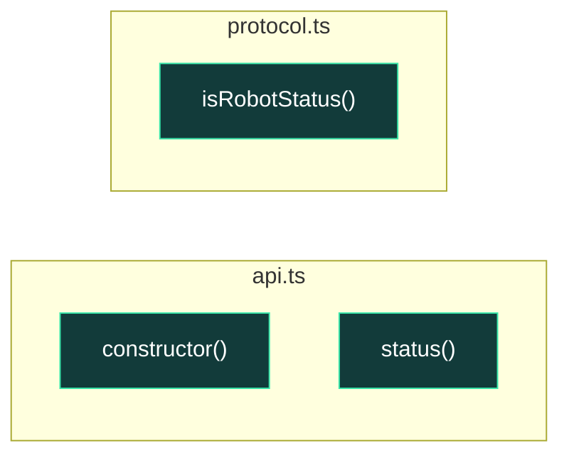

# UML funcional: `frontend/typescript`

Funciones detectadas: **3**. Tipos detectados: **4**.

## Grafo de llamadas

Fuentes: [Mermaid](mermaid/frontend_typescript.mmd) · [PlantUML](plantuml/frontend_typescript.puml). Las flechas continuas son llamadas síncronas; las discontinuas representan asincronía, eventos o colas. El color del nodo indica riesgo estático.

## Inventario

| Función | Archivo | CC | Propietario | Riesgo/estado | Entra desde | Sale hacia | Estado compartido |
|---|---|---:|---|---|---|---|---|
| `RobotApi.constructor` | [`desktop_app/frontend/src/api.ts`](../../desktop_app/frontend/src/api.ts#L4) | 1 | HMI / operador | Bajo; sin llamada interna detectada; síncrona | — | — | — |
| `RobotApi.status` | [`desktop_app/frontend/src/api.ts`](../../desktop_app/frontend/src/api.ts#L6) | 2 | HMI / operador | Bajo; entrada/framework; asíncrona | `connection`, `events`, `stream` | — | — |
| `isRobotStatus` | [`desktop_app/frontend/src/protocol.ts`](../../desktop_app/frontend/src/protocol.ts#L120) | 1 | HMI / operador | Bajo; sin llamada interna detectada; síncrona | — | — | — |
