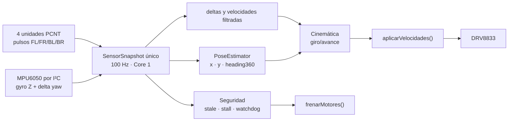
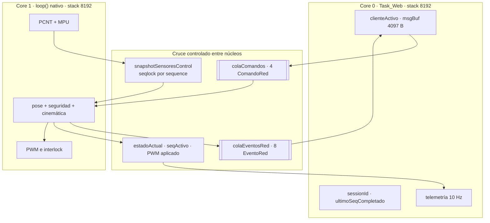
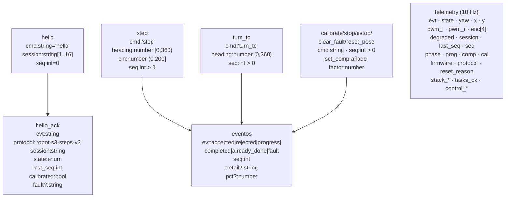
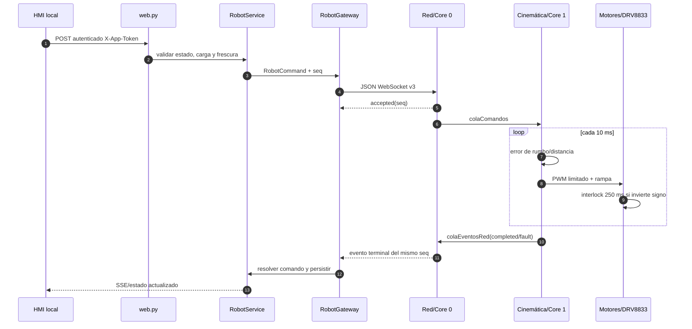
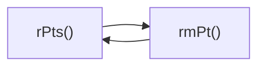

# Vistas especializadas de ejecución y protocolo

Estas vistas complementan el atlas general y los grafos generados por carpeta.
Describen el corte operativo actual; no convierten los riesgos abiertos en
garantías de seguridad física.

## Cadena de adquisición, pose y control

La lectura PCNT no se sustituye por interrupciones GPIO. Pose, seguridad y
cinemática consumen la misma muestra para evitar decisiones de ciclos distintos.

## Propiedad de memoria y recursos compartidos

Los valores globales/volátiles hacen visible el estado, pero no sustituyen la
sincronización. Los dos cruces de trabajo explícitos son las colas FreeRTOS; la
copia de sensores usa la secuencia del snapshot.

## Contrato JSON v3, campo por campo

`session` identifica el proceso controlador; `seq` ordena maniobras dentro de
esa memoria corta. El UUID `command_id` existe en Python/SQLite, pero no viaja al
firmware, limitación registrada como A-03.

## Cadena de una orden hasta el PWM

## Ciclo nominal detectado por análisis estático

El ciclo `rPts ↔ rmPt` procede del descomponedor HTML independiente. Es un ciclo
nominal del grafo de llamadas, no evidencia por sí solo de recursión infinita;
debe revisarse con entradas límite cuando se modifique esa herramienta.

## Exportaciones

- [Fuente PlantUML combinada](plantuml/vistas_especializadas.puml)
- [SVG](exportados/vistas_especializadas.svg)
- [PNG](exportados/vistas_especializadas.png)

