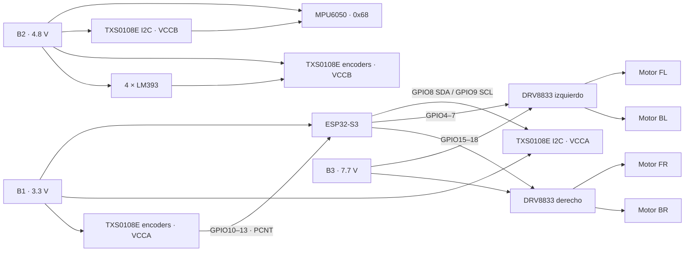

# Diagrama de ensamble físico actual

> Fuentes canónicas: la [hoja física dogmática](../../evidencia/hardware/cableado_dogmatico_milestone_2026-09-08.jpeg) fija terminales, GPIO y colores; `include/Config.h` debe coincidir con ella. Los GPIO no se cambian para corregir control, ejes o polaridad.

## Alimentación

| Fuente | Tensión | Destino |
|---|---:|---|
| B1 | 3.3 V regulados | ESP32-S3 y lado VCCA de los conversores |
| B2 | 4.8 V regulados | MPU6050, LM393 y lado VCCB de los conversores |
| B3 | 7.7 V | VMOT de ambos DRV8833 |

Todas las fuentes y módulos comparten una **tierra estrella**. Nunca conecte 7.7 V a un GPIO o al riel de 3.3 V. Verifique las tensiones con multímetro antes de conectar el ESP32.

## Pinout canónico

### Motores DRV8833

| Rueda | FWD nominal | REV nominal | Entradas/salidas físicas | Colores |
|---|---:|---:|---|---|
| FL, frontal izquierda | GPIO7 | GPIO6 | izquierdo IN3/OUT3 · IN4/OUT4 | naranja 2 · café |
| BL, trasera izquierda | GPIO4 | GPIO5 | izquierdo IN2/OUT2 · IN1/OUT1 | naranja 1 · rojo |
| FR, frontal derecha | GPIO18 | GPIO17 | derecho IN4/OUT4 · IN3/OUT3 | naranja · amarillo |
| BR, trasera derecha | GPIO16 | GPIO15 | derecho IN2/OUT2 · IN1/OUT1 | negro · verde |

El firmware genera PWM a 5 kHz y 10 bits (0–1023). Los nombres FWD/REV de la
tabla identifican los canales nominales del cableado. La orientación mecánica
actual se compensa una sola vez con `PWM_FORWARD_POLARITY = -1`; un avance
lógico energiza el sentido eléctrico opuesto para impulsar el frente marcado
del chasis. No intercambie además los GPIO porque duplicaría la inversión.

### Encoders PCNT

| Encoder | GPIO | PCNT | Identificación física |
|---|---:|---:|---|
| FL | GPIO11 | UNIT 0 | verde, TXS B5→A5 |
| FR | GPIO10 | UNIT 1 | blanco, TXS B6→A6 |
| BL | GPIO12 | UNIT 2 | negro, TXS B2→A2 |
| BR | GPIO13 | UNIT 3 | rojo, TXS B1→A1 |

Las salidas LM393 de 4.8 V pasan por el conversor de nivel antes del ESP32. La lectura se hace con PCNT, no con `attachInterrupt`.

### MPU6050

| Señal | ESP32-S3 | Observación |
|---|---:|---|
| SDA | GPIO8 | I2C mediante conversor de nivel |
| SCL | GPIO9 | I2C mediante conversor de nivel |
| Dirección | 0x68 | AD0 en nivel bajo |

El MPU6050 debe fijarse con orientación conocida, lejos de vibración intensa y cableado de potencia. Es un acelerómetro/giroscopio de 6 ejes; no contiene magnetómetro.

## Distribución FreeRTOS

| Núcleo | Ejecución |
|---|---|
| Core 0 | `Task_Web`: AP Wi-Fi, WebSocket/JSON V1 y telemetría |
| Core 1 | `loop()` síncrono a 100 Hz: MPU6050/PCNT → pose/seguridad → navegación → motores |

La computadora ejecuta `desktop_app` y es el único cliente WebSocket. El ESP32 expone `ws://192.168.4.1/ws`; no aloja el HMI activo.

Consulte [manual_ensamble_fisico.md](manual_ensamble_fisico.md) para la secuencia de montaje y [diagrama_interactivo/diagrama.html](diagrama_interactivo/diagrama.html) para inspeccionar cada conexión.
