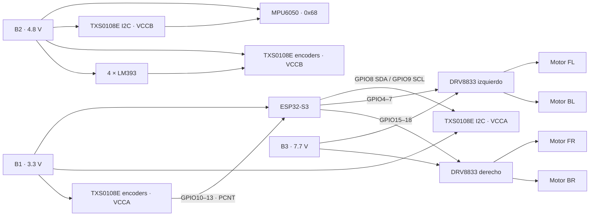
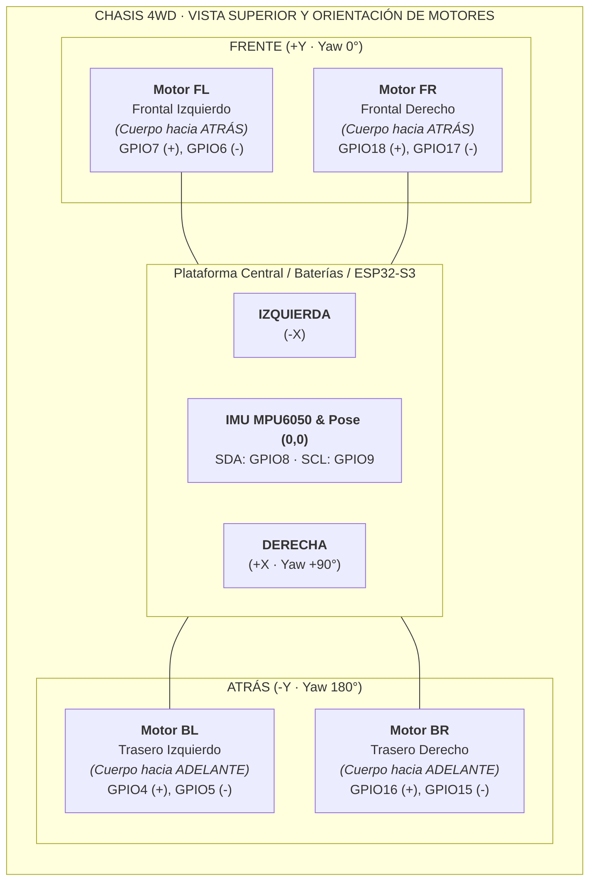

# Diagrama de ensamble físico actual

> Fuente canónica: `include/Config.h`. Si cambia un GPIO en firmware, este documento y el diagrama interactivo deben actualizarse en el mismo cambio.

## Alimentación

| Fuente | Tensión | Destino |
|---|---:|---|
| B1 | 3.3 V regulados | ESP32-S3 y lado VCCA de los conversores |
| B2 | 4.8 V regulados | MPU6050, LM393 y lado VCCB de los conversores |
| B3 | 7.7 V | VMOT de ambos DRV8833 |

Todas las fuentes y módulos comparten una **tierra estrella**. Nunca conecte 7.7 V a un GPIO o al riel de 3.3 V. Verifique las tensiones con multímetro antes de conectar el ESP32.



## Disposición Mecánica del Chasis 4WD y Simetría


```
                  FRENTE (+Y, Yaw = 0°)
          ┌───────────────────────────────────┐
          │   [Motor FL]          [Motor FR]  │
          │   (Cuerpo hacia       (Cuerpo hacia│
          │      atrás)              atrás)   │
          │                                   │
IZQUIERDA │        (ESP32-S3 / Baterías)      │ DERECHA (+X, Yaw = 90°)
(-X)      │         Pose (0,0) IMU            │
          │                                   │
          │   [Motor BL]          [Motor BR]  │
          │   (Cuerpo hacia       (Cuerpo hacia│
          │     adelante)           adelante) │
          └───────────────────────────────────┘
                  ATRÁS (-Y, Yaw = 180°)
```



> **Dogma de Simetría Mecánica 4WD**: Los motores reductores TT delanteros (FL/FR) y traseros (BL/BR) están montados en oposición física ($180^\circ$ enfrentados hacia el interior del chasis). La asignación de pines FWD/REV y la conexión a las borneras del DRV8833 compensa esta orientación física para asegurar que la señal lógica de avance (`FWD`, $+Y$) produzca rotación armónica hacia el frente en todas las ruedas.

## Pinout canónico

### Motores DRV8833

| Rueda | Avance/FWD | Reversa/REV | Puente y entradas |
|---|---:|---:|---|
| FL, frontal izquierda | GPIO7 | GPIO6 | DRV izquierdo IN3 (+) / IN4 (-) |
| BL, trasera izquierda | GPIO4 | GPIO5 | DRV izquierdo IN2 (+) / IN1 (-) |
| FR, frontal derecha | GPIO18 | GPIO17 | DRV derecho IN4 (+) / IN3 (-) |
| BR, trasera derecha | GPIO16 | GPIO15 | DRV derecho IN2 (+) / IN1 (-) |

El firmware genera PWM a 5 kHz y 10 bits (0–1023). La polaridad lógica aprobada está implementada en software; no intercambie GPIO para corregir el sentido de una rueda sin revisar también el cableado y `Config.h`.

### Encoders PCNT

| Encoder | GPIO | PCNT | Identificación física (TXS0108E) |
|---|---:|---:|---|
| FL | GPIO11 | UNIT 0 | Verde (B5 $\to$ A5) |
| FR | GPIO10 | UNIT 1 | Blanco (B6 $\to$ A6) |
| BL | GPIO12 | UNIT 2 | Negro (B2 $\to$ A2) |
| BR | GPIO13 | UNIT 3 | Rojo (B1 $\to$ A1) |

Las salidas LM393 de 4.8 V pasan por el conversor de nivel antes del ESP32. La lectura se hace con PCNT, no con `attachInterrupt`.

### MPU6050

| Señal | ESP32-S3 | Observación |
|---|---:|---|
| SDA | GPIO8 | I2C mediante conversor de nivel |
| SCL | GPIO9 | I2C mediante conversor de nivel |
| Dirección | 0x68 | AD0 en nivel bajo |

El MPU6050 debe fijarse con orientación conocida, lejos de vibración intensa y cableado de potencia. Es un acelerómetro/giroscopio de 6 ejes; no contiene magnetómetro.

## Distribución FreeRTOS

| Núcleo | Ejecución |
|---|---|
| Core 0 | `Task_Web`: AP Wi-Fi, WebSocket/JSON V1 y telemetría |
| Core 1 | `loop()` síncrono a 100 Hz: MPU6050/PCNT → pose/seguridad → navegación → motores |

La computadora ejecuta `desktop_app` y es el único cliente WebSocket. El ESP32 expone `ws://192.168.4.1/ws`; no aloja el HMI activo.

Consulte [manual_ensamble_fisico.md](manual_ensamble_fisico.md) para la secuencia de montaje y [diagrama_interactivo/diagrama.html](diagrama_interactivo/diagrama.html) para inspeccionar cada conexión.
