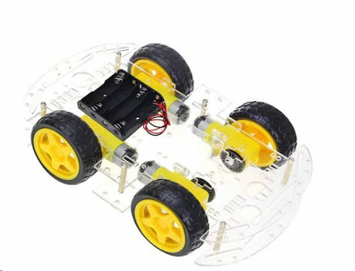
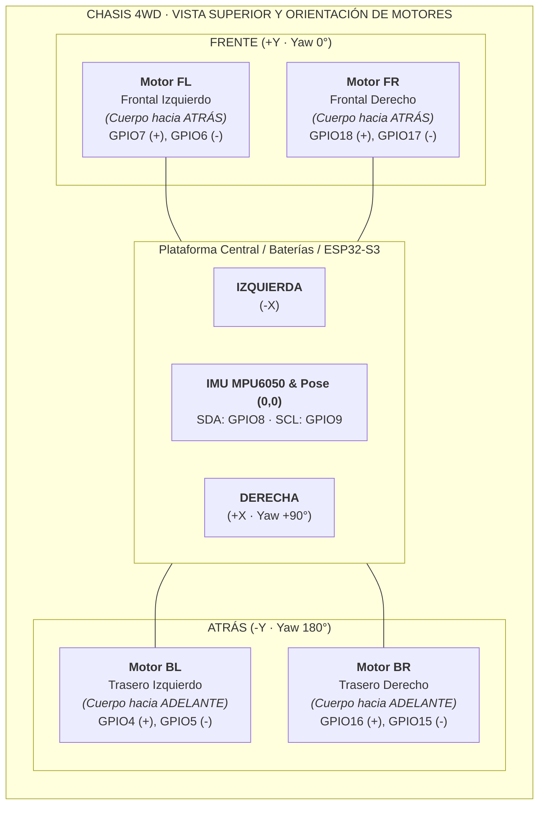
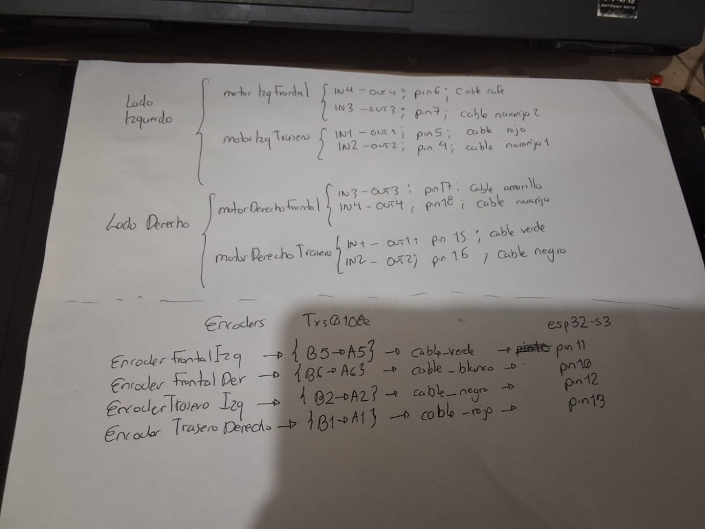
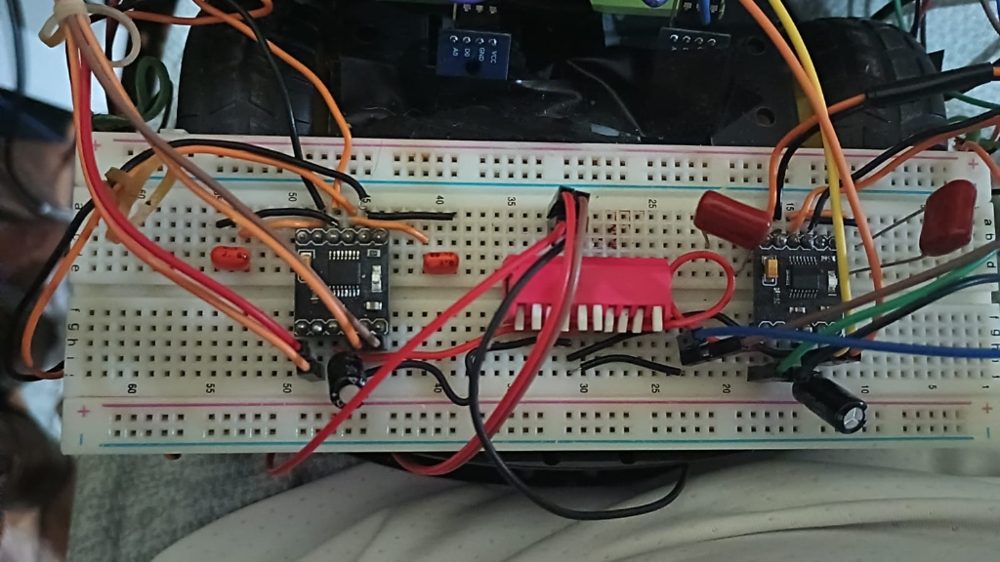

# Manual de ensamble físico — Robot ESP32-S3

Este manual corresponde al firmware modular actual. Los números de GPIO proceden de `include/Config.h`; el ensayo histórico deshabilitado sirve como referencia física, pero no sustituye esta tabla.

## 1. Reglas de seguridad

1. Ensamble siempre sin energía y con las ruedas elevadas durante la primera prueba.
2. Una todas las tierras en un único punto estrella: B1, B2, B3, ESP32, conversores, MPU6050, encoders y DRV8833.
3. Mida B1 = 3.3 V, B2 = 4.8 V y B3 = 7.7 V antes de conectar módulos.
4. B3 alimenta exclusivamente VMOT de los DRV8833. No conecte 7.7 V al ESP32, sensores o GPIO.
5. Instale junto a cada DRV8833 un capacitor de 100 µF y otro de 100 nF entre VMOT y GND, respetando la polaridad del electrolítico.
6. No conecte ni desconecte motores, encoders o buses con el sistema energizado.
7. Mantenga apagado el interruptor doble de VMOT durante carga y reinicio del ESP32; habilite motores únicamente después de confirmar `UNCALIBRATED` y PWM izquierdo/derecho en cero.

## 2. Nombres y orientación

Mirando el carrito desde arriba y con el frente apuntando hacia adelante:

| Código | Posición |
|---|---|
| FL | frontal izquierda |
| FR | frontal derecha |
| BL | trasera izquierda |
| BR | trasera derecha |

Mantenga estas etiquetas tanto en motores como en encoders. No use “motor 1/2” sin indicar también FL, FR, BL o BR.

## 3. Conexión de potencia

| Alimentación | Conectar a |
|---|---|
| B1, 3.3 V regulados | ESP32-S3; VCCA de ambos TXS0108E |
| B2, 4.8 V regulados | MPU6050; cuatro LM393; VCCB de ambos TXS0108E |
| B3, 7.7 V | VMOT del DRV8833 izquierdo y derecho |
| GND estrella | GND de absolutamente todos los módulos y fuentes |

Si el módulo TXS0108E expone `OE` y la placa no lo mantiene activo internamente, conéctelo a VCCA (3.3 V). Nunca lo deje flotante.

### Arquitectura General de Hardware y Conexiones

```mermaid
flowchart TB
    %% Definición de Estilos
    classDef mcu fill:#1e293b,stroke:#38bdf8,stroke-width:2px,color:#ffffff;
    classDef sensor fill:#0f766e,stroke:#2dd4bf,stroke-width:2px,color:#ffffff;
    classDef power fill:#7c2d12,stroke:#fb923c,stroke-width:2px,color:#ffffff;
    classDef driver fill:#831843,stroke:#f472b6,stroke-width:2px,color:#ffffff;
    classDef motor fill:#701a75,stroke:#e879f9,stroke-width:2px,color:#ffffff;
    classDef level fill:#1e3a8a,stroke:#60a5fa,stroke-width:2px,color:#ffffff;
    classDef hmi fill:#14532d,stroke:#4ade80,stroke-width:2px,color:#ffffff;

    subgraph SISTEMA_COMPLETO["ROBOT ESP32-S3 4WD · ARQUITECTURA GENERAL DE HARDWARE Y CONEXIONES"]
        direction TB

        %% Capa de Interfaz y Enlace Inalámbrico
        subgraph CAPA_HMI["1. Capa de Comunicación e Interfaz de Control"]
            direction LR
            HMI["<b>HMI / Panel de Control</b><br/>(Tablet Android / App Python Desktop)<br/>WebSocket Protocol: robot-s3-steps-v3"]:::hmi
            WIFI["<b>Enlace Wi-Fi SoftAP</b><br/>SSID: robot-s3-ap (192.168.4.1)<br/>Puerto 80 / ws://192.168.4.1/ws"]:::hmi
            HMI <-->|Frames JSON ≤ 7168 Bytes| WIFI
        end

        %% Capa de Alimentación Eléctrica
        subgraph CAPA_POWER["2. Sistema de Potencia y Alimentación Aislada"]
            direction LR
            B1["<b>B1 · 3.3V Regulados</b><br/>Lógica ESP32-S3 y TXS0108E (VCCA)"]:::power
            B2["<b>B2 · 4.8V Regulados</b><br/>Sensores LM393, MPU6050 y TXS (VCCB)"]:::power
            B3["<b>B3 · 7.7V Li-Ion (2S)</b><br/>Alimentación Motores VMOT"]:::power
            SWITCH["<b>Interruptor Físico VMOT</b><br/>Doble switch de seguridad"]:::power
            GND_STAR["<b>GND ESTRELLA UNIFICADO</b><br/>(Punto común de referencia a tierra)"]:::power

            B3 --> SWITCH
            B1 --- GND_STAR
            B2 --- GND_STAR
            SWITCH --- GND_STAR
        end

        %% Microcontrolador Central
        subgraph CAPA_MCU["3. Unidad de Procesamiento Central (ESP32-S3 DevKitC-1)"]
            direction TB
            ESP["<b>ESP32-S3 Microcontroller (N8)</b><br/>Xtensa LX7 Dual-Core @ 240 MHz<br/>• Core 0: Task_Web (AsyncTCP / WebSocket / JSON)<br/>• Core 1: loop() Súper-Ciclo Síncrono 100 Hz RTOS"]:::mcu
        end

        %% Capa de Sensores y Adaptación de Nivel
        subgraph CAPA_SENSORES["4. Sensores de Odometría e Inercia (5V / 4.8V)"]
            direction TB

            subgraph TXS_BLOCK["Adaptación de Nivel Lógico (TXS0108E)"]
                TXS_I2C["<b>TXS0108E (I2C)</b><br/>3.3V (VCCA) ↔ 4.8V (VCCB)"]:::level
                TXS_ENC["<b>TXS0108E (Encoders)</b><br/>3.3V (VCCA) ↔ 4.8V (VCCB)"]:::level
            end

            subgraph SENSORES_HARDWARE["Módulos de Sensado"]
                MPU["<b>IMU MPU6050 (6-DOF)</b><br/>I2C Addr: 0x68 (AD0=GND)<br/>Giroscopio Z: Autoridad Angular"]:::sensor
                ENC_FL["<b>Encoder FL (LM393)</b><br/>Rueda Frontal Izq (20 PPR)"]:::sensor
                ENC_FR["<b>Encoder FR (LM393)</b><br/>Rueda Frontal Der (20 PPR)"]:::sensor
                ENC_BL["<b>Encoder BL (LM393)</b><br/>Rueda Trasera Izq (20 PPR)"]:::sensor
                ENC_BR["<b>Encoder BR (LM393)</b><br/>Rueda Trasera Der (20 PPR)"]:::sensor
            end
        end

        %% Capa de Actuadores y Drivers de Potencia
        subgraph CAPA_ACTUADORES["5. Drivers Puente H y Motores de Tracción (4WD)"]
            direction TB

            subgraph DRIVERS_POTENCIA["Puentes H Duales (DRV8833)"]
                DRV_L["<b>DRV8833 Izquierdo</b><br/>Canales FL + BL<br/>Capacitores 100µF + 0.1µF"]:::driver
                DRV_R["<b>DRV8833 Derecho</b><br/>Canales FR + BR<br/>Capacitores 100µF + 0.1µF"]:::driver
            end

            subgraph MOTORES_TT["Motores Reductores DC (TT Amarillos 1:48)"]
                M_FL["<b>Motor FL</b> (Frontal Izq)<br/>Montado con cuerpo hacia ATRÁS"]:::motor
                M_BL["<b>Motor BL</b> (Trasero Izq)<br/>Montado con cuerpo hacia ADELANTE"]:::motor
                M_FR["<b>Motor FR</b> (Frontal Der)<br/>Montado con cuerpo hacia ATRÁS"]:::motor
                M_BR["<b>Motor BR</b> (Trasero Der)<br/>Montado con cuerpo hacia ADELANTE"]:::motor
            end
        end

        %% Interconexiones de Señales y Buses
        WIFI <-->|AsyncTCP Core 0| ESP
        B1 -.->|3.3V Power| ESP
        B1 -.->|VCCA 3.3V| TXS_BLOCK
        B2 -.->|VCCB 4.8V| TXS_BLOCK
        B2 -.->|Alimentación 4.8V| SENSORES_HARDWARE
        SWITCH -.->|VMOT 7.7V Filtrado| DRIVERS_POTENCIA

        %% I2C
        ESP -- "GPIO8 (SDA) / GPIO9 (SCL)" --> TXS_I2C
        TXS_I2C -- "SDA / SCL (4.8V)" --> MPU

        %% Encoders PCNT
        ENC_FL -- "Señal Digital (Verde B5)" --> TXS_ENC
        ENC_FR -- "Señal Digital (Blanco B6)" --> TXS_ENC
        ENC_BL -- "Señal Digital (Negro B2)" --> TXS_ENC
        ENC_BR -- "Señal Digital (Rojo B1)" --> TXS_ENC

        TXS_ENC -- "GPIO11 (PCNT Unit 0)" --> ESP
        TXS_ENC -- "GPIO10 (PCNT Unit 1)" --> ESP
        TXS_ENC -- "GPIO12 (PCNT Unit 2)" --> ESP
        TXS_ENC -- "GPIO13 (PCNT Unit 3)" --> ESP

        %% PWM Motores DRV8833
        ESP -- "GPIO7 (IN3 · FWD+) / GPIO6 (IN4 · REV-)" --> DRV_L
        ESP -- "GPIO4 (IN2 · FWD+) / GPIO5 (IN1 · REV-)" --> DRV_L
        ESP -- "GPIO18 (IN4 · FWD+) / GPIO17 (IN3 · REV-)" --> DRV_R
        ESP -- "GPIO16 (IN2 · FWD+) / GPIO15 (IN1 · REV-)" --> DRV_R

        %% Conexión Borneras Motor
        DRV_L -- "OUT3 (+) Naranja / OUT4 (-) Negro" --> M_FL
        DRV_L -- "OUT2 (+) Naranja / OUT1 (-) Rojo" --> M_BL
        DRV_R -- "OUT4 (+) Naranja / OUT3 (-) Negro" --> M_FR
        DRV_R -- "OUT2 (+) Naranja / OUT1 (-) Negro" --> M_BR
    end
```



## 4. Motores, Chasis 4WD y DRV8833

### Dogma de Simetría y Espejado Mecánico del Chasis 4WD

En la estructura física del chasis 4WD acrílico de doble plataforma, la disposición espacial de los motores y sus reductores de engranaje amarillo (TT) define la relación entre el sentido de rotación angular del motor DC interno y la traslación vectorial del chasis:



```
                  FRENTE (+Y, Yaw = 0°)
          ┌───────────────────────────────────┐
          │   [Motor FL]          [Motor FR]  │
          │   (Cuerpo hacia       (Cuerpo hacia│
          │      atrás)              atrás)   │
          │                                   │
IZQUIERDA │        (ESP32-S3 / Baterías)      │ DERECHA (+X, Yaw = 90°)
(-X)      │         Pose (0,0) IMU            │
          │                                   │
          │   [Motor BL]          [Motor BR]  │
          │   (Cuerpo hacia       (Cuerpo hacia│
          │     adelante)           adelante) │
          └───────────────────────────────────┘
                  ATRÁS (-Y, Yaw = 180°)
```



1. **Inversión Longitudinal (Frente vs Atrás)**:
   - Los motores del par delantero (**FL / FR**) están montados con sus cajas reductoras hacia los extremos y sus cuerpos de motor DC orientados hacia atrás (hacia el centro del chasis).
   - Los motores del par trasero (**BL / BR**) están montados con sus cuerpos de motor DC orientados hacia adelante (enfrentados a los motores delanteros).
   - Debido a este giro físico de $180^\circ$ sobre el plano horizontal, una rotación idéntica del rotor DC interno produce desplazamientos lineales opuestos si no se compensa la polaridad.
2. **Espejado Sagital (Izquierda vs Derecha)**:
   - Los motores del lado izquierdo tienen sus ejes saliendo hacia la izquierda, y los del lado derecho hacia la derecha.
3. **Dogma de Polaridad y Compensación Eléctrica**:
   - Para que una orden de avance (`FWD`, $+Y$) resulte en un movimiento lineal positivo y uniforme sin torques antagónicos, la asignación de borneras en los puentes H (DRV8833) y la definición lógica de pines en el firmware compensan esta geometría de modo que **el cable naranja sea energizado con $(+)$ y el cable negro con $(-)$** en los 4 motores para traslación $+Y$.

### Registro Fotográfico del Cableado Real (Notas de Taller y Montaje)





### DRV8833 izquierdo

| Entrada | Bornera / Canal | GPIO ESP32 | Polaridad OUT / Color Cable | Función |
|---|---|---:|---|---|
| IN3 | OUT3 | GPIO7 | Naranja (+) | **FL FWD** |
| IN4 | OUT4 | GPIO6 | Negro / Café (-) | **FL REV** |
| IN2 | OUT2 | GPIO4 | Naranja 1 (+) | **BL FWD** |
| IN1 | OUT1 | GPIO5 | Rojo (-) | **BL REV** |

### DRV8833 derecho

| Entrada | Bornera / Canal | GPIO ESP32 | Polaridad OUT / Color Cable | Función |
|---|---|---:|---|---|
| IN4 | OUT4 | GPIO18 | Naranja (+) | **FR FWD** |
| IN3 | OUT3 | GPIO17 | Negro / Amarillo (-) | **FR REV** |
| IN2 | OUT2 | GPIO16 | Naranja (+) | **BR FWD** |
| IN1 | OUT1 | GPIO15 | Negro / Verde (-) | **BR REV** |

El PWM actual es de 5 kHz y 10 bits, con límite de 242/255 en avance y 247/255 en giro y calibración. La calibración parte eléctricamente de cero, alcanza la base desde 140/255 y ajusta el PWM de cada lado por separado. Un yaw acumulado de 1° más un PCNT detecta torque; para validar el pivote debe responder al menos un PCNT por lado y la relación entre `max(FL,BL)` y `max(FR,BR)` debe permanecer entre 0.5 y 2.0. Dos ventanas asimétricas de 250 ms, más de 3° o 1.5 s sin equilibrio frenan la fase. Toda inversión mantiene ambos canales del lado apagados al menos 250 ms y la calibración espera 750 ms antes de cambiar polaridad. Los PCNT actuales cuentan un flanco sin dirección física: la evidencia de equilibrio no garantiza por sí sola un pivote centrado. Si una rueda gira al revés, detenga el sistema y compruebe cableado y polaridad individual antes de cambiar configuración.

El DRV8833 original incorpora resistencias pull-down internas en sus entradas de control (aproximadamente 150 kΩ; `nSLEEP` usa aproximadamente 500 kΩ). Resistencias externas de 10 kΩ son opcionales como defensa adicional para módulos clon, no un requisito del integrado original.

## 5. Encoders LM393 y PCNT

Cada LM393 se alimenta desde B2. Su salida digital pasa por el lado de 4.8 V del conversor de nivel TXS0108E; el lado de 3.3 V llega directamente al GPIO del ESP32.

| Rueda | Canal TXS0108E | Color de Cable | GPIO ESP32 | Unidad PCNT |
|---|---|---|---:|---:|
| **FL** (Frontal Izquierda) | B5 $\to$ A5 | Verde | **GPIO11** | PCNT 0 |
| **FR** (Frontal Derecha) | B6 $\to$ A6 | Blanco | **GPIO10** | PCNT 1 |
| **BL** (Trasera Izquierda) | B2 $\to$ A2 | Negro | **GPIO12** | PCNT 2 |
| **BR** (Trasera Derecha) | B1 $\to$ A1 | Rojo | **GPIO13** | PCNT 3 |

Use cable corto y separado de los conductores de motor. El firmware cuenta un flanco ascendente por ranura y usa 20 PPR nominales. No reemplace PCNT con interrupciones GPIO.

## 6. MPU6050 e I2C

Conecte el MPU6050 al lado de 4.8 V del conversor I2C y el ESP32 al lado de 3.3 V:

| Señal | GPIO ESP32 |
|---|---:|
| SDA | GPIO8 |
| SCL | GPIO9 |
| Dirección I2C | 0x68 |

Fije la placa del MPU con su eje Z perpendicular al piso y evite que pueda moverse respecto al chasis. Sepárela de vibración directa, motores y conductores de corriente. El MPU6050 no tiene magnetómetro: el objetivo del aislamiento es reducir vibración y ruido eléctrico.

## 7. Orden recomendado de montaje

1. Etiquete las cuatro esquinas FL, FR, BL y BR.
2. Prepare la tierra estrella y compruebe continuidad con el sistema apagado.
3. Conecte B1 y valide el ESP32 sin sensores ni motores.
4. Monte los conversores de nivel; conecte VCCA, VCCB, GND y `OE`.
5. Conecte MPU6050 en GPIO8/GPIO9 y confirme detección en 0x68.
6. Conecte un encoder a la vez en GPIO10–GPIO13 y confirme el contador PCNT correspondiente.
7. Conecte los DRV8833 sin motores, comprobando alimentación y capacitores.
8. Conecte un motor a la vez y verifique su posición y sentido con ruedas elevadas.
9. Conecte los cuatro motores y ejecute calibración desde `desktop_app` sin tocar el carrito.
10. Realice `stop`, E-STOP y pérdida de joystick antes de cualquier prueba en piso.

## 8. Lista de comprobación antes de calibrar

- [ ] GND común en estrella y sin conexiones flojas.
- [ ] B1, B2 y B3 medidos con multímetro.
- [ ] GPIO4–GPIO7 conectados sólo al DRV izquierdo según la tabla.
- [ ] GPIO15–GPIO18 conectados sólo al DRV derecho según la tabla.
- [ ] Encoders en GPIO10–GPIO13 y su rueda coincide con FL/FR/BL/BR.
- [ ] SDA GPIO8 y SCL GPIO9; MPU6050 visible en 0x68.
- [ ] Capacitores instalados junto a ambos DRV8833.
- [ ] Ruedas elevadas, piso libre y E-STOP accesible.
- [ ] Motores inmóviles antes de completar la calibración.
- [ ] ESP32 iniciado con VMOT apagado; telemetría en `UNCALIBRATED` y ambos PWM en cero antes de activar el interruptor de motores.

## 9. Relación con el software

`Task_Web` corre en Core 0 y gestiona AP Wi-Fi, WebSocket/JSON y telemetría. El `loop()` nativo de Core 1 es un súper-ciclo único de 100 Hz que ejecuta MPU/PCNT → pose/seguridad → cinemática → PWM sin colas intermedias. El HMI activo es `desktop_app`; el navegador se comunica con Python por HTTP/SSE y Python es el único propietario del WebSocket hacia el carrito.

La vista navegable está en [diagrama_interactivo/diagrama.html](diagrama_interactivo/diagrama.html).
