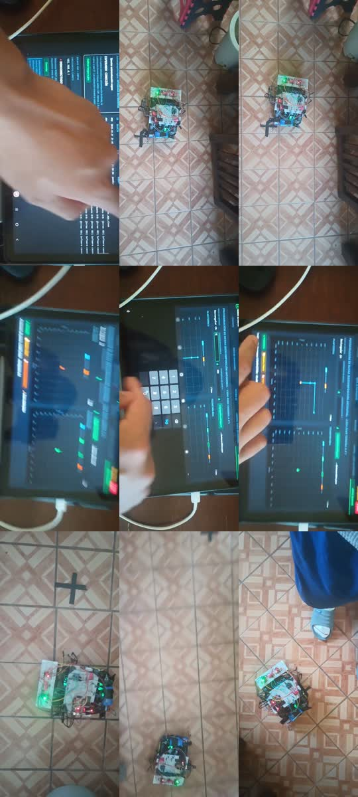
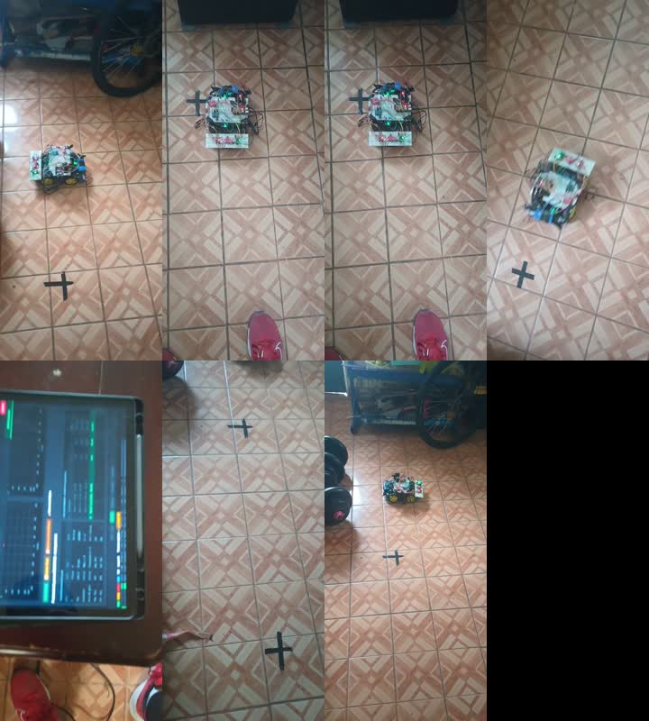

# Evidencia audiovisual del robot

Esta carpeta conserva las dos grabaciones solicitadas y fotogramas derivados
para el manual de operación. Los videos son evidencia observacional: muestran
la interfaz y el movimiento físico, pero por sí solos no demuestran corriente,
estado interno de encoders, integridad de SQLite ni ausencia de reinicios.

El caso de reconexión observado durante la auditoría está preservado como
extracto trazable en
[`incidentes/2026-07-30_reinicio_y_calibracion.md`](incidentes/2026-07-30_reinicio_y_calibracion.md).

## Archivos originales

| Evidencia | Duración | Resolución | Tamaño | SHA-256 |
|---|---:|---:|---:|---|
| [`CarritoRutaOrtogonalServerYRobot.mp4`](videos/CarritoRutaOrtogonalServerYRobot.mp4) | 03:43.874 | 576×1280, H.264/AAC | 62,778,149 B | `64A6D1FF5640824B51B0A30742CC9F79A37EBB0F81F4CFD062C7C7395CAF92E3` |
| [`carrito ruta ortogonal , y=+100,y=+50,x=+190,x=-190.mp4`](videos/carrito%20ruta%20ortogonal%20,%20y=+100,y=+50,x=+190,x=-190.mp4) | 01:28.549 | 576×1280, H.264/AAC | 24,830,404 B | `969514D1F85BCF7136F1E52ECE054F79A52C2C7CC3839B9AEF2CD1A0787A7508` |

Los hashes permiten comprobar que una copia posterior corresponde exactamente
al archivo utilizado para esta documentación.

## Lectura guiada: servidor y robot

| Tiempo | Fotograma | Uso tutorial |
|---:|---|---|
| 00:05 | [Vista 1](fotogramas/server_y_robot/paso_01_005s.jpg) | Identificar la HMI local y el dispositivo controlador. |
| 00:25 | [Vista 2](fotogramas/server_y_robot/paso_02_025s.jpg) | Reconocer el robot colocado en el área de prueba. |
| 00:50 | [Vista 3](fotogramas/server_y_robot/paso_03_050s.jpg) | Observar orientación y referencias físicas del suelo. |
| 01:20 | [Vista 4](fotogramas/server_y_robot/paso_04_080s.jpg) | Relacionar la ejecución física con el panel de estado. |
| 01:50 | [Vista 5](fotogramas/server_y_robot/paso_05_110s.jpg) | Localizar los controles de preparación de ruta. |
| 02:20 | [Vista 6](fotogramas/server_y_robot/paso_06_140s.jpg) | Leer la representación gráfica de puntos y segmentos. |
| 02:50 | [Vista 7](fotogramas/server_y_robot/paso_07_170s.jpg) | Volver a la observación física durante la maniobra. |
| 03:20 | [Vista 8](fotogramas/server_y_robot/paso_08_200s.jpg) | Comprobar visualmente posición y orientación alcanzadas. |
| 03:40 | [Vista 9](fotogramas/server_y_robot/paso_09_220s.jpg) | Registrar el estado visual al final de la demostración. |

## Lectura guiada: ruta ortogonal

La ruta nominal indicada por el nombre del archivo es `Y+100`, `Y+50`,
`X+190`, `X-190` centímetros. La grabación permite observar la ejecución y la
interfaz, pero la distancia cuantitativa debe verificarse con telemetría y una
medición física independiente.

| Tiempo | Fotograma | Uso tutorial |
|---:|---|---|
| 00:03 | [Vista 1](fotogramas/ruta_ortogonal/paso_01_003s.jpg) | Punto de partida y marca física de referencia. |
| 00:15 | [Vista 2](fotogramas/ruta_ortogonal/paso_02_015s.jpg) | Primer desplazamiento visible. |
| 00:30 | [Vista 3](fotogramas/ruta_ortogonal/paso_03_030s.jpg) | Continuidad del avance sobre el eje de la ruta. |
| 00:45 | [Vista 4](fotogramas/ruta_ortogonal/paso_04_045s.jpg) | Cambio de orientación o transición entre tramos. |
| 01:00 | [Vista 5](fotogramas/ruta_ortogonal/paso_05_060s.jpg) | Consulta del estado de la misión en la HMI. |
| 01:15 | [Vista 6](fotogramas/ruta_ortogonal/paso_06_075s.jpg) | Posición física posterior a los tramos principales. |
| 01:25 | [Vista 7](fotogramas/ruta_ortogonal/paso_07_085s.jpg) | Estado final observable de la demostración. |

## Procedencia y reproducción

- Origen: archivos suministrados desde `C:\Users\IK\Downloads`.
- Extracción: FFmpeg, sin alterar los videos originales.
- Fotogramas: JPEG de referencia, extraídos en los tiempos indicados.
- Reproducción: el portal documental utiliza el elemento HTML `<video>` y no
  inicia automáticamente el movimiento ni el audio.

## Límites de interpretación

1. Una imagen borrosa no se utiliza para afirmar una coordenada exacta.
2. La posición estimada por la HMI no sustituye una medición del suelo.
3. La ausencia visual de movimiento no prueba PWM cero.
4. Una ruta visible no demuestra que todos los eventos terminales se hayan
   persistido en SQLite.
5. La seguridad eléctrica sólo puede aceptarse mediante la prueba de corriente
   descrita en [`docs/validacion_sistema_final.md`](../docs/validacion_sistema_final.md).
