# UML funcional: `firmware/src`

Funciones detectadas: **107**. Tipos detectados: **0**.

## Grafo de llamadas

```mermaid
flowchart LR
  subgraph f0["Cinematica.cpp"]
    nb3c2de34d2["errorAng360(float obj,float act)"]
    nd2dd213a05["aproximar(float v)"]
    n94a0fc463b["sensar()"]
    nb3d1dd709d["copiarBase(int64_t dest[4],const SensorSnapshot & s)"]
    n376cfb0702["deltas(const int64_t base[4],const SensorSnapshot & s,int64_t out[4])"]
    n4313d9e18b["fin(TipoEvento t,const char * d)"]
    nc327703bd2["fallo(const char * d)"]
    n972cfa0778["iniciarFaseCal(Fase f)"]
    nf7d51233fb["calCuenta()"]
    n8237d3fd95["calTorque(bool primera)"]
    n7cae77d5a5["controlarCalibracion()"]
    nef730fce8b["iniciarBaseGiro(float objetivoDeg,Fase retorno)"]
    n2a897b4070["reintentarGiro(const char * motivo)"]
    n1de9eeafb5["controlarGiro()"]
    n933e390584["completarGiro()"]
    nb04bc9ce76["actualizarErroresTrayectoria()"]
    n5ac963b956["objetivoAbsolutoAlcanzado()"]
    n0c43080c87["mediana4(const int64_t v[4])"]
    n83d4a41ef4["hayPorLado()"]
    n58ca8c5311["promedioLado(const int64_t v[4],bool izq)"]
    n9662a23eeb["estimarTicksAvance(const int64_t v[4])"]
    na15071c7f7["resetConfEncoders()"]
    nb79044223b["iniciarAvance(bool conservar)"]
    n02ddb33e6b["detectarOutliers(const int64_t v[4])"]
    n3cce5ee1e3["iniciarPausaReeval(const int64_t v[4])"]
    n9f76082d99["completarPausaReeval()"]
    n2fbf752b0e["pwmAntiFriccion(uint8_t indice)"]
    n365e3971dd["iniciarAntiFriccion(const SensorSnapshot & s)"]
    nb1cd00c2d3["controlarAntiFriccion(const SensorSnapshot & s)"]
    n74d857cea7["controlarAvance()"]
    n9af6b31b71["iniciarAsentamientoFinal(float distanciaAntesDeFrenarCm)"]
    n8501399e16["controlarAsentamientoFinal()"]
    n3b2ba8399c["iniciarVerificacionFinal()"]
    naf8edc03d5["iniciarRecuperacionEndpoint()"]
    n4f607c7e44["verificarObjetivoFinal()"]
    nd0d94a8587["completarPaso()"]
    n95d57c01cb["completarPasoConCorreccionPendiente()"]
    n1c5e98456e["iniciarPasoInterno()"]
    n945c277527["normalizar360(float a)"]
    n1e0d0116a1["reiniciarControlRumbo()"]
    n97c3da06a2["registrarMotivoFinalizacion(const char * detalle)"]
    n9e6bee1c80["enFaseAvance()"]
    na90c58bf3f["enFaseTraslacion()"]
    nc9842e53da["enFaseGiro()"]
    n73077f5dea["enFaseCalibracion()"]
    nc43a8aa4bd["iniciarCalibracion(int seq)"]
    n291303a498["iniciarPaso(float heading,float distanciaCm,int seq,float targetX,float targetY,bool objetivoAbsoluto,ModoPaso modoPaso)"]
    ne5c5a1c1bd["iniciarGiroAbsoluto(float heading,int seq)"]
    n86ac4bad7e["cancelarMovimiento(const char * detalle)"]
    n3e4d820ed6["controlarMovimiento()"]
  end
  subgraph f1["DiagnosticoRTOS.cpp"]
    ned6049114b["textoReset(esp_reset_reason_t motivo)"]
    n999b6f2133["actualizarMinimo(volatile uint32_t & destino,UBaseType_t valor)"]
    n13d5d5c8e7["resultadosValidos(BaseType_t web,bool controlEnCore1)"]
    ne4a753795c["stackBajoValores(uint32_t web,uint32_t control)"]
    n73252a2cfd["inicializarDiagnosticoRTOS()"]
    n93202db9d6["registrarStackLibre(TareaDiagnosticada tarea,UBaseType_t bytesLibres)"]
    n7fe919940e["registrarResultadoArquitectura(BaseType_t web,bool controlEnCore1)"]
    ndf604692a1["registrarCicloControl(uint32_t periodoUs,uint32_t jitterUs,uint32_t duracionUs,uint32_t antiguedadMuestraUs,uint32_t deadlinesPerdidos)"]
    n1b9377afe9["stackRTOSBajo()"]
    ndf57242908["validarLogicaDiagnosticoRTOS()"]
  end
  subgraph f2["Estado.cpp"]
    n0a3d7af388["contenidoSinNul(const char * valor,size_t longitud)"]
    nf52367ee09["cadenaConfiguracionValida(const char (& valor)[N])"]
  end
  subgraph f3["Eventos.cpp"]
    na2bfb4ac57["encolarEvento(TipoEvento tipo,int seq,const char * detalle,float progreso,uint32_t runId)"]
  end
  subgraph f4["Motores.cpp"]
    n685fd62caf["validarMapaMotores()"]
    ned8aac33b6["aplicarVelocidades(int velIzq,int velDer)"]
    n36b60d19ed["frenarMotores()"]
    n8fe1874de3["validarInterlockMotores()"]
    n2c56769c27["estadoInterlockL()"]
    ne28254bd9f["estadoInterlockR()"]
    n83e71ee961["signoEnergizadoL()"]
    n18507f5e40["signoEnergizadoR()"]
    n06ad789fef["signoPendienteL()"]
    nbb47799838["signoPendienteR()"]
    n44a0c6a4d1["motoresListos()"]
    n98bfb063e4["estadoMotores()"]
    nde95c6d768["setup_MotorPinsLow()"]
    nb51dcc7337["setup_Motores()"]
  end
  subgraph f5["PoseEstimator.cpp"]
    n6d0812ef64["PoseEstimator()"]
    naf7943a248["inicializar(float rueda_diametro_cm,int encoder_ppr)"]
    n09b485aec5["reset()"]
    n40419d6fc8["actualizarOdometria(int64_t pulsosFL,int64_t pulsosFR,int64_t pulsosBL,int64_t pulsosBR,bool avanzando)"]
    nbc5b045960["iniciarMedicionTraslacionGiro()"]
    nc8a9f799ef["actualizarOrientacion(float imu_delta_z)"]
    nf524a72017["distanciaAlObjetivo(float obj_x,float obj_y)"]
    n84102f3e2b["anguloAlObjetivoRad(float obj_x,float obj_y)"]
  end
  subgraph f6["Red.cpp"]
    n50d3987825["setup_Red()"]
    n62792a4584["procesarWebSockets()"]
    n1fa0608ddb["pushTelemetria()"]
  end
  subgraph f7["Seguridad.cpp"]
    nf8836652dd["Seguridad()"]
    n0c00dc27c4["reiniciarSaludEncoders()"]
    n250627f063["actualizarSaludEncoders(const SensorSnapshot & snap,int pwm_L,int pwm_R)"]
    n0effb4bec6["auditarSalud(const SensorSnapshot & snap,int pwm_L,int pwm_R)"]
    nce07096a9e["forzarEStop()"]
    na4f631d837["resetFallo()"]
  end
  subgraph f8["Sensores.cpp"]
    ne07f96b0e0["setup_Sensores()"]
    nbcba3216f0["resetFiltrosEncoder()"]
    n30e90c2e57["resetOrientacionIMU()"]
    nce50232280["obtenerYawIMUDeg()"]
    na50b46ec42["recentrarYawIMUEnReposo()"]
    nbc954010bb["cantidadRecentradosYawIMU()"]
    naf53943060["leerSensoresSincrono()"]
    n8a65804026["snapshotSensoresControl()"]
    n9008852f41["obtenerUltimoSnapshotSensores(SensorSnapshot & destino)"]
  end
  subgraph f9["main.cpp"]
    n0efbc0872a["procesarComandos()"]
    nebcb5a8505["Task_Web(void *)"]
    nbf8e0c2b67["setup()"]
    nfa770db2df["loop()"]
  end
  n02ddb33e6b --> n0c43080c87
  n02ddb33e6b --> nb3c2de34d2
  n09b485aec5 --> nbc5b045960
  n0efbc0872a -.-> n09b485aec5
  n0efbc0872a -.-> n291303a498
  n0efbc0872a -.-> n30e90c2e57
  n0efbc0872a -.-> n86ac4bad7e
  n0efbc0872a -.-> na2bfb4ac57
  n0efbc0872a -.-> na4f631d837
  n0efbc0872a -.-> nc43a8aa4bd
  n0efbc0872a -.-> nce07096a9e
  n0efbc0872a -.-> ne5c5a1c1bd
  n0effb4bec6 -.-> n1e0d0116a1
  n0effb4bec6 -.-> n36b60d19ed
  n0effb4bec6 -.-> n73077f5dea
  n0effb4bec6 -.-> n97c3da06a2
  n0effb4bec6 -.-> n9e6bee1c80
  n0effb4bec6 -.-> na2bfb4ac57
  n0effb4bec6 -.-> nc9842e53da
  n1b9377afe9 --> ne4a753795c
  n1c5e98456e --> nb3c2de34d2
  n1c5e98456e --> nb79044223b
  n1c5e98456e --> nef730fce8b
  n1de9eeafb5 --> n2a897b4070
  n1de9eeafb5 --> n36b60d19ed
  n1de9eeafb5 --> n376cfb0702
  n1de9eeafb5 --> n933e390584
  n1de9eeafb5 --> n94a0fc463b
  n1de9eeafb5 --> nb3c2de34d2
  n1de9eeafb5 --> nb3d1dd709d
  n1de9eeafb5 --> nc327703bd2
  n1de9eeafb5 --> nd2dd213a05
  n1de9eeafb5 --> ned8aac33b6
  n250627f063 --> n9e6bee1c80
  n291303a498 -.-> n1c5e98456e
  n291303a498 -.-> n945c277527
  n291303a498 -.-> n97c3da06a2
  n291303a498 -.-> na2bfb4ac57
  n291303a498 -.-> nb04bc9ce76
  n2a897b4070 --> n36b60d19ed
  n2a897b4070 --> nc327703bd2
  n365e3971dd --> n2fbf752b0e
  n365e3971dd --> n36b60d19ed
  n365e3971dd --> nb3d1dd709d
  n3b2ba8399c --> n36b60d19ed
  n3cce5ee1e3 --> n1e0d0116a1
  n3cce5ee1e3 --> n36b60d19ed
  n3e4d820ed6 --> n1de9eeafb5
  n3e4d820ed6 --> n3b2ba8399c
  n3e4d820ed6 --> n4f607c7e44
  n3e4d820ed6 --> n74d857cea7
  n3e4d820ed6 --> n7cae77d5a5
  n3e4d820ed6 --> n8501399e16
  n4313d9e18b -.-> n1e0d0116a1
  n4313d9e18b -.-> n36b60d19ed
  n4313d9e18b -.-> n97c3da06a2
  n4313d9e18b -.-> na2bfb4ac57
  n4f607c7e44 --> n36b60d19ed
  n4f607c7e44 --> n5ac963b956
  n4f607c7e44 --> naf8edc03d5
  n4f607c7e44 --> nb3c2de34d2
  n4f607c7e44 --> nd0d94a8587
  n4f607c7e44 --> nef730fce8b
  n5ac963b956 --> nb04bc9ce76
  n5ac963b956 --> nb3c2de34d2
  n6d0812ef64 --> n09b485aec5
  n73252a2cfd --> ned6049114b
  n74d857cea7 --> n365e3971dd
  n74d857cea7 --> n36b60d19ed
  n74d857cea7 --> n376cfb0702
  n74d857cea7 --> n58ca8c5311
  n74d857cea7 --> n83d4a41ef4
  n74d857cea7 --> n84102f3e2b
  n74d857cea7 --> n945c277527
  n74d857cea7 --> n94a0fc463b
  n74d857cea7 --> n9662a23eeb
  n74d857cea7 --> n9af6b31b71
  n74d857cea7 --> n9f76082d99
  n74d857cea7 --> nb04bc9ce76
  n74d857cea7 --> nb1cd00c2d3
  n74d857cea7 --> nb3c2de34d2
  n74d857cea7 --> nc327703bd2
  n74d857cea7 --> nd2dd213a05
  n74d857cea7 --> ned8aac33b6
  n74d857cea7 --> nef730fce8b
  n74d857cea7 --> nf524a72017
  n7cae77d5a5 --> n1de9eeafb5
  n7cae77d5a5 --> n36b60d19ed
  n7cae77d5a5 --> n8237d3fd95
  n7cae77d5a5 --> n945c277527
  n7cae77d5a5 --> n94a0fc463b
  n7cae77d5a5 --> n972cfa0778
  n7cae77d5a5 --> nb3d1dd709d
  n7cae77d5a5 --> nc327703bd2
  n7cae77d5a5 --> nef730fce8b
  n7cae77d5a5 --> nf7d51233fb
  n7fe919940e --> n13d5d5c8e7
  n8237d3fd95 --> n36b60d19ed
  n8237d3fd95 --> n376cfb0702
  n8237d3fd95 --> n945c277527
  n8237d3fd95 --> n94a0fc463b
  n8237d3fd95 --> n972cfa0778
  n8237d3fd95 --> nb3d1dd709d
  n8237d3fd95 --> nc327703bd2
  n8237d3fd95 --> ned8aac33b6
  n8237d3fd95 --> nef730fce8b
  n8501399e16 --> n376cfb0702
  n8501399e16 --> n94a0fc463b
  n8501399e16 --> n9662a23eeb
  n8501399e16 --> nb04bc9ce76
  n8501399e16 --> nc327703bd2
  n86ac4bad7e -.-> n1e0d0116a1
  n86ac4bad7e -.-> n36b60d19ed
  n86ac4bad7e -.-> n97c3da06a2
  n86ac4bad7e -.-> na2bfb4ac57
  n93202db9d6 --> n999b6f2133
  n933e390584 --> n09b485aec5
  n933e390584 --> n30e90c2e57
  n933e390584 --> n36b60d19ed
  n933e390584 --> n3b2ba8399c
  n933e390584 --> n4313d9e18b
  n933e390584 --> n972cfa0778
  n933e390584 --> nb79044223b
  n94a0fc463b --> n9008852f41
  n95d57c01cb --> n4313d9e18b
  n9662a23eeb --> n58ca8c5311
  n9662a23eeb --> n83d4a41ef4
  n9af6b31b71 --> n36b60d19ed
  n9af6b31b71 --> n94a0fc463b
  n9af6b31b71 --> nb3d1dd709d
  n9f76082d99 --> nb79044223b
  n9f76082d99 --> nc327703bd2
  na15071c7f7 --> nbcba3216f0
  na4f631d837 --> n0c00dc27c4
  na4f631d837 --> n1e0d0116a1
  na4f631d837 --> n36b60d19ed
  na4f631d837 --> n44a0c6a4d1
  na4f631d837 --> n97c3da06a2
  naf8edc03d5 --> n84102f3e2b
  naf8edc03d5 --> n945c277527
  naf8edc03d5 --> n95d57c01cb
  naf8edc03d5 --> nb04bc9ce76
  naf8edc03d5 --> nb3c2de34d2
  naf8edc03d5 --> nb79044223b
  naf8edc03d5 --> nc327703bd2
  naf8edc03d5 --> nef730fce8b
  naf8edc03d5 --> nf524a72017
  nb1cd00c2d3 --> n2fbf752b0e
  nb1cd00c2d3 --> n36b60d19ed
  nb1cd00c2d3 --> n376cfb0702
  nb1cd00c2d3 --> n58ca8c5311
  nb1cd00c2d3 --> nb3d1dd709d
  nb1cd00c2d3 --> nc327703bd2
  nb1cd00c2d3 --> ned8aac33b6
  nb51dcc7337 --> n36b60d19ed
  nb51dcc7337 --> n685fd62caf
  nb79044223b --> n1e0d0116a1
  nb79044223b --> n94a0fc463b
  nb79044223b --> na15071c7f7
  nb79044223b --> nb04bc9ce76
  nb79044223b --> nb3d1dd709d
  nb79044223b --> nf524a72017
  nbf8e0c2b67 -.-> n36b60d19ed
  nbf8e0c2b67 -.-> n50d3987825
  nbf8e0c2b67 -.-> n73252a2cfd
  nbf8e0c2b67 -.-> n7fe919940e
  nbf8e0c2b67 -.-> n98bfb063e4
  nbf8e0c2b67 -.-> naf7943a248
  nbf8e0c2b67 -.-> nb51dcc7337
  nbf8e0c2b67 -.-> nde95c6d768
  nbf8e0c2b67 -.-> ne07f96b0e0
  nc327703bd2 --> n4313d9e18b
  nc43a8aa4bd -.-> n94a0fc463b
  nc43a8aa4bd -.-> n97c3da06a2
  nc43a8aa4bd -.-> na2bfb4ac57
  nce07096a9e --> n1e0d0116a1
  nce07096a9e --> n36b60d19ed
  nce07096a9e --> n97c3da06a2
  nd0d94a8587 --> n4313d9e18b
  nd0d94a8587 --> n5ac963b956
  nd0d94a8587 --> n95d57c01cb
  nd0d94a8587 --> naf8edc03d5
  nd0d94a8587 --> nc327703bd2
  nd0d94a8587 --> nf524a72017
  nde95c6d768 --> n685fd62caf
  ndf57242908 --> n13d5d5c8e7
  ndf57242908 --> ne4a753795c
  ndf57242908 --> ned6049114b
  ne5c5a1c1bd -.-> n945c277527
  ne5c5a1c1bd -.-> n97c3da06a2
  ne5c5a1c1bd -.-> na2bfb4ac57
  ne5c5a1c1bd -.-> nef730fce8b
  nebcb5a8505 --> n1fa0608ddb
  nebcb5a8505 --> n62792a4584
  nebcb5a8505 --> n93202db9d6
  ned8aac33b6 --> n44a0c6a4d1
  ned8aac33b6 --> n685fd62caf
  nef730fce8b --> n1e0d0116a1
  nef730fce8b --> n94a0fc463b
  nef730fce8b --> nb3d1dd709d
  nf52367ee09 --> n0a3d7af388
  nf7d51233fb --> n945c277527
  nf7d51233fb --> n94a0fc463b
  nf7d51233fb --> n972cfa0778
  nf7d51233fb --> nb3d1dd709d
  nf7d51233fb --> nc327703bd2
  nfa770db2df --> n8a65804026
  nfa770db2df --> n93202db9d6
  nfa770db2df --> ndf604692a1
  classDef alto fill:#5b1f2a,stroke:#ff7a7a,color:#fff
  classDef medio fill:#4a3717,stroke:#ffca67,color:#fff
  classDef bajo fill:#123b3a,stroke:#39e6aa,color:#fff
  class nb3c2de34d2 bajo
  class nd2dd213a05 bajo
  class n94a0fc463b bajo
  class nb3d1dd709d bajo
  class n376cfb0702 bajo
  class n4313d9e18b bajo
  class nc327703bd2 bajo
  class n972cfa0778 bajo
  class nf7d51233fb bajo
  class n8237d3fd95 alto
  class n7cae77d5a5 bajo
  class nef730fce8b bajo
  class n2a897b4070 bajo
  class n1de9eeafb5 alto
  class n933e390584 bajo
  class nb04bc9ce76 bajo
  class n5ac963b956 bajo
  class n0c43080c87 bajo
  class n83d4a41ef4 bajo
  class n58ca8c5311 bajo
  class n9662a23eeb bajo
  class na15071c7f7 bajo
  class nb79044223b bajo
  class n02ddb33e6b bajo
  class n3cce5ee1e3 bajo
  class n9f76082d99 bajo
  class n2fbf752b0e bajo
  class n365e3971dd bajo
  class nb1cd00c2d3 alto
  class n74d857cea7 alto
  class n9af6b31b71 bajo
  class n8501399e16 bajo
  class n3b2ba8399c bajo
  class naf8edc03d5 bajo
  class n4f607c7e44 bajo
  class nd0d94a8587 bajo
  class n95d57c01cb bajo
  class n1c5e98456e bajo
  class n945c277527 bajo
  class n1e0d0116a1 bajo
  class n97c3da06a2 bajo
  class n9e6bee1c80 bajo
  class na90c58bf3f bajo
  class nc9842e53da bajo
  class n73077f5dea bajo
  class nc43a8aa4bd bajo
  class n291303a498 bajo
  class ne5c5a1c1bd bajo
  class n86ac4bad7e medio
  class n3e4d820ed6 bajo
  class ned6049114b bajo
  class n999b6f2133 bajo
  class n13d5d5c8e7 bajo
  class ne4a753795c bajo
  class n73252a2cfd bajo
  class n93202db9d6 bajo
  class n7fe919940e bajo
  class ndf604692a1 bajo
  class n1b9377afe9 bajo
  class ndf57242908 bajo
  class n0a3d7af388 bajo
  class nf52367ee09 bajo
  class na2bfb4ac57 bajo
  class n685fd62caf bajo
  class ned8aac33b6 alto
  class n36b60d19ed bajo
  class n8fe1874de3 bajo
  class n2c56769c27 bajo
  class ne28254bd9f bajo
  class n83e71ee961 bajo
  class n18507f5e40 bajo
  class n06ad789fef bajo
  class nbb47799838 bajo
  class n44a0c6a4d1 bajo
  class n98bfb063e4 bajo
  class nde95c6d768 bajo
  class nb51dcc7337 alto
  class n6d0812ef64 bajo
  class naf7943a248 bajo
  class n09b485aec5 bajo
  class n40419d6fc8 bajo
  class nbc5b045960 bajo
  class nc8a9f799ef bajo
  class nf524a72017 bajo
  class n84102f3e2b bajo
  class n50d3987825 medio
  class n62792a4584 bajo
  class n1fa0608ddb bajo
  class nf8836652dd bajo
  class n0c00dc27c4 bajo
  class n250627f063 alto
  class n0effb4bec6 alto
  class nce07096a9e medio
  class na4f631d837 medio
  class ne07f96b0e0 bajo
  class nbcba3216f0 bajo
  class n30e90c2e57 bajo
  class nce50232280 bajo
  class na50b46ec42 bajo
  class nbc954010bb bajo
  class naf53943060 bajo
  class n8a65804026 bajo
  class n9008852f41 bajo
  class n0efbc0872a medio
  class nebcb5a8505 bajo
  class nbf8e0c2b67 alto
  class nfa770db2df bajo
```

Fuentes: [Mermaid](mermaid/firmware_src.mmd) · [PlantUML](plantuml/firmware_src.puml). Las flechas continuas son llamadas síncronas; las discontinuas representan asincronía, eventos o colas. El color del nodo indica riesgo estático.

## Inventario

| Función | Archivo | CC | Propietario | Riesgo/estado | Entra desde | Sale hacia | Estado compartido |
|---|---|---:|---|---|---|---|---|
| `__anon3dcaec680111.errorAng360` | [`src/Cinematica.cpp`](../../src/Cinematica.cpp#L63) | 3 | ESP32 / tiempo real | Bajo; interno; síncrona | `controlarAvance`, `controlarGiro`, `detectarOutliers`, `iniciarPasoInterno`, `iniciarRecuperacionEndpoint`, `objetivoAbsolutoAlcanzado`, `verificarObjetivoFinal` | — | — |
| `__anon3dcaec680111.aproximar` | [`src/Cinematica.cpp`](../../src/Cinematica.cpp#L69) | 1 | ESP32 / tiempo real | Bajo; interno; síncrona | `controlarAvance`, `controlarGiro` | — | — |
| `__anon3dcaec680111.sensar` | [`src/Cinematica.cpp`](../../src/Cinematica.cpp#L72) | 1 | ESP32 / tiempo real | Bajo; interno; síncrona | `calCuenta`, `calTorque`, `controlarAsentamientoFinal`, `controlarAvance`, `controlarCalibracion`, `controlarGiro`, `iniciarAsentamientoFinal`, `iniciarAvance`, `iniciarBaseGiro`, `iniciarCalibracion` | `obtenerUltimoSnapshotSensores` | — |
| `__anon3dcaec680111.copiarBase` | [`src/Cinematica.cpp`](../../src/Cinematica.cpp#L77) | 1 | ESP32 / tiempo real | Bajo; interno; síncrona | `calCuenta`, `calTorque`, `controlarAntiFriccion`, `controlarCalibracion`, `controlarGiro`, `iniciarAntiFriccion`, `iniciarAsentamientoFinal`, `iniciarAvance`, `iniciarBaseGiro` | — | — |
| `__anon3dcaec680111.deltas` | [`src/Cinematica.cpp`](../../src/Cinematica.cpp#L80) | 1 | ESP32 / tiempo real | Bajo; interno; síncrona | `calTorque`, `controlarAntiFriccion`, `controlarAsentamientoFinal`, `controlarAvance`, `controlarGiro` | — | — |
| `__anon3dcaec680111.fin` | [`src/Cinematica.cpp`](../../src/Cinematica.cpp#L86) | 3 | ESP32 / tiempo real | Bajo; interno; evento | `completarGiro`, `completarPaso`, `completarPasoConCorreccionPendiente`, `fallo` | `encolarEvento`, `frenarMotores`, `registrarMotivoFinalizacion`, `reiniciarControlRumbo` | — |
| `__anon3dcaec680111.fallo` | [`src/Cinematica.cpp`](../../src/Cinematica.cpp#L97) | 1 | ESP32 / tiempo real | Bajo; interno; síncrona | `calCuenta`, `calTorque`, `completarPaso`, `completarPausaReeval`, `controlarAntiFriccion`, `controlarAsentamientoFinal`, `controlarAvance`, `controlarCalibracion`, `controlarGiro`, `iniciarRecuperacionEndpoint`, `reintentarGiro` | `fin` | — |
| `__anon3dcaec680111.iniciarFaseCal` | [`src/Cinematica.cpp`](../../src/Cinematica.cpp#L115) | 1 | ESP32 / tiempo real | Bajo; interno; síncrona | `calCuenta`, `calTorque`, `completarGiro`, `controlarCalibracion` | — | — |
| `__anon3dcaec680111.calCuenta` | [`src/Cinematica.cpp`](../../src/Cinematica.cpp#L117) | 5 | ESP32 / tiempo real | Bajo; interno; síncrona | `controlarCalibracion` | `copiarBase`, `fallo`, `iniciarFaseCal`, `normalizar360`, `sensar` | — |
| `__anon3dcaec680111.calTorque` | [`src/Cinematica.cpp`](../../src/Cinematica.cpp#L130) | 20 | ESP32 / tiempo real | Alto; interno; síncrona | `controlarCalibracion` | `aplicarVelocidades`, `copiarBase`, `deltas`, `fallo`, `frenarMotores`, `iniciarBaseGiro`, `iniciarFaseCal`, `normalizar360`, `sensar` | — |
| `__anon3dcaec680111.controlarCalibracion` | [`src/Cinematica.cpp`](../../src/Cinematica.cpp#L198) | 13 | ESP32 / tiempo real | Bajo; interno; síncrona | `controlarMovimiento` | `calCuenta`, `calTorque`, `controlarGiro`, `copiarBase`, `fallo`, `frenarMotores`, `iniciarBaseGiro`, `iniciarFaseCal`, `normalizar360`, `sensar` | — |
| `__anon3dcaec680111.iniciarBaseGiro` | [`src/Cinematica.cpp`](../../src/Cinematica.cpp#L248) | 6 | ESP32 / tiempo real | Bajo; interno; síncrona | `calTorque`, `controlarAvance`, `controlarCalibracion`, `iniciarGiroAbsoluto`, `iniciarPasoInterno`, `iniciarRecuperacionEndpoint`, `verificarObjetivoFinal` | `copiarBase`, `reiniciarControlRumbo`, `sensar` | — |
| `__anon3dcaec680111.reintentarGiro` | [`src/Cinematica.cpp`](../../src/Cinematica.cpp#L271) | 2 | ESP32 / tiempo real | Bajo; interno; síncrona | `controlarGiro` | `fallo`, `frenarMotores` | — |
| `__anon3dcaec680111.controlarGiro` | [`src/Cinematica.cpp`](../../src/Cinematica.cpp#L280) | 77 | ESP32 / tiempo real | Alto; interno; síncrona | `controlarCalibracion`, `controlarMovimiento` | `aplicarVelocidades`, `aproximar`, `completarGiro`, `copiarBase`, `deltas`, `errorAng360`, `fallo`, `frenarMotores`, `reintentarGiro`, `sensar` | — |
| `__anon3dcaec680111.completarGiro` | [`src/Cinematica.cpp`](../../src/Cinematica.cpp#L434) | 7 | ESP32 / tiempo real | Bajo; interno; síncrona | `controlarGiro` | `fin`, `frenarMotores`, `iniciarAvance`, `iniciarFaseCal`, `iniciarVerificacionFinal`, `reset`, `resetOrientacionIMU` | — |
| `__anon3dcaec680111.actualizarErroresTrayectoria` | [`src/Cinematica.cpp`](../../src/Cinematica.cpp#L474) | 2 | ESP32 / tiempo real | Bajo; interno; síncrona | `controlarAsentamientoFinal`, `controlarAvance`, `iniciarAvance`, `iniciarPaso`, `iniciarRecuperacionEndpoint`, `objetivoAbsolutoAlcanzado` | `calcularErroresTrayectoria`, `getX`, `getY` | — |
| `__anon3dcaec680111.objetivoAbsolutoAlcanzado` | [`src/Cinematica.cpp`](../../src/Cinematica.cpp#L484) | 2 | ESP32 / tiempo real | Bajo; interno; síncrona | `completarPaso`, `verificarObjetivoFinal` | `actualizarErroresTrayectoria`, `endpointAceptable`, `errorAng360` | — |
| `__anon3dcaec680111.mediana4` | [`src/Cinematica.cpp`](../../src/Cinematica.cpp#L491) | 1 | ESP32 / tiempo real | Bajo; interno; síncrona | `detectarOutliers` | `medianaCuatro` | — |
| `__anon3dcaec680111.hayPorLado` | [`src/Cinematica.cpp`](../../src/Cinematica.cpp#L494) | 1 | ESP32 / tiempo real | Bajo; interno; síncrona | `controlarAvance`, `estimarTicksAvance` | `fuentesPorLadoValidas` | — |
| `__anon3dcaec680111.promedioLado` | [`src/Cinematica.cpp`](../../src/Cinematica.cpp#L495) | 1 | ESP32 / tiempo real | Bajo; interno; síncrona | `controlarAntiFriccion`, `controlarAvance`, `estimarTicksAvance` | `promedioConfiableLado` | — |
| `__anon3dcaec680111.estimarTicksAvance` | [`src/Cinematica.cpp`](../../src/Cinematica.cpp#L498) | 2 | ESP32 / tiempo real | Bajo; interno; síncrona | `controlarAsentamientoFinal`, `controlarAvance` | `hayPorLado`, `promedioLado` | — |
| `__anon3dcaec680111.resetConfEncoders` | [`src/Cinematica.cpp`](../../src/Cinematica.cpp#L504) | 3 | ESP32 / tiempo real | Bajo; interno; síncrona | `iniciarAvance` | `resetFiltrosEncoder` | — |
| `__anon3dcaec680111.iniciarAvance` | [`src/Cinematica.cpp`](../../src/Cinematica.cpp#L512) | 4 | ESP32 / tiempo real | Bajo; interno; síncrona | `completarGiro`, `completarPausaReeval`, `iniciarPasoInterno`, `iniciarRecuperacionEndpoint` | `actualizarErroresTrayectoria`, `copiarBase`, `distanciaAlObjetivo`, `reiniciarControlRumbo`, `resetConfEncoders`, `sensar` | — |
| `__anon3dcaec680111.detectarOutliers` | [`src/Cinematica.cpp`](../../src/Cinematica.cpp#L548) | 12 | ESP32 / tiempo real | Bajo; sin llamada interna detectada; síncrona | — | `encoderEsOutlier`, `errorAng360`, `mediana4` | — |
| `__anon3dcaec680111.iniciarPausaReeval` | [`src/Cinematica.cpp`](../../src/Cinematica.cpp#L567) | 2 | ESP32 / tiempo real | Bajo; sin llamada interna detectada; síncrona | — | `frenarMotores`, `reiniciarControlRumbo` | — |
| `__anon3dcaec680111.completarPausaReeval` | [`src/Cinematica.cpp`](../../src/Cinematica.cpp#L576) | 5 | ESP32 / tiempo real | Bajo; interno; síncrona | `controlarAvance` | `clasificarEncoders`, `fallo`, `iniciarAvance` | — |
| `__anon3dcaec680111.pwmAntiFriccion` | [`src/Cinematica.cpp`](../../src/Cinematica.cpp#L593) | 1 | ESP32 / tiempo real | Bajo; interno; síncrona | `controlarAntiFriccion`, `iniciarAntiFriccion` | `nivelAntiFriccion8Bit` | — |
| `__anon3dcaec680111.iniciarAntiFriccion` | [`src/Cinematica.cpp`](../../src/Cinematica.cpp#L599) | 1 | ESP32 / tiempo real | Bajo; interno; síncrona | `controlarAvance` | `copiarBase`, `frenarMotores`, `pwmAntiFriccion` | — |
| `__anon3dcaec680111.controlarAntiFriccion` | [`src/Cinematica.cpp`](../../src/Cinematica.cpp#L611) | 9 | ESP32 / tiempo real | Alto; interno; síncrona | `controlarAvance` | `aplicarVelocidades`, `copiarBase`, `deltas`, `fallo`, `frenarMotores`, `movimientoAntiFriccionConfirmado`, `promedioLado`, `pwmAntiFriccion` | — |
| `__anon3dcaec680111.controlarAvance` | [`src/Cinematica.cpp`](../../src/Cinematica.cpp#L663) | 48 | ESP32 / tiempo real | Alto; interno; síncrona | `controlarMovimiento` | `actualizarErroresTrayectoria`, `actualizarPI`, `anguloAlObjetivoRad`, `aplicarVelocidades`, `aproximar`, `completarPausaReeval`, `controlarAntiFriccion`, `correccionLateralParaDireccion`, `correccionLateralRumboDeg`, `deltas`, `distanciaAlObjetivo`, `distanciaFrenoPrevista`, `distanciaPorTick`, `errorAng360`, `estimarTicksAvance`, `fallo`, `frenarLadoIzquierdoParaRumbo`, `frenarMotores`, `hayPorLado`, `iniciarAntiFriccion`, `iniciarAsentamientoFinal`, `iniciarBaseGiro`, `normalizar360`, `promedioLado`, `rumboCuerpoParaTrayecto`, `sensar` | — |
| `__anon3dcaec680111.iniciarAsentamientoFinal` | [`src/Cinematica.cpp`](../../src/Cinematica.cpp#L863) | 1 | ESP32 / tiempo real | Bajo; interno; síncrona | `controlarAvance` | `copiarBase`, `frenarMotores`, `sensar` | — |
| `__anon3dcaec680111.controlarAsentamientoFinal` | [`src/Cinematica.cpp`](../../src/Cinematica.cpp#L877) | 7 | ESP32 / tiempo real | Bajo; interno; síncrona | `controlarMovimiento` | `actualizarErroresTrayectoria`, `deltas`, `distanciaPorTick`, `estimarTicksAvance`, `fallo`, `sensar` | — |
| `__anon3dcaec680111.iniciarVerificacionFinal` | [`src/Cinematica.cpp`](../../src/Cinematica.cpp#L907) | 1 | ESP32 / tiempo real | Bajo; interno; síncrona | `completarGiro`, `controlarMovimiento` | `frenarMotores` | — |
| `__anon3dcaec680111.iniciarRecuperacionEndpoint` | [`src/Cinematica.cpp`](../../src/Cinematica.cpp#L914) | 9 | ESP32 / tiempo real | Bajo; interno; síncrona | `completarPaso`, `verificarObjetivoFinal` | `actualizarErroresTrayectoria`, `anguloAlObjetivoRad`, `completarPasoConCorreccionPendiente`, `decidirEndpointSeguro`, `distanciaAlObjetivo`, `errorAng360`, `fallo`, `iniciarAvance`, `iniciarBaseGiro`, `normalizar360`, `reversaAutomatica`, `rumboCuerpoParaTrayecto` | — |
| `__anon3dcaec680111.verificarObjetivoFinal` | [`src/Cinematica.cpp`](../../src/Cinematica.cpp#L968) | 5 | ESP32 / tiempo real | Bajo; interno; síncrona | `controlarMovimiento` | `completarPaso`, `errorAng360`, `frenarMotores`, `iniciarBaseGiro`, `iniciarRecuperacionEndpoint`, `objetivoAbsolutoAlcanzado` | — |
| `__anon3dcaec680111.completarPaso` | [`src/Cinematica.cpp`](../../src/Cinematica.cpp#L986) | 5 | ESP32 / tiempo real | Bajo; interno; síncrona | `verificarObjetivoFinal` | `completarPasoConCorreccionPendiente`, `decidirEndpointSeguro`, `distanciaAlObjetivo`, `fallo`, `fin`, `iniciarRecuperacionEndpoint`, `objetivoAbsolutoAlcanzado` | — |
| `__anon3dcaec680111.completarPasoConCorreccionPendiente` | [`src/Cinematica.cpp`](../../src/Cinematica.cpp#L1012) | 1 | ESP32 / tiempo real | Bajo; interno; síncrona | `completarPaso`, `iniciarRecuperacionEndpoint` | `fin` | — |
| `__anon3dcaec680111.iniciarPasoInterno` | [`src/Cinematica.cpp`](../../src/Cinematica.cpp#L1020) | 2 | ESP32 / tiempo real | Bajo; interno; síncrona | `iniciarPaso` | `errorAng360`, `iniciarAvance`, `iniciarBaseGiro` | — |
| `normalizar360` | [`src/Cinematica.cpp`](../../src/Cinematica.cpp#L1032) | 2 | ESP32 / tiempo real | Bajo; interno; síncrona | `calCuenta`, `calTorque`, `controlarAvance`, `controlarCalibracion`, `errorAngularDeg`, `iniciarGiroAbsoluto`, `iniciarPaso`, `iniciarRecuperacionEndpoint`, `rumboCuerpoParaTrayecto` | — | — |
| `reiniciarControlRumbo` | [`src/Cinematica.cpp`](../../src/Cinematica.cpp#L1037) | 1 | ESP32 / tiempo real | Bajo; interno; síncrona | `auditarSalud`, `cancelarMovimiento`, `fin`, `forzarEStop`, `iniciarAvance`, `iniciarBaseGiro`, `iniciarPausaReeval`, `resetFallo` | — | — |
| `registrarMotivoFinalizacion` | [`src/Cinematica.cpp`](../../src/Cinematica.cpp#L1048) | 2 | ESP32 / tiempo real | Bajo; interno; síncrona | `auditarSalud`, `cancelarMovimiento`, `fin`, `forzarEStop`, `iniciarCalibracion`, `iniciarGiroAbsoluto`, `iniciarPaso`, `resetFallo` | — | — |
| `enFaseAvance` | [`src/Cinematica.cpp`](../../src/Cinematica.cpp#L1052) | 1 | ESP32 / tiempo real | Bajo; interno; síncrona | `actualizarSaludEncoders`, `auditarSalud` | — | — |
| `enFaseTraslacion` | [`src/Cinematica.cpp`](../../src/Cinematica.cpp#L1053) | 2 | ESP32 / tiempo real | Bajo; sin llamada interna detectada; síncrona | — | — | — |
| `enFaseGiro` | [`src/Cinematica.cpp`](../../src/Cinematica.cpp#L1056) | 6 | ESP32 / tiempo real | Bajo; interno; síncrona | `auditarSalud` | — | — |
| `enFaseCalibracion` | [`src/Cinematica.cpp`](../../src/Cinematica.cpp#L1061) | 1 | ESP32 / tiempo real | Bajo; interno; síncrona | `auditarSalud` | — | — |
| `iniciarCalibracion` | [`src/Cinematica.cpp`](../../src/Cinematica.cpp#L1065) | 6 | ESP32 / tiempo real | Bajo; interno; evento | `procesarComandos` | `encolarEvento`, `registrarMotivoFinalizacion`, `sensar` | — |
| `iniciarPaso` | [`src/Cinematica.cpp`](../../src/Cinematica.cpp#L1081) | 23 | ESP32 / tiempo real | Bajo; interno; evento | `procesarComandos` | `actualizarErroresTrayectoria`, `encolarEvento`, `getX`, `getY`, `iniciarPasoInterno`, `normalizar360`, `registrarMotivoFinalizacion`, `reversaAutomatica`, `rumboCuerpoParaTrayecto` | estado |
| `iniciarGiroAbsoluto` | [`src/Cinematica.cpp`](../../src/Cinematica.cpp#L1169) | 5 | ESP32 / tiempo real | Bajo; interno; evento | `procesarComandos` | `encolarEvento`, `iniciarBaseGiro`, `normalizar360`, `registrarMotivoFinalizacion` | estado |
| `cancelarMovimiento` | [`src/Cinematica.cpp`](../../src/Cinematica.cpp#L1198) | 6 | ESP32 / tiempo real | Medio; interno; evento | `procesarComandos` | `encolarEvento`, `frenarMotores`, `registrarMotivoFinalizacion`, `reiniciarControlRumbo`, `stopDebePreservarFallo` | parada/cierre |
| `controlarMovimiento` | [`src/Cinematica.cpp`](../../src/Cinematica.cpp#L1219) | 20 | ESP32 / tiempo real | Bajo; sin llamada interna detectada; síncrona | — | `controlarAsentamientoFinal`, `controlarAvance`, `controlarCalibracion`, `controlarGiro`, `iniciarVerificacionFinal`, `verificarObjetivoFinal` | — |
| `__anon3946a1160111.textoReset` | [`src/DiagnosticoRTOS.cpp`](../../src/DiagnosticoRTOS.cpp#L19) | 11 | ESP32 / tiempo real | Bajo; interno; síncrona | `inicializarDiagnosticoRTOS`, `validarLogicaDiagnosticoRTOS` | — | — |
| `__anon3946a1160111.actualizarMinimo` | [`src/DiagnosticoRTOS.cpp`](../../src/DiagnosticoRTOS.cpp#L35) | 2 | ESP32 / tiempo real | Bajo; interno; síncrona | `registrarStackLibre` | — | — |
| `__anon3946a1160111.resultadosValidos` | [`src/DiagnosticoRTOS.cpp`](../../src/DiagnosticoRTOS.cpp#L40) | 2 | ESP32 / tiempo real | Bajo; interno; síncrona | `registrarResultadoArquitectura`, `validarLogicaDiagnosticoRTOS` | — | — |
| `__anon3946a1160111.stackBajoValores` | [`src/DiagnosticoRTOS.cpp`](../../src/DiagnosticoRTOS.cpp#L44) | 3 | ESP32 / tiempo real | Bajo; interno; síncrona | `stackRTOSBajo`, `validarLogicaDiagnosticoRTOS` | — | — |
| `inicializarDiagnosticoRTOS` | [`src/DiagnosticoRTOS.cpp`](../../src/DiagnosticoRTOS.cpp#L52) | 1 | ESP32 / tiempo real | Bajo; interno; síncrona | `setup` | `textoReset` | — |
| `registrarStackLibre` | [`src/DiagnosticoRTOS.cpp`](../../src/DiagnosticoRTOS.cpp#L57) | 3 | ESP32 / tiempo real | Bajo; interno; síncrona | `Task_Web`, `loop` | `actualizarMinimo` | — |
| `registrarResultadoArquitectura` | [`src/DiagnosticoRTOS.cpp`](../../src/DiagnosticoRTOS.cpp#L64) | 3 | ESP32 / tiempo real | Bajo; interno; síncrona | `setup` | `resultadosValidos` | — |
| `registrarCicloControl` | [`src/DiagnosticoRTOS.cpp`](../../src/DiagnosticoRTOS.cpp#L72) | 4 | ESP32 / tiempo real | Bajo; interno; síncrona | `loop` | — | — |
| `stackRTOSBajo` | [`src/DiagnosticoRTOS.cpp`](../../src/DiagnosticoRTOS.cpp#L82) | 1 | ESP32 / tiempo real | Bajo; sin llamada interna detectada; síncrona | — | `stackBajoValores` | — |
| `validarLogicaDiagnosticoRTOS` | [`src/DiagnosticoRTOS.cpp`](../../src/DiagnosticoRTOS.cpp#L86) | 11 | ESP32 / tiempo real | Bajo; sin llamada interna detectada; síncrona | — | `resultadosValidos`, `stackBajoValores`, `textoReset` | — |
| `contenidoSinNul` | [`src/Estado.cpp`](../../src/Estado.cpp#L12) | 3 | ESP32 / tiempo real | Bajo; interno; síncrona | `cadenaConfiguracionValida` | — | — |
| `cadenaConfiguracionValida` | [`src/Estado.cpp`](../../src/Estado.cpp#L18) | 3 | ESP32 / tiempo real | Bajo; sin llamada interna detectada; síncrona | — | `contenidoSinNul` | — |
| `encolarEvento` | [`src/Eventos.cpp`](../../src/Eventos.cpp#L6) | 13 | ESP32 / tiempo real | Bajo; interno; cola/evento | `auditarSalud`, `cancelarMovimiento`, `fin`, `iniciarCalibracion`, `iniciarGiroAbsoluto`, `iniciarPaso`, `procesarComandos` | — | — |
| `validarMapaMotores` | [`src/Motores.cpp`](../../src/Motores.cpp#L107) | 9 | ESP32 / tiempo real | Bajo; interno; síncrona | `aplicarVelocidades`, `setup_MotorPinsLow`, `setup_Motores` | — | — |
| `aplicarVelocidades` | [`src/Motores.cpp`](../../src/Motores.cpp#L152) | 14 | ESP32 / tiempo real | Alto; interno; síncrona | `calTorque`, `controlarAntiFriccion`, `controlarAvance`, `controlarGiro` | `motoresListos`, `validarMapaMotores` | — |
| `frenarMotores` | [`src/Motores.cpp`](../../src/Motores.cpp#L197) | 1 | ESP32 / tiempo real | Bajo; interno; síncrona | `auditarSalud`, `calTorque`, `cancelarMovimiento`, `completarGiro`, `controlarAntiFriccion`, `controlarAvance`, `controlarCalibracion`, `controlarGiro`, `fin`, `forzarEStop`, `iniciarAntiFriccion`, `iniciarAsentamientoFinal`, `iniciarPausaReeval`, `iniciarVerificacionFinal`, `reintentarGiro`, `resetFallo`, `setup`, `setup_Motores`, `verificarObjetivoFinal` | — | — |
| `validarInterlockMotores` | [`src/Motores.cpp`](../../src/Motores.cpp#L208) | 24 | ESP32 / tiempo real | Bajo; sin llamada interna detectada; síncrona | — | — | estado |
| `estadoInterlockL` | [`src/Motores.cpp`](../../src/Motores.cpp#L254) | 1 | ESP32 / tiempo real | Bajo; sin llamada interna detectada; síncrona | — | — | estado |
| `estadoInterlockR` | [`src/Motores.cpp`](../../src/Motores.cpp#L255) | 1 | ESP32 / tiempo real | Bajo; sin llamada interna detectada; síncrona | — | — | estado |
| `signoEnergizadoL` | [`src/Motores.cpp`](../../src/Motores.cpp#L256) | 1 | ESP32 / tiempo real | Bajo; sin llamada interna detectada; síncrona | — | — | — |
| `signoEnergizadoR` | [`src/Motores.cpp`](../../src/Motores.cpp#L257) | 1 | ESP32 / tiempo real | Bajo; sin llamada interna detectada; síncrona | — | — | — |
| `signoPendienteL` | [`src/Motores.cpp`](../../src/Motores.cpp#L258) | 1 | ESP32 / tiempo real | Bajo; sin llamada interna detectada; síncrona | — | — | — |
| `signoPendienteR` | [`src/Motores.cpp`](../../src/Motores.cpp#L259) | 1 | ESP32 / tiempo real | Bajo; sin llamada interna detectada; síncrona | — | — | — |
| `motoresListos` | [`src/Motores.cpp`](../../src/Motores.cpp#L261) | 1 | ESP32 / tiempo real | Bajo; interno; síncrona | `aplicarVelocidades`, `resetFallo` | — | — |
| `estadoMotores` | [`src/Motores.cpp`](../../src/Motores.cpp#L263) | 4 | ESP32 / tiempo real | Bajo; interno; síncrona | `setup` | — | — |
| `setup_MotorPinsLow` | [`src/Motores.cpp`](../../src/Motores.cpp#L272) | 5 | ESP32 / tiempo real | Bajo; interno; síncrona | `setup` | `validarMapaMotores` | — |
| `setup_Motores` | [`src/Motores.cpp`](../../src/Motores.cpp#L284) | 4 | ESP32 / tiempo real | Alto; interno; síncrona | `setup` | `frenarMotores`, `validarMapaMotores` | — |
| `PoseEstimator.PoseEstimator` | [`src/PoseEstimator.cpp`](../../src/PoseEstimator.cpp#L7) | 1 | ESP32 / tiempo real | Bajo; sin llamada interna detectada; síncrona | — | `reset` | — |
| `PoseEstimator.inicializar` | [`src/PoseEstimator.cpp`](../../src/PoseEstimator.cpp#L11) | 1 | ESP32 / tiempo real | Bajo; interno; síncrona | `setup` | — | — |
| `PoseEstimator.reset` | [`src/PoseEstimator.cpp`](../../src/PoseEstimator.cpp#L15) | 1 | ESP32 / tiempo real | Bajo; interno; síncrona | `PoseEstimator`, `completarGiro`, `procesarComandos` | `iniciarMedicionTraslacionGiro` | — |
| `PoseEstimator.actualizarOdometria` | [`src/PoseEstimator.cpp`](../../src/PoseEstimator.cpp#L27) | 12 | ESP32 / tiempo real | Bajo; sin llamada interna detectada; síncrona | — | — | — |
| `PoseEstimator.iniciarMedicionTraslacionGiro` | [`src/PoseEstimator.cpp`](../../src/PoseEstimator.cpp#L65) | 1 | ESP32 / tiempo real | Bajo; interno; síncrona | `reset` | — | — |
| `PoseEstimator.actualizarOrientacion` | [`src/PoseEstimator.cpp`](../../src/PoseEstimator.cpp#L71) | 3 | ESP32 / tiempo real | Bajo; sin llamada interna detectada; síncrona | — | — | — |
| `PoseEstimator.distanciaAlObjetivo` | [`src/PoseEstimator.cpp`](../../src/PoseEstimator.cpp#L78) | 1 | ESP32 / tiempo real | Bajo; interno; síncrona | `completarPaso`, `controlarAvance`, `iniciarAvance`, `iniciarRecuperacionEndpoint` | — | — |
| `PoseEstimator.anguloAlObjetivoRad` | [`src/PoseEstimator.cpp`](../../src/PoseEstimator.cpp#L84) | 1 | ESP32 / tiempo real | Bajo; interno; síncrona | `controlarAvance`, `iniciarRecuperacionEndpoint` | — | — |
| `setup_Red` | [`src/Red.cpp`](../../src/Red.cpp#L369) | 4 | ESP32 / tiempo real | Medio; interno; asíncrona | `setup` | — | — |
| `procesarWebSockets` | [`src/Red.cpp`](../../src/Red.cpp#L383) | 3 | ESP32 / tiempo real | Bajo; interno; síncrona | `Task_Web` | — | — |
| `pushTelemetria` | [`src/Red.cpp`](../../src/Red.cpp#L389) | 1 | ESP32 / tiempo real | Bajo; interno; síncrona | `Task_Web` | — | — |
| `Seguridad.Seguridad` | [`src/Seguridad.cpp`](../../src/Seguridad.cpp#L11) | 2 | ESP32 / tiempo real | Bajo; sin llamada interna detectada; síncrona | — | — | — |
| `Seguridad.reiniciarSaludEncoders` | [`src/Seguridad.cpp`](../../src/Seguridad.cpp#L22) | 2 | ESP32 / tiempo real | Bajo; interno; síncrona | `resetFallo` | — | — |
| `Seguridad.actualizarSaludEncoders` | [`src/Seguridad.cpp`](../../src/Seguridad.cpp#L37) | 33 | ESP32 / tiempo real | Alto; sin llamada interna detectada; síncrona | — | `enFaseAvance`, `encoderSinRespuestaAislada`, `medianaCuatro`, `promedioConfiableLado` | — |
| `Seguridad.auditarSalud` | [`src/Seguridad.cpp`](../../src/Seguridad.cpp#L150) | 19 | ESP32 / tiempo real | Alto; sin llamada interna detectada; evento | — | `enFaseAvance`, `enFaseCalibracion`, `enFaseGiro`, `encolarEvento`, `frenarMotores`, `ladoEnStall`, `registrarMotivoFinalizacion`, `reiniciarControlRumbo` | parada/cierre |
| `Seguridad.forzarEStop` | [`src/Seguridad.cpp`](../../src/Seguridad.cpp#L226) | 1 | ESP32 / tiempo real | Medio; interno; síncrona | `procesarComandos` | `frenarMotores`, `registrarMotivoFinalizacion`, `reiniciarControlRumbo` | parada/cierre |
| `Seguridad.resetFallo` | [`src/Seguridad.cpp`](../../src/Seguridad.cpp#L234) | 5 | ESP32 / tiempo real | Medio; interno; síncrona | `procesarComandos` | `frenarMotores`, `motoresListos`, `registrarMotivoFinalizacion`, `reiniciarControlRumbo`, `reiniciarSaludEncoders` | parada/cierre |
| `setup_Sensores` | [`src/Sensores.cpp`](../../src/Sensores.cpp#L82) | 5 | ESP32 / tiempo real | Bajo; interno; síncrona | `setup` | — | — |
| `resetFiltrosEncoder` | [`src/Sensores.cpp`](../../src/Sensores.cpp#L158) | 1 | ESP32 / tiempo real | Bajo; interno; síncrona | `resetConfEncoders` | — | — |
| `resetOrientacionIMU` | [`src/Sensores.cpp`](../../src/Sensores.cpp#L165) | 1 | ESP32 / tiempo real | Bajo; interno; síncrona | `completarGiro`, `procesarComandos` | — | — |
| `obtenerYawIMUDeg` | [`src/Sensores.cpp`](../../src/Sensores.cpp#L174) | 1 | ESP32 / tiempo real | Bajo; sin llamada interna detectada; síncrona | — | — | — |
| `recentrarYawIMUEnReposo` | [`src/Sensores.cpp`](../../src/Sensores.cpp#L181) | 2 | ESP32 / tiempo real | Bajo; sin llamada interna detectada; síncrona | — | — | — |
| `cantidadRecentradosYawIMU` | [`src/Sensores.cpp`](../../src/Sensores.cpp#L198) | 1 | ESP32 / tiempo real | Bajo; sin llamada interna detectada; síncrona | — | — | — |
| `leerSensoresSincrono` | [`src/Sensores.cpp`](../../src/Sensores.cpp#L253) | 1 | ESP32 / tiempo real | Bajo; sin llamada interna detectada; síncrona | — | — | — |
| `snapshotSensoresControl` | [`src/Sensores.cpp`](../../src/Sensores.cpp#L267) | 1 | ESP32 / tiempo real | Bajo; interno; síncrona | `loop` | — | — |
| `obtenerUltimoSnapshotSensores` | [`src/Sensores.cpp`](../../src/Sensores.cpp#L271) | 1 | ESP32 / tiempo real | Bajo; interno; síncrona | `sensar` | — | — |
| `procesarComandos` | [`src/main.cpp`](../../src/main.cpp#L22) | 18 | ESP32 / tiempo real | Medio; sin llamada interna detectada; cola/evento | — | `cancelarMovimiento`, `encolarEvento`, `estopSolicitado`, `forzarEStop`, `iniciarCalibracion`, `iniciarGiroAbsoluto`, `iniciarPaso`, `reset`, `resetFallo`, `resetOrientacionIMU` | cola de comandos, parada/cierre |
| `Task_Web` | [`src/main.cpp`](../../src/main.cpp#L77) | 3 | ESP32 / tiempo real | Bajo; sin llamada interna detectada; síncrona | — | `procesarWebSockets`, `pushTelemetria`, `registrarStackLibre` | — |
| `setup` | [`src/main.cpp`](../../src/main.cpp#L129) | 3 | ESP32 / tiempo real | Alto; entrada/framework; cola/evento | — | `estadoMotores`, `frenarMotores`, `inicializar`, `inicializarDiagnosticoRTOS`, `registrarResultadoArquitectura`, `setup_MotorPinsLow`, `setup_Motores`, `setup_Red`, `setup_Sensores` | cola de comandos |
| `loop` | [`src/main.cpp`](../../src/main.cpp#L160) | 6 | ESP32 / tiempo real | Bajo; entrada/framework; síncrona | `init` | `registrarCicloControl`, `registrarStackLibre`, `snapshotSensoresControl` | — |
