# UML funcional: `firmware/src`

Funciones detectadas: **117**. Tipos detectados: **0**.

## Grafo de llamadas

```mermaid
flowchart LR
  subgraph f0["Cinematica.cpp"]
    nb3c2de34d2["errorAng360(float obj,float act)"]
    nd2dd213a05["aproximar(float v)"]
    n94a0fc463b["sensar()"]
    nb3d1dd709d["copiarBase(int64_t dest[4],const SensorSnapshot & s)"]
    n376cfb0702["deltas(const int64_t base[4],const SensorSnapshot & s,int64_t out[4])"]
    n4313d9e18b["fin(TipoEvento t,const char * d)"]
    nd4e48562e4["fallo(const char * d)"]
    n3e898b5792["iniciarFaseCal(Fase f)"]
    n4d34fd19d5["calCuenta()"]
    n24f8eeb829["calTorque(bool primera)"]
    nadbdf91523["controlarCalibracion()"]
    n05ce7ce48f["iniciarBaseGiro(float objetivoDeg,Fase retorno)"]
    n64b123c661["reintentarGiro(const char * motivo)"]
    nd82630c4f2["controlarGiro()"]
    n0b1b652b92["completarGiro()"]
    ndeefae67e0["actualizarErroresTrayectoria()"]
    ne7df26d4a4["objetivoAbsolutoAlcanzado()"]
    nc6bd140237["mediana4(const int64_t v[4])"]
    n92499977d8["hayPorLado()"]
    n8dae175203["promedioLado(const int64_t v[4],bool izq)"]
    nf78d15f462["estimarTicksAvance(const int64_t v[4])"]
    n7c385189f6["resetConfEncoders()"]
    nf4edd13271["iniciarAvance(bool conservar)"]
    n1654cf5ce5["detectarOutliers(const int64_t v[4])"]
    nfa586d022d["iniciarPausaReeval(const int64_t v[4])"]
    na1a3695957["completarPausaReeval()"]
    n6e01f954ae["controlarAvance()"]
    nfd664b966f["iniciarAsentamientoFinal(float distanciaAntesDeFrenarCm)"]
    n305fa80ef8["controlarAsentamientoFinal()"]
    ndb2c7e999d["iniciarVerificacionFinal()"]
    n23df116453["iniciarRecuperacionEndpoint()"]
    n17ee10c517["verificarObjetivoFinal()"]
    n7fc539cd61["completarPaso()"]
    n6f0b6d91cf["completarPasoConCorreccionPendiente()"]
    n89f1f2b391["iniciarPasoInterno()"]
    na6511716e3["normalizar360(float a)"]
    n0e586c9f88["reiniciarControlRumbo()"]
    ncc17b2ad6f["registrarMotivoFinalizacion(const char * detalle)"]
    nf8fc719767["enFaseAvance()"]
    n13d4427bfb["enFaseTraslacion()"]
    nf51a3f6b40["enFaseGiro()"]
    n3c9f33d510["enFaseCalibracion()"]
    n4ae2730352["iniciarCalibracion(int seq)"]
    na8599a3697["iniciarPaso(float heading,float distanciaCm,int seq,float targetX,float targetY,bool objetivoAbsoluto,ModoPaso modoPaso)"]
    nc41be588e6["iniciarGiroAbsoluto(float heading,int seq)"]
    n9157b36b8c["cancelarMovimiento(const char * detalle)"]
    nea9fa83468["controlarMovimiento()"]
  end
  subgraph f1["DiagnosticoRTOS.cpp"]
    ned6049114b["textoReset(esp_reset_reason_t motivo)"]
    n999b6f2133["actualizarMinimo(volatile uint32_t & destino,UBaseType_t valor)"]
    n13d5d5c8e7["resultadosValidos(BaseType_t web,bool controlEnCore1)"]
    ne4a753795c["stackBajoValores(uint32_t web,uint32_t control)"]
    n73252a2cfd["inicializarDiagnosticoRTOS()"]
    n93202db9d6["registrarStackLibre(TareaDiagnosticada tarea,UBaseType_t bytesLibres)"]
    n7fe919940e["registrarResultadoArquitectura(BaseType_t web,bool controlEnCore1)"]
    ndf604692a1["registrarCicloControl(uint32_t periodoUs,uint32_t jitterUs,uint32_t duracionUs,uint32_t antiguedadMuestraUs,uint32_t deadlinesPerdidos)"]
    n1b9377afe9["stackRTOSBajo()"]
    ndf57242908["validarLogicaDiagnosticoRTOS()"]
  end
  subgraph f2["Eventos.cpp"]
    na2bfb4ac57["encolarEvento(TipoEvento tipo,int seq,const char * detalle,float progreso,uint32_t runId)"]
  end
  subgraph f3["Mision.cpp"]
    n4c72a557d1["guardarCheckpoint()"]
    n7f71553283["crearIdPaso(size_t indice)"]
    n7124881696["calcularDestino(float targetX,float targetY,const char * stepId)"]
    n78ff63d885["inicializarPersistenciaMision()"]
    n7111d39d27["misionAutonomaCoincide(const char * missionId,uint32_t revision,const PuntoMision * nuevos,size_t cantidad)"]
    ne2128c8db3["cargarMisionAutonoma(const char * missionId,uint32_t revision,const PuntoMision * nuevos,size_t cantidad)"]
    n3611be396e["iniciarMisionAutonoma(const char * commandId,const char * missionId,uint32_t revision)"]
    n66990ff677["procesarMisionAutonoma()"]
    n70b3074db4["detenerMisionAutonoma(bool conservarRuta)"]
    ne0b5dff15e["liberarMisionAutonoma()"]
    nb0228d405f["misionAutonomaCargada()"]
    n361e38c76d["misionAutonomaActiva()"]
    n9ca963ff76["idMisionAutonoma()"]
    nf5e174de25["revisionMisionAutonoma()"]
    n9e66c04032["pasoMisionActual()"]
    n8d730cf516["pasosMisionCompletados()"]
    n402773b772["totalPasosMision()"]
    n701f62257b["estadoMisionAutonoma()"]
    nebce00eecf["idPasoMisionActual()"]
    n9acab61491["misionAutonomaInterrumpida()"]
  end
  subgraph f4["Motores.cpp"]
    neac6f35910["aplicarVelocidades(int velIzq,int velDer)"]
    na27e92de22["frenarMotores()"]
    n5766281555["validarInterlockMotores()"]
    n2569a29899["estadoInterlockL()"]
    n975b360956["estadoInterlockR()"]
    nf65c4ca9a2["signoEnergizadoL()"]
    n337c0aa1f1["signoEnergizadoR()"]
    nf1254dfd85["signoPendienteL()"]
    n7bc60c1e73["signoPendienteR()"]
    n799d913a06["setup_MotorPinsLow()"]
    n9cd8f173f7["setup_Motores()"]
  end
  subgraph f5["PoseEstimator.cpp"]
    n6d0812ef64["PoseEstimator()"]
    naf7943a248["inicializar(float rueda_diametro_cm,int encoder_ppr)"]
    n09b485aec5["reset()"]
    n40419d6fc8["actualizarOdometria(int64_t pulsosFL,int64_t pulsosFR,int64_t pulsosBL,int64_t pulsosBR,bool avanzando)"]
    nbc5b045960["iniciarMedicionTraslacionGiro()"]
    nc8a9f799ef["actualizarOrientacion(float imu_delta_z)"]
    nf524a72017["distanciaAlObjetivo(float obj_x,float obj_y)"]
    n84102f3e2b["anguloAlObjetivoRad(float obj_x,float obj_y)"]
  end
  subgraph f6["Red.cpp"]
    n6aae488938["setup_Red()"]
    nf66963fa43["procesarWebSockets()"]
    n5fd1d4087f["pushTelemetria()"]
  end
  subgraph f7["Seguridad.cpp"]
    nf8836652dd["Seguridad()"]
    n5da3e780a3["auditarSalud(const SensorSnapshot & snap,int pwm_L,int pwm_R)"]
    n09e27b3866["forzarEStop()"]
    nd1008258e2["resetFallo()"]
  end
  subgraph f8["Sensores.cpp"]
    ne07f96b0e0["setup_Sensores()"]
    nbcba3216f0["resetFiltrosEncoder()"]
    n30e90c2e57["resetOrientacionIMU()"]
    nce50232280["obtenerYawIMUDeg()"]
    na50b46ec42["recentrarYawIMUEnReposo()"]
    nbc954010bb["cantidadRecentradosYawIMU()"]
    naf53943060["leerSensoresSincrono()"]
    n8a65804026["snapshotSensoresControl()"]
    n9008852f41["obtenerUltimoSnapshotSensores(SensorSnapshot & destino)"]
  end
  subgraph f9["main.cpp"]
    n0efbc0872a["procesarComandos()"]
    nebcb5a8505["Task_Web(void *)"]
    n0fe808c82c["setup()"]
    nce0637f1e2["loop()"]
  end
  n05ce7ce48f --> n0e586c9f88
  n05ce7ce48f --> n94a0fc463b
  n05ce7ce48f --> nb3d1dd709d
  n09b485aec5 --> nbc5b045960
  n09e27b3866 --> n0e586c9f88
  n09e27b3866 --> na27e92de22
  n09e27b3866 --> ncc17b2ad6f
  n0b1b652b92 --> n09b485aec5
  n0b1b652b92 --> n30e90c2e57
  n0b1b652b92 --> n3e898b5792
  n0b1b652b92 --> n4313d9e18b
  n0b1b652b92 --> na27e92de22
  n0b1b652b92 --> ndb2c7e999d
  n0b1b652b92 --> nf4edd13271
  n0efbc0872a -.-> n09b485aec5
  n0efbc0872a -.-> n09e27b3866
  n0efbc0872a -.-> n30e90c2e57
  n0efbc0872a -.-> n4ae2730352
  n0efbc0872a -.-> n9157b36b8c
  n0efbc0872a -.-> na2bfb4ac57
  n0efbc0872a -.-> na8599a3697
  n0efbc0872a -.-> nc41be588e6
  n0efbc0872a -.-> nd1008258e2
  n0fe808c82c -.-> n6aae488938
  n0fe808c82c -.-> n73252a2cfd
  n0fe808c82c -.-> n799d913a06
  n0fe808c82c -.-> n7fe919940e
  n0fe808c82c -.-> n9cd8f173f7
  n0fe808c82c -.-> na27e92de22
  n0fe808c82c -.-> naf7943a248
  n0fe808c82c -.-> ne07f96b0e0
  n1654cf5ce5 --> nb3c2de34d2
  n1654cf5ce5 --> nc6bd140237
  n17ee10c517 --> n05ce7ce48f
  n17ee10c517 --> n23df116453
  n17ee10c517 --> n7fc539cd61
  n17ee10c517 --> na27e92de22
  n17ee10c517 --> nb3c2de34d2
  n17ee10c517 --> ne7df26d4a4
  n1b9377afe9 --> ne4a753795c
  n23df116453 --> n05ce7ce48f
  n23df116453 --> n6f0b6d91cf
  n23df116453 --> n84102f3e2b
  n23df116453 --> na6511716e3
  n23df116453 --> nb3c2de34d2
  n23df116453 --> nd4e48562e4
  n23df116453 --> ndeefae67e0
  n23df116453 --> nf4edd13271
  n23df116453 --> nf524a72017
  n24f8eeb829 --> n05ce7ce48f
  n24f8eeb829 --> n376cfb0702
  n24f8eeb829 --> n3e898b5792
  n24f8eeb829 --> n94a0fc463b
  n24f8eeb829 --> na27e92de22
  n24f8eeb829 --> na6511716e3
  n24f8eeb829 --> nb3d1dd709d
  n24f8eeb829 --> nd4e48562e4
  n24f8eeb829 --> neac6f35910
  n305fa80ef8 --> n376cfb0702
  n305fa80ef8 --> n94a0fc463b
  n305fa80ef8 --> nd4e48562e4
  n305fa80ef8 --> ndeefae67e0
  n305fa80ef8 --> nf78d15f462
  n3611be396e --> nb0228d405f
  n4313d9e18b -.-> n0e586c9f88
  n4313d9e18b -.-> na27e92de22
  n4313d9e18b -.-> na2bfb4ac57
  n4313d9e18b -.-> ncc17b2ad6f
  n4ae2730352 -.-> n94a0fc463b
  n4ae2730352 -.-> na2bfb4ac57
  n4ae2730352 -.-> ncc17b2ad6f
  n4d34fd19d5 --> n3e898b5792
  n4d34fd19d5 --> n94a0fc463b
  n4d34fd19d5 --> na6511716e3
  n4d34fd19d5 --> nb3d1dd709d
  n4d34fd19d5 --> nd4e48562e4
  n5da3e780a3 -.-> n0e586c9f88
  n5da3e780a3 -.-> n3c9f33d510
  n5da3e780a3 -.-> na27e92de22
  n5da3e780a3 -.-> na2bfb4ac57
  n5da3e780a3 -.-> ncc17b2ad6f
  n5da3e780a3 -.-> nf51a3f6b40
  n5da3e780a3 -.-> nf8fc719767
  n64b123c661 --> na27e92de22
  n64b123c661 --> nd4e48562e4
  n66990ff677 -.-> n4c72a557d1
  n66990ff677 -.-> n7124881696
  n66990ff677 -.-> n7f71553283
  n66990ff677 -.-> na2bfb4ac57
  n66990ff677 -.-> na6511716e3
  n66990ff677 -.-> na8599a3697
  n6d0812ef64 --> n09b485aec5
  n6e01f954ae --> n05ce7ce48f
  n6e01f954ae --> n1654cf5ce5
  n6e01f954ae --> n376cfb0702
  n6e01f954ae --> n84102f3e2b
  n6e01f954ae --> n8dae175203
  n6e01f954ae --> n94a0fc463b
  n6e01f954ae --> na1a3695957
  n6e01f954ae --> na27e92de22
  n6e01f954ae --> na6511716e3
  n6e01f954ae --> nb3c2de34d2
  n6e01f954ae --> nd2dd213a05
  n6e01f954ae --> nd4e48562e4
  n6e01f954ae --> ndeefae67e0
  n6e01f954ae --> neac6f35910
  n6e01f954ae --> nf524a72017
  n6e01f954ae --> nf78d15f462
  n6e01f954ae --> nfa586d022d
  n6e01f954ae --> nfd664b966f
  n6f0b6d91cf --> n4313d9e18b
  n70b3074db4 --> n4c72a557d1
  n70b3074db4 --> ne0b5dff15e
  n7124881696 --> n84102f3e2b
  n7124881696 --> na6511716e3
  n7124881696 --> na8599a3697
  n7124881696 --> nf524a72017
  n73252a2cfd --> ned6049114b
  n7c385189f6 --> nbcba3216f0
  n7fc539cd61 --> n23df116453
  n7fc539cd61 --> n4313d9e18b
  n7fc539cd61 --> n6f0b6d91cf
  n7fc539cd61 --> nd4e48562e4
  n7fc539cd61 --> ne7df26d4a4
  n7fc539cd61 --> nf524a72017
  n7fe919940e --> n13d5d5c8e7
  n89f1f2b391 --> n05ce7ce48f
  n89f1f2b391 --> nb3c2de34d2
  n89f1f2b391 --> nf4edd13271
  n9157b36b8c -.-> n0e586c9f88
  n9157b36b8c -.-> na27e92de22
  n9157b36b8c -.-> na2bfb4ac57
  n9157b36b8c -.-> ncc17b2ad6f
  n93202db9d6 --> n999b6f2133
  n94a0fc463b --> n9008852f41
  n9cd8f173f7 --> na27e92de22
  na1a3695957 --> nd4e48562e4
  na1a3695957 --> nf4edd13271
  na8599a3697 -.-> n89f1f2b391
  na8599a3697 -.-> na2bfb4ac57
  na8599a3697 -.-> na6511716e3
  na8599a3697 -.-> ncc17b2ad6f
  na8599a3697 -.-> ndeefae67e0
  nadbdf91523 --> n05ce7ce48f
  nadbdf91523 --> n24f8eeb829
  nadbdf91523 --> n3e898b5792
  nadbdf91523 --> n4d34fd19d5
  nadbdf91523 --> n94a0fc463b
  nadbdf91523 --> na27e92de22
  nadbdf91523 --> na6511716e3
  nadbdf91523 --> nb3d1dd709d
  nadbdf91523 --> nd4e48562e4
  nadbdf91523 --> nd82630c4f2
  nc41be588e6 -.-> n05ce7ce48f
  nc41be588e6 -.-> na2bfb4ac57
  nc41be588e6 -.-> na6511716e3
  nc41be588e6 -.-> ncc17b2ad6f
  nce0637f1e2 --> n8a65804026
  nce0637f1e2 --> n93202db9d6
  nce0637f1e2 --> ndf604692a1
  nd1008258e2 --> n0e586c9f88
  nd1008258e2 --> na27e92de22
  nd4e48562e4 --> n4313d9e18b
  nd82630c4f2 --> n0b1b652b92
  nd82630c4f2 --> n376cfb0702
  nd82630c4f2 --> n64b123c661
  nd82630c4f2 --> n94a0fc463b
  nd82630c4f2 --> na27e92de22
  nd82630c4f2 --> nb3c2de34d2
  nd82630c4f2 --> nb3d1dd709d
  nd82630c4f2 --> nd2dd213a05
  nd82630c4f2 --> nd4e48562e4
  nd82630c4f2 --> neac6f35910
  ndb2c7e999d --> na27e92de22
  ndf57242908 --> n13d5d5c8e7
  ndf57242908 --> ne4a753795c
  ndf57242908 --> ned6049114b
  ne2128c8db3 --> n4c72a557d1
  ne7df26d4a4 --> nb3c2de34d2
  ne7df26d4a4 --> ndeefae67e0
  nea9fa83468 --> n17ee10c517
  nea9fa83468 --> n305fa80ef8
  nea9fa83468 --> n6e01f954ae
  nea9fa83468 --> nadbdf91523
  nea9fa83468 --> nd82630c4f2
  nea9fa83468 --> ndb2c7e999d
  nebcb5a8505 --> n5fd1d4087f
  nebcb5a8505 --> n93202db9d6
  nebcb5a8505 --> nf66963fa43
  nf4edd13271 --> n0e586c9f88
  nf4edd13271 --> n7c385189f6
  nf4edd13271 --> n94a0fc463b
  nf4edd13271 --> nb3d1dd709d
  nf4edd13271 --> ndeefae67e0
  nf4edd13271 --> nf524a72017
  nf78d15f462 --> n8dae175203
  nf78d15f462 --> n92499977d8
  nf78d15f462 --> nc6bd140237
  nfa586d022d --> n0e586c9f88
  nfa586d022d --> na27e92de22
  nfd664b966f --> n94a0fc463b
  nfd664b966f --> na27e92de22
  nfd664b966f --> nb3d1dd709d
  classDef alto fill:#5b1f2a,stroke:#ff7a7a,color:#fff
  classDef medio fill:#4a3717,stroke:#ffca67,color:#fff
  classDef bajo fill:#123b3a,stroke:#39e6aa,color:#fff
  class nb3c2de34d2 bajo
  class nd2dd213a05 bajo
  class n94a0fc463b bajo
  class nb3d1dd709d bajo
  class n376cfb0702 bajo
  class n4313d9e18b bajo
  class nd4e48562e4 bajo
  class n3e898b5792 bajo
  class n4d34fd19d5 bajo
  class n24f8eeb829 alto
  class nadbdf91523 bajo
  class n05ce7ce48f bajo
  class n64b123c661 bajo
  class nd82630c4f2 alto
  class n0b1b652b92 bajo
  class ndeefae67e0 bajo
  class ne7df26d4a4 bajo
  class nc6bd140237 bajo
  class n92499977d8 bajo
  class n8dae175203 bajo
  class nf78d15f462 bajo
  class n7c385189f6 bajo
  class nf4edd13271 bajo
  class n1654cf5ce5 bajo
  class nfa586d022d bajo
  class na1a3695957 bajo
  class n6e01f954ae alto
  class nfd664b966f bajo
  class n305fa80ef8 bajo
  class ndb2c7e999d bajo
  class n23df116453 bajo
  class n17ee10c517 bajo
  class n7fc539cd61 bajo
  class n6f0b6d91cf bajo
  class n89f1f2b391 bajo
  class na6511716e3 bajo
  class n0e586c9f88 bajo
  class ncc17b2ad6f bajo
  class nf8fc719767 bajo
  class n13d4427bfb bajo
  class nf51a3f6b40 bajo
  class n3c9f33d510 bajo
  class n4ae2730352 bajo
  class na8599a3697 bajo
  class nc41be588e6 bajo
  class n9157b36b8c bajo
  class nea9fa83468 bajo
  class ned6049114b bajo
  class n999b6f2133 bajo
  class n13d5d5c8e7 bajo
  class ne4a753795c bajo
  class n73252a2cfd bajo
  class n93202db9d6 bajo
  class n7fe919940e bajo
  class ndf604692a1 bajo
  class n1b9377afe9 bajo
  class ndf57242908 bajo
  class na2bfb4ac57 bajo
  class n4c72a557d1 medio
  class n7f71553283 bajo
  class n7124881696 bajo
  class n78ff63d885 medio
  class n7111d39d27 bajo
  class ne2128c8db3 bajo
  class n3611be396e bajo
  class n66990ff677 bajo
  class n70b3074db4 bajo
  class ne0b5dff15e medio
  class nb0228d405f bajo
  class n361e38c76d bajo
  class n9ca963ff76 bajo
  class nf5e174de25 bajo
  class n9e66c04032 bajo
  class n8d730cf516 bajo
  class n402773b772 bajo
  class n701f62257b bajo
  class nebce00eecf bajo
  class n9acab61491 bajo
  class neac6f35910 alto
  class na27e92de22 alto
  class n5766281555 bajo
  class n2569a29899 bajo
  class n975b360956 bajo
  class nf65c4ca9a2 bajo
  class n337c0aa1f1 bajo
  class nf1254dfd85 bajo
  class n7bc60c1e73 bajo
  class n799d913a06 bajo
  class n9cd8f173f7 alto
  class n6d0812ef64 bajo
  class naf7943a248 bajo
  class n09b485aec5 bajo
  class n40419d6fc8 bajo
  class nbc5b045960 bajo
  class nc8a9f799ef bajo
  class nf524a72017 bajo
  class n84102f3e2b bajo
  class n6aae488938 medio
  class nf66963fa43 bajo
  class n5fd1d4087f bajo
  class nf8836652dd bajo
  class n5da3e780a3 alto
  class n09e27b3866 medio
  class nd1008258e2 medio
  class ne07f96b0e0 bajo
  class nbcba3216f0 bajo
  class n30e90c2e57 bajo
  class nce50232280 bajo
  class na50b46ec42 bajo
  class nbc954010bb bajo
  class naf53943060 bajo
  class n8a65804026 bajo
  class n9008852f41 bajo
  class n0efbc0872a medio
  class nebcb5a8505 bajo
  class n0fe808c82c alto
  class nce0637f1e2 bajo
```

Fuentes: [Mermaid](mermaid/firmware_src.mmd) · [PlantUML](plantuml/firmware_src.puml). Las flechas continuas son llamadas síncronas; las discontinuas representan asincronía, eventos o colas. El color del nodo indica riesgo estático.

## Inventario

| Función | Archivo | CC | Propietario | Riesgo/estado | Entra desde | Sale hacia | Estado compartido |
|---|---|---:|---|---|---|---|---|
| `__anon3dcaec680111.errorAng360` | [`src/Cinematica.cpp`](../../src/Cinematica.cpp#L63) | 3 | ESP32 / tiempo real | Bajo; interno; síncrona | `controlarAvance`, `controlarGiro`, `detectarOutliers`, `iniciarPasoInterno`, `iniciarRecuperacionEndpoint`, `objetivoAbsolutoAlcanzado`, `verificarObjetivoFinal` | — | — |
| `__anon3dcaec680111.aproximar` | [`src/Cinematica.cpp`](../../src/Cinematica.cpp#L69) | 1 | ESP32 / tiempo real | Bajo; interno; síncrona | `controlarAvance`, `controlarGiro` | — | — |
| `__anon3dcaec680111.sensar` | [`src/Cinematica.cpp`](../../src/Cinematica.cpp#L72) | 1 | ESP32 / tiempo real | Bajo; interno; síncrona | `calCuenta`, `calTorque`, `controlarAsentamientoFinal`, `controlarAvance`, `controlarCalibracion`, `controlarGiro`, `iniciarAsentamientoFinal`, `iniciarAvance`, `iniciarBaseGiro`, `iniciarCalibracion` | `obtenerUltimoSnapshotSensores` | — |
| `__anon3dcaec680111.copiarBase` | [`src/Cinematica.cpp`](../../src/Cinematica.cpp#L77) | 1 | ESP32 / tiempo real | Bajo; interno; síncrona | `calCuenta`, `calTorque`, `controlarCalibracion`, `controlarGiro`, `iniciarAsentamientoFinal`, `iniciarAvance`, `iniciarBaseGiro` | — | — |
| `__anon3dcaec680111.deltas` | [`src/Cinematica.cpp`](../../src/Cinematica.cpp#L80) | 1 | ESP32 / tiempo real | Bajo; interno; síncrona | `calTorque`, `controlarAsentamientoFinal`, `controlarAvance`, `controlarGiro` | — | — |
| `__anon3dcaec680111.fin` | [`src/Cinematica.cpp`](../../src/Cinematica.cpp#L86) | 3 | ESP32 / tiempo real | Bajo; interno; evento | `completarGiro`, `completarPaso`, `completarPasoConCorreccionPendiente`, `fallo` | `encolarEvento`, `frenarMotores`, `registrarMotivoFinalizacion`, `reiniciarControlRumbo` | — |
| `__anon3dcaec680111.fallo` | [`src/Cinematica.cpp`](../../src/Cinematica.cpp#L94) | 1 | ESP32 / tiempo real | Bajo; interno; síncrona | `calCuenta`, `calTorque`, `completarPaso`, `completarPausaReeval`, `controlarAsentamientoFinal`, `controlarAvance`, `controlarCalibracion`, `controlarGiro`, `iniciarRecuperacionEndpoint`, `reintentarGiro` | `fin` | — |
| `__anon3dcaec680111.iniciarFaseCal` | [`src/Cinematica.cpp`](../../src/Cinematica.cpp#L112) | 1 | ESP32 / tiempo real | Bajo; interno; síncrona | `calCuenta`, `calTorque`, `completarGiro`, `controlarCalibracion` | — | — |
| `__anon3dcaec680111.calCuenta` | [`src/Cinematica.cpp`](../../src/Cinematica.cpp#L114) | 5 | ESP32 / tiempo real | Bajo; interno; síncrona | `controlarCalibracion` | `copiarBase`, `fallo`, `iniciarFaseCal`, `normalizar360`, `sensar` | — |
| `__anon3dcaec680111.calTorque` | [`src/Cinematica.cpp`](../../src/Cinematica.cpp#L127) | 19 | ESP32 / tiempo real | Alto; interno; síncrona | `controlarCalibracion` | `aplicarVelocidades`, `copiarBase`, `deltas`, `fallo`, `frenarMotores`, `iniciarBaseGiro`, `iniciarFaseCal`, `normalizar360`, `sensar` | — |
| `__anon3dcaec680111.controlarCalibracion` | [`src/Cinematica.cpp`](../../src/Cinematica.cpp#L192) | 13 | ESP32 / tiempo real | Bajo; interno; síncrona | `controlarMovimiento` | `calCuenta`, `calTorque`, `controlarGiro`, `copiarBase`, `fallo`, `frenarMotores`, `iniciarBaseGiro`, `iniciarFaseCal`, `normalizar360`, `sensar` | — |
| `__anon3dcaec680111.iniciarBaseGiro` | [`src/Cinematica.cpp`](../../src/Cinematica.cpp#L242) | 6 | ESP32 / tiempo real | Bajo; interno; síncrona | `calTorque`, `controlarAvance`, `controlarCalibracion`, `iniciarGiroAbsoluto`, `iniciarPasoInterno`, `iniciarRecuperacionEndpoint`, `verificarObjetivoFinal` | `copiarBase`, `reiniciarControlRumbo`, `sensar` | — |
| `__anon3dcaec680111.reintentarGiro` | [`src/Cinematica.cpp`](../../src/Cinematica.cpp#L265) | 2 | ESP32 / tiempo real | Bajo; interno; síncrona | `controlarGiro` | `fallo`, `frenarMotores` | — |
| `__anon3dcaec680111.controlarGiro` | [`src/Cinematica.cpp`](../../src/Cinematica.cpp#L274) | 76 | ESP32 / tiempo real | Alto; interno; síncrona | `controlarCalibracion`, `controlarMovimiento` | `aplicarVelocidades`, `aproximar`, `completarGiro`, `copiarBase`, `deltas`, `errorAng360`, `fallo`, `frenarMotores`, `reintentarGiro`, `sensar` | — |
| `__anon3dcaec680111.completarGiro` | [`src/Cinematica.cpp`](../../src/Cinematica.cpp#L425) | 7 | ESP32 / tiempo real | Bajo; interno; síncrona | `controlarGiro` | `fin`, `frenarMotores`, `iniciarAvance`, `iniciarFaseCal`, `iniciarVerificacionFinal`, `reset`, `resetOrientacionIMU` | — |
| `__anon3dcaec680111.actualizarErroresTrayectoria` | [`src/Cinematica.cpp`](../../src/Cinematica.cpp#L464) | 2 | ESP32 / tiempo real | Bajo; interno; síncrona | `controlarAsentamientoFinal`, `controlarAvance`, `iniciarAvance`, `iniciarPaso`, `iniciarRecuperacionEndpoint`, `objetivoAbsolutoAlcanzado` | `calcularErroresTrayectoria`, `getX`, `getY` | — |
| `__anon3dcaec680111.objetivoAbsolutoAlcanzado` | [`src/Cinematica.cpp`](../../src/Cinematica.cpp#L474) | 2 | ESP32 / tiempo real | Bajo; interno; síncrona | `completarPaso`, `verificarObjetivoFinal` | `actualizarErroresTrayectoria`, `endpointAceptable`, `errorAng360` | — |
| `__anon3dcaec680111.mediana4` | [`src/Cinematica.cpp`](../../src/Cinematica.cpp#L481) | 1 | ESP32 / tiempo real | Bajo; interno; síncrona | `detectarOutliers`, `estimarTicksAvance` | `medianaCuatro` | — |
| `__anon3dcaec680111.hayPorLado` | [`src/Cinematica.cpp`](../../src/Cinematica.cpp#L484) | 4 | ESP32 / tiempo real | Bajo; interno; síncrona | `estimarTicksAvance` | — | — |
| `__anon3dcaec680111.promedioLado` | [`src/Cinematica.cpp`](../../src/Cinematica.cpp#L485) | 1 | ESP32 / tiempo real | Bajo; interno; síncrona | `controlarAvance`, `estimarTicksAvance` | `promedioConfiableLado` | — |
| `__anon3dcaec680111.estimarTicksAvance` | [`src/Cinematica.cpp`](../../src/Cinematica.cpp#L488) | 3 | ESP32 / tiempo real | Bajo; interno; síncrona | `controlarAsentamientoFinal`, `controlarAvance` | `hayPorLado`, `mediana4`, `promedioLado` | — |
| `__anon3dcaec680111.resetConfEncoders` | [`src/Cinematica.cpp`](../../src/Cinematica.cpp#L494) | 2 | ESP32 / tiempo real | Bajo; interno; síncrona | `iniciarAvance` | `resetFiltrosEncoder` | — |
| `__anon3dcaec680111.iniciarAvance` | [`src/Cinematica.cpp`](../../src/Cinematica.cpp#L505) | 4 | ESP32 / tiempo real | Bajo; interno; síncrona | `completarGiro`, `completarPausaReeval`, `iniciarPasoInterno`, `iniciarRecuperacionEndpoint` | `actualizarErroresTrayectoria`, `copiarBase`, `distanciaAlObjetivo`, `reiniciarControlRumbo`, `resetConfEncoders`, `sensar` | — |
| `__anon3dcaec680111.detectarOutliers` | [`src/Cinematica.cpp`](../../src/Cinematica.cpp#L536) | 12 | ESP32 / tiempo real | Bajo; interno; síncrona | `controlarAvance` | `encoderEsOutlier`, `errorAng360`, `mediana4` | — |
| `__anon3dcaec680111.iniciarPausaReeval` | [`src/Cinematica.cpp`](../../src/Cinematica.cpp#L555) | 2 | ESP32 / tiempo real | Bajo; interno; síncrona | `controlarAvance` | `frenarMotores`, `reiniciarControlRumbo` | — |
| `__anon3dcaec680111.completarPausaReeval` | [`src/Cinematica.cpp`](../../src/Cinematica.cpp#L564) | 5 | ESP32 / tiempo real | Bajo; interno; síncrona | `controlarAvance` | `clasificarEncoders`, `fallo`, `iniciarAvance` | — |
| `__anon3dcaec680111.controlarAvance` | [`src/Cinematica.cpp`](../../src/Cinematica.cpp#L582) | 43 | ESP32 / tiempo real | Alto; interno; síncrona | `controlarMovimiento` | `actualizarErroresTrayectoria`, `actualizarPI`, `anguloAlObjetivoRad`, `aplicarVelocidades`, `aproximar`, `completarPausaReeval`, `correccionLateralParaDireccion`, `correccionLateralRumboDeg`, `deltas`, `detectarOutliers`, `distanciaAlObjetivo`, `distanciaFrenoPrevista`, `distanciaPorTick`, `errorAng360`, `estimarTicksAvance`, `fallo`, `frenarLadoIzquierdoParaRumbo`, `frenarMotores`, `iniciarAsentamientoFinal`, `iniciarBaseGiro`, `iniciarPausaReeval`, `normalizar360`, `promedioLado`, `rumboCuerpoParaTrayecto`, `sensar` | — |
| `__anon3dcaec680111.iniciarAsentamientoFinal` | [`src/Cinematica.cpp`](../../src/Cinematica.cpp#L771) | 1 | ESP32 / tiempo real | Bajo; interno; síncrona | `controlarAvance` | `copiarBase`, `frenarMotores`, `sensar` | — |
| `__anon3dcaec680111.controlarAsentamientoFinal` | [`src/Cinematica.cpp`](../../src/Cinematica.cpp#L785) | 7 | ESP32 / tiempo real | Bajo; interno; síncrona | `controlarMovimiento` | `actualizarErroresTrayectoria`, `deltas`, `distanciaPorTick`, `estimarTicksAvance`, `fallo`, `sensar` | — |
| `__anon3dcaec680111.iniciarVerificacionFinal` | [`src/Cinematica.cpp`](../../src/Cinematica.cpp#L815) | 1 | ESP32 / tiempo real | Bajo; interno; síncrona | `completarGiro`, `controlarMovimiento` | `frenarMotores` | — |
| `__anon3dcaec680111.iniciarRecuperacionEndpoint` | [`src/Cinematica.cpp`](../../src/Cinematica.cpp#L822) | 9 | ESP32 / tiempo real | Bajo; interno; síncrona | `completarPaso`, `verificarObjetivoFinal` | `actualizarErroresTrayectoria`, `anguloAlObjetivoRad`, `completarPasoConCorreccionPendiente`, `decidirEndpointSeguro`, `distanciaAlObjetivo`, `errorAng360`, `fallo`, `iniciarAvance`, `iniciarBaseGiro`, `normalizar360`, `reversaAutomatica`, `rumboCuerpoParaTrayecto` | — |
| `__anon3dcaec680111.verificarObjetivoFinal` | [`src/Cinematica.cpp`](../../src/Cinematica.cpp#L876) | 5 | ESP32 / tiempo real | Bajo; interno; síncrona | `controlarMovimiento` | `completarPaso`, `errorAng360`, `frenarMotores`, `iniciarBaseGiro`, `iniciarRecuperacionEndpoint`, `objetivoAbsolutoAlcanzado` | — |
| `__anon3dcaec680111.completarPaso` | [`src/Cinematica.cpp`](../../src/Cinematica.cpp#L894) | 5 | ESP32 / tiempo real | Bajo; interno; síncrona | `verificarObjetivoFinal` | `completarPasoConCorreccionPendiente`, `decidirEndpointSeguro`, `distanciaAlObjetivo`, `fallo`, `fin`, `iniciarRecuperacionEndpoint`, `objetivoAbsolutoAlcanzado` | — |
| `__anon3dcaec680111.completarPasoConCorreccionPendiente` | [`src/Cinematica.cpp`](../../src/Cinematica.cpp#L920) | 1 | ESP32 / tiempo real | Bajo; interno; síncrona | `completarPaso`, `iniciarRecuperacionEndpoint` | `fin` | — |
| `__anon3dcaec680111.iniciarPasoInterno` | [`src/Cinematica.cpp`](../../src/Cinematica.cpp#L928) | 2 | ESP32 / tiempo real | Bajo; interno; síncrona | `iniciarPaso` | `errorAng360`, `iniciarAvance`, `iniciarBaseGiro` | — |
| `normalizar360` | [`src/Cinematica.cpp`](../../src/Cinematica.cpp#L940) | 2 | ESP32 / tiempo real | Bajo; interno; síncrona | `calCuenta`, `calTorque`, `calcularDestino`, `controlarAvance`, `controlarCalibracion`, `errorAngularDeg`, `iniciarGiroAbsoluto`, `iniciarPaso`, `iniciarRecuperacionEndpoint`, `procesarMisionAutonoma`, `rumboCuerpoParaTrayecto` | — | — |
| `reiniciarControlRumbo` | [`src/Cinematica.cpp`](../../src/Cinematica.cpp#L945) | 1 | ESP32 / tiempo real | Bajo; interno; síncrona | `auditarSalud`, `cancelarMovimiento`, `fin`, `forzarEStop`, `iniciarAvance`, `iniciarBaseGiro`, `iniciarPausaReeval`, `resetFallo` | — | — |
| `registrarMotivoFinalizacion` | [`src/Cinematica.cpp`](../../src/Cinematica.cpp#L956) | 2 | ESP32 / tiempo real | Bajo; interno; síncrona | `auditarSalud`, `cancelarMovimiento`, `fin`, `forzarEStop`, `iniciarCalibracion`, `iniciarGiroAbsoluto`, `iniciarPaso` | — | — |
| `enFaseAvance` | [`src/Cinematica.cpp`](../../src/Cinematica.cpp#L960) | 1 | ESP32 / tiempo real | Bajo; interno; síncrona | `auditarSalud` | — | — |
| `enFaseTraslacion` | [`src/Cinematica.cpp`](../../src/Cinematica.cpp#L961) | 2 | ESP32 / tiempo real | Bajo; sin llamada interna detectada; síncrona | — | — | — |
| `enFaseGiro` | [`src/Cinematica.cpp`](../../src/Cinematica.cpp#L964) | 6 | ESP32 / tiempo real | Bajo; interno; síncrona | `auditarSalud` | — | — |
| `enFaseCalibracion` | [`src/Cinematica.cpp`](../../src/Cinematica.cpp#L969) | 1 | ESP32 / tiempo real | Bajo; interno; síncrona | `auditarSalud` | — | — |
| `iniciarCalibracion` | [`src/Cinematica.cpp`](../../src/Cinematica.cpp#L973) | 6 | ESP32 / tiempo real | Bajo; interno; evento | `procesarComandos` | `encolarEvento`, `registrarMotivoFinalizacion`, `sensar` | — |
| `iniciarPaso` | [`src/Cinematica.cpp`](../../src/Cinematica.cpp#L989) | 22 | ESP32 / tiempo real | Bajo; interno; evento | `calcularDestino`, `procesarComandos`, `procesarMisionAutonoma` | `actualizarErroresTrayectoria`, `encolarEvento`, `getX`, `getY`, `iniciarPasoInterno`, `normalizar360`, `registrarMotivoFinalizacion`, `reversaAutomatica`, `rumboCuerpoParaTrayecto` | — |
| `iniciarGiroAbsoluto` | [`src/Cinematica.cpp`](../../src/Cinematica.cpp#L1075) | 4 | ESP32 / tiempo real | Bajo; interno; evento | `procesarComandos` | `encolarEvento`, `iniciarBaseGiro`, `normalizar360`, `registrarMotivoFinalizacion` | — |
| `cancelarMovimiento` | [`src/Cinematica.cpp`](../../src/Cinematica.cpp#L1101) | 5 | ESP32 / tiempo real | Bajo; interno; evento | `procesarComandos` | `encolarEvento`, `frenarMotores`, `registrarMotivoFinalizacion`, `reiniciarControlRumbo` | — |
| `controlarMovimiento` | [`src/Cinematica.cpp`](../../src/Cinematica.cpp#L1111) | 20 | ESP32 / tiempo real | Bajo; sin llamada interna detectada; síncrona | — | `controlarAsentamientoFinal`, `controlarAvance`, `controlarCalibracion`, `controlarGiro`, `iniciarVerificacionFinal`, `verificarObjetivoFinal` | — |
| `__anon3946a1160111.textoReset` | [`src/DiagnosticoRTOS.cpp`](../../src/DiagnosticoRTOS.cpp#L19) | 11 | ESP32 / tiempo real | Bajo; interno; síncrona | `inicializarDiagnosticoRTOS`, `validarLogicaDiagnosticoRTOS` | — | — |
| `__anon3946a1160111.actualizarMinimo` | [`src/DiagnosticoRTOS.cpp`](../../src/DiagnosticoRTOS.cpp#L35) | 2 | ESP32 / tiempo real | Bajo; interno; síncrona | `registrarStackLibre` | — | — |
| `__anon3946a1160111.resultadosValidos` | [`src/DiagnosticoRTOS.cpp`](../../src/DiagnosticoRTOS.cpp#L40) | 2 | ESP32 / tiempo real | Bajo; interno; síncrona | `registrarResultadoArquitectura`, `validarLogicaDiagnosticoRTOS` | — | — |
| `__anon3946a1160111.stackBajoValores` | [`src/DiagnosticoRTOS.cpp`](../../src/DiagnosticoRTOS.cpp#L44) | 3 | ESP32 / tiempo real | Bajo; interno; síncrona | `stackRTOSBajo`, `validarLogicaDiagnosticoRTOS` | — | — |
| `inicializarDiagnosticoRTOS` | [`src/DiagnosticoRTOS.cpp`](../../src/DiagnosticoRTOS.cpp#L52) | 1 | ESP32 / tiempo real | Bajo; interno; síncrona | `setup` | `textoReset` | — |
| `registrarStackLibre` | [`src/DiagnosticoRTOS.cpp`](../../src/DiagnosticoRTOS.cpp#L57) | 3 | ESP32 / tiempo real | Bajo; interno; síncrona | `Task_Web`, `loop` | `actualizarMinimo` | — |
| `registrarResultadoArquitectura` | [`src/DiagnosticoRTOS.cpp`](../../src/DiagnosticoRTOS.cpp#L64) | 3 | ESP32 / tiempo real | Bajo; interno; síncrona | `setup` | `resultadosValidos` | — |
| `registrarCicloControl` | [`src/DiagnosticoRTOS.cpp`](../../src/DiagnosticoRTOS.cpp#L72) | 4 | ESP32 / tiempo real | Bajo; interno; síncrona | `loop` | — | — |
| `stackRTOSBajo` | [`src/DiagnosticoRTOS.cpp`](../../src/DiagnosticoRTOS.cpp#L82) | 1 | ESP32 / tiempo real | Bajo; sin llamada interna detectada; síncrona | — | `stackBajoValores` | — |
| `validarLogicaDiagnosticoRTOS` | [`src/DiagnosticoRTOS.cpp`](../../src/DiagnosticoRTOS.cpp#L86) | 11 | ESP32 / tiempo real | Bajo; sin llamada interna detectada; síncrona | — | `resultadosValidos`, `stackBajoValores`, `textoReset` | — |
| `encolarEvento` | [`src/Eventos.cpp`](../../src/Eventos.cpp#L6) | 13 | ESP32 / tiempo real | Bajo; interno; cola/evento | `auditarSalud`, `cancelarMovimiento`, `fin`, `iniciarCalibracion`, `iniciarGiroAbsoluto`, `iniciarPaso`, `procesarComandos`, `procesarMisionAutonoma` | — | — |
| `__anon9b3bf7a90111.guardarCheckpoint` | [`src/Mision.cpp`](../../src/Mision.cpp#L31) | 2 | ESP32 / tiempo real | Medio; interno; síncrona | `cargarMisionAutonoma`, `detenerMisionAutonoma`, `procesarMisionAutonoma` | `end` | — |
| `__anon9b3bf7a90111.crearIdPaso` | [`src/Mision.cpp`](../../src/Mision.cpp#L42) | 1 | ESP32 / tiempo real | Bajo; interno; síncrona | `procesarMisionAutonoma` | — | — |
| `__anon9b3bf7a90111.calcularDestino` | [`src/Mision.cpp`](../../src/Mision.cpp#L47) | 3 | ESP32 / tiempo real | Bajo; interno; síncrona | `procesarMisionAutonoma` | `anguloAlObjetivoRad`, `distanciaAlObjetivo`, `iniciarPaso`, `normalizar360` | — |
| `inicializarPersistenciaMision` | [`src/Mision.cpp`](../../src/Mision.cpp#L61) | 5 | ESP32 / tiempo real | Medio; sin llamada interna detectada; síncrona | — | `end` | — |
| `misionAutonomaCoincide` | [`src/Mision.cpp`](../../src/Mision.cpp#L75) | 10 | ESP32 / tiempo real | Bajo; sin llamada interna detectada; síncrona | — | — | — |
| `cargarMisionAutonoma` | [`src/Mision.cpp`](../../src/Mision.cpp#L88) | 15 | ESP32 / tiempo real | Bajo; sin llamada interna detectada; síncrona | — | `guardarCheckpoint` | — |
| `iniciarMisionAutonoma` | [`src/Mision.cpp`](../../src/Mision.cpp#L118) | 9 | ESP32 / tiempo real | Bajo; sin llamada interna detectada; síncrona | — | `misionAutonomaCargada` | — |
| `procesarMisionAutonoma` | [`src/Mision.cpp`](../../src/Mision.cpp#L132) | 15 | ESP32 / tiempo real | Bajo; sin llamada interna detectada; evento | — | `calcularDestino`, `crearIdPaso`, `encolarEvento`, `guardarCheckpoint`, `iniciarPaso`, `normalizar360` | — |
| `detenerMisionAutonoma` | [`src/Mision.cpp`](../../src/Mision.cpp#L195) | 3 | ESP32 / tiempo real | Bajo; sin llamada interna detectada; síncrona | — | `guardarCheckpoint`, `liberarMisionAutonoma` | — |
| `liberarMisionAutonoma` | [`src/Mision.cpp`](../../src/Mision.cpp#L207) | 2 | ESP32 / tiempo real | Medio; interno; síncrona | `detenerMisionAutonoma` | `clear`, `end` | — |
| `misionAutonomaCargada` | [`src/Mision.cpp`](../../src/Mision.cpp#L224) | 1 | ESP32 / tiempo real | Bajo; interno; síncrona | `iniciarMisionAutonoma` | — | — |
| `misionAutonomaActiva` | [`src/Mision.cpp`](../../src/Mision.cpp#L225) | 1 | ESP32 / tiempo real | Bajo; sin llamada interna detectada; síncrona | — | — | — |
| `idMisionAutonoma` | [`src/Mision.cpp`](../../src/Mision.cpp#L226) | 1 | ESP32 / tiempo real | Bajo; sin llamada interna detectada; síncrona | — | — | — |
| `revisionMisionAutonoma` | [`src/Mision.cpp`](../../src/Mision.cpp#L227) | 1 | ESP32 / tiempo real | Bajo; sin llamada interna detectada; síncrona | — | — | — |
| `pasoMisionActual` | [`src/Mision.cpp`](../../src/Mision.cpp#L228) | 1 | ESP32 / tiempo real | Bajo; sin llamada interna detectada; síncrona | — | — | — |
| `pasosMisionCompletados` | [`src/Mision.cpp`](../../src/Mision.cpp#L229) | 1 | ESP32 / tiempo real | Bajo; sin llamada interna detectada; síncrona | — | — | — |
| `totalPasosMision` | [`src/Mision.cpp`](../../src/Mision.cpp#L230) | 1 | ESP32 / tiempo real | Bajo; sin llamada interna detectada; síncrona | — | — | — |
| `estadoMisionAutonoma` | [`src/Mision.cpp`](../../src/Mision.cpp#L231) | 9 | ESP32 / tiempo real | Bajo; sin llamada interna detectada; síncrona | — | — | — |
| `idPasoMisionActual` | [`src/Mision.cpp`](../../src/Mision.cpp#L238) | 1 | ESP32 / tiempo real | Bajo; sin llamada interna detectada; síncrona | — | — | — |
| `misionAutonomaInterrumpida` | [`src/Mision.cpp`](../../src/Mision.cpp#L239) | 1 | ESP32 / tiempo real | Bajo; sin llamada interna detectada; síncrona | — | — | — |
| `aplicarVelocidades` | [`src/Motores.cpp`](../../src/Motores.cpp#L109) | 1 | ESP32 / tiempo real | Alto; interno; síncrona | `calTorque`, `controlarAvance`, `controlarGiro` | — | — |
| `frenarMotores` | [`src/Motores.cpp`](../../src/Motores.cpp#L122) | 2 | ESP32 / tiempo real | Alto; interno; síncrona | `auditarSalud`, `calTorque`, `cancelarMovimiento`, `completarGiro`, `controlarAvance`, `controlarCalibracion`, `controlarGiro`, `fin`, `forzarEStop`, `iniciarAsentamientoFinal`, `iniciarPausaReeval`, `iniciarVerificacionFinal`, `reintentarGiro`, `resetFallo`, `setup`, `setup_Motores`, `verificarObjetivoFinal` | — | — |
| `validarInterlockMotores` | [`src/Motores.cpp`](../../src/Motores.cpp#L133) | 24 | ESP32 / tiempo real | Bajo; sin llamada interna detectada; síncrona | — | — | estado |
| `estadoInterlockL` | [`src/Motores.cpp`](../../src/Motores.cpp#L179) | 1 | ESP32 / tiempo real | Bajo; sin llamada interna detectada; síncrona | — | — | estado |
| `estadoInterlockR` | [`src/Motores.cpp`](../../src/Motores.cpp#L180) | 1 | ESP32 / tiempo real | Bajo; sin llamada interna detectada; síncrona | — | — | estado |
| `signoEnergizadoL` | [`src/Motores.cpp`](../../src/Motores.cpp#L181) | 1 | ESP32 / tiempo real | Bajo; sin llamada interna detectada; síncrona | — | — | — |
| `signoEnergizadoR` | [`src/Motores.cpp`](../../src/Motores.cpp#L182) | 1 | ESP32 / tiempo real | Bajo; sin llamada interna detectada; síncrona | — | — | — |
| `signoPendienteL` | [`src/Motores.cpp`](../../src/Motores.cpp#L183) | 1 | ESP32 / tiempo real | Bajo; sin llamada interna detectada; síncrona | — | — | — |
| `signoPendienteR` | [`src/Motores.cpp`](../../src/Motores.cpp#L184) | 1 | ESP32 / tiempo real | Bajo; sin llamada interna detectada; síncrona | — | — | — |
| `setup_MotorPinsLow` | [`src/Motores.cpp`](../../src/Motores.cpp#L186) | 2 | ESP32 / tiempo real | Bajo; interno; síncrona | `setup` | — | — |
| `setup_Motores` | [`src/Motores.cpp`](../../src/Motores.cpp#L193) | 2 | ESP32 / tiempo real | Alto; interno; síncrona | `setup` | `frenarMotores` | — |
| `PoseEstimator.PoseEstimator` | [`src/PoseEstimator.cpp`](../../src/PoseEstimator.cpp#L7) | 1 | ESP32 / tiempo real | Bajo; sin llamada interna detectada; síncrona | — | `reset` | — |
| `PoseEstimator.inicializar` | [`src/PoseEstimator.cpp`](../../src/PoseEstimator.cpp#L11) | 1 | ESP32 / tiempo real | Bajo; interno; síncrona | `setup` | — | — |
| `PoseEstimator.reset` | [`src/PoseEstimator.cpp`](../../src/PoseEstimator.cpp#L15) | 1 | ESP32 / tiempo real | Bajo; interno; síncrona | `PoseEstimator`, `completarGiro`, `procesarComandos` | `iniciarMedicionTraslacionGiro` | — |
| `PoseEstimator.actualizarOdometria` | [`src/PoseEstimator.cpp`](../../src/PoseEstimator.cpp#L27) | 12 | ESP32 / tiempo real | Bajo; sin llamada interna detectada; síncrona | — | — | — |
| `PoseEstimator.iniciarMedicionTraslacionGiro` | [`src/PoseEstimator.cpp`](../../src/PoseEstimator.cpp#L65) | 1 | ESP32 / tiempo real | Bajo; interno; síncrona | `reset` | — | — |
| `PoseEstimator.actualizarOrientacion` | [`src/PoseEstimator.cpp`](../../src/PoseEstimator.cpp#L71) | 3 | ESP32 / tiempo real | Bajo; sin llamada interna detectada; síncrona | — | — | — |
| `PoseEstimator.distanciaAlObjetivo` | [`src/PoseEstimator.cpp`](../../src/PoseEstimator.cpp#L78) | 1 | ESP32 / tiempo real | Bajo; interno; síncrona | `calcularDestino`, `completarPaso`, `controlarAvance`, `iniciarAvance`, `iniciarRecuperacionEndpoint` | — | — |
| `PoseEstimator.anguloAlObjetivoRad` | [`src/PoseEstimator.cpp`](../../src/PoseEstimator.cpp#L84) | 1 | ESP32 / tiempo real | Bajo; interno; síncrona | `calcularDestino`, `controlarAvance`, `iniciarRecuperacionEndpoint` | — | — |
| `setup_Red` | [`src/Red.cpp`](../../src/Red.cpp#L311) | 4 | ESP32 / tiempo real | Medio; interno; asíncrona | `setup` | — | — |
| `procesarWebSockets` | [`src/Red.cpp`](../../src/Red.cpp#L325) | 3 | ESP32 / tiempo real | Bajo; interno; síncrona | `Task_Web` | — | — |
| `pushTelemetria` | [`src/Red.cpp`](../../src/Red.cpp#L331) | 1 | ESP32 / tiempo real | Bajo; interno; síncrona | `Task_Web` | — | — |
| `Seguridad.Seguridad` | [`src/Seguridad.cpp`](../../src/Seguridad.cpp#L11) | 2 | ESP32 / tiempo real | Bajo; sin llamada interna detectada; síncrona | — | — | — |
| `Seguridad.auditarSalud` | [`src/Seguridad.cpp`](../../src/Seguridad.cpp#L16) | 19 | ESP32 / tiempo real | Alto; sin llamada interna detectada; evento | — | `enFaseAvance`, `enFaseCalibracion`, `enFaseGiro`, `encolarEvento`, `frenarMotores`, `ladoEnStall`, `registrarMotivoFinalizacion`, `reiniciarControlRumbo` | parada/cierre |
| `Seguridad.forzarEStop` | [`src/Seguridad.cpp`](../../src/Seguridad.cpp#L92) | 1 | ESP32 / tiempo real | Medio; interno; síncrona | `procesarComandos` | `frenarMotores`, `registrarMotivoFinalizacion`, `reiniciarControlRumbo` | parada/cierre |
| `Seguridad.resetFallo` | [`src/Seguridad.cpp`](../../src/Seguridad.cpp#L100) | 4 | ESP32 / tiempo real | Medio; interno; síncrona | `procesarComandos` | `frenarMotores`, `reiniciarControlRumbo` | parada/cierre |
| `setup_Sensores` | [`src/Sensores.cpp`](../../src/Sensores.cpp#L82) | 5 | ESP32 / tiempo real | Bajo; interno; síncrona | `setup` | — | — |
| `resetFiltrosEncoder` | [`src/Sensores.cpp`](../../src/Sensores.cpp#L158) | 1 | ESP32 / tiempo real | Bajo; interno; síncrona | `resetConfEncoders` | — | — |
| `resetOrientacionIMU` | [`src/Sensores.cpp`](../../src/Sensores.cpp#L165) | 1 | ESP32 / tiempo real | Bajo; interno; síncrona | `completarGiro`, `procesarComandos` | — | — |
| `obtenerYawIMUDeg` | [`src/Sensores.cpp`](../../src/Sensores.cpp#L174) | 1 | ESP32 / tiempo real | Bajo; sin llamada interna detectada; síncrona | — | — | — |
| `recentrarYawIMUEnReposo` | [`src/Sensores.cpp`](../../src/Sensores.cpp#L181) | 2 | ESP32 / tiempo real | Bajo; sin llamada interna detectada; síncrona | — | — | — |
| `cantidadRecentradosYawIMU` | [`src/Sensores.cpp`](../../src/Sensores.cpp#L198) | 1 | ESP32 / tiempo real | Bajo; sin llamada interna detectada; síncrona | — | — | — |
| `leerSensoresSincrono` | [`src/Sensores.cpp`](../../src/Sensores.cpp#L253) | 1 | ESP32 / tiempo real | Bajo; sin llamada interna detectada; síncrona | — | — | — |
| `snapshotSensoresControl` | [`src/Sensores.cpp`](../../src/Sensores.cpp#L267) | 1 | ESP32 / tiempo real | Bajo; interno; síncrona | `loop` | — | — |
| `obtenerUltimoSnapshotSensores` | [`src/Sensores.cpp`](../../src/Sensores.cpp#L271) | 1 | ESP32 / tiempo real | Bajo; interno; síncrona | `sensar` | — | — |
| `procesarComandos` | [`src/main.cpp`](../../src/main.cpp#L22) | 18 | ESP32 / tiempo real | Medio; sin llamada interna detectada; cola/evento | — | `cancelarMovimiento`, `encolarEvento`, `estopSolicitado`, `forzarEStop`, `iniciarCalibracion`, `iniciarGiroAbsoluto`, `iniciarPaso`, `reset`, `resetFallo`, `resetOrientacionIMU` | cola de comandos, parada/cierre |
| `Task_Web` | [`src/main.cpp`](../../src/main.cpp#L77) | 3 | ESP32 / tiempo real | Bajo; sin llamada interna detectada; síncrona | — | `procesarWebSockets`, `pushTelemetria`, `registrarStackLibre` | — |
| `setup` | [`src/main.cpp`](../../src/main.cpp#L128) | 2 | ESP32 / tiempo real | Alto; entrada/framework; cola/evento | — | `frenarMotores`, `inicializar`, `inicializarDiagnosticoRTOS`, `registrarResultadoArquitectura`, `setup_MotorPinsLow`, `setup_Motores`, `setup_Red`, `setup_Sensores` | cola de comandos |
| `loop` | [`src/main.cpp`](../../src/main.cpp#L154) | 6 | ESP32 / tiempo real | Bajo; entrada/framework; síncrona | `init` | `registrarCicloControl`, `registrarStackLibre`, `snapshotSensoresControl` | — |
