# UML funcional: `herramientas/scripts`

Funciones detectadas: **78**. Tipos detectados: **0**.

## Grafo de llamadas

```mermaid
flowchart LR
  subgraph f0["SistemaDeDescomposicionDePuntosAVectoresYARutaOrtogonal.html"]
    n4cbf77c493["fm(n,d=1)"]
    n593102974c["nLetter()"]
    n14f1ef6e7b["toast(m,t='info')"]
    n622aa6745d["addPt()"]
    n9c3c116062["rmPt(l)"]
    n01061f78b6["clearAll()"]
    n198e0e1e49["rPts()"]
    n315958bad0["genRoute()"]
    n4671b319ba["rChips()"]
    nc767be9aa0["calcSteps()"]
    n1fe21f1388["buildCSegs()"]
    ndf4f4132cd["rSteps()"]
    n09bc0b5b13["draw()"]
    nb71483d30e["arrow(ax,ay,dx,dy,col)"]
    nf82920201d["toggleCine()"]
    n3cf472952d["startC()"]
    n1aaec6a3f2["stopC()"]
    nee051b40aa["cFrame(t)"]
    nbfbc2048fe["hlStep(i)"]
    nc0f3636e27["upSt()"]
    n93bfeb5085["resetV()"]
    n505bfe6358["initResize()"]
    n29119f8e5f["mainW()"]
    n1a802d9f8b["pL()"]
    ne07e262822["pR()"]
    ne7fd0cdcfd["onDown(type,e)"]
    ndcc2caa7d0["onMove(cx2)"]
    n6703467174["onUp()"]
    naa0319038c["initEv()"]
    n756c4c6df7["rsz()"]
    n4df1dd2897["init()"]
  end
  subgraph f1["consultar_db.py"]
    nb391cbbc20["local_session_label(row: sqlite3.Row, prefix: str = 'started')"]
    n9cd8234207["connect_db(db_path: str)"]
    n808b5cb284["show_summary(conn: sqlite3.Connection)"]
    nd11d227f1a["list_sessions(conn: sqlite3.Connection, limit: int)"]
    n06004134a7["list_commands(conn: sqlite3.Connection, limit: int)"]
    nbaa4dfdd0f["list_events(conn: sqlite3.Connection, limit: int)"]
    n045311b46e["list_telemetry(conn: sqlite3.Connection, limit: int)"]
    nca5a308e36["_angular_delta_deg(reference: float, value: float)"]
    ne7789e784f["list_segments(conn: sqlite3.Connection, limit: int)"]
    n301b3d3054["trace_command(conn: sqlite3.Connection, command_prefix: str)"]
    n569b24b0a7["search_all(conn: sqlite3.Connection, term: str)"]
    n61e3332d73["main()"]
  end
  subgraph f2["generar_catalogo.py"]
    nd51f2a6408["active_files()"]
    n210980a486["subsystem(path: Path)"]
    n07fe6a944c["language(path: Path)"]
    n86defff6e6["run_ctags(files: list[Path])"]
    n05fd952c15["embedded_html_functions(path: Path)"]
    n94a1c6f5a1["find_end(start: int)"]
    n928ef6a5ea["scripted_functions(files: list[Path])"]
    n6d08e8ebec["visibility(item: dict[str, Any], source_line: str)"]
    ncffa2c3ca5["normalize_tags(tags: list[dict[str, Any]])"]
    nb3d6afc324["_function_body(item: dict[str, Any])"]
    n4d3e366351["_owner(folder: str)"]
    n9ae4e62892["_platform(folder: str)"]
    nd6c9e4adfc["_complexity(body: str)"]
    n4fea69e755["_interaction(body: str)"]
    n695976a230["_shared_state(body: str)"]
    ne8ee46a3f6["infer_calls(functions: list[dict[str, Any]], routes: list[dict[str, Any]])"]
    nc3694a75e3["dependency_cycles(functions: list[dict[str, Any]])"]
    nd4668bb680["visit(node: str)"]
    n7a6a2826bf["extract_routes(files: list[Path])"]
    n4e3d415426["node_id(item: dict[str, Any])"]
    n108afd9284["mermaid_for_folder(folder: str, functions: list[dict[str, Any]])"]
    nab4165c4d6["plantuml_for_folder(folder: str, functions: list[dict[str, Any]])"]
    n36c7594300["write_markdown(functions: list[dict[str, Any]], types: list[dict[str, Any]])"]
    nee872e3d0e["main()"]
  end
  subgraph f3["generar_resumen_sqlite.py"]
    n9eab49d8ad["rows(connection: sqlite3.Connection, query: str, parameters: tuple = ())"]
    ncb8c29961f["elapsed_seconds(value: str, origin: datetime)"]
    n1c9814c081["main()"]
  end
  subgraph f4["renderizar_uml.py"]
    n5483b456cb["download_if_needed()"]
    nf237d76ace["render(format_name: str)"]
    n489ce3258b["main()"]
  end
  subgraph f5["validar_enlaces.py"]
    n5f476609c0["markdown_files()"]
    nef1683839e["normalize_target(raw: str)"]
    n665e17835e["candidates_for(document: Path, target: str)"]
    n667ac1e252["main()"]
  end
  subgraph f6["preparar_spiffs.ps1"]
    nbc404b234a["Convertir-NumeroParticion([string] $Valor)"]
  end
  n01061f78b6 --> n09bc0b5b13
  n01061f78b6 --> n14f1ef6e7b
  n01061f78b6 --> n198e0e1e49
  n01061f78b6 --> n1aaec6a3f2
  n01061f78b6 --> n4671b319ba
  n01061f78b6 --> nc0f3636e27
  n01061f78b6 --> ndf4f4132cd
  n05fd952c15 --> n94a1c6f5a1
  n09bc0b5b13 --> nb71483d30e
  n108afd9284 --> n4e3d415426
  n198e0e1e49 --> n09bc0b5b13
  n198e0e1e49 --> n9c3c116062
  n1a802d9f8b --> ne7fd0cdcfd
  n1aaec6a3f2 --> n09bc0b5b13
  n1c9814c081 --> n9eab49d8ad
  n1c9814c081 --> ncb8c29961f
  n29119f8e5f --> ne7fd0cdcfd
  n301b3d3054 --> nca5a308e36
  n315958bad0 --> n09bc0b5b13
  n315958bad0 --> n14f1ef6e7b
  n315958bad0 --> n4671b319ba
  n315958bad0 --> nc0f3636e27
  n315958bad0 --> nc767be9aa0
  n315958bad0 --> ndf4f4132cd
  n36c7594300 --> n108afd9284
  n36c7594300 --> nab4165c4d6
  n489ce3258b --> n5483b456cb
  n489ce3258b --> nf237d76ace
  n4cbf77c493 --> n593102974c
  n4df1dd2897 --> n09bc0b5b13
  n4df1dd2897 --> n198e0e1e49
  n4df1dd2897 --> n315958bad0
  n4df1dd2897 --> n505bfe6358
  n4df1dd2897 --> n622aa6745d
  n4df1dd2897 --> n756c4c6df7
  n4df1dd2897 --> naa0319038c
  n4df1dd2897 --> nc0f3636e27
  n505bfe6358 --> n29119f8e5f
  n505bfe6358 --> n6703467174
  n505bfe6358 --> n756c4c6df7
  n505bfe6358 --> ndcc2caa7d0
  n505bfe6358 --> ne7fd0cdcfd
  n61e3332d73 --> n045311b46e
  n61e3332d73 --> n06004134a7
  n61e3332d73 --> n301b3d3054
  n61e3332d73 --> n569b24b0a7
  n61e3332d73 --> n808b5cb284
  n61e3332d73 --> n9cd8234207
  n61e3332d73 --> nbaa4dfdd0f
  n61e3332d73 --> nd11d227f1a
  n61e3332d73 --> ne7789e784f
  n622aa6745d --> n09bc0b5b13
  n622aa6745d --> n14f1ef6e7b
  n622aa6745d --> n198e0e1e49
  n622aa6745d --> n593102974c
  n622aa6745d --> nc0f3636e27
  n667ac1e252 --> n5f476609c0
  n667ac1e252 --> n665e17835e
  n667ac1e252 --> nef1683839e
  n756c4c6df7 --> n09bc0b5b13
  n808b5cb284 --> nb391cbbc20
  n93bfeb5085 --> n09bc0b5b13
  n9c3c116062 --> n09bc0b5b13
  n9c3c116062 --> n198e0e1e49
  n9c3c116062 --> n4671b319ba
  n9c3c116062 --> nc0f3636e27
  n9c3c116062 --> nc767be9aa0
  n9c3c116062 --> ndf4f4132cd
  naa0319038c --> n09bc0b5b13
  nab4165c4d6 --> n4e3d415426
  nc3694a75e3 --> nd4668bb680
  nc767be9aa0 --> n1fe21f1388
  ncffa2c3ca5 --> n07fe6a944c
  ncffa2c3ca5 --> n210980a486
  ncffa2c3ca5 --> n6d08e8ebec
  nd11d227f1a --> nb391cbbc20
  ndcc2caa7d0 --> n29119f8e5f
  ndcc2caa7d0 --> n756c4c6df7
  ndf4f4132cd --> n09bc0b5b13
  ne07e262822 --> ne7fd0cdcfd
  ne7789e784f --> nca5a308e36
  ne8ee46a3f6 --> n4d3e366351
  ne8ee46a3f6 --> n4fea69e755
  ne8ee46a3f6 --> n695976a230
  ne8ee46a3f6 --> n9ae4e62892
  ne8ee46a3f6 --> nb3d6afc324
  ne8ee46a3f6 --> nd6c9e4adfc
  nee051b40aa --> n09bc0b5b13
  nee051b40aa --> n14f1ef6e7b
  nee051b40aa --> n1aaec6a3f2
  nee051b40aa --> nbfbc2048fe
  nee872e3d0e --> n05fd952c15
  nee872e3d0e --> n36c7594300
  nee872e3d0e --> n7a6a2826bf
  nee872e3d0e --> n86defff6e6
  nee872e3d0e --> n928ef6a5ea
  nee872e3d0e --> nc3694a75e3
  nee872e3d0e --> ncffa2c3ca5
  nee872e3d0e --> nd51f2a6408
  nee872e3d0e --> ne8ee46a3f6
  nf82920201d --> n1aaec6a3f2
  nf82920201d --> n3cf472952d
  classDef alto fill:#5b1f2a,stroke:#ff7a7a,color:#fff
  classDef medio fill:#4a3717,stroke:#ffca67,color:#fff
  classDef bajo fill:#123b3a,stroke:#39e6aa,color:#fff
  class n4cbf77c493 bajo
  class n593102974c bajo
  class n14f1ef6e7b bajo
  class n622aa6745d bajo
  class n9c3c116062 bajo
  class n01061f78b6 bajo
  class n198e0e1e49 bajo
  class n315958bad0 bajo
  class n4671b319ba bajo
  class nc767be9aa0 bajo
  class n1fe21f1388 bajo
  class ndf4f4132cd bajo
  class n09bc0b5b13 bajo
  class nb71483d30e bajo
  class nf82920201d bajo
  class n3cf472952d medio
  class n1aaec6a3f2 bajo
  class nee051b40aa bajo
  class nbfbc2048fe bajo
  class nc0f3636e27 bajo
  class n93bfeb5085 bajo
  class n505bfe6358 bajo
  class n29119f8e5f bajo
  class n1a802d9f8b bajo
  class ne07e262822 bajo
  class ne7fd0cdcfd bajo
  class ndcc2caa7d0 bajo
  class n6703467174 bajo
  class naa0319038c bajo
  class n756c4c6df7 bajo
  class n4df1dd2897 bajo
  class nb391cbbc20 bajo
  class n9cd8234207 bajo
  class n808b5cb284 bajo
  class nd11d227f1a bajo
  class n06004134a7 bajo
  class nbaa4dfdd0f bajo
  class n045311b46e alto
  class nca5a308e36 bajo
  class ne7789e784f medio
  class n301b3d3054 alto
  class n569b24b0a7 bajo
  class n61e3332d73 bajo
  class nd51f2a6408 bajo
  class n210980a486 bajo
  class n07fe6a944c bajo
  class n86defff6e6 bajo
  class n05fd952c15 bajo
  class n94a1c6f5a1 bajo
  class n928ef6a5ea bajo
  class n6d08e8ebec bajo
  class ncffa2c3ca5 bajo
  class nb3d6afc324 bajo
  class n4d3e366351 bajo
  class n9ae4e62892 bajo
  class nd6c9e4adfc bajo
  class n4fea69e755 medio
  class n695976a230 medio
  class ne8ee46a3f6 alto
  class nc3694a75e3 bajo
  class nd4668bb680 bajo
  class n7a6a2826bf bajo
  class n4e3d415426 bajo
  class n108afd9284 bajo
  class nab4165c4d6 bajo
  class n36c7594300 alto
  class nee872e3d0e bajo
  class n9eab49d8ad bajo
  class ncb8c29961f bajo
  class n1c9814c081 medio
  class n5483b456cb bajo
  class nf237d76ace bajo
  class n489ce3258b bajo
  class n5f476609c0 bajo
  class nef1683839e bajo
  class n665e17835e bajo
  class n667ac1e252 bajo
  class nbc404b234a bajo
```

Fuentes: [Mermaid](mermaid/herramientas_scripts.mmd) · [PlantUML](plantuml/herramientas_scripts.puml). Las flechas continuas son llamadas síncronas; las discontinuas representan asincronía, eventos o colas. El color del nodo indica riesgo estático.

## Inventario

| Función | Archivo | CC | Propietario | Riesgo/estado | Entra desde | Sale hacia | Estado compartido |
|---|---|---:|---|---|---|---|---|
| `SistemaDeDescomposicionDePuntosAVectoresYARutaOrtogonal.fm` | [`SistemaDeDescomposicionDePuntosAVectoresYARutaOrtogonal.html`](../../SistemaDeDescomposicionDePuntosAVectoresYARutaOrtogonal.html#L187) | 4 | Mantenimiento / herramientas | Bajo; sin llamada interna detectada; síncrona | — | `nLetter` | — |
| `SistemaDeDescomposicionDePuntosAVectoresYARutaOrtogonal.nLetter` | [`SistemaDeDescomposicionDePuntosAVectoresYARutaOrtogonal.html`](../../SistemaDeDescomposicionDePuntosAVectoresYARutaOrtogonal.html#L189) | 2 | Mantenimiento / herramientas | Bajo; interno; síncrona | `addPt`, `fm` | — | — |
| `SistemaDeDescomposicionDePuntosAVectoresYARutaOrtogonal.toast` | [`SistemaDeDescomposicionDePuntosAVectoresYARutaOrtogonal.html`](../../SistemaDeDescomposicionDePuntosAVectoresYARutaOrtogonal.html#L192) | 2 | Mantenimiento / herramientas | Bajo; interno; síncrona | `addPt`, `cFrame`, `clearAll`, `genRoute` | — | — |
| `SistemaDeDescomposicionDePuntosAVectoresYARutaOrtogonal.addPt` | [`SistemaDeDescomposicionDePuntosAVectoresYARutaOrtogonal.html`](../../SistemaDeDescomposicionDePuntosAVectoresYARutaOrtogonal.html#L201) | 5 | Mantenimiento / herramientas | Bajo; interno; síncrona | `init` | `draw`, `nLetter`, `rPts`, `toast`, `upSt` | — |
| `SistemaDeDescomposicionDePuntosAVectoresYARutaOrtogonal.rmPt` | [`SistemaDeDescomposicionDePuntosAVectoresYARutaOrtogonal.html`](../../SistemaDeDescomposicionDePuntosAVectoresYARutaOrtogonal.html#L212) | 1 | Mantenimiento / herramientas | Bajo; interno; síncrona | `rPts` | `calcSteps`, `draw`, `rChips`, `rPts`, `rSteps`, `upSt` | — |
| `SistemaDeDescomposicionDePuntosAVectoresYARutaOrtogonal.clearAll` | [`SistemaDeDescomposicionDePuntosAVectoresYARutaOrtogonal.html`](../../SistemaDeDescomposicionDePuntosAVectoresYARutaOrtogonal.html#L217) | 2 | Mantenimiento / herramientas | Bajo; sin llamada interna detectada; síncrona | — | `draw`, `rChips`, `rPts`, `rSteps`, `stopC`, `toast`, `upSt` | — |
| `SistemaDeDescomposicionDePuntosAVectoresYARutaOrtogonal.rPts` | [`SistemaDeDescomposicionDePuntosAVectoresYARutaOrtogonal.html`](../../SistemaDeDescomposicionDePuntosAVectoresYARutaOrtogonal.html#L223) | 2 | Mantenimiento / herramientas | Bajo; interno; síncrona | `addPt`, `clearAll`, `init`, `rmPt` | `draw`, `rmPt` | — |
| `SistemaDeDescomposicionDePuntosAVectoresYARutaOrtogonal.genRoute` | [`SistemaDeDescomposicionDePuntosAVectoresYARutaOrtogonal.html`](../../SistemaDeDescomposicionDePuntosAVectoresYARutaOrtogonal.html#L237) | 5 | Mantenimiento / herramientas | Bajo; interno; síncrona | `init` | `calcSteps`, `draw`, `rChips`, `rSteps`, `toast`, `upSt` | — |
| `SistemaDeDescomposicionDePuntosAVectoresYARutaOrtogonal.rChips` | [`SistemaDeDescomposicionDePuntosAVectoresYARutaOrtogonal.html`](../../SistemaDeDescomposicionDePuntosAVectoresYARutaOrtogonal.html#L249) | 3 | Mantenimiento / herramientas | Bajo; interno; síncrona | `clearAll`, `genRoute`, `rmPt` | — | — |
| `SistemaDeDescomposicionDePuntosAVectoresYARutaOrtogonal.calcSteps` | [`SistemaDeDescomposicionDePuntosAVectoresYARutaOrtogonal.html`](../../SistemaDeDescomposicionDePuntosAVectoresYARutaOrtogonal.html#L259) | 3 | Mantenimiento / herramientas | Bajo; interno; síncrona | `genRoute`, `rmPt` | `buildCSegs` | — |
| `SistemaDeDescomposicionDePuntosAVectoresYARutaOrtogonal.buildCSegs` | [`SistemaDeDescomposicionDePuntosAVectoresYARutaOrtogonal.html`](../../SistemaDeDescomposicionDePuntosAVectoresYARutaOrtogonal.html#L271) | 3 | Mantenimiento / herramientas | Bajo; interno; síncrona | `calcSteps` | — | — |
| `SistemaDeDescomposicionDePuntosAVectoresYARutaOrtogonal.rSteps` | [`SistemaDeDescomposicionDePuntosAVectoresYARutaOrtogonal.html`](../../SistemaDeDescomposicionDePuntosAVectoresYARutaOrtogonal.html#L280) | 8 | Mantenimiento / herramientas | Bajo; interno; síncrona | `clearAll`, `genRoute`, `rmPt` | `draw` | — |
| `SistemaDeDescomposicionDePuntosAVectoresYARutaOrtogonal.draw` | [`SistemaDeDescomposicionDePuntosAVectoresYARutaOrtogonal.html`](../../SistemaDeDescomposicionDePuntosAVectoresYARutaOrtogonal.html#L315) | 46 | Mantenimiento / herramientas | Bajo; interno; síncrona | `addPt`, `cFrame`, `clearAll`, `genRoute`, `init`, `initEv`, `rPts`, `rSteps`, `renderRecording`, `resetV`, `rmPt`, `rsz`, `stopC` | `arrow` | — |
| `SistemaDeDescomposicionDePuntosAVectoresYARutaOrtogonal.arrow` | [`SistemaDeDescomposicionDePuntosAVectoresYARutaOrtogonal.html`](../../SistemaDeDescomposicionDePuntosAVectoresYARutaOrtogonal.html#L432) | 2 | Mantenimiento / herramientas | Bajo; interno; síncrona | `_initCharts`, `draw` | — | — |
| `SistemaDeDescomposicionDePuntosAVectoresYARutaOrtogonal.toggleCine` | [`SistemaDeDescomposicionDePuntosAVectoresYARutaOrtogonal.html`](../../SistemaDeDescomposicionDePuntosAVectoresYARutaOrtogonal.html#L443) | 2 | Mantenimiento / herramientas | Bajo; sin llamada interna detectada; síncrona | — | `startC`, `stopC` | — |
| `SistemaDeDescomposicionDePuntosAVectoresYARutaOrtogonal.startC` | [`SistemaDeDescomposicionDePuntosAVectoresYARutaOrtogonal.html`](../../SistemaDeDescomposicionDePuntosAVectoresYARutaOrtogonal.html#L445) | 2 | Mantenimiento / herramientas | Medio; interno; síncrona | `toggleCine` | `add` | — |
| `SistemaDeDescomposicionDePuntosAVectoresYARutaOrtogonal.stopC` | [`SistemaDeDescomposicionDePuntosAVectoresYARutaOrtogonal.html`](../../SistemaDeDescomposicionDePuntosAVectoresYARutaOrtogonal.html#L455) | 2 | Mantenimiento / herramientas | Bajo; interno; síncrona | `cFrame`, `clearAll`, `toggleCine` | `draw` | — |
| `SistemaDeDescomposicionDePuntosAVectoresYARutaOrtogonal.cFrame` | [`SistemaDeDescomposicionDePuntosAVectoresYARutaOrtogonal.html`](../../SistemaDeDescomposicionDePuntosAVectoresYARutaOrtogonal.html#L465) | 6 | Mantenimiento / herramientas | Bajo; sin llamada interna detectada; síncrona | — | `draw`, `hlStep`, `stopC`, `toast` | — |
| `SistemaDeDescomposicionDePuntosAVectoresYARutaOrtogonal.hlStep` | [`SistemaDeDescomposicionDePuntosAVectoresYARutaOrtogonal.html`](../../SistemaDeDescomposicionDePuntosAVectoresYARutaOrtogonal.html#L479) | 2 | Mantenimiento / herramientas | Bajo; interno; síncrona | `cFrame` | `add` | — |
| `SistemaDeDescomposicionDePuntosAVectoresYARutaOrtogonal.upSt` | [`SistemaDeDescomposicionDePuntosAVectoresYARutaOrtogonal.html`](../../SistemaDeDescomposicionDePuntosAVectoresYARutaOrtogonal.html#L486) | 1 | Mantenimiento / herramientas | Bajo; interno; síncrona | `addPt`, `clearAll`, `genRoute`, `init`, `rmPt` | — | — |
| `SistemaDeDescomposicionDePuntosAVectoresYARutaOrtogonal.resetV` | [`SistemaDeDescomposicionDePuntosAVectoresYARutaOrtogonal.html`](../../SistemaDeDescomposicionDePuntosAVectoresYARutaOrtogonal.html#L493) | 1 | Mantenimiento / herramientas | Bajo; sin llamada interna detectada; síncrona | — | `draw` | — |
| `SistemaDeDescomposicionDePuntosAVectoresYARutaOrtogonal.initResize` | [`SistemaDeDescomposicionDePuntosAVectoresYARutaOrtogonal.html`](../../SistemaDeDescomposicionDePuntosAVectoresYARutaOrtogonal.html#L496) | 13 | Mantenimiento / herramientas | Bajo; interno; síncrona | `init` | `add`, `mainW`, `onDown`, `onMove`, `onUp`, `rsz` | — |
| `SistemaDeDescomposicionDePuntosAVectoresYARutaOrtogonal.mainW` | [`SistemaDeDescomposicionDePuntosAVectoresYARutaOrtogonal.html`](../../SistemaDeDescomposicionDePuntosAVectoresYARutaOrtogonal.html#L497) | 3 | Mantenimiento / herramientas | Bajo; interno; síncrona | `initResize`, `onMove` | `add`, `onDown` | — |
| `SistemaDeDescomposicionDePuntosAVectoresYARutaOrtogonal.pL` | [`SistemaDeDescomposicionDePuntosAVectoresYARutaOrtogonal.html`](../../SistemaDeDescomposicionDePuntosAVectoresYARutaOrtogonal.html#L498) | 3 | Mantenimiento / herramientas | Bajo; sin llamada interna detectada; síncrona | — | `add`, `onDown` | — |
| `SistemaDeDescomposicionDePuntosAVectoresYARutaOrtogonal.pR` | [`SistemaDeDescomposicionDePuntosAVectoresYARutaOrtogonal.html`](../../SistemaDeDescomposicionDePuntosAVectoresYARutaOrtogonal.html#L499) | 3 | Mantenimiento / herramientas | Bajo; sin llamada interna detectada; síncrona | — | `add`, `onDown` | — |
| `SistemaDeDescomposicionDePuntosAVectoresYARutaOrtogonal.onDown` | [`SistemaDeDescomposicionDePuntosAVectoresYARutaOrtogonal.html`](../../SistemaDeDescomposicionDePuntosAVectoresYARutaOrtogonal.html#L503) | 3 | Mantenimiento / herramientas | Bajo; interno; síncrona | `initResize`, `mainW`, `pL`, `pR` | `add` | — |
| `SistemaDeDescomposicionDePuntosAVectoresYARutaOrtogonal.onMove` | [`SistemaDeDescomposicionDePuntosAVectoresYARutaOrtogonal.html`](../../SistemaDeDescomposicionDePuntosAVectoresYARutaOrtogonal.html#L518) | 3 | Mantenimiento / herramientas | Bajo; interno; síncrona | `initResize` | `mainW`, `rsz` | — |
| `SistemaDeDescomposicionDePuntosAVectoresYARutaOrtogonal.onUp` | [`SistemaDeDescomposicionDePuntosAVectoresYARutaOrtogonal.html`](../../SistemaDeDescomposicionDePuntosAVectoresYARutaOrtogonal.html#L539) | 3 | Mantenimiento / herramientas | Bajo; interno; síncrona | `initResize` | — | — |
| `SistemaDeDescomposicionDePuntosAVectoresYARutaOrtogonal.initEv` | [`SistemaDeDescomposicionDePuntosAVectoresYARutaOrtogonal.html`](../../SistemaDeDescomposicionDePuntosAVectoresYARutaOrtogonal.html#L562) | 11 | Mantenimiento / herramientas | Bajo; interno; síncrona | `init` | `draw` | — |
| `SistemaDeDescomposicionDePuntosAVectoresYARutaOrtogonal.rsz` | [`SistemaDeDescomposicionDePuntosAVectoresYARutaOrtogonal.html`](../../SistemaDeDescomposicionDePuntosAVectoresYARutaOrtogonal.html#L589) | 2 | Mantenimiento / herramientas | Bajo; interno; síncrona | `init`, `initResize`, `onMove` | `draw` | — |
| `SistemaDeDescomposicionDePuntosAVectoresYARutaOrtogonal.init` | [`SistemaDeDescomposicionDePuntosAVectoresYARutaOrtogonal.html`](../../SistemaDeDescomposicionDePuntosAVectoresYARutaOrtogonal.html#L597) | 4 | Mantenimiento / herramientas | Bajo; sin llamada interna detectada; síncrona | — | `addPt`, `draw`, `genRoute`, `initEv`, `initResize`, `loop`, `rPts`, `rsz`, `upSt` | — |
| `local_session_label` | [`consultar_db.py`](../../consultar_db.py#L22) | 5 | Mantenimiento / herramientas | Bajo; interno; síncrona | `list_sessions`, `show_summary` | — | — |
| `connect_db` | [`consultar_db.py`](../../consultar_db.py#L36) | 2 | Mantenimiento / herramientas | Bajo; interno; síncrona | `main` | `connect` | — |
| `show_summary` | [`consultar_db.py`](../../consultar_db.py#L47) | 6 | Mantenimiento / herramientas | Bajo; interno; síncrona | `main` | `local_session_label` | estado |
| `list_sessions` | [`consultar_db.py`](../../consultar_db.py#L69) | 3 | Mantenimiento / herramientas | Bajo; interno; síncrona | `main` | `local_session_label` | — |
| `list_commands` | [`consultar_db.py`](../../consultar_db.py#L79) | 4 | Mantenimiento / herramientas | Bajo; interno; síncrona | `main` | — | estado |
| `list_events` | [`consultar_db.py`](../../consultar_db.py#L90) | 6 | Mantenimiento / herramientas | Bajo; interno; síncrona | `main` | — | — |
| `list_telemetry` | [`consultar_db.py`](../../consultar_db.py#L105) | 7 | Mantenimiento / herramientas | Alto; interno; síncrona | `main` | — | estado, telemetría |
| `_angular_delta_deg` | [`consultar_db.py`](../../consultar_db.py#L125) | 1 | Mantenimiento / herramientas | Bajo; interno; síncrona | `list_segments`, `trace_command` | — | — |
| `list_segments` | [`consultar_db.py`](../../consultar_db.py#L129) | 20 | Mantenimiento / herramientas | Medio; interno; síncrona | `main` | `_angular_delta_deg` | telemetría |
| `trace_command` | [`consultar_db.py`](../../consultar_db.py#L196) | 34 | Mantenimiento / herramientas | Alto; interno; síncrona | `main` | `_angular_delta_deg` | telemetría |
| `search_all` | [`consultar_db.py`](../../consultar_db.py#L293) | 12 | Mantenimiento / herramientas | Bajo; interno; síncrona | `main` | — | — |
| `main` | [`consultar_db.py`](../../consultar_db.py#L315) | 15 | Mantenimiento / herramientas | Bajo; entrada/framework; síncrona | — | `close`, `connect_db`, `list_commands`, `list_events`, `list_segments`, `list_sessions`, `list_telemetry`, `parse_args`, `search_all`, `show_summary`, `trace_command` | telemetría |
| `active_files` | [`scripts/documentacion/generar_catalogo.py`](../../scripts/documentacion/generar_catalogo.py#L37) | 7 | Mantenimiento / herramientas | Bajo; interno; síncrona | `main` | — | — |
| `subsystem` | [`scripts/documentacion/generar_catalogo.py`](../../scripts/documentacion/generar_catalogo.py#L68) | 8 | Mantenimiento / herramientas | Bajo; interno; síncrona | `normalize_tags` | — | — |
| `language` | [`scripts/documentacion/generar_catalogo.py`](../../scripts/documentacion/generar_catalogo.py#L87) | 1 | Mantenimiento / herramientas | Bajo; interno; síncrona | `normalize_tags` | — | — |
| `run_ctags` | [`scripts/documentacion/generar_catalogo.py`](../../scripts/documentacion/generar_catalogo.py#L95) | 7 | Mantenimiento / herramientas | Bajo; interno; síncrona | `main` | `run` | — |
| `embedded_html_functions` | [`scripts/documentacion/generar_catalogo.py`](../../scripts/documentacion/generar_catalogo.py#L113) | 22 | Mantenimiento / herramientas | Bajo; interno; asíncrona | `main` | `compile`, `find_end` | — |
| `embedded_html_functions.find_end` | [`scripts/documentacion/generar_catalogo.py`](../../scripts/documentacion/generar_catalogo.py#L123) | 5 | Mantenimiento / herramientas | Bajo; interno; síncrona | `embedded_html_functions` | — | — |
| `scripted_functions` | [`scripts/documentacion/generar_catalogo.py`](../../scripts/documentacion/generar_catalogo.py#L160) | 8 | Mantenimiento / herramientas | Bajo; interno; síncrona | `main` | — | — |
| `visibility` | [`scripts/documentacion/generar_catalogo.py`](../../scripts/documentacion/generar_catalogo.py#L191) | 2 | Mantenimiento / herramientas | Bajo; interno; síncrona | `normalize_tags` | — | — |
| `normalize_tags` | [`scripts/documentacion/generar_catalogo.py`](../../scripts/documentacion/generar_catalogo.py#L198) | 8 | Mantenimiento / herramientas | Bajo; interno; síncrona | `main` | `language`, `subsystem`, `visibility` | — |
| `_function_body` | [`scripts/documentacion/generar_catalogo.py`](../../scripts/documentacion/generar_catalogo.py#L248) | 1 | Mantenimiento / herramientas | Bajo; interno; síncrona | `infer_calls` | — | — |
| `_owner` | [`scripts/documentacion/generar_catalogo.py`](../../scripts/documentacion/generar_catalogo.py#L254) | 5 | Mantenimiento / herramientas | Bajo; interno; síncrona | `infer_calls` | — | — |
| `_platform` | [`scripts/documentacion/generar_catalogo.py`](../../scripts/documentacion/generar_catalogo.py#L266) | 5 | Mantenimiento / herramientas | Bajo; interno; síncrona | `infer_calls` | — | — |
| `_complexity` | [`scripts/documentacion/generar_catalogo.py`](../../scripts/documentacion/generar_catalogo.py#L278) | 12 | Mantenimiento / herramientas | Bajo; interno; síncrona | `infer_calls` | — | — |
| `_interaction` | [`scripts/documentacion/generar_catalogo.py`](../../scripts/documentacion/generar_catalogo.py#L284) | 7 | Mantenimiento / herramientas | Medio; interno; cola/evento | `infer_calls` | — | cola de comandos, cola de eventos |
| `_shared_state` | [`scripts/documentacion/generar_catalogo.py`](../../scripts/documentacion/generar_catalogo.py#L294) | 9 | Mantenimiento / herramientas | Medio; interno; síncrona | `infer_calls` | — | estado, misión activa, comando activo, telemetría, sesión, parada/cierre |
| `infer_calls` | [`scripts/documentacion/generar_catalogo.py`](../../scripts/documentacion/generar_catalogo.py#L308) | 18 | Mantenimiento / herramientas | Alto; interno; asíncrona | `main` | `_complexity`, `_function_body`, `_interaction`, `_owner`, `_platform`, `_shared_state` | sesión, parada/cierre |
| `dependency_cycles` | [`scripts/documentacion/generar_catalogo.py`](../../scripts/documentacion/generar_catalogo.py#L344) | 12 | Mantenimiento / herramientas | Bajo; interno; síncrona | `main` | `add`, `visit` | — |
| `dependency_cycles.visit` | [`scripts/documentacion/generar_catalogo.py`](../../scripts/documentacion/generar_catalogo.py#L354) | 9 | Mantenimiento / herramientas | Bajo; interno; síncrona | `dependency_cycles` | `add` | — |
| `extract_routes` | [`scripts/documentacion/generar_catalogo.py`](../../scripts/documentacion/generar_catalogo.py#L385) | 9 | Mantenimiento / herramientas | Bajo; interno; síncrona | `main` | `compile` | — |
| `node_id` | [`scripts/documentacion/generar_catalogo.py`](../../scripts/documentacion/generar_catalogo.py#L406) | 1 | Mantenimiento / herramientas | Bajo; interno; síncrona | `mermaid_for_folder`, `plantuml_for_folder` | — | — |
| `mermaid_for_folder` | [`scripts/documentacion/generar_catalogo.py`](../../scripts/documentacion/generar_catalogo.py#L411) | 15 | Mantenimiento / herramientas | Bajo; interno; síncrona | `write_markdown` | `add`, `node_id` | — |
| `plantuml_for_folder` | [`scripts/documentacion/generar_catalogo.py`](../../scripts/documentacion/generar_catalogo.py#L448) | 8 | Mantenimiento / herramientas | Bajo; interno; síncrona | `write_markdown` | `node_id` | — |
| `write_markdown` | [`scripts/documentacion/generar_catalogo.py`](../../scripts/documentacion/generar_catalogo.py#L475) | 10 | Mantenimiento / herramientas | Alto; interno; síncrona | `main` | `mermaid_for_folder`, `plantuml_for_folder` | estado |
| `main` | [`scripts/documentacion/generar_catalogo.py`](../../scripts/documentacion/generar_catalogo.py#L526) | 10 | Mantenimiento / herramientas | Bajo; entrada/framework; síncrona | — | `active_files`, `dependency_cycles`, `embedded_html_functions`, `extract_routes`, `infer_calls`, `normalize_tags`, `run_ctags`, `scripted_functions`, `write_markdown` | — |
| `rows` | [`scripts/documentacion/generar_resumen_sqlite.py`](../../scripts/documentacion/generar_resumen_sqlite.py#L18) | 1 | Mantenimiento / herramientas | Bajo; interno; síncrona | `main` | — | — |
| `elapsed_seconds` | [`scripts/documentacion/generar_resumen_sqlite.py`](../../scripts/documentacion/generar_resumen_sqlite.py#L22) | 1 | Mantenimiento / herramientas | Bajo; interno; síncrona | `main` | — | — |
| `main` | [`scripts/documentacion/generar_resumen_sqlite.py`](../../scripts/documentacion/generar_resumen_sqlite.py#L27) | 11 | Mantenimiento / herramientas | Medio; entrada/framework; síncrona | — | `close`, `connect`, `elapsed_seconds`, `parse_args`, `rows` | telemetría, sesión |
| `download_if_needed` | [`scripts/documentacion/renderizar_uml.py`](../../scripts/documentacion/renderizar_uml.py#L25) | 3 | Mantenimiento / herramientas | Bajo; interno; síncrona | `main` | — | — |
| `render` | [`scripts/documentacion/renderizar_uml.py`](../../scripts/documentacion/renderizar_uml.py#L42) | 3 | Mantenimiento / herramientas | Bajo; interno; síncrona | `_ui`, `init`, `main`, `update` | `run` | — |
| `main` | [`scripts/documentacion/renderizar_uml.py`](../../scripts/documentacion/renderizar_uml.py#L54) | 3 | Mantenimiento / herramientas | Bajo; entrada/framework; síncrona | — | `download_if_needed`, `render` | — |
| `markdown_files` | [`scripts/documentacion/validar_enlaces.py`](../../scripts/documentacion/validar_enlaces.py#L17) | 7 | Mantenimiento / herramientas | Bajo; interno; síncrona | `main` | — | — |
| `normalize_target` | [`scripts/documentacion/validar_enlaces.py`](../../scripts/documentacion/validar_enlaces.py#L32) | 3 | Mantenimiento / herramientas | Bajo; interno; síncrona | `main` | — | — |
| `candidates_for` | [`scripts/documentacion/validar_enlaces.py`](../../scripts/documentacion/validar_enlaces.py#L42) | 7 | Mantenimiento / herramientas | Bajo; interno; síncrona | `main` | — | — |
| `main` | [`scripts/documentacion/validar_enlaces.py`](../../scripts/documentacion/validar_enlaces.py#L65) | 11 | Mantenimiento / herramientas | Bajo; entrada/framework; síncrona | — | `candidates_for`, `markdown_files`, `normalize_target` | — |
| `Convertir-NumeroParticion` | [`scripts/firmware/preparar_spiffs.ps1`](../../scripts/firmware/preparar_spiffs.ps1#L40) | 1 | Mantenimiento / herramientas | Bajo; sin llamada interna detectada; síncrona | — | — | — |
