# UML funcional: `hmi/canonica`

Funciones detectadas: **76**. Tipos detectados: **0**.

## Grafo de llamadas

```mermaid
flowchart LR
  subgraph f0["index.html"]
    nee86fdca74["initChart()"]
    n99e6595030["actualizarBarra()"]
    nf8eb6a3c5b["init()"]
    ncf6e67baef["api(path, options={})"]
    n1f05b7bb16["closeApplication(force=false)"]
    nf7f5fbb165["connectBackend()"]
    n99d05da507["consumeBackend(message)"]
    n4bca4dbf17["applyBackendTelemetry(raw)"]
    neb9327c776["send(obj)"]
    n3f0d078548["sendMove(x, y)"]
    n58835483ad["init()"]
    n4e547a6c99["setState(label,ready)"]
    n14ef65d1df["applyTelemetry(raw)"]
    n09c2cf954f["onRobotEvent(event)"]
    nee5977af6d["init()"]
    na87914b31b["change(action)"]
    n8ab2488116["applySnapshot(snapshot)"]
    nc5de226983["applyConnection(connection)"]
    na6183fa879["applySession(session)"]
    n64d02b51c3["applyIdentity(telemetry)"]
    neef9192da8["esc(value)"]
    nd0ffaebee1["loadHistory()"]
    nb93e676245["init()"]
    nabd9d63e2c["add(level, message)"]
    n476f446316["clear()"]
    ne6605e29bc["setFilter(l, a)"]
    naaa5a1e019["downloadTXT()"]
    n5cd700d68b["init()"]
    naa0538dda1["_ticks(gId, n, rI, rO)"]
    nee20a4a39e["loop(now)"]
    n58ae522be7["init()"]
    n46c8d2883b["update(t)"]
    nf0b0d0b3fe["render()"]
    n6bdc9cbf46["_process(t)"]
    n9e96484f0c["_uiTelem()"]
    n95ff5e4bef["_uiPos()"]
    n6d7e49f4dc["_ui()"]
    nc14ba64920["update(s)"]
    ne988cdbdd6["init()"]
    ne89c47dac3["_chartOptions()"]
    n89765df6ad["_initCharts()"]
    n4e96445871["afterDatasetsDraw(chart)"]
    n57851eaca1["resizeCharts()"]
    n1fa6bc1209["clearTelemetryTrail()"]
    n93b1428e98["updateLabels()"]
    n762ba6b073["completarEjeRectangular(campoEditado)"]
    n55c540e2c3["updatePreview()"]
    nfd2953a28c["addStep()"]
    n7b0309952c["removeLastStep()"]
    nc6797a312b["appendLimited(x0,y0,x1,y1,label)"]
    nf1507e3656["updateListUI()"]
    n34daab6d29["drawPlan()"]
    n84f515c828["autoScale()"]
    n34152aa04c["updateTelemetryMap(posX, posY, orientacion)"]
    na1fd23abc3["toggleCinema(cardId)"]
    n2c563017fb["lockTabs()"]
    nb34cdd65c1["unlockTabs()"]
    n894d4b3f13["start()"]
    na59826e99d["onRobotEvent(event)"]
    n5f262db3e5["onMission(mission)"]
    n4f74f0d195["onFsmIdle()"]
    nfac1c558b9["failRoute(reason)"]
    n6207b2991f["stopAndReset()"]
    nd6f8bacce9["clearRobotMemory()"]
    ncc659ad570["ockhamReturn()"]
    n6e158d8d4f["init()"]
    n044fa291be["init()"]
    n1df4314fb2["_pos(e)"]
    n735cd68206["_sendManual(pwmL, pwmR, dirL, dirR, force=false)"]
    nb13a9fc75d["start(e)"]
    nfb42432fc6["move(e)"]
    n9938979ec9["end()"]
    n8f77fdf540["_resetVis()"]
    n361c26b301["_bars(pL,pR,dL,dR)"]
    n24c0adcc14["_dirName(a,m)"]
    n29c676d9f1["init()"]
  end
  n044fa291be --> n894d4b3f13
  n044fa291be --> n9938979ec9
  n044fa291be --> nfb42432fc6
  n09c2cf954f --> n4e547a6c99
  n09c2cf954f --> nabd9d63e2c
  n14ef65d1df --> n4e547a6c99
  n14ef65d1df --> nabd9d63e2c
  n1f05b7bb16 --> nabd9d63e2c
  n1f05b7bb16 --> ncf6e67baef
  n1fa6bc1209 --> n46c8d2883b
  n29c676d9f1 --> n1f05b7bb16
  n29c676d9f1 --> n46c8d2883b
  n29c676d9f1 --> n476f446316
  n29c676d9f1 --> n9938979ec9
  n29c676d9f1 --> na1fd23abc3
  n29c676d9f1 --> naaa5a1e019
  n29c676d9f1 --> nabd9d63e2c
  n29c676d9f1 --> nd0ffaebee1
  n29c676d9f1 --> ne6605e29bc
  n29c676d9f1 --> neb9327c776
  n29c676d9f1 --> nee86fdca74
  n2c563017fb --> nabd9d63e2c
  n34152aa04c --> n46c8d2883b
  n34daab6d29 -.-> n46c8d2883b
  n3f0d078548 --> nabd9d63e2c
  n3f0d078548 --> ncf6e67baef
  n46c8d2883b --> nf0b0d0b3fe
  n4bca4dbf17 --> n14ef65d1df
  n4bca4dbf17 --> n46c8d2883b
  n4bca4dbf17 --> n64d02b51c3
  n4bca4dbf17 --> n6bdc9cbf46
  n4bca4dbf17 --> nabd9d63e2c
  n58835483ad --> n4e547a6c99
  n58835483ad --> nabd9d63e2c
  n58835483ad --> neb9327c776
  n58ae522be7 --> nf0b0d0b3fe
  n5cd700d68b --> naa0538dda1
  n5cd700d68b --> nee20a4a39e
  n5f262db3e5 --> n34daab6d29
  n5f262db3e5 --> nabd9d63e2c
  n5f262db3e5 --> nb34cdd65c1
  n5f262db3e5 --> nf1507e3656
  n5f262db3e5 --> nfac1c558b9
  n6207b2991f -.-> n1fa6bc1209
  n6207b2991f -.-> n34daab6d29
  n6207b2991f -.-> nabd9d63e2c
  n6207b2991f -.-> nb34cdd65c1
  n6207b2991f -.-> ncf6e67baef
  n6207b2991f -.-> nf1507e3656
  n6bdc9cbf46 --> n34152aa04c
  n6bdc9cbf46 --> n46c8d2883b
  n6bdc9cbf46 --> n4f74f0d195
  n6bdc9cbf46 --> n95ff5e4bef
  n6bdc9cbf46 --> n9e96484f0c
  n6bdc9cbf46 --> nabd9d63e2c
  n6d7e49f4dc --> nf0b0d0b3fe
  n735cd68206 --> neb9327c776
  n7b0309952c -.-> n34daab6d29
  n7b0309952c -.-> n84f515c828
  n7b0309952c -.-> nabd9d63e2c
  n7b0309952c -.-> nf1507e3656
  n84f515c828 -.-> n46c8d2883b
  n894d4b3f13 -.-> n2c563017fb
  n894d4b3f13 -.-> n34daab6d29
  n894d4b3f13 -.-> nabd9d63e2c
  n894d4b3f13 -.-> ncf6e67baef
  n894d4b3f13 -.-> nf1507e3656
  n89765df6ad --> n4e96445871
  n89765df6ad --> ne89c47dac3
  n8ab2488116 --> n64d02b51c3
  n8ab2488116 --> na6183fa879
  n8ab2488116 --> nc5de226983
  n93b1428e98 --> n55c540e2c3
  n9938979ec9 --> n361c26b301
  n9938979ec9 --> n735cd68206
  n9938979ec9 --> n8f77fdf540
  n99d05da507 --> n09c2cf954f
  n99d05da507 --> n4bca4dbf17
  n99d05da507 --> n5f262db3e5
  n99d05da507 --> n8ab2488116
  n99d05da507 --> na6183fa879
  n99d05da507 --> nabd9d63e2c
  n99d05da507 --> nc5de226983
  n99d05da507 --> nd0ffaebee1
  n99e6595030 --> n46c8d2883b
  n9e96484f0c --> n46c8d2883b
  na1fd23abc3 --> n57851eaca1
  na87914b31b --> n8ab2488116
  na87914b31b --> nabd9d63e2c
  na87914b31b --> ncf6e67baef
  nb13a9fc75d --> n735cd68206
  nb13a9fc75d --> nabd9d63e2c
  nb13a9fc75d --> nfb42432fc6
  nc14ba64920 --> nabd9d63e2c
  nc5de226983 --> n6d7e49f4dc
  ncc659ad570 -.-> n1fa6bc1209
  ncc659ad570 -.-> n2c563017fb
  ncc659ad570 -.-> n34daab6d29
  ncc659ad570 -.-> n84f515c828
  ncc659ad570 -.-> nabd9d63e2c
  ncc659ad570 -.-> ncf6e67baef
  ncc659ad570 -.-> nf1507e3656
  nd0ffaebee1 --> nabd9d63e2c
  nd0ffaebee1 --> ncf6e67baef
  nd0ffaebee1 --> neef9192da8
  nd6f8bacce9 --> n34daab6d29
  nd6f8bacce9 --> nabd9d63e2c
  nd6f8bacce9 --> nb34cdd65c1
  nd6f8bacce9 --> ncf6e67baef
  nd6f8bacce9 --> nf1507e3656
  ne988cdbdd6 --> n55c540e2c3
  ne988cdbdd6 --> n6207b2991f
  ne988cdbdd6 --> n762ba6b073
  ne988cdbdd6 --> n7b0309952c
  ne988cdbdd6 --> n894d4b3f13
  ne988cdbdd6 --> n89765df6ad
  ne988cdbdd6 --> n93b1428e98
  ne988cdbdd6 --> ncc659ad570
  ne988cdbdd6 --> nd6f8bacce9
  ne988cdbdd6 --> nfd2953a28c
  neb9327c776 --> nabd9d63e2c
  neb9327c776 --> ncf6e67baef
  nee20a4a39e --> nabd9d63e2c
  nee5977af6d --> na87914b31b
  nee5977af6d --> nd0ffaebee1
  nee86fdca74 --> n3f0d078548
  nee86fdca74 --> n46c8d2883b
  nee86fdca74 --> n99e6595030
  nf7f5fbb165 --> n99d05da507
  nf7f5fbb165 --> nabd9d63e2c
  nf7f5fbb165 --> ncf6e67baef
  nf8eb6a3c5b --> nabd9d63e2c
  nf8eb6a3c5b --> nf7f5fbb165
  nfac1c558b9 --> nabd9d63e2c
  nfac1c558b9 --> nb34cdd65c1
  nfac1c558b9 --> nf1507e3656
  nfb42432fc6 --> n1df4314fb2
  nfb42432fc6 --> n24c0adcc14
  nfb42432fc6 --> n361c26b301
  nfb42432fc6 --> n735cd68206
  nfb42432fc6 --> n9938979ec9
  nfd2953a28c -.-> n1fa6bc1209
  nfd2953a28c -.-> n34daab6d29
  nfd2953a28c -.-> n84f515c828
  nfd2953a28c -.-> nabd9d63e2c
  nfd2953a28c -.-> nc6797a312b
  nfd2953a28c -.-> nf1507e3656
  classDef alto fill:#5b1f2a,stroke:#ff7a7a,color:#fff
  classDef medio fill:#4a3717,stroke:#ffca67,color:#fff
  classDef bajo fill:#123b3a,stroke:#39e6aa,color:#fff
  class nee86fdca74 medio
  class n99e6595030 bajo
  class nf8eb6a3c5b bajo
  class ncf6e67baef bajo
  class n1f05b7bb16 medio
  class nf7f5fbb165 bajo
  class n99d05da507 medio
  class n4bca4dbf17 alto
  class neb9327c776 medio
  class n3f0d078548 bajo
  class n58835483ad bajo
  class n4e547a6c99 bajo
  class n14ef65d1df alto
  class n09c2cf954f bajo
  class nee5977af6d bajo
  class na87914b31b bajo
  class n8ab2488116 bajo
  class nc5de226983 medio
  class na6183fa879 medio
  class n64d02b51c3 bajo
  class neef9192da8 bajo
  class nd0ffaebee1 medio
  class nb93e676245 bajo
  class nabd9d63e2c bajo
  class n476f446316 bajo
  class ne6605e29bc bajo
  class naaa5a1e019 bajo
  class n5cd700d68b bajo
  class naa0538dda1 bajo
  class nee20a4a39e alto
  class n58ae522be7 bajo
  class n46c8d2883b bajo
  class nf0b0d0b3fe medio
  class n6bdc9cbf46 bajo
  class n9e96484f0c bajo
  class n95ff5e4bef bajo
  class n6d7e49f4dc bajo
  class nc14ba64920 medio
  class ne988cdbdd6 medio
  class ne89c47dac3 bajo
  class n89765df6ad bajo
  class n4e96445871 bajo
  class n57851eaca1 bajo
  class n1fa6bc1209 bajo
  class n93b1428e98 bajo
  class n762ba6b073 bajo
  class n55c540e2c3 bajo
  class nfd2953a28c bajo
  class n7b0309952c bajo
  class nc6797a312b bajo
  class nf1507e3656 bajo
  class n34daab6d29 bajo
  class n84f515c828 bajo
  class n34152aa04c bajo
  class na1fd23abc3 bajo
  class n2c563017fb bajo
  class nb34cdd65c1 bajo
  class n894d4b3f13 medio
  class na59826e99d bajo
  class n5f262db3e5 medio
  class n4f74f0d195 bajo
  class nfac1c558b9 bajo
  class n6207b2991f medio
  class nd6f8bacce9 medio
  class ncc659ad570 medio
  class n6e158d8d4f bajo
  class n044fa291be bajo
  class n1df4314fb2 bajo
  class n735cd68206 medio
  class nb13a9fc75d medio
  class nfb42432fc6 medio
  class n9938979ec9 medio
  class n8f77fdf540 bajo
  class n361c26b301 bajo
  class n24c0adcc14 bajo
  class n29c676d9f1 alto
```

Fuentes: [Mermaid](mermaid/hmi_canonica.mmd) · [PlantUML](plantuml/hmi_canonica.puml). Las flechas continuas son llamadas síncronas; las discontinuas representan asincronía, eventos o colas. El color del nodo indica riesgo estático.

## Inventario

| Función | Archivo | CC | Propietario | Riesgo/estado | Entra desde | Sale hacia | Estado compartido |
|---|---|---:|---|---|---|---|---|
| `HMI.initChart` | [`desktop_app/robot_app/hmi/index.html`](../../desktop_app/robot_app/hmi/index.html#L1340) | 5 | HMI / operador | Medio; interno; asíncrona | `init` | `actualizarBarra`, `sendMove`, `update` | — |
| `HMI.actualizarBarra` | [`desktop_app/robot_app/hmi/index.html`](../../desktop_app/robot_app/hmi/index.html#L1436) | 3 | HMI / operador | Bajo; interno; síncrona | `initChart` | `update` | — |
| `HMI.init` | [`desktop_app/robot_app/hmi/index.html`](../../desktop_app/robot_app/hmi/index.html#L1472) | 2 | HMI / operador | Bajo; sin llamada interna detectada; síncrona | — | `add`, `connectBackend` | — |
| `HMI.api` | [`desktop_app/robot_app/hmi/index.html`](../../desktop_app/robot_app/hmi/index.html#L1479) | 6 | HMI / operador | Bajo; interno; asíncrona | `change`, `clearRobotMemory`, `closeApplication`, `connectBackend`, `loadHistory`, `ockhamReturn`, `send`, `sendMove`, `start`, `stopAndReset` | — | — |
| `HMI.closeApplication` | [`desktop_app/robot_app/hmi/index.html`](../../desktop_app/robot_app/hmi/index.html#L1491) | 10 | HMI / operador | Medio; interno; asíncrona | `init` | `add`, `api`, `close`, `closeApp` | — |
| `HMI.connectBackend` | [`desktop_app/robot_app/hmi/index.html`](../../desktop_app/robot_app/hmi/index.html#L1516) | 3 | HMI / operador | Bajo; interno; asíncrona | `init` | `add`, `api`, `consumeBackend` | — |
| `HMI.consumeBackend` | [`desktop_app/robot_app/hmi/index.html`](../../desktop_app/robot_app/hmi/index.html#L1527) | 11 | HMI / operador | Medio; interno; síncrona | `connectBackend` | `add`, `applyBackendTelemetry`, `applyConnection`, `applySession`, `applySnapshot`, `loadHistory`, `onMission`, `onRobotEvent` | telemetría, sesión |
| `HMI.applyBackendTelemetry` | [`desktop_app/robot_app/hmi/index.html`](../../desktop_app/robot_app/hmi/index.html#L1545) | 145 | HMI / operador | Alto; interno; síncrona | `consumeBackend` | `_process`, `add`, `applyIdentity`, `applyTelemetry`, `update` | estado, telemetría, parada/cierre |
| `HMI.send` | [`desktop_app/robot_app/hmi/index.html`](../../desktop_app/robot_app/hmi/index.html#L1613) | 7 | HMI / operador | Medio; interno; asíncrona | `_drain_one`, `_run`, `_sendManual`, `init` | `add`, `api` | parada/cierre |
| `HMI.sendMove` | [`desktop_app/robot_app/hmi/index.html`](../../desktop_app/robot_app/hmi/index.html#L1627) | 4 | HMI / operador | Bajo; interno; síncrona | `initChart` | `add`, `api` | — |
| `HMI.init` | [`desktop_app/robot_app/hmi/index.html`](../../desktop_app/robot_app/hmi/index.html#L1641) | 4 | HMI / operador | Bajo; sin llamada interna detectada; asíncrona | — | `add`, `send`, `setState` | — |
| `HMI.setState` | [`desktop_app/robot_app/hmi/index.html`](../../desktop_app/robot_app/hmi/index.html#L1659) | 1 | HMI / operador | Bajo; interno; síncrona | `applyTelemetry`, `init`, `onRobotEvent` | — | — |
| `HMI.applyTelemetry` | [`desktop_app/robot_app/hmi/index.html`](../../desktop_app/robot_app/hmi/index.html#L1666) | 54 | HMI / operador | Alto; interno; síncrona | `applyBackendTelemetry` | `add`, `setState` | parada/cierre |
| `HMI.onRobotEvent` | [`desktop_app/robot_app/hmi/index.html`](../../desktop_app/robot_app/hmi/index.html#L1720) | 19 | HMI / operador | Bajo; interno; síncrona | `consumeBackend` | `add`, `setState` | — |
| `HMI.init` | [`desktop_app/robot_app/hmi/index.html`](../../desktop_app/robot_app/hmi/index.html#L1746) | 1 | HMI / operador | Bajo; sin llamada interna detectada; síncrona | — | `change`, `loadHistory` | — |
| `HMI.change` | [`desktop_app/robot_app/hmi/index.html`](../../desktop_app/robot_app/hmi/index.html#L1752) | 4 | HMI / operador | Bajo; interno; asíncrona | `init` | `add`, `api`, `applySnapshot` | — |
| `HMI.applySnapshot` | [`desktop_app/robot_app/hmi/index.html`](../../desktop_app/robot_app/hmi/index.html#L1762) | 8 | HMI / operador | Bajo; interno; síncrona | `change`, `consumeBackend` | `applyConnection`, `applyIdentity`, `applySession` | telemetría |
| `HMI.applyConnection` | [`desktop_app/robot_app/hmi/index.html`](../../desktop_app/robot_app/hmi/index.html#L1769) | 5 | HMI / operador | Medio; interno; asíncrona | `applySnapshot`, `consumeBackend` | `_ui` | telemetría |
| `HMI.applySession` | [`desktop_app/robot_app/hmi/index.html`](../../desktop_app/robot_app/hmi/index.html#L1779) | 2 | HMI / operador | Medio; interno; síncrona | `applySnapshot`, `consumeBackend` | — | sesión |
| `HMI.applyIdentity` | [`desktop_app/robot_app/hmi/index.html`](../../desktop_app/robot_app/hmi/index.html#L1780) | 4 | HMI / operador | Bajo; interno; síncrona | `applyBackendTelemetry`, `applySnapshot` | — | telemetría |
| `HMI.esc` | [`desktop_app/robot_app/hmi/index.html`](../../desktop_app/robot_app/hmi/index.html#L1785) | 3 | HMI / operador | Bajo; interno; síncrona | `loadHistory` | — | — |
| `HMI.loadHistory` | [`desktop_app/robot_app/hmi/index.html`](../../desktop_app/robot_app/hmi/index.html#L1786) | 4 | HMI / operador | Medio; interno; asíncrona | `consumeBackend`, `init` | `add`, `api`, `esc` | telemetría, sesión |
| `HMI.init` | [`desktop_app/robot_app/hmi/index.html`](../../desktop_app/robot_app/hmi/index.html#L1802) | 1 | HMI / operador | Bajo; sin llamada interna detectada; síncrona | — | — | — |
| `HMI.add` | [`desktop_app/robot_app/hmi/index.html`](../../desktop_app/robot_app/hmi/index.html#L1803) | 7 | HMI / operador | Bajo; interno; síncrona | `_process`, `addStep`, `applyBackendTelemetry`, `applyTelemetry`, `cancel`, `change`, `clearRobotMemory`, `closeApplication`, `connectBackend`, `consumeBackend`, `dependency_cycles`, `failRoute`, `hlStep`, `init`, `initResize`, `loadHistory`, `lockTabs`, `loop`, `mainW`, `mermaid_for_folder`, `ockhamReturn`, `onDown`, `onMission`, `onRobotEvent`, `pL`, `pR`, `removeLastStep`, `send`, `sendMove`, `send_command`, `start`, `startC`, `stopAndReset`, `subscribe`, `update`, `visit` | — | — |
| `HMI.clear` | [`desktop_app/robot_app/hmi/index.html`](../../desktop_app/robot_app/hmi/index.html#L1820) | 3 | HMI / operador | Bajo; interno; síncrona | `_run`, `init`, `liberarMisionAutonoma`, `start` | — | — |
| `HMI.setFilter` | [`desktop_app/robot_app/hmi/index.html`](../../desktop_app/robot_app/hmi/index.html#L1826) | 2 | HMI / operador | Bajo; interno; síncrona | `init` | — | — |
| `HMI.downloadTXT` | [`desktop_app/robot_app/hmi/index.html`](../../desktop_app/robot_app/hmi/index.html#L1827) | 2 | HMI / operador | Bajo; interno; síncrona | `init` | — | estado |
| `HMI.init` | [`desktop_app/robot_app/hmi/index.html`](../../desktop_app/robot_app/hmi/index.html#L1839) | 2 | HMI / operador | Bajo; sin llamada interna detectada; síncrona | — | `_ticks`, `loop` | — |
| `HMI._ticks` | [`desktop_app/robot_app/hmi/index.html`](../../desktop_app/robot_app/hmi/index.html#L1852) | 4 | HMI / operador | Bajo; interno; síncrona | `init` | — | — |
| `HMI.loop` | [`desktop_app/robot_app/hmi/index.html`](../../desktop_app/robot_app/hmi/index.html#L1862) | 19 | HMI / operador | Alto; entrada/framework; síncrona | `init` | `add` | estado, telemetría |
| `HMI.init` | [`desktop_app/robot_app/hmi/index.html`](../../desktop_app/robot_app/hmi/index.html#L1912) | 1 | HMI / operador | Bajo; sin llamada interna detectada; síncrona | — | `render` | — |
| `HMI.update` | [`desktop_app/robot_app/hmi/index.html`](../../desktop_app/robot_app/hmi/index.html#L1913) | 13 | HMI / operador | Bajo; interno; síncrona | `_process`, `_uiTelem`, `actualizarBarra`, `applyBackendTelemetry`, `autoScale`, `clearTelemetryTrail`, `create_app`, `drawPlan`, `init`, `initChart`, `updateTelemetryMap` | `render` | — |
| `HMI.render` | [`desktop_app/robot_app/hmi/index.html`](../../desktop_app/robot_app/hmi/index.html#L1934) | 10 | HMI / operador | Medio; interno; síncrona | `_ui`, `init`, `main`, `update` | — | telemetría |
| `HMI._process` | [`desktop_app/robot_app/hmi/index.html`](../../desktop_app/robot_app/hmi/index.html#L1953) | 6 | HMI / operador | Bajo; interno; síncrona | `applyBackendTelemetry` | `_uiPos`, `_uiTelem`, `add`, `onFsmIdle`, `update`, `updateTelemetryMap` | estado, telemetría |
| `HMI._uiTelem` | [`desktop_app/robot_app/hmi/index.html`](../../desktop_app/robot_app/hmi/index.html#L1970) | 43 | HMI / operador | Bajo; interno; síncrona | `_process` | `update` | estado, telemetría |
| `HMI._uiPos` | [`desktop_app/robot_app/hmi/index.html`](../../desktop_app/robot_app/hmi/index.html#L2023) | 3 | HMI / operador | Bajo; interno; síncrona | `_process` | — | telemetría |
| `HMI._ui` | [`desktop_app/robot_app/hmi/index.html`](../../desktop_app/robot_app/hmi/index.html#L2038) | 2 | HMI / operador | Bajo; interno; síncrona | `applyConnection` | `render` | — |
| `HMI.update` | [`desktop_app/robot_app/hmi/index.html`](../../desktop_app/robot_app/hmi/index.html#L2046) | 5 | HMI / operador | Medio; interno; síncrona | `_process`, `_uiTelem`, `actualizarBarra`, `applyBackendTelemetry`, `autoScale`, `clearTelemetryTrail`, `create_app`, `drawPlan`, `init`, `initChart`, `updateTelemetryMap` | `add` | parada/cierre |
| `HMI.init` | [`desktop_app/robot_app/hmi/index.html`](../../desktop_app/robot_app/hmi/index.html#L2061) | 1 | HMI / operador | Medio; sin llamada interna detectada; síncrona | — | `_initCharts`, `addStep`, `clearRobotMemory`, `completarEjeRectangular`, `ockhamReturn`, `removeLastStep`, `start`, `stopAndReset`, `updateLabels`, `updatePreview` | — |
| `HMI._chartOptions` | [`desktop_app/robot_app/hmi/index.html`](../../desktop_app/robot_app/hmi/index.html#L2089) | 1 | HMI / operador | Bajo; interno; síncrona | `_initCharts` | — | — |
| `HMI._initCharts` | [`desktop_app/robot_app/hmi/index.html`](../../desktop_app/robot_app/hmi/index.html#L2106) | 6 | HMI / operador | Bajo; interno; síncrona | `init` | `_chartOptions`, `afterDatasetsDraw` | — |
| `HMI.afterDatasetsDraw` | [`desktop_app/robot_app/hmi/index.html`](../../desktop_app/robot_app/hmi/index.html#L2122) | 2 | HMI / operador | Bajo; interno; síncrona | `_initCharts` | — | — |
| `HMI.resizeCharts` | [`desktop_app/robot_app/hmi/index.html`](../../desktop_app/robot_app/hmi/index.html#L2146) | 3 | HMI / operador | Bajo; interno; síncrona | `toggleCinema` | — | — |
| `HMI.clearTelemetryTrail` | [`desktop_app/robot_app/hmi/index.html`](../../desktop_app/robot_app/hmi/index.html#L2150) | 2 | HMI / operador | Bajo; interno; síncrona | `addStep`, `ockhamReturn`, `stopAndReset` | `update` | — |
| `HMI.updateLabels` | [`desktop_app/robot_app/hmi/index.html`](../../desktop_app/robot_app/hmi/index.html#L2154) | 3 | HMI / operador | Bajo; interno; síncrona | `init` | `updatePreview` | — |
| `HMI.completarEjeRectangular` | [`desktop_app/robot_app/hmi/index.html`](../../desktop_app/robot_app/hmi/index.html#L2172) | 8 | HMI / operador | Bajo; interno; síncrona | `init` | — | — |
| `HMI.updatePreview` | [`desktop_app/robot_app/hmi/index.html`](../../desktop_app/robot_app/hmi/index.html#L2186) | 4 | HMI / operador | Bajo; interno; síncrona | `init`, `updateLabels` | — | — |
| `HMI.addStep` | [`desktop_app/robot_app/hmi/index.html`](../../desktop_app/robot_app/hmi/index.html#L2193) | 8 | HMI / operador | Bajo; interno; cola/evento | `init` | `add`, `appendLimited`, `autoScale`, `clearTelemetryTrail`, `drawPlan`, `updateListUI` | telemetría |
| `HMI.removeLastStep` | [`desktop_app/robot_app/hmi/index.html`](../../desktop_app/robot_app/hmi/index.html#L2221) | 4 | HMI / operador | Bajo; interno; cola/evento | `init` | `add`, `autoScale`, `drawPlan`, `updateListUI` | telemetría |
| `HMI.appendLimited` | [`desktop_app/robot_app/hmi/index.html`](../../desktop_app/robot_app/hmi/index.html#L2232) | 2 | HMI / operador | Bajo; interno; cola/evento | `addStep` | — | — |
| `HMI.updateListUI` | [`desktop_app/robot_app/hmi/index.html`](../../desktop_app/robot_app/hmi/index.html#L2239) | 9 | HMI / operador | Bajo; interno; cola/evento | `addStep`, `clearRobotMemory`, `failRoute`, `ockhamReturn`, `onMission`, `removeLastStep`, `start`, `stopAndReset` | — | — |
| `HMI.drawPlan` | [`desktop_app/robot_app/hmi/index.html`](../../desktop_app/robot_app/hmi/index.html#L2253) | 5 | HMI / operador | Bajo; interno; cola/evento | `addStep`, `clearRobotMemory`, `ockhamReturn`, `onMission`, `removeLastStep`, `start`, `stopAndReset` | `update` | — |
| `HMI.autoScale` | [`desktop_app/robot_app/hmi/index.html`](../../desktop_app/robot_app/hmi/index.html#L2267) | 4 | HMI / operador | Bajo; interno; cola/evento | `addStep`, `ockhamReturn`, `removeLastStep` | `update` | — |
| `HMI.updateTelemetryMap` | [`desktop_app/robot_app/hmi/index.html`](../../desktop_app/robot_app/hmi/index.html#L2282) | 4 | HMI / operador | Bajo; interno; síncrona | `_process` | `update` | — |
| `HMI.toggleCinema` | [`desktop_app/robot_app/hmi/index.html`](../../desktop_app/robot_app/hmi/index.html#L2295) | 1 | HMI / operador | Bajo; interno; síncrona | `init` | `resizeCharts` | — |
| `HMI.lockTabs` | [`desktop_app/robot_app/hmi/index.html`](../../desktop_app/robot_app/hmi/index.html#L2300) | 2 | HMI / operador | Bajo; interno; síncrona | `ockhamReturn`, `start` | `add` | — |
| `HMI.unlockTabs` | [`desktop_app/robot_app/hmi/index.html`](../../desktop_app/robot_app/hmi/index.html#L2306) | 1 | HMI / operador | Bajo; interno; síncrona | `clearRobotMemory`, `failRoute`, `onMission`, `stopAndReset` | — | — |
| `HMI.start` | [`desktop_app/robot_app/hmi/index.html`](../../desktop_app/robot_app/hmi/index.html#L2310) | 8 | HMI / operador | Medio; interno; cola/evento | `__init__`, `close_application`, `connect`, `init`, `main`, `reconnect` | `add`, `api`, `drawPlan`, `lockTabs`, `updateListUI` | — |
| `HMI.onRobotEvent` | [`desktop_app/robot_app/hmi/index.html`](../../desktop_app/robot_app/hmi/index.html#L2325) | 1 | HMI / operador | Bajo; interno; síncrona | `consumeBackend` | — | — |
| `HMI.onMission` | [`desktop_app/robot_app/hmi/index.html`](../../desktop_app/robot_app/hmi/index.html#L2326) | 12 | HMI / operador | Medio; interno; síncrona | `consumeBackend` | `add`, `drawPlan`, `failRoute`, `unlockTabs`, `updateListUI` | — |
| `HMI.onFsmIdle` | [`desktop_app/robot_app/hmi/index.html`](../../desktop_app/robot_app/hmi/index.html#L2348) | 1 | HMI / operador | Bajo; interno; síncrona | `_process` | — | — |
| `HMI.failRoute` | [`desktop_app/robot_app/hmi/index.html`](../../desktop_app/robot_app/hmi/index.html#L2349) | 1 | HMI / operador | Bajo; interno; síncrona | `onMission` | `add`, `unlockTabs`, `updateListUI` | — |
| `HMI.stopAndReset` | [`desktop_app/robot_app/hmi/index.html`](../../desktop_app/robot_app/hmi/index.html#L2354) | 7 | HMI / operador | Medio; interno; cola/evento | `init` | `add`, `api`, `clearTelemetryTrail`, `drawPlan`, `unlockTabs`, `updateListUI` | telemetría |
| `HMI.clearRobotMemory` | [`desktop_app/robot_app/hmi/index.html`](../../desktop_app/robot_app/hmi/index.html#L2375) | 4 | HMI / operador | Medio; interno; asíncrona | `init` | `add`, `api`, `drawPlan`, `unlockTabs`, `updateListUI` | — |
| `HMI.ockhamReturn` | [`desktop_app/robot_app/hmi/index.html`](../../desktop_app/robot_app/hmi/index.html#L2385) | 7 | HMI / operador | Medio; interno; cola/evento | `init` | `add`, `api`, `autoScale`, `clearTelemetryTrail`, `drawPlan`, `lockTabs`, `updateListUI` | telemetría |
| `HMI.init` | [`desktop_app/robot_app/hmi/index.html`](../../desktop_app/robot_app/hmi/index.html#L2407) | 1 | HMI / operador | Bajo; sin llamada interna detectada; síncrona | — | — | — |
| `HMI.init` | [`desktop_app/robot_app/hmi/index.html`](../../desktop_app/robot_app/hmi/index.html#L2426) | 3 | HMI / operador | Bajo; sin llamada interna detectada; síncrona | — | `end`, `move`, `start` | — |
| `HMI._pos` | [`desktop_app/robot_app/hmi/index.html`](../../desktop_app/robot_app/hmi/index.html#L2440) | 3 | HMI / operador | Bajo; interno; síncrona | `move` | — | — |
| `HMI._sendManual` | [`desktop_app/robot_app/hmi/index.html`](../../desktop_app/robot_app/hmi/index.html#L2445) | 8 | HMI / operador | Medio; interno; síncrona | `end`, `move`, `start` | `send` | — |
| `HMI.start` | [`desktop_app/robot_app/hmi/index.html`](../../desktop_app/robot_app/hmi/index.html#L2454) | 12 | HMI / operador | Medio; interno; síncrona | `__init__`, `close_application`, `connect`, `init`, `main`, `reconnect` | `_sendManual`, `add`, `move` | estado |
| `HMI.move` | [`desktop_app/robot_app/hmi/index.html`](../../desktop_app/robot_app/hmi/index.html#L2465) | 13 | HMI / operador | Medio; interno; síncrona | `init`, `start` | `_bars`, `_dirName`, `_pos`, `_sendManual`, `end` | — |
| `HMI.end` | [`desktop_app/robot_app/hmi/index.html`](../../desktop_app/robot_app/hmi/index.html#L2491) | 3 | HMI / operador | Medio; interno; síncrona | `guardarCheckpoint`, `inicializarPersistenciaMision`, `init`, `liberarMisionAutonoma`, `move` | `_bars`, `_resetVis`, `_sendManual` | — |
| `HMI._resetVis` | [`desktop_app/robot_app/hmi/index.html`](../../desktop_app/robot_app/hmi/index.html#L2501) | 1 | HMI / operador | Bajo; interno; síncrona | `end` | — | — |
| `HMI._bars` | [`desktop_app/robot_app/hmi/index.html`](../../desktop_app/robot_app/hmi/index.html#L2507) | 5 | HMI / operador | Bajo; interno; síncrona | `end`, `move` | — | — |
| `HMI._dirName` | [`desktop_app/robot_app/hmi/index.html`](../../desktop_app/robot_app/hmi/index.html#L2521) | 18 | HMI / operador | Bajo; interno; síncrona | `move` | — | — |
| `HMI.init` | [`desktop_app/robot_app/hmi/index.html`](../../desktop_app/robot_app/hmi/index.html#L2533) | 31 | HMI / operador | Alto; sin llamada interna detectada; asíncrona | — | `add`, `clear`, `closeApplication`, `downloadTXT`, `end`, `initChart`, `loadHistory`, `send`, `setFilter`, `toggleCinema`, `update` | telemetría, parada/cierre |
