# UML funcional: `hmi/canonica`

Funciones detectadas: **76**. Tipos detectados: **0**.

## Grafo de llamadas

```mermaid
flowchart LR
  subgraph f0["index.html"]
    nee86fdca74["initChart()"]
    n99e6595030["actualizarBarra()"]
    nf8eb6a3c5b["init()"]
    ncf6e67baef["api(path, options={})"]
    n1f05b7bb16["closeApplication(force=false)"]
    nf7f5fbb165["connectBackend()"]
    n99d05da507["consumeBackend(message)"]
    n4bca4dbf17["applyBackendTelemetry(raw)"]
    n26907f9a73["send(obj)"]
    na13a27b2b7["sendMove(x, y)"]
    n985076db68["init()"]
    n57b8903e2b["setState(label,ready)"]
    n7a91dc1d1a["applyTelemetry(raw)"]
    nfbed5e1dfa["onRobotEvent(event)"]
    n0c5ba84338["init()"]
    n313b4eeda3["change(action)"]
    nd770f575a4["applySnapshot(snapshot)"]
    nd5cb16f46b["applyConnection(connection)"]
    n56263e8983["applySession(session)"]
    n0714246eb1["applyIdentity(telemetry)"]
    n1c8167e7c5["esc(value)"]
    n41f816c162["loadHistory()"]
    na94cbcabd4["init()"]
    n4b38fdced3["add(level, message)"]
    n1156484ee6["clear()"]
    nbfa9daec10["setFilter(l, a)"]
    nace84d4578["downloadTXT()"]
    n60cec83f5b["init()"]
    nccdaa766ac["_ticks(gId, n, rI, rO)"]
    n8f699de0ed["loop(now)"]
    nc81cc9439c["init()"]
    n43819b46a5["update(t)"]
    n5f03481389["render()"]
    ndc4638bfcb["_process(t)"]
    n82a85ce88b["_uiTelem()"]
    n58a9d7bc8c["_uiPos()"]
    n4a0db448ff["_ui()"]
    ndd77bde070["update(s)"]
    na8a6cf87de["init()"]
    nf37f2517b6["_chartOptions()"]
    na09b7f5876["_initCharts()"]
    n42a38827cd["afterDatasetsDraw(chart)"]
    nbc4f640537["resizeCharts()"]
    nf8b5403f09["clearTelemetryTrail()"]
    na3c2c51166["updateLabels()"]
    n6271b2a300["completarEjeRectangular(campoEditado)"]
    n227f18aa0a["updatePreview()"]
    nd83135557b["addStep()"]
    nef205a880b["removeLastStep()"]
    na5d977179a["appendLimited(x0,y0,x1,y1,label)"]
    nc2b0d84feb["updateListUI()"]
    n84a11000e7["drawPlan()"]
    ne0619eaa02["autoScale()"]
    nc14e08c7c8["updateTelemetryMap(posX, posY, orientacion)"]
    nd41480563f["toggleCinema(cardId)"]
    n553a0caa47["lockTabs()"]
    nc2b388fd6a["unlockTabs()"]
    n2e6b8cdea1["start()"]
    n6e4f95886d["onRobotEvent(event)"]
    nd243778310["onMission(mission)"]
    n7cffb5b690["onFsmIdle()"]
    n435c80e63f["failRoute(reason)"]
    n18a47977df["stopAndReset()"]
    nd56bed21ed["clearRobotMemory()"]
    n32d3bd061a["ockhamReturn()"]
    n194b2a5ad9["init()"]
    n9a95644639["init()"]
    n132ab81c06["_pos(e)"]
    naa61683e29["_sendManual(pwmL, pwmR, dirL, dirR, force=false)"]
    nc8846cfb7c["start(e)"]
    n83a41b826d["move(e)"]
    n76b03fefca["end()"]
    n2a203e82b3["_resetVis()"]
    n201ae87ae5["_bars(pL,pR,dL,dR)"]
    ne410a12d5e["_dirName(a,m)"]
    na9de5770ab["init()"]
  end
  n0c5ba84338 --> n313b4eeda3
  n0c5ba84338 --> n41f816c162
  n18a47977df -.-> n4b38fdced3
  n18a47977df -.-> n84a11000e7
  n18a47977df -.-> nc2b0d84feb
  n18a47977df -.-> nc2b388fd6a
  n18a47977df -.-> ncf6e67baef
  n18a47977df -.-> nf8b5403f09
  n1f05b7bb16 --> n4b38fdced3
  n1f05b7bb16 --> ncf6e67baef
  n26907f9a73 --> n4b38fdced3
  n26907f9a73 --> ncf6e67baef
  n2e6b8cdea1 -.-> n4b38fdced3
  n2e6b8cdea1 -.-> n553a0caa47
  n2e6b8cdea1 -.-> n84a11000e7
  n2e6b8cdea1 -.-> nc2b0d84feb
  n2e6b8cdea1 -.-> ncf6e67baef
  n313b4eeda3 --> n4b38fdced3
  n313b4eeda3 --> ncf6e67baef
  n313b4eeda3 --> nd770f575a4
  n32d3bd061a -.-> n4b38fdced3
  n32d3bd061a -.-> n553a0caa47
  n32d3bd061a -.-> n84a11000e7
  n32d3bd061a -.-> nc2b0d84feb
  n32d3bd061a -.-> ncf6e67baef
  n32d3bd061a -.-> ne0619eaa02
  n32d3bd061a -.-> nf8b5403f09
  n41f816c162 --> n1c8167e7c5
  n41f816c162 --> n4b38fdced3
  n41f816c162 --> ncf6e67baef
  n435c80e63f --> n4b38fdced3
  n435c80e63f --> nc2b0d84feb
  n435c80e63f --> nc2b388fd6a
  n43819b46a5 --> n5f03481389
  n4a0db448ff --> n5f03481389
  n4bca4dbf17 --> n0714246eb1
  n4bca4dbf17 --> n43819b46a5
  n4bca4dbf17 --> n4b38fdced3
  n4bca4dbf17 --> n7a91dc1d1a
  n4bca4dbf17 --> ndc4638bfcb
  n553a0caa47 --> n4b38fdced3
  n60cec83f5b --> n8f699de0ed
  n60cec83f5b --> nccdaa766ac
  n76b03fefca --> n201ae87ae5
  n76b03fefca --> n2a203e82b3
  n76b03fefca --> naa61683e29
  n7a91dc1d1a --> n4b38fdced3
  n7a91dc1d1a --> n57b8903e2b
  n82a85ce88b --> n43819b46a5
  n83a41b826d --> n132ab81c06
  n83a41b826d --> n201ae87ae5
  n83a41b826d --> n76b03fefca
  n83a41b826d --> naa61683e29
  n83a41b826d --> ne410a12d5e
  n84a11000e7 -.-> n43819b46a5
  n8f699de0ed --> n4b38fdced3
  n985076db68 --> n26907f9a73
  n985076db68 --> n4b38fdced3
  n985076db68 --> n57b8903e2b
  n99d05da507 --> n41f816c162
  n99d05da507 --> n4b38fdced3
  n99d05da507 --> n4bca4dbf17
  n99d05da507 --> n56263e8983
  n99d05da507 --> nd243778310
  n99d05da507 --> nd5cb16f46b
  n99d05da507 --> nd770f575a4
  n99d05da507 --> nfbed5e1dfa
  n99e6595030 --> n43819b46a5
  n9a95644639 --> n2e6b8cdea1
  n9a95644639 --> n76b03fefca
  n9a95644639 --> n83a41b826d
  na09b7f5876 --> n42a38827cd
  na09b7f5876 --> nf37f2517b6
  na13a27b2b7 --> n4b38fdced3
  na13a27b2b7 --> ncf6e67baef
  na3c2c51166 --> n227f18aa0a
  na8a6cf87de --> n18a47977df
  na8a6cf87de --> n227f18aa0a
  na8a6cf87de --> n2e6b8cdea1
  na8a6cf87de --> n32d3bd061a
  na8a6cf87de --> n6271b2a300
  na8a6cf87de --> na09b7f5876
  na8a6cf87de --> na3c2c51166
  na8a6cf87de --> nd56bed21ed
  na8a6cf87de --> nd83135557b
  na8a6cf87de --> nef205a880b
  na9de5770ab --> n1156484ee6
  na9de5770ab --> n1f05b7bb16
  na9de5770ab --> n26907f9a73
  na9de5770ab --> n41f816c162
  na9de5770ab --> n43819b46a5
  na9de5770ab --> n4b38fdced3
  na9de5770ab --> n76b03fefca
  na9de5770ab --> nace84d4578
  na9de5770ab --> nbfa9daec10
  na9de5770ab --> nd41480563f
  na9de5770ab --> nee86fdca74
  naa61683e29 --> n26907f9a73
  nc14e08c7c8 --> n43819b46a5
  nc81cc9439c --> n5f03481389
  nc8846cfb7c --> n4b38fdced3
  nc8846cfb7c --> n83a41b826d
  nc8846cfb7c --> naa61683e29
  nd243778310 --> n435c80e63f
  nd243778310 --> n4b38fdced3
  nd243778310 --> n84a11000e7
  nd243778310 --> nc2b0d84feb
  nd243778310 --> nc2b388fd6a
  nd41480563f --> nbc4f640537
  nd56bed21ed --> n4b38fdced3
  nd56bed21ed --> n84a11000e7
  nd56bed21ed --> nc2b0d84feb
  nd56bed21ed --> nc2b388fd6a
  nd56bed21ed --> ncf6e67baef
  nd5cb16f46b --> n4a0db448ff
  nd770f575a4 --> n0714246eb1
  nd770f575a4 --> n56263e8983
  nd770f575a4 --> nd5cb16f46b
  nd83135557b -.-> n4b38fdced3
  nd83135557b -.-> n84a11000e7
  nd83135557b -.-> na5d977179a
  nd83135557b -.-> nc2b0d84feb
  nd83135557b -.-> ne0619eaa02
  nd83135557b -.-> nf8b5403f09
  ndc4638bfcb --> n43819b46a5
  ndc4638bfcb --> n4b38fdced3
  ndc4638bfcb --> n58a9d7bc8c
  ndc4638bfcb --> n7cffb5b690
  ndc4638bfcb --> n82a85ce88b
  ndc4638bfcb --> nc14e08c7c8
  ndd77bde070 --> n4b38fdced3
  ne0619eaa02 -.-> n43819b46a5
  nee86fdca74 --> n43819b46a5
  nee86fdca74 --> n99e6595030
  nee86fdca74 --> na13a27b2b7
  nef205a880b -.-> n4b38fdced3
  nef205a880b -.-> n84a11000e7
  nef205a880b -.-> nc2b0d84feb
  nef205a880b -.-> ne0619eaa02
  nf7f5fbb165 --> n4b38fdced3
  nf7f5fbb165 --> n99d05da507
  nf7f5fbb165 --> ncf6e67baef
  nf8b5403f09 --> n43819b46a5
  nf8eb6a3c5b --> n4b38fdced3
  nf8eb6a3c5b --> nf7f5fbb165
  nfbed5e1dfa --> n4b38fdced3
  nfbed5e1dfa --> n57b8903e2b
  classDef alto fill:#5b1f2a,stroke:#ff7a7a,color:#fff
  classDef medio fill:#4a3717,stroke:#ffca67,color:#fff
  classDef bajo fill:#123b3a,stroke:#39e6aa,color:#fff
  class nee86fdca74 medio
  class n99e6595030 bajo
  class nf8eb6a3c5b bajo
  class ncf6e67baef bajo
  class n1f05b7bb16 medio
  class nf7f5fbb165 bajo
  class n99d05da507 medio
  class n4bca4dbf17 alto
  class n26907f9a73 medio
  class na13a27b2b7 bajo
  class n985076db68 bajo
  class n57b8903e2b bajo
  class n7a91dc1d1a alto
  class nfbed5e1dfa bajo
  class n0c5ba84338 bajo
  class n313b4eeda3 bajo
  class nd770f575a4 bajo
  class nd5cb16f46b medio
  class n56263e8983 medio
  class n0714246eb1 bajo
  class n1c8167e7c5 bajo
  class n41f816c162 medio
  class na94cbcabd4 bajo
  class n4b38fdced3 bajo
  class n1156484ee6 bajo
  class nbfa9daec10 bajo
  class nace84d4578 bajo
  class n60cec83f5b bajo
  class nccdaa766ac bajo
  class n8f699de0ed alto
  class nc81cc9439c bajo
  class n43819b46a5 bajo
  class n5f03481389 medio
  class ndc4638bfcb bajo
  class n82a85ce88b bajo
  class n58a9d7bc8c bajo
  class n4a0db448ff bajo
  class ndd77bde070 medio
  class na8a6cf87de medio
  class nf37f2517b6 bajo
  class na09b7f5876 bajo
  class n42a38827cd bajo
  class nbc4f640537 bajo
  class nf8b5403f09 bajo
  class na3c2c51166 bajo
  class n6271b2a300 bajo
  class n227f18aa0a bajo
  class nd83135557b bajo
  class nef205a880b bajo
  class na5d977179a bajo
  class nc2b0d84feb bajo
  class n84a11000e7 bajo
  class ne0619eaa02 bajo
  class nc14e08c7c8 bajo
  class nd41480563f bajo
  class n553a0caa47 bajo
  class nc2b388fd6a bajo
  class n2e6b8cdea1 medio
  class n6e4f95886d bajo
  class nd243778310 medio
  class n7cffb5b690 bajo
  class n435c80e63f bajo
  class n18a47977df medio
  class nd56bed21ed medio
  class n32d3bd061a medio
  class n194b2a5ad9 bajo
  class n9a95644639 bajo
  class n132ab81c06 bajo
  class naa61683e29 medio
  class nc8846cfb7c medio
  class n83a41b826d medio
  class n76b03fefca medio
  class n2a203e82b3 bajo
  class n201ae87ae5 bajo
  class ne410a12d5e bajo
  class na9de5770ab alto
```

Fuentes: [Mermaid](mermaid/hmi_canonica.mmd) · [PlantUML](plantuml/hmi_canonica.puml). Las flechas continuas son llamadas síncronas; las discontinuas representan asincronía, eventos o colas. El color del nodo indica riesgo estático.

## Inventario

| Función | Archivo | CC | Propietario | Riesgo/estado | Entra desde | Sale hacia | Estado compartido |
|---|---|---:|---|---|---|---|---|
| `HMI.initChart` | [`desktop_app/robot_app/hmi/index.html`](../../desktop_app/robot_app/hmi/index.html#L1340) | 5 | HMI / operador | Medio; interno; asíncrona | `init` | `actualizarBarra`, `sendMove`, `update` | — |
| `HMI.actualizarBarra` | [`desktop_app/robot_app/hmi/index.html`](../../desktop_app/robot_app/hmi/index.html#L1436) | 3 | HMI / operador | Bajo; interno; síncrona | `initChart` | `update` | — |
| `HMI.init` | [`desktop_app/robot_app/hmi/index.html`](../../desktop_app/robot_app/hmi/index.html#L1472) | 2 | HMI / operador | Bajo; sin llamada interna detectada; síncrona | — | `add`, `connectBackend` | — |
| `HMI.api` | [`desktop_app/robot_app/hmi/index.html`](../../desktop_app/robot_app/hmi/index.html#L1479) | 6 | HMI / operador | Bajo; interno; asíncrona | `change`, `clearRobotMemory`, `closeApplication`, `connectBackend`, `loadHistory`, `ockhamReturn`, `send`, `sendMove`, `start`, `stopAndReset` | — | — |
| `HMI.closeApplication` | [`desktop_app/robot_app/hmi/index.html`](../../desktop_app/robot_app/hmi/index.html#L1491) | 10 | HMI / operador | Medio; interno; asíncrona | `init` | `add`, `api`, `close`, `closeApp` | — |
| `HMI.connectBackend` | [`desktop_app/robot_app/hmi/index.html`](../../desktop_app/robot_app/hmi/index.html#L1516) | 3 | HMI / operador | Bajo; interno; asíncrona | `init` | `add`, `api`, `consumeBackend` | — |
| `HMI.consumeBackend` | [`desktop_app/robot_app/hmi/index.html`](../../desktop_app/robot_app/hmi/index.html#L1527) | 11 | HMI / operador | Medio; interno; síncrona | `connectBackend` | `add`, `applyBackendTelemetry`, `applyConnection`, `applySession`, `applySnapshot`, `loadHistory`, `onMission`, `onRobotEvent` | telemetría, sesión |
| `HMI.applyBackendTelemetry` | [`desktop_app/robot_app/hmi/index.html`](../../desktop_app/robot_app/hmi/index.html#L1545) | 154 | HMI / operador | Alto; interno; síncrona | `consumeBackend` | `_process`, `add`, `applyIdentity`, `applyTelemetry`, `update` | estado, telemetría, parada/cierre |
| `HMI.send` | [`desktop_app/robot_app/hmi/index.html`](../../desktop_app/robot_app/hmi/index.html#L1615) | 7 | HMI / operador | Medio; interno; asíncrona | `_drain_one`, `_run`, `_sendManual`, `init` | `add`, `api` | parada/cierre |
| `HMI.sendMove` | [`desktop_app/robot_app/hmi/index.html`](../../desktop_app/robot_app/hmi/index.html#L1629) | 4 | HMI / operador | Bajo; interno; síncrona | `initChart` | `add`, `api` | — |
| `HMI.init` | [`desktop_app/robot_app/hmi/index.html`](../../desktop_app/robot_app/hmi/index.html#L1643) | 4 | HMI / operador | Bajo; sin llamada interna detectada; asíncrona | — | `add`, `send`, `setState` | — |
| `HMI.setState` | [`desktop_app/robot_app/hmi/index.html`](../../desktop_app/robot_app/hmi/index.html#L1661) | 1 | HMI / operador | Bajo; interno; síncrona | `applyTelemetry`, `init`, `onRobotEvent` | — | — |
| `HMI.applyTelemetry` | [`desktop_app/robot_app/hmi/index.html`](../../desktop_app/robot_app/hmi/index.html#L1668) | 69 | HMI / operador | Alto; interno; síncrona | `applyBackendTelemetry` | `add`, `setState` | parada/cierre |
| `HMI.onRobotEvent` | [`desktop_app/robot_app/hmi/index.html`](../../desktop_app/robot_app/hmi/index.html#L1736) | 19 | HMI / operador | Bajo; interno; síncrona | `consumeBackend` | `add`, `setState` | — |
| `HMI.init` | [`desktop_app/robot_app/hmi/index.html`](../../desktop_app/robot_app/hmi/index.html#L1762) | 1 | HMI / operador | Bajo; sin llamada interna detectada; síncrona | — | `change`, `loadHistory` | — |
| `HMI.change` | [`desktop_app/robot_app/hmi/index.html`](../../desktop_app/robot_app/hmi/index.html#L1768) | 4 | HMI / operador | Bajo; interno; asíncrona | `init` | `add`, `api`, `applySnapshot` | — |
| `HMI.applySnapshot` | [`desktop_app/robot_app/hmi/index.html`](../../desktop_app/robot_app/hmi/index.html#L1778) | 8 | HMI / operador | Bajo; interno; síncrona | `change`, `consumeBackend` | `applyConnection`, `applyIdentity`, `applySession` | telemetría |
| `HMI.applyConnection` | [`desktop_app/robot_app/hmi/index.html`](../../desktop_app/robot_app/hmi/index.html#L1785) | 5 | HMI / operador | Medio; interno; asíncrona | `applySnapshot`, `consumeBackend` | `_ui` | telemetría |
| `HMI.applySession` | [`desktop_app/robot_app/hmi/index.html`](../../desktop_app/robot_app/hmi/index.html#L1795) | 2 | HMI / operador | Medio; interno; síncrona | `applySnapshot`, `consumeBackend` | — | sesión |
| `HMI.applyIdentity` | [`desktop_app/robot_app/hmi/index.html`](../../desktop_app/robot_app/hmi/index.html#L1796) | 4 | HMI / operador | Bajo; interno; síncrona | `applyBackendTelemetry`, `applySnapshot` | — | telemetría |
| `HMI.esc` | [`desktop_app/robot_app/hmi/index.html`](../../desktop_app/robot_app/hmi/index.html#L1801) | 3 | HMI / operador | Bajo; interno; síncrona | `loadHistory` | — | — |
| `HMI.loadHistory` | [`desktop_app/robot_app/hmi/index.html`](../../desktop_app/robot_app/hmi/index.html#L1802) | 4 | HMI / operador | Medio; interno; asíncrona | `consumeBackend`, `init` | `add`, `api`, `esc` | telemetría, sesión |
| `HMI.init` | [`desktop_app/robot_app/hmi/index.html`](../../desktop_app/robot_app/hmi/index.html#L1818) | 1 | HMI / operador | Bajo; sin llamada interna detectada; síncrona | — | — | — |
| `HMI.add` | [`desktop_app/robot_app/hmi/index.html`](../../desktop_app/robot_app/hmi/index.html#L1819) | 7 | HMI / operador | Bajo; interno; síncrona | `_process`, `addStep`, `applyBackendTelemetry`, `applyTelemetry`, `cancel`, `change`, `clearRobotMemory`, `closeApplication`, `connectBackend`, `consumeBackend`, `dependency_cycles`, `failRoute`, `hlStep`, `init`, `initResize`, `loadHistory`, `lockTabs`, `loop`, `mainW`, `mermaid_for_folder`, `ockhamReturn`, `onDown`, `onMission`, `onRobotEvent`, `pL`, `pR`, `removeLastStep`, `send`, `sendMove`, `send_command`, `start`, `startC`, `stopAndReset`, `subscribe`, `update`, `visit` | — | — |
| `HMI.clear` | [`desktop_app/robot_app/hmi/index.html`](../../desktop_app/robot_app/hmi/index.html#L1836) | 3 | HMI / operador | Bajo; interno; síncrona | `_run`, `init`, `start` | — | — |
| `HMI.setFilter` | [`desktop_app/robot_app/hmi/index.html`](../../desktop_app/robot_app/hmi/index.html#L1842) | 2 | HMI / operador | Bajo; interno; síncrona | `init` | — | — |
| `HMI.downloadTXT` | [`desktop_app/robot_app/hmi/index.html`](../../desktop_app/robot_app/hmi/index.html#L1843) | 2 | HMI / operador | Bajo; interno; síncrona | `init` | — | estado |
| `HMI.init` | [`desktop_app/robot_app/hmi/index.html`](../../desktop_app/robot_app/hmi/index.html#L1855) | 2 | HMI / operador | Bajo; sin llamada interna detectada; síncrona | — | `_ticks`, `loop` | — |
| `HMI._ticks` | [`desktop_app/robot_app/hmi/index.html`](../../desktop_app/robot_app/hmi/index.html#L1868) | 4 | HMI / operador | Bajo; interno; síncrona | `init` | — | — |
| `HMI.loop` | [`desktop_app/robot_app/hmi/index.html`](../../desktop_app/robot_app/hmi/index.html#L1878) | 19 | HMI / operador | Alto; entrada/framework; síncrona | `init` | `add` | estado, telemetría |
| `HMI.init` | [`desktop_app/robot_app/hmi/index.html`](../../desktop_app/robot_app/hmi/index.html#L1928) | 1 | HMI / operador | Bajo; sin llamada interna detectada; síncrona | — | `render` | — |
| `HMI.update` | [`desktop_app/robot_app/hmi/index.html`](../../desktop_app/robot_app/hmi/index.html#L1929) | 13 | HMI / operador | Bajo; interno; síncrona | `_process`, `_uiTelem`, `actualizarBarra`, `applyBackendTelemetry`, `autoScale`, `clearTelemetryTrail`, `compact_database`, `create_app`, `drawPlan`, `init`, `initChart`, `updateTelemetryMap` | `render` | — |
| `HMI.render` | [`desktop_app/robot_app/hmi/index.html`](../../desktop_app/robot_app/hmi/index.html#L1950) | 10 | HMI / operador | Medio; interno; síncrona | `_ui`, `init`, `main`, `update` | — | telemetría |
| `HMI._process` | [`desktop_app/robot_app/hmi/index.html`](../../desktop_app/robot_app/hmi/index.html#L1969) | 6 | HMI / operador | Bajo; interno; síncrona | `applyBackendTelemetry` | `_uiPos`, `_uiTelem`, `add`, `onFsmIdle`, `update`, `updateTelemetryMap` | estado, telemetría |
| `HMI._uiTelem` | [`desktop_app/robot_app/hmi/index.html`](../../desktop_app/robot_app/hmi/index.html#L1986) | 43 | HMI / operador | Bajo; interno; síncrona | `_process` | `update` | estado, telemetría |
| `HMI._uiPos` | [`desktop_app/robot_app/hmi/index.html`](../../desktop_app/robot_app/hmi/index.html#L2039) | 3 | HMI / operador | Bajo; interno; síncrona | `_process` | — | telemetría |
| `HMI._ui` | [`desktop_app/robot_app/hmi/index.html`](../../desktop_app/robot_app/hmi/index.html#L2054) | 2 | HMI / operador | Bajo; interno; síncrona | `applyConnection` | `render` | — |
| `HMI.update` | [`desktop_app/robot_app/hmi/index.html`](../../desktop_app/robot_app/hmi/index.html#L2062) | 5 | HMI / operador | Medio; interno; síncrona | `_process`, `_uiTelem`, `actualizarBarra`, `applyBackendTelemetry`, `autoScale`, `clearTelemetryTrail`, `compact_database`, `create_app`, `drawPlan`, `init`, `initChart`, `updateTelemetryMap` | `add` | parada/cierre |
| `HMI.init` | [`desktop_app/robot_app/hmi/index.html`](../../desktop_app/robot_app/hmi/index.html#L2077) | 1 | HMI / operador | Medio; sin llamada interna detectada; síncrona | — | `_initCharts`, `addStep`, `clearRobotMemory`, `completarEjeRectangular`, `ockhamReturn`, `removeLastStep`, `start`, `stopAndReset`, `updateLabels`, `updatePreview` | — |
| `HMI._chartOptions` | [`desktop_app/robot_app/hmi/index.html`](../../desktop_app/robot_app/hmi/index.html#L2105) | 1 | HMI / operador | Bajo; interno; síncrona | `_initCharts` | — | — |
| `HMI._initCharts` | [`desktop_app/robot_app/hmi/index.html`](../../desktop_app/robot_app/hmi/index.html#L2122) | 6 | HMI / operador | Bajo; interno; síncrona | `init` | `_chartOptions`, `afterDatasetsDraw` | — |
| `HMI.afterDatasetsDraw` | [`desktop_app/robot_app/hmi/index.html`](../../desktop_app/robot_app/hmi/index.html#L2138) | 2 | HMI / operador | Bajo; interno; síncrona | `_initCharts` | — | — |
| `HMI.resizeCharts` | [`desktop_app/robot_app/hmi/index.html`](../../desktop_app/robot_app/hmi/index.html#L2162) | 3 | HMI / operador | Bajo; interno; síncrona | `toggleCinema` | — | — |
| `HMI.clearTelemetryTrail` | [`desktop_app/robot_app/hmi/index.html`](../../desktop_app/robot_app/hmi/index.html#L2166) | 2 | HMI / operador | Bajo; interno; síncrona | `addStep`, `ockhamReturn`, `stopAndReset` | `update` | — |
| `HMI.updateLabels` | [`desktop_app/robot_app/hmi/index.html`](../../desktop_app/robot_app/hmi/index.html#L2170) | 3 | HMI / operador | Bajo; interno; síncrona | `init` | `updatePreview` | — |
| `HMI.completarEjeRectangular` | [`desktop_app/robot_app/hmi/index.html`](../../desktop_app/robot_app/hmi/index.html#L2188) | 8 | HMI / operador | Bajo; interno; síncrona | `init` | — | — |
| `HMI.updatePreview` | [`desktop_app/robot_app/hmi/index.html`](../../desktop_app/robot_app/hmi/index.html#L2202) | 4 | HMI / operador | Bajo; interno; síncrona | `init`, `updateLabels` | — | — |
| `HMI.addStep` | [`desktop_app/robot_app/hmi/index.html`](../../desktop_app/robot_app/hmi/index.html#L2209) | 8 | HMI / operador | Bajo; interno; cola/evento | `init` | `add`, `appendLimited`, `autoScale`, `clearTelemetryTrail`, `drawPlan`, `updateListUI` | telemetría |
| `HMI.removeLastStep` | [`desktop_app/robot_app/hmi/index.html`](../../desktop_app/robot_app/hmi/index.html#L2237) | 4 | HMI / operador | Bajo; interno; cola/evento | `init` | `add`, `autoScale`, `drawPlan`, `updateListUI` | telemetría |
| `HMI.appendLimited` | [`desktop_app/robot_app/hmi/index.html`](../../desktop_app/robot_app/hmi/index.html#L2248) | 2 | HMI / operador | Bajo; interno; cola/evento | `addStep` | — | — |
| `HMI.updateListUI` | [`desktop_app/robot_app/hmi/index.html`](../../desktop_app/robot_app/hmi/index.html#L2255) | 9 | HMI / operador | Bajo; interno; cola/evento | `addStep`, `clearRobotMemory`, `failRoute`, `ockhamReturn`, `onMission`, `removeLastStep`, `start`, `stopAndReset` | — | — |
| `HMI.drawPlan` | [`desktop_app/robot_app/hmi/index.html`](../../desktop_app/robot_app/hmi/index.html#L2269) | 5 | HMI / operador | Bajo; interno; cola/evento | `addStep`, `clearRobotMemory`, `ockhamReturn`, `onMission`, `removeLastStep`, `start`, `stopAndReset` | `update` | — |
| `HMI.autoScale` | [`desktop_app/robot_app/hmi/index.html`](../../desktop_app/robot_app/hmi/index.html#L2283) | 4 | HMI / operador | Bajo; interno; cola/evento | `addStep`, `ockhamReturn`, `removeLastStep` | `update` | — |
| `HMI.updateTelemetryMap` | [`desktop_app/robot_app/hmi/index.html`](../../desktop_app/robot_app/hmi/index.html#L2298) | 4 | HMI / operador | Bajo; interno; síncrona | `_process` | `update` | — |
| `HMI.toggleCinema` | [`desktop_app/robot_app/hmi/index.html`](../../desktop_app/robot_app/hmi/index.html#L2311) | 1 | HMI / operador | Bajo; interno; síncrona | `init` | `resizeCharts` | — |
| `HMI.lockTabs` | [`desktop_app/robot_app/hmi/index.html`](../../desktop_app/robot_app/hmi/index.html#L2316) | 2 | HMI / operador | Bajo; interno; síncrona | `ockhamReturn`, `start` | `add` | — |
| `HMI.unlockTabs` | [`desktop_app/robot_app/hmi/index.html`](../../desktop_app/robot_app/hmi/index.html#L2322) | 1 | HMI / operador | Bajo; interno; síncrona | `clearRobotMemory`, `failRoute`, `onMission`, `stopAndReset` | — | — |
| `HMI.start` | [`desktop_app/robot_app/hmi/index.html`](../../desktop_app/robot_app/hmi/index.html#L2326) | 8 | HMI / operador | Medio; interno; cola/evento | `__init__`, `close_application`, `connect`, `init`, `main`, `reconnect` | `add`, `api`, `drawPlan`, `lockTabs`, `updateListUI` | — |
| `HMI.onRobotEvent` | [`desktop_app/robot_app/hmi/index.html`](../../desktop_app/robot_app/hmi/index.html#L2341) | 1 | HMI / operador | Bajo; interno; síncrona | `consumeBackend` | — | — |
| `HMI.onMission` | [`desktop_app/robot_app/hmi/index.html`](../../desktop_app/robot_app/hmi/index.html#L2342) | 12 | HMI / operador | Medio; interno; síncrona | `consumeBackend` | `add`, `drawPlan`, `failRoute`, `unlockTabs`, `updateListUI` | — |
| `HMI.onFsmIdle` | [`desktop_app/robot_app/hmi/index.html`](../../desktop_app/robot_app/hmi/index.html#L2364) | 1 | HMI / operador | Bajo; interno; síncrona | `_process` | — | — |
| `HMI.failRoute` | [`desktop_app/robot_app/hmi/index.html`](../../desktop_app/robot_app/hmi/index.html#L2365) | 1 | HMI / operador | Bajo; interno; síncrona | `onMission` | `add`, `unlockTabs`, `updateListUI` | — |
| `HMI.stopAndReset` | [`desktop_app/robot_app/hmi/index.html`](../../desktop_app/robot_app/hmi/index.html#L2370) | 7 | HMI / operador | Medio; interno; cola/evento | `init` | `add`, `api`, `clearTelemetryTrail`, `drawPlan`, `unlockTabs`, `updateListUI` | telemetría |
| `HMI.clearRobotMemory` | [`desktop_app/robot_app/hmi/index.html`](../../desktop_app/robot_app/hmi/index.html#L2391) | 4 | HMI / operador | Medio; interno; asíncrona | `init` | `add`, `api`, `drawPlan`, `unlockTabs`, `updateListUI` | — |
| `HMI.ockhamReturn` | [`desktop_app/robot_app/hmi/index.html`](../../desktop_app/robot_app/hmi/index.html#L2401) | 7 | HMI / operador | Medio; interno; cola/evento | `init` | `add`, `api`, `autoScale`, `clearTelemetryTrail`, `drawPlan`, `lockTabs`, `updateListUI` | telemetría |
| `HMI.init` | [`desktop_app/robot_app/hmi/index.html`](../../desktop_app/robot_app/hmi/index.html#L2423) | 1 | HMI / operador | Bajo; sin llamada interna detectada; síncrona | — | — | — |
| `HMI.init` | [`desktop_app/robot_app/hmi/index.html`](../../desktop_app/robot_app/hmi/index.html#L2442) | 3 | HMI / operador | Bajo; sin llamada interna detectada; síncrona | — | `end`, `move`, `start` | — |
| `HMI._pos` | [`desktop_app/robot_app/hmi/index.html`](../../desktop_app/robot_app/hmi/index.html#L2456) | 3 | HMI / operador | Bajo; interno; síncrona | `move` | — | — |
| `HMI._sendManual` | [`desktop_app/robot_app/hmi/index.html`](../../desktop_app/robot_app/hmi/index.html#L2461) | 8 | HMI / operador | Medio; interno; síncrona | `end`, `move`, `start` | `send` | — |
| `HMI.start` | [`desktop_app/robot_app/hmi/index.html`](../../desktop_app/robot_app/hmi/index.html#L2470) | 12 | HMI / operador | Medio; interno; síncrona | `__init__`, `close_application`, `connect`, `init`, `main`, `reconnect` | `_sendManual`, `add`, `move` | estado |
| `HMI.move` | [`desktop_app/robot_app/hmi/index.html`](../../desktop_app/robot_app/hmi/index.html#L2481) | 13 | HMI / operador | Medio; interno; síncrona | `init`, `start` | `_bars`, `_dirName`, `_pos`, `_sendManual`, `end` | — |
| `HMI.end` | [`desktop_app/robot_app/hmi/index.html`](../../desktop_app/robot_app/hmi/index.html#L2507) | 3 | HMI / operador | Medio; interno; síncrona | `init`, `move` | `_bars`, `_resetVis`, `_sendManual` | — |
| `HMI._resetVis` | [`desktop_app/robot_app/hmi/index.html`](../../desktop_app/robot_app/hmi/index.html#L2517) | 1 | HMI / operador | Bajo; interno; síncrona | `end` | — | — |
| `HMI._bars` | [`desktop_app/robot_app/hmi/index.html`](../../desktop_app/robot_app/hmi/index.html#L2523) | 5 | HMI / operador | Bajo; interno; síncrona | `end`, `move` | — | — |
| `HMI._dirName` | [`desktop_app/robot_app/hmi/index.html`](../../desktop_app/robot_app/hmi/index.html#L2537) | 18 | HMI / operador | Bajo; interno; síncrona | `move` | — | — |
| `HMI.init` | [`desktop_app/robot_app/hmi/index.html`](../../desktop_app/robot_app/hmi/index.html#L2549) | 31 | HMI / operador | Alto; sin llamada interna detectada; asíncrona | — | `add`, `clear`, `closeApplication`, `downloadTXT`, `end`, `initChart`, `loadHistory`, `send`, `setFilter`, `toggleCinema`, `update` | telemetría, parada/cierre |
