# UML funcional: `hmi/canonica`

Funciones detectadas: **88**. Tipos detectados: **0**.

## Grafo de llamadas

```mermaid
flowchart LR
  subgraph f0["index.html"]
    nb1acc3cce7["initChart()"]
    nc1640824a1["actualizarBarra()"]
    n1b607fb26a["init()"]
    n4f7537ca14["api(path, options={})"]
    naeae46f1da["closeApplication(force=false)"]
    n055dab6e7a["connectBackend()"]
    nac48c7072a["consumeBackend(message)"]
    n7abed99562["applyBackendTelemetry(raw)"]
    n17f0c7a20b["send(obj)"]
    nae5572d7eb["sendMove(x, y)"]
    nb4af8d3535["init()"]
    na4346fe45f["normalizeRobotState(value)"]
    n4967bb66ed["hasAllowed(command)"]
    n28fb8e2939["mpuStatus(raw)"]
    nf91edf236e["canCalibrate()"]
    n23bac5952d["canRearm()"]
    n94e4460257["calibrationBlockReason()"]
    nf32b4c5137["updateAvailability()"]
    n25157419be["showCause(reason,visible)"]
    nb5e07517be["setState(label,ready,tone='')"]
    n5b802e66bc["valueAt(container,key,index,fallback=undefined)"]
    na0a3156b4d["renderDiagnostics(raw)"]
    nf6f593dfc0["side(name,index)"]
    nc21439d3c0["applyTelemetry(raw)"]
    n01f701ba91["onRobotEvent(event)"]
    n6b96f4103c["init()"]
    nd0e52be730["change(action)"]
    nde3e20bade["applySnapshot(snapshot)"]
    n0914dad4f1["applyConnection(connection)"]
    nb24cd8720a["applySession(session)"]
    n38cb02f0ea["applyIdentity(telemetry)"]
    n16d12405c9["esc(value)"]
    nca7537eac6["loadHistory()"]
    n5a5dc18a23["init()"]
    n3d075db654["updateCount()"]
    n04d9c55d48["add(level, message)"]
    n9f14d6ab0c["clear()"]
    nff19473b99["setFilter(l, a)"]
    ne327e63753["downloadTXT()"]
    nccff2af84e["init()"]
    naf4c5b7e8d["_ticks(gId, n, rI, rO)"]
    n53d6b3b060["loop(now)"]
    nbd2e4c50ba["init()"]
    n5ded8e9598["update(t)"]
    n5341096a80["render()"]
    nb49ccf5e8b["_process(t)"]
    n580bca8fab["_uiTelem()"]
    n2715fff301["_uiPos()"]
    n8e1f50fd6a["_ui()"]
    nb4ca1eaab7["update(s)"]
    nf883460453["init()"]
    ne2d1a50fe8["_chartOptions()"]
    n143fb59079["_initCharts()"]
    nfa15c0b79b["afterDatasetsDraw(chart)"]
    n2a9fc73980["resizeCharts()"]
    n8b2b2cf663["clearTelemetryTrail()"]
    na00ebc0480["updateLabels()"]
    ndae9567b8d["completarEjeRectangular(campoEditado)"]
    nf2c63acc3f["updatePreview()"]
    n68ca9e4a65["addStep()"]
    nb748fcc7ba["removeLastStep()"]
    n06147bb597["appendLimited(x0,y0,x1,y1,label)"]
    n0dedef95ba["updateListUI()"]
    n69d6a1b63c["drawPlan()"]
    nc90172bfcc["autoScale()"]
    n21c20d5a5b["updateTelemetryMap(posX, posY, orientacion)"]
    n7c90634ab8["toggleCinema(cardId)"]
    n1e53a2da6d["lockTabs()"]
    n76d298a20f["unlockTabs()"]
    nd8825ef6f2["start()"]
    n9e8ed0051e["onRobotEvent(event)"]
    nba1114148a["onMission(mission)"]
    n830e7a3ecd["onFsmIdle()"]
    n2c6ca31a84["failRoute(reason)"]
    n86cc429127["stopAndReset()"]
    n4ab00c047d["clearRobotMemory()"]
    n35d01a0e08["ockhamReturn()"]
    n7664f511b2["init()"]
    nf621bdbf77["init()"]
    nb49bf20bf9["_pos(e)"]
    n50689df926["_sendManual(pwmL, pwmR, dirL, dirR, force=false)"]
    na6e1676e04["start(e)"]
    naeb3bdc38c["move(e)"]
    n8ef20fa21f["end()"]
    n72be99321d["_resetVis()"]
    ne9c8d043aa["_bars(pL,pR,dL,dR)"]
    nb7125b7bce["_dirName(a,m)"]
    na4441bac8e["init()"]
  end
  n01f701ba91 --> n04d9c55d48
  n01f701ba91 --> n25157419be
  n01f701ba91 --> nb5e07517be
  n01f701ba91 --> nf32b4c5137
  n04d9c55d48 --> n3d075db654
  n055dab6e7a --> n04d9c55d48
  n055dab6e7a --> n4f7537ca14
  n055dab6e7a --> nac48c7072a
  n0914dad4f1 --> n8e1f50fd6a
  n0914dad4f1 --> nf32b4c5137
  n143fb59079 --> ne2d1a50fe8
  n143fb59079 --> nfa15c0b79b
  n17f0c7a20b --> n04d9c55d48
  n17f0c7a20b --> n4f7537ca14
  n1b607fb26a --> n04d9c55d48
  n1b607fb26a --> n055dab6e7a
  n1e53a2da6d --> n04d9c55d48
  n21c20d5a5b --> n5ded8e9598
  n23bac5952d --> n4967bb66ed
  n2c6ca31a84 --> n04d9c55d48
  n2c6ca31a84 --> n0dedef95ba
  n2c6ca31a84 --> n76d298a20f
  n35d01a0e08 -.-> n04d9c55d48
  n35d01a0e08 -.-> n0dedef95ba
  n35d01a0e08 -.-> n1e53a2da6d
  n35d01a0e08 -.-> n4f7537ca14
  n35d01a0e08 -.-> n69d6a1b63c
  n35d01a0e08 -.-> n8b2b2cf663
  n35d01a0e08 -.-> nc90172bfcc
  n4ab00c047d --> n04d9c55d48
  n4ab00c047d --> n0dedef95ba
  n4ab00c047d --> n4f7537ca14
  n4ab00c047d --> n69d6a1b63c
  n4ab00c047d --> n76d298a20f
  n50689df926 --> n17f0c7a20b
  n53d6b3b060 --> n04d9c55d48
  n580bca8fab --> n5ded8e9598
  n5ded8e9598 --> n5341096a80
  n68ca9e4a65 -.-> n04d9c55d48
  n68ca9e4a65 -.-> n06147bb597
  n68ca9e4a65 -.-> n0dedef95ba
  n68ca9e4a65 -.-> n69d6a1b63c
  n68ca9e4a65 -.-> n8b2b2cf663
  n68ca9e4a65 -.-> nc90172bfcc
  n69d6a1b63c -.-> n5ded8e9598
  n6b96f4103c --> nca7537eac6
  n6b96f4103c --> nd0e52be730
  n7abed99562 --> n04d9c55d48
  n7abed99562 --> n38cb02f0ea
  n7abed99562 --> n5ded8e9598
  n7abed99562 --> nb49ccf5e8b
  n7abed99562 --> nc21439d3c0
  n7c90634ab8 --> n2a9fc73980
  n86cc429127 -.-> n04d9c55d48
  n86cc429127 -.-> n0dedef95ba
  n86cc429127 -.-> n4f7537ca14
  n86cc429127 -.-> n69d6a1b63c
  n86cc429127 -.-> n76d298a20f
  n86cc429127 -.-> n8b2b2cf663
  n8b2b2cf663 --> n5ded8e9598
  n8e1f50fd6a --> n5341096a80
  n8ef20fa21f --> n50689df926
  n8ef20fa21f --> n72be99321d
  n8ef20fa21f --> ne9c8d043aa
  n94e4460257 --> n28fb8e2939
  n94e4460257 --> n4967bb66ed
  n9f14d6ab0c --> n3d075db654
  na00ebc0480 --> nf2c63acc3f
  na0a3156b4d --> n5b802e66bc
  na0a3156b4d --> nf6f593dfc0
  na4441bac8e --> n04d9c55d48
  na4441bac8e --> n17f0c7a20b
  na4441bac8e --> n5ded8e9598
  na4441bac8e --> n7c90634ab8
  na4441bac8e --> n8ef20fa21f
  na4441bac8e --> n9f14d6ab0c
  na4441bac8e --> naeae46f1da
  na4441bac8e --> nb1acc3cce7
  na4441bac8e --> nca7537eac6
  na4441bac8e --> ne327e63753
  na4441bac8e --> nff19473b99
  na6e1676e04 --> n04d9c55d48
  na6e1676e04 --> n50689df926
  na6e1676e04 --> naeb3bdc38c
  nac48c7072a --> n01f701ba91
  nac48c7072a --> n04d9c55d48
  nac48c7072a --> n0914dad4f1
  nac48c7072a --> n7abed99562
  nac48c7072a --> nb24cd8720a
  nac48c7072a --> nba1114148a
  nac48c7072a --> nca7537eac6
  nac48c7072a --> nde3e20bade
  nae5572d7eb --> n04d9c55d48
  nae5572d7eb --> n4f7537ca14
  naeae46f1da --> n04d9c55d48
  naeae46f1da --> n4f7537ca14
  naeb3bdc38c --> n50689df926
  naeb3bdc38c --> n8ef20fa21f
  naeb3bdc38c --> nb49bf20bf9
  naeb3bdc38c --> nb7125b7bce
  naeb3bdc38c --> ne9c8d043aa
  nb1acc3cce7 --> n5ded8e9598
  nb1acc3cce7 --> nae5572d7eb
  nb1acc3cce7 --> nc1640824a1
  nb49ccf5e8b --> n04d9c55d48
  nb49ccf5e8b --> n21c20d5a5b
  nb49ccf5e8b --> n2715fff301
  nb49ccf5e8b --> n580bca8fab
  nb49ccf5e8b --> n5ded8e9598
  nb49ccf5e8b --> n830e7a3ecd
  nb4af8d3535 --> n04d9c55d48
  nb4af8d3535 --> n17f0c7a20b
  nb4af8d3535 --> n23bac5952d
  nb4af8d3535 --> n94e4460257
  nb4af8d3535 --> nb5e07517be
  nb4af8d3535 --> nf32b4c5137
  nb4af8d3535 --> nf91edf236e
  nb4ca1eaab7 --> n04d9c55d48
  nb5e07517be --> nf32b4c5137
  nb748fcc7ba -.-> n04d9c55d48
  nb748fcc7ba -.-> n0dedef95ba
  nb748fcc7ba -.-> n69d6a1b63c
  nb748fcc7ba -.-> nc90172bfcc
  nba1114148a --> n04d9c55d48
  nba1114148a --> n0dedef95ba
  nba1114148a --> n2c6ca31a84
  nba1114148a --> n69d6a1b63c
  nba1114148a --> n76d298a20f
  nbd2e4c50ba --> n5341096a80
  nc1640824a1 --> n5ded8e9598
  nc21439d3c0 --> n04d9c55d48
  nc21439d3c0 --> n25157419be
  nc21439d3c0 --> n28fb8e2939
  nc21439d3c0 --> na0a3156b4d
  nc21439d3c0 --> na4346fe45f
  nc21439d3c0 --> nb5e07517be
  nc90172bfcc -.-> n5ded8e9598
  nca7537eac6 --> n04d9c55d48
  nca7537eac6 --> n16d12405c9
  nca7537eac6 --> n4f7537ca14
  nccff2af84e --> n53d6b3b060
  nccff2af84e --> naf4c5b7e8d
  nd0e52be730 --> n04d9c55d48
  nd0e52be730 --> n4f7537ca14
  nd0e52be730 --> nde3e20bade
  nd8825ef6f2 -.-> n04d9c55d48
  nd8825ef6f2 -.-> n0dedef95ba
  nd8825ef6f2 -.-> n1e53a2da6d
  nd8825ef6f2 -.-> n4f7537ca14
  nd8825ef6f2 -.-> n69d6a1b63c
  nde3e20bade --> n0914dad4f1
  nde3e20bade --> n38cb02f0ea
  nde3e20bade --> nb24cd8720a
  nf32b4c5137 --> n23bac5952d
  nf32b4c5137 --> n94e4460257
  nf32b4c5137 --> nf91edf236e
  nf621bdbf77 --> n8ef20fa21f
  nf621bdbf77 --> naeb3bdc38c
  nf621bdbf77 --> nd8825ef6f2
  nf6f593dfc0 --> n5b802e66bc
  nf883460453 --> n143fb59079
  nf883460453 --> n35d01a0e08
  nf883460453 --> n4ab00c047d
  nf883460453 --> n68ca9e4a65
  nf883460453 --> n86cc429127
  nf883460453 --> na00ebc0480
  nf883460453 --> nb748fcc7ba
  nf883460453 --> nd8825ef6f2
  nf883460453 --> ndae9567b8d
  nf883460453 --> nf2c63acc3f
  nf91edf236e --> n4967bb66ed
  classDef alto fill:#5b1f2a,stroke:#ff7a7a,color:#fff
  classDef medio fill:#4a3717,stroke:#ffca67,color:#fff
  classDef bajo fill:#123b3a,stroke:#39e6aa,color:#fff
  class nb1acc3cce7 medio
  class nc1640824a1 bajo
  class n1b607fb26a bajo
  class n4f7537ca14 bajo
  class naeae46f1da medio
  class n055dab6e7a bajo
  class nac48c7072a medio
  class n7abed99562 alto
  class n17f0c7a20b medio
  class nae5572d7eb bajo
  class nb4af8d3535 medio
  class na4346fe45f bajo
  class n4967bb66ed bajo
  class n28fb8e2939 bajo
  class nf91edf236e bajo
  class n23bac5952d medio
  class n94e4460257 medio
  class nf32b4c5137 medio
  class n25157419be bajo
  class nb5e07517be medio
  class n5b802e66bc bajo
  class na0a3156b4d bajo
  class nf6f593dfc0 bajo
  class nc21439d3c0 alto
  class n01f701ba91 bajo
  class n6b96f4103c bajo
  class nd0e52be730 bajo
  class nde3e20bade bajo
  class n0914dad4f1 medio
  class nb24cd8720a medio
  class n38cb02f0ea bajo
  class n16d12405c9 bajo
  class nca7537eac6 medio
  class n5a5dc18a23 bajo
  class n3d075db654 bajo
  class n04d9c55d48 bajo
  class n9f14d6ab0c bajo
  class nff19473b99 bajo
  class ne327e63753 bajo
  class nccff2af84e bajo
  class naf4c5b7e8d bajo
  class n53d6b3b060 alto
  class nbd2e4c50ba bajo
  class n5ded8e9598 bajo
  class n5341096a80 medio
  class nb49ccf5e8b bajo
  class n580bca8fab bajo
  class n2715fff301 bajo
  class n8e1f50fd6a bajo
  class nb4ca1eaab7 medio
  class nf883460453 medio
  class ne2d1a50fe8 bajo
  class n143fb59079 bajo
  class nfa15c0b79b bajo
  class n2a9fc73980 bajo
  class n8b2b2cf663 bajo
  class na00ebc0480 bajo
  class ndae9567b8d bajo
  class nf2c63acc3f bajo
  class n68ca9e4a65 bajo
  class nb748fcc7ba bajo
  class n06147bb597 bajo
  class n0dedef95ba bajo
  class n69d6a1b63c bajo
  class nc90172bfcc bajo
  class n21c20d5a5b bajo
  class n7c90634ab8 bajo
  class n1e53a2da6d bajo
  class n76d298a20f bajo
  class nd8825ef6f2 medio
  class n9e8ed0051e bajo
  class nba1114148a medio
  class n830e7a3ecd bajo
  class n2c6ca31a84 bajo
  class n86cc429127 medio
  class n4ab00c047d medio
  class n35d01a0e08 medio
  class n7664f511b2 bajo
  class nf621bdbf77 bajo
  class nb49bf20bf9 bajo
  class n50689df926 medio
  class na6e1676e04 medio
  class naeb3bdc38c medio
  class n8ef20fa21f medio
  class n72be99321d bajo
  class ne9c8d043aa bajo
  class nb7125b7bce bajo
  class na4441bac8e alto
```

Fuentes: [Mermaid](mermaid/hmi_canonica.mmd) · [PlantUML](plantuml/hmi_canonica.puml). Las flechas continuas son llamadas síncronas; las discontinuas representan asincronía, eventos o colas. El color del nodo indica riesgo estático.

## Inventario

| Función | Archivo | CC | Propietario | Riesgo/estado | Entra desde | Sale hacia | Estado compartido |
|---|---|---:|---|---|---|---|---|
| `HMI.initChart` | [`desktop_app/robot_app/hmi/index.html`](../../desktop_app/robot_app/hmi/index.html#L1685) | 5 | HMI / operador | Medio; interno; asíncrona | `init` | `actualizarBarra`, `sendMove`, `update` | — |
| `HMI.actualizarBarra` | [`desktop_app/robot_app/hmi/index.html`](../../desktop_app/robot_app/hmi/index.html#L1781) | 3 | HMI / operador | Bajo; interno; síncrona | `initChart` | `update` | — |
| `HMI.init` | [`desktop_app/robot_app/hmi/index.html`](../../desktop_app/robot_app/hmi/index.html#L1817) | 2 | HMI / operador | Bajo; sin llamada interna detectada; síncrona | — | `add`, `connectBackend` | — |
| `HMI.api` | [`desktop_app/robot_app/hmi/index.html`](../../desktop_app/robot_app/hmi/index.html#L1824) | 6 | HMI / operador | Bajo; interno; asíncrona | `change`, `clearRobotMemory`, `closeApplication`, `connectBackend`, `loadHistory`, `ockhamReturn`, `send`, `sendMove`, `start`, `stopAndReset` | — | — |
| `HMI.closeApplication` | [`desktop_app/robot_app/hmi/index.html`](../../desktop_app/robot_app/hmi/index.html#L1836) | 10 | HMI / operador | Medio; interno; asíncrona | `init` | `add`, `api`, `close`, `closeApp` | — |
| `HMI.connectBackend` | [`desktop_app/robot_app/hmi/index.html`](../../desktop_app/robot_app/hmi/index.html#L1861) | 3 | HMI / operador | Bajo; interno; asíncrona | `init` | `add`, `api`, `consumeBackend` | — |
| `HMI.consumeBackend` | [`desktop_app/robot_app/hmi/index.html`](../../desktop_app/robot_app/hmi/index.html#L1872) | 11 | HMI / operador | Medio; interno; síncrona | `connectBackend` | `add`, `applyBackendTelemetry`, `applyConnection`, `applySession`, `applySnapshot`, `loadHistory`, `onMission`, `onRobotEvent` | telemetría, sesión |
| `HMI.applyBackendTelemetry` | [`desktop_app/robot_app/hmi/index.html`](../../desktop_app/robot_app/hmi/index.html#L1890) | 158 | HMI / operador | Alto; interno; síncrona | `consumeBackend` | `_process`, `add`, `applyIdentity`, `applyTelemetry`, `update` | estado, telemetría, parada/cierre |
| `HMI.send` | [`desktop_app/robot_app/hmi/index.html`](../../desktop_app/robot_app/hmi/index.html#L1962) | 7 | HMI / operador | Medio; interno; asíncrona | `_drain_one`, `_run`, `_sendManual`, `init` | `add`, `api` | parada/cierre |
| `HMI.sendMove` | [`desktop_app/robot_app/hmi/index.html`](../../desktop_app/robot_app/hmi/index.html#L1976) | 4 | HMI / operador | Bajo; interno; síncrona | `initChart` | `add`, `api` | — |
| `HMI.init` | [`desktop_app/robot_app/hmi/index.html`](../../desktop_app/robot_app/hmi/index.html#L1991) | 7 | HMI / operador | Medio; sin llamada interna detectada; asíncrona | — | `add`, `calibrationBlockReason`, `canCalibrate`, `canRearm`, `send`, `setState`, `updateAvailability` | parada/cierre |
| `HMI.normalizeRobotState` | [`desktop_app/robot_app/hmi/index.html`](../../desktop_app/robot_app/hmi/index.html#L2023) | 3 | HMI / operador | Bajo; interno; síncrona | `applyTelemetry` | — | — |
| `HMI.hasAllowed` | [`desktop_app/robot_app/hmi/index.html`](../../desktop_app/robot_app/hmi/index.html#L2027) | 2 | HMI / operador | Bajo; interno; síncrona | `calibrationBlockReason`, `canCalibrate`, `canRearm` | — | — |
| `HMI.mpuStatus` | [`desktop_app/robot_app/hmi/index.html`](../../desktop_app/robot_app/hmi/index.html#L2030) | 18 | HMI / operador | Bajo; interno; síncrona | `applyTelemetry`, `calibrationBlockReason` | — | — |
| `HMI.canCalibrate` | [`desktop_app/robot_app/hmi/index.html`](../../desktop_app/robot_app/hmi/index.html#L2042) | 6 | HMI / operador | Bajo; interno; síncrona | `init`, `updateAvailability` | `hasAllowed` | — |
| `HMI.canRearm` | [`desktop_app/robot_app/hmi/index.html`](../../desktop_app/robot_app/hmi/index.html#L2046) | 4 | HMI / operador | Medio; interno; síncrona | `init`, `updateAvailability` | `hasAllowed` | parada/cierre |
| `HMI.calibrationBlockReason` | [`desktop_app/robot_app/hmi/index.html`](../../desktop_app/robot_app/hmi/index.html#L2050) | 10 | HMI / operador | Medio; interno; síncrona | `init`, `updateAvailability` | `hasAllowed`, `mpuStatus` | estado, parada/cierre |
| `HMI.updateAvailability` | [`desktop_app/robot_app/hmi/index.html`](../../desktop_app/robot_app/hmi/index.html#L2061) | 4 | HMI / operador | Medio; interno; síncrona | `applyConnection`, `init`, `onRobotEvent`, `setState` | `calibrationBlockReason`, `canCalibrate`, `canRearm` | parada/cierre |
| `HMI.showCause` | [`desktop_app/robot_app/hmi/index.html`](../../desktop_app/robot_app/hmi/index.html#L2071) | 3 | HMI / operador | Bajo; interno; síncrona | `applyTelemetry`, `onRobotEvent` | — | — |
| `HMI.setState` | [`desktop_app/robot_app/hmi/index.html`](../../desktop_app/robot_app/hmi/index.html#L2076) | 1 | HMI / operador | Medio; interno; síncrona | `applyTelemetry`, `init`, `onRobotEvent` | `updateAvailability` | parada/cierre |
| `HMI.valueAt` | [`desktop_app/robot_app/hmi/index.html`](../../desktop_app/robot_app/hmi/index.html#L2086) | 10 | HMI / operador | Bajo; interno; síncrona | `renderDiagnostics`, `side` | — | — |
| `HMI.renderDiagnostics` | [`desktop_app/robot_app/hmi/index.html`](../../desktop_app/robot_app/hmi/index.html#L2091) | 78 | HMI / operador | Bajo; interno; síncrona | `applyTelemetry` | `side`, `valueAt` | — |
| `HMI.side` | [`desktop_app/robot_app/hmi/index.html`](../../desktop_app/robot_app/hmi/index.html#L2126) | 13 | HMI / operador | Bajo; interno; síncrona | `renderDiagnostics` | `valueAt` | — |
| `HMI.applyTelemetry` | [`desktop_app/robot_app/hmi/index.html`](../../desktop_app/robot_app/hmi/index.html#L2139) | 82 | HMI / operador | Alto; interno; síncrona | `applyBackendTelemetry` | `add`, `mpuStatus`, `normalizeRobotState`, `renderDiagnostics`, `setState`, `showCause` | parada/cierre |
| `HMI.onRobotEvent` | [`desktop_app/robot_app/hmi/index.html`](../../desktop_app/robot_app/hmi/index.html#L2228) | 29 | HMI / operador | Bajo; interno; síncrona | `consumeBackend` | `add`, `setState`, `showCause`, `updateAvailability` | estado |
| `HMI.init` | [`desktop_app/robot_app/hmi/index.html`](../../desktop_app/robot_app/hmi/index.html#L2275) | 1 | HMI / operador | Bajo; sin llamada interna detectada; síncrona | — | `change`, `loadHistory` | — |
| `HMI.change` | [`desktop_app/robot_app/hmi/index.html`](../../desktop_app/robot_app/hmi/index.html#L2281) | 4 | HMI / operador | Bajo; interno; asíncrona | `init` | `add`, `api`, `applySnapshot` | — |
| `HMI.applySnapshot` | [`desktop_app/robot_app/hmi/index.html`](../../desktop_app/robot_app/hmi/index.html#L2291) | 8 | HMI / operador | Bajo; interno; síncrona | `change`, `consumeBackend` | `applyConnection`, `applyIdentity`, `applySession` | telemetría |
| `HMI.applyConnection` | [`desktop_app/robot_app/hmi/index.html`](../../desktop_app/robot_app/hmi/index.html#L2298) | 5 | HMI / operador | Medio; interno; asíncrona | `applySnapshot`, `consumeBackend` | `_ui`, `updateAvailability` | telemetría |
| `HMI.applySession` | [`desktop_app/robot_app/hmi/index.html`](../../desktop_app/robot_app/hmi/index.html#L2309) | 2 | HMI / operador | Medio; interno; síncrona | `applySnapshot`, `consumeBackend` | — | sesión |
| `HMI.applyIdentity` | [`desktop_app/robot_app/hmi/index.html`](../../desktop_app/robot_app/hmi/index.html#L2310) | 4 | HMI / operador | Bajo; interno; síncrona | `applyBackendTelemetry`, `applySnapshot` | — | telemetría |
| `HMI.esc` | [`desktop_app/robot_app/hmi/index.html`](../../desktop_app/robot_app/hmi/index.html#L2315) | 3 | HMI / operador | Bajo; interno; síncrona | `loadHistory` | — | — |
| `HMI.loadHistory` | [`desktop_app/robot_app/hmi/index.html`](../../desktop_app/robot_app/hmi/index.html#L2316) | 4 | HMI / operador | Medio; interno; asíncrona | `consumeBackend`, `init` | `add`, `api`, `esc` | telemetría, sesión |
| `HMI.init` | [`desktop_app/robot_app/hmi/index.html`](../../desktop_app/robot_app/hmi/index.html#L2332) | 1 | HMI / operador | Bajo; sin llamada interna detectada; síncrona | — | — | — |
| `HMI.updateCount` | [`desktop_app/robot_app/hmi/index.html`](../../desktop_app/robot_app/hmi/index.html#L2333) | 1 | HMI / operador | Bajo; interno; síncrona | `add`, `clear` | — | — |
| `HMI.add` | [`desktop_app/robot_app/hmi/index.html`](../../desktop_app/robot_app/hmi/index.html#L2338) | 7 | HMI / operador | Bajo; interno; síncrona | `_process`, `addStep`, `applyBackendTelemetry`, `applyTelemetry`, `cancel`, `change`, `clearRobotMemory`, `closeApplication`, `connectBackend`, `consumeBackend`, `dependency_cycles`, `failRoute`, `hlStep`, `init`, `initResize`, `loadHistory`, `lockTabs`, `loop`, `mainW`, `mermaid_for_folder`, `ockhamReturn`, `onDown`, `onMission`, `onRobotEvent`, `pL`, `pR`, `removeLastStep`, `send`, `sendMove`, `send_command`, `start`, `startC`, `stopAndReset`, `subscribe`, `update`, `visit` | `updateCount` | — |
| `HMI.clear` | [`desktop_app/robot_app/hmi/index.html`](../../desktop_app/robot_app/hmi/index.html#L2365) | 3 | HMI / operador | Bajo; interno; síncrona | `_run`, `init`, `start` | `updateCount` | — |
| `HMI.setFilter` | [`desktop_app/robot_app/hmi/index.html`](../../desktop_app/robot_app/hmi/index.html#L2371) | 2 | HMI / operador | Bajo; interno; síncrona | `init` | — | — |
| `HMI.downloadTXT` | [`desktop_app/robot_app/hmi/index.html`](../../desktop_app/robot_app/hmi/index.html#L2372) | 2 | HMI / operador | Bajo; interno; síncrona | `init` | — | estado |
| `HMI.init` | [`desktop_app/robot_app/hmi/index.html`](../../desktop_app/robot_app/hmi/index.html#L2384) | 2 | HMI / operador | Bajo; sin llamada interna detectada; síncrona | — | `_ticks`, `loop` | — |
| `HMI._ticks` | [`desktop_app/robot_app/hmi/index.html`](../../desktop_app/robot_app/hmi/index.html#L2397) | 4 | HMI / operador | Bajo; interno; síncrona | `init` | — | — |
| `HMI.loop` | [`desktop_app/robot_app/hmi/index.html`](../../desktop_app/robot_app/hmi/index.html#L2407) | 19 | HMI / operador | Alto; entrada/framework; síncrona | `init` | `add` | estado, telemetría |
| `HMI.init` | [`desktop_app/robot_app/hmi/index.html`](../../desktop_app/robot_app/hmi/index.html#L2457) | 1 | HMI / operador | Bajo; sin llamada interna detectada; síncrona | — | `render` | — |
| `HMI.update` | [`desktop_app/robot_app/hmi/index.html`](../../desktop_app/robot_app/hmi/index.html#L2458) | 13 | HMI / operador | Bajo; interno; síncrona | `_process`, `_uiTelem`, `actualizarBarra`, `applyBackendTelemetry`, `autoScale`, `clearTelemetryTrail`, `compact_database`, `create_app`, `drawPlan`, `init`, `initChart`, `updateTelemetryMap` | `render` | — |
| `HMI.render` | [`desktop_app/robot_app/hmi/index.html`](../../desktop_app/robot_app/hmi/index.html#L2479) | 10 | HMI / operador | Medio; interno; síncrona | `_ui`, `init`, `main`, `update` | — | telemetría |
| `HMI._process` | [`desktop_app/robot_app/hmi/index.html`](../../desktop_app/robot_app/hmi/index.html#L2498) | 6 | HMI / operador | Bajo; interno; síncrona | `applyBackendTelemetry` | `_uiPos`, `_uiTelem`, `add`, `onFsmIdle`, `update`, `updateTelemetryMap` | estado, telemetría |
| `HMI._uiTelem` | [`desktop_app/robot_app/hmi/index.html`](../../desktop_app/robot_app/hmi/index.html#L2515) | 43 | HMI / operador | Bajo; interno; síncrona | `_process` | `update` | estado, telemetría |
| `HMI._uiPos` | [`desktop_app/robot_app/hmi/index.html`](../../desktop_app/robot_app/hmi/index.html#L2568) | 3 | HMI / operador | Bajo; interno; síncrona | `_process` | — | telemetría |
| `HMI._ui` | [`desktop_app/robot_app/hmi/index.html`](../../desktop_app/robot_app/hmi/index.html#L2583) | 2 | HMI / operador | Bajo; interno; síncrona | `applyConnection` | `render` | — |
| `HMI.update` | [`desktop_app/robot_app/hmi/index.html`](../../desktop_app/robot_app/hmi/index.html#L2591) | 6 | HMI / operador | Medio; interno; síncrona | `_process`, `_uiTelem`, `actualizarBarra`, `applyBackendTelemetry`, `autoScale`, `clearTelemetryTrail`, `compact_database`, `create_app`, `drawPlan`, `init`, `initChart`, `updateTelemetryMap` | `add` | parada/cierre |
| `HMI.init` | [`desktop_app/robot_app/hmi/index.html`](../../desktop_app/robot_app/hmi/index.html#L2610) | 1 | HMI / operador | Medio; sin llamada interna detectada; síncrona | — | `_initCharts`, `addStep`, `clearRobotMemory`, `completarEjeRectangular`, `ockhamReturn`, `removeLastStep`, `start`, `stopAndReset`, `updateLabels`, `updatePreview` | — |
| `HMI._chartOptions` | [`desktop_app/robot_app/hmi/index.html`](../../desktop_app/robot_app/hmi/index.html#L2638) | 1 | HMI / operador | Bajo; interno; síncrona | `_initCharts` | — | — |
| `HMI._initCharts` | [`desktop_app/robot_app/hmi/index.html`](../../desktop_app/robot_app/hmi/index.html#L2655) | 6 | HMI / operador | Bajo; interno; síncrona | `init` | `_chartOptions`, `afterDatasetsDraw` | — |
| `HMI.afterDatasetsDraw` | [`desktop_app/robot_app/hmi/index.html`](../../desktop_app/robot_app/hmi/index.html#L2671) | 2 | HMI / operador | Bajo; interno; síncrona | `_initCharts` | — | — |
| `HMI.resizeCharts` | [`desktop_app/robot_app/hmi/index.html`](../../desktop_app/robot_app/hmi/index.html#L2695) | 3 | HMI / operador | Bajo; interno; síncrona | `toggleCinema` | — | — |
| `HMI.clearTelemetryTrail` | [`desktop_app/robot_app/hmi/index.html`](../../desktop_app/robot_app/hmi/index.html#L2699) | 2 | HMI / operador | Bajo; interno; síncrona | `addStep`, `ockhamReturn`, `stopAndReset` | `update` | — |
| `HMI.updateLabels` | [`desktop_app/robot_app/hmi/index.html`](../../desktop_app/robot_app/hmi/index.html#L2703) | 3 | HMI / operador | Bajo; interno; síncrona | `init` | `updatePreview` | — |
| `HMI.completarEjeRectangular` | [`desktop_app/robot_app/hmi/index.html`](../../desktop_app/robot_app/hmi/index.html#L2721) | 8 | HMI / operador | Bajo; interno; síncrona | `init` | — | — |
| `HMI.updatePreview` | [`desktop_app/robot_app/hmi/index.html`](../../desktop_app/robot_app/hmi/index.html#L2735) | 4 | HMI / operador | Bajo; interno; síncrona | `init`, `updateLabels` | — | — |
| `HMI.addStep` | [`desktop_app/robot_app/hmi/index.html`](../../desktop_app/robot_app/hmi/index.html#L2742) | 8 | HMI / operador | Bajo; interno; cola/evento | `init` | `add`, `appendLimited`, `autoScale`, `clearTelemetryTrail`, `drawPlan`, `updateListUI` | telemetría |
| `HMI.removeLastStep` | [`desktop_app/robot_app/hmi/index.html`](../../desktop_app/robot_app/hmi/index.html#L2770) | 4 | HMI / operador | Bajo; interno; cola/evento | `init` | `add`, `autoScale`, `drawPlan`, `updateListUI` | telemetría |
| `HMI.appendLimited` | [`desktop_app/robot_app/hmi/index.html`](../../desktop_app/robot_app/hmi/index.html#L2781) | 2 | HMI / operador | Bajo; interno; cola/evento | `addStep` | — | — |
| `HMI.updateListUI` | [`desktop_app/robot_app/hmi/index.html`](../../desktop_app/robot_app/hmi/index.html#L2788) | 9 | HMI / operador | Bajo; interno; cola/evento | `addStep`, `clearRobotMemory`, `failRoute`, `ockhamReturn`, `onMission`, `removeLastStep`, `start`, `stopAndReset` | — | — |
| `HMI.drawPlan` | [`desktop_app/robot_app/hmi/index.html`](../../desktop_app/robot_app/hmi/index.html#L2802) | 5 | HMI / operador | Bajo; interno; cola/evento | `addStep`, `clearRobotMemory`, `ockhamReturn`, `onMission`, `removeLastStep`, `start`, `stopAndReset` | `update` | — |
| `HMI.autoScale` | [`desktop_app/robot_app/hmi/index.html`](../../desktop_app/robot_app/hmi/index.html#L2816) | 4 | HMI / operador | Bajo; interno; cola/evento | `addStep`, `ockhamReturn`, `removeLastStep` | `update` | — |
| `HMI.updateTelemetryMap` | [`desktop_app/robot_app/hmi/index.html`](../../desktop_app/robot_app/hmi/index.html#L2831) | 4 | HMI / operador | Bajo; interno; síncrona | `_process` | `update` | — |
| `HMI.toggleCinema` | [`desktop_app/robot_app/hmi/index.html`](../../desktop_app/robot_app/hmi/index.html#L2844) | 1 | HMI / operador | Bajo; interno; síncrona | `init` | `resizeCharts` | — |
| `HMI.lockTabs` | [`desktop_app/robot_app/hmi/index.html`](../../desktop_app/robot_app/hmi/index.html#L2849) | 2 | HMI / operador | Bajo; interno; síncrona | `ockhamReturn`, `start` | `add` | — |
| `HMI.unlockTabs` | [`desktop_app/robot_app/hmi/index.html`](../../desktop_app/robot_app/hmi/index.html#L2855) | 1 | HMI / operador | Bajo; interno; síncrona | `clearRobotMemory`, `failRoute`, `onMission`, `stopAndReset` | — | — |
| `HMI.start` | [`desktop_app/robot_app/hmi/index.html`](../../desktop_app/robot_app/hmi/index.html#L2859) | 8 | HMI / operador | Medio; interno; cola/evento | `__init__`, `close_application`, `connect`, `init`, `main`, `reconnect` | `add`, `api`, `drawPlan`, `lockTabs`, `updateListUI` | — |
| `HMI.onRobotEvent` | [`desktop_app/robot_app/hmi/index.html`](../../desktop_app/robot_app/hmi/index.html#L2874) | 1 | HMI / operador | Bajo; interno; síncrona | `consumeBackend` | — | — |
| `HMI.onMission` | [`desktop_app/robot_app/hmi/index.html`](../../desktop_app/robot_app/hmi/index.html#L2875) | 12 | HMI / operador | Medio; interno; síncrona | `consumeBackend` | `add`, `drawPlan`, `failRoute`, `unlockTabs`, `updateListUI` | — |
| `HMI.onFsmIdle` | [`desktop_app/robot_app/hmi/index.html`](../../desktop_app/robot_app/hmi/index.html#L2897) | 1 | HMI / operador | Bajo; interno; síncrona | `_process` | — | — |
| `HMI.failRoute` | [`desktop_app/robot_app/hmi/index.html`](../../desktop_app/robot_app/hmi/index.html#L2898) | 1 | HMI / operador | Bajo; interno; síncrona | `onMission` | `add`, `unlockTabs`, `updateListUI` | — |
| `HMI.stopAndReset` | [`desktop_app/robot_app/hmi/index.html`](../../desktop_app/robot_app/hmi/index.html#L2903) | 7 | HMI / operador | Medio; interno; cola/evento | `init` | `add`, `api`, `clearTelemetryTrail`, `drawPlan`, `unlockTabs`, `updateListUI` | telemetría |
| `HMI.clearRobotMemory` | [`desktop_app/robot_app/hmi/index.html`](../../desktop_app/robot_app/hmi/index.html#L2924) | 4 | HMI / operador | Medio; interno; asíncrona | `init` | `add`, `api`, `drawPlan`, `unlockTabs`, `updateListUI` | — |
| `HMI.ockhamReturn` | [`desktop_app/robot_app/hmi/index.html`](../../desktop_app/robot_app/hmi/index.html#L2934) | 7 | HMI / operador | Medio; interno; cola/evento | `init` | `add`, `api`, `autoScale`, `clearTelemetryTrail`, `drawPlan`, `lockTabs`, `updateListUI` | telemetría |
| `HMI.init` | [`desktop_app/robot_app/hmi/index.html`](../../desktop_app/robot_app/hmi/index.html#L2956) | 7 | HMI / operador | Bajo; sin llamada interna detectada; síncrona | — | — | — |
| `HMI.init` | [`desktop_app/robot_app/hmi/index.html`](../../desktop_app/robot_app/hmi/index.html#L2996) | 3 | HMI / operador | Bajo; sin llamada interna detectada; síncrona | — | `end`, `move`, `start` | — |
| `HMI._pos` | [`desktop_app/robot_app/hmi/index.html`](../../desktop_app/robot_app/hmi/index.html#L3010) | 3 | HMI / operador | Bajo; interno; síncrona | `move` | — | — |
| `HMI._sendManual` | [`desktop_app/robot_app/hmi/index.html`](../../desktop_app/robot_app/hmi/index.html#L3015) | 8 | HMI / operador | Medio; interno; síncrona | `end`, `move`, `start` | `send` | — |
| `HMI.start` | [`desktop_app/robot_app/hmi/index.html`](../../desktop_app/robot_app/hmi/index.html#L3024) | 12 | HMI / operador | Medio; interno; síncrona | `__init__`, `close_application`, `connect`, `init`, `main`, `reconnect` | `_sendManual`, `add`, `move` | estado |
| `HMI.move` | [`desktop_app/robot_app/hmi/index.html`](../../desktop_app/robot_app/hmi/index.html#L3035) | 13 | HMI / operador | Medio; interno; síncrona | `init`, `start` | `_bars`, `_dirName`, `_pos`, `_sendManual`, `end` | — |
| `HMI.end` | [`desktop_app/robot_app/hmi/index.html`](../../desktop_app/robot_app/hmi/index.html#L3061) | 3 | HMI / operador | Medio; interno; síncrona | `init`, `move` | `_bars`, `_resetVis`, `_sendManual` | — |
| `HMI._resetVis` | [`desktop_app/robot_app/hmi/index.html`](../../desktop_app/robot_app/hmi/index.html#L3071) | 1 | HMI / operador | Bajo; interno; síncrona | `end` | — | — |
| `HMI._bars` | [`desktop_app/robot_app/hmi/index.html`](../../desktop_app/robot_app/hmi/index.html#L3077) | 5 | HMI / operador | Bajo; interno; síncrona | `end`, `move` | — | — |
| `HMI._dirName` | [`desktop_app/robot_app/hmi/index.html`](../../desktop_app/robot_app/hmi/index.html#L3091) | 18 | HMI / operador | Bajo; interno; síncrona | `move` | — | — |
| `HMI.init` | [`desktop_app/robot_app/hmi/index.html`](../../desktop_app/robot_app/hmi/index.html#L3103) | 32 | HMI / operador | Alto; sin llamada interna detectada; asíncrona | — | `add`, `clear`, `closeApplication`, `downloadTXT`, `end`, `initChart`, `loadHistory`, `send`, `setFilter`, `toggleCinema`, `update` | telemetría, parada/cierre |
